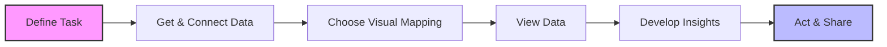

### **Overview**
The transcript focuses on conducting visual analysis within **Tableau** to discover data trends, extract insights, and craft compelling data stories. The ultimate goal of data visualization is to balance the author's narrative with audience interactivity, allowing end-users to derive their own insights before compiling these visuals into a dashboard.

### **The Visual Analysis Process**
The core workflow for creating visual analytics in Tableau follows a distinct sequential process:

### **Data Structure and Relationships**
The tutorial uses the standard **Sample Superstore Data**. To perform cross-functional analysis, relationships must be established between different data sheets. Tableau handles this in the background using specific identifiers (often referred to as "noodles" in the Tableau interface).

| Primary Sheet | Related Sheet | Connecting Field | Purpose in Analysis |
| :--- | :--- | :--- | :--- |
| **Orders** | **Returns** | `Order ID` | To analyze how many products sold resulted in returns. |
| **Orders** | **People** | `Region` | To connect sales and regional personnel/managers. |
| **Returns** | **People** | Indirectly via `Orders` | Allows viewing regional returns without a direct link. |

### **Key Visualizations & Insights Developed**

**1. Segment & State Sales (Stacked Bar Charts)**
*   **Action:** Mapped Sales against Segments (Consumer, Corporate, Home Office) and States. Applied filters to isolate specific categories.
*   **Insights Derived:**
    *   The **Consumer segment** drives the majority of the total sales.
    *   **California** and **New York** are the highest-performing states in absolute sales, followed closely by Texas, Washington, and Pennsylvania. 

**2. Returns Analysis (Cross-Sheet Integration)**
*   **Action:** Combined 'State' (from Orders) with 'Returns Count' (from Returns) and 'Region' (from People) using filters.
*   **Insights Derived:**
    *   States with the highest sales (like California in the West region) expectedly have the highest volume of returns. 
    *   The seamless connection allows regional slicing of return rates even if the raw data points are housed in separate Excel sheets.

**3. Category & Subcategory Drill-Downs**
*   **Action:** Grouped Sales by Category and Subcategory across different Regions, applying logical sorting and color coordination.
*   **Insights Derived:**
    *   Sorting data logically makes it cognitively pleasing and easier for the audience to digest.
    *   Some items (like *Binders*) show consistent sales across all regions, while others (like *Machines*) show massive regional variances.

**4. Geographical Mapping**
*   **Action:** Plotted a filled geographic map utilizing Tableau's auto-generated latitude/longitude based on the 'State' variable. Applied a diverging color palette (e.g., Orange-Blue) to represent sales volume.
*   **Insights Derived:**
    *   Visually reinforces that major sales originate from specific, densely populated hubs: California (West), New York (East), and Texas (Central). 
    *   The South region noticeably lacks a dominant, high-sales state compared to the other regions.

### **Best Practices Highlighted for Tableau Users**
*   **Connect Your Data Properly:** Always establish a clean relationship between your data sheets to achieve cross-functionality and a unified view.
*   **Sort Logically:** Always sort categories in a way that reveals logical patterns to convince your audience.
*   **Use Visual Cues Effectively:** Utilize color palettes, mark labels, and specific map types (filled maps vs. dot maps) that best suit the narrative of your data.
*   **Test and Iterate:** Explore the dataset with different visuals, swap rows and columns, and test different elements before publishing them to a final dashboard.

Tags: #statistics #machine-learning #data-science #statistical-modelling
