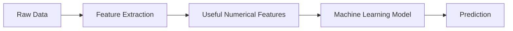
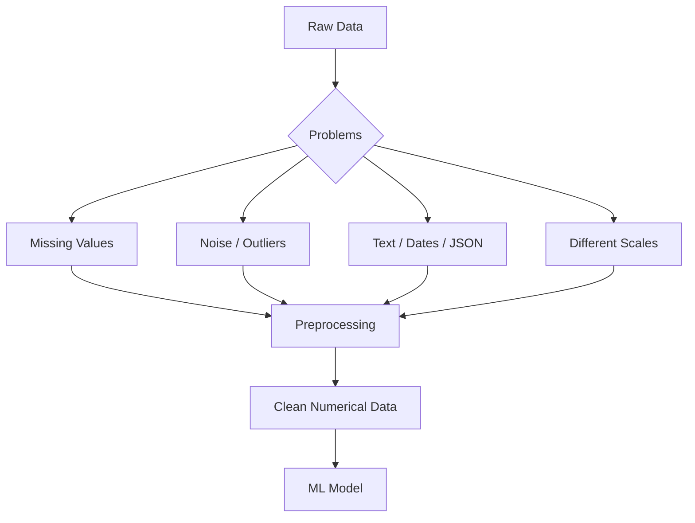

### **QUESTION 1 (10 Marks)**

**Part (a)**
*   **(i) What is the main goal of feature extraction? [1 Mark]**
    The main goal of feature extraction is to transform raw, high-dimensional, or unstructured data into a compact, numerical representation (a set of features) that a machine learning model can process, while preserving the most important and relevant information.
*   **(ii) Give two types of data where feature extraction is mandatory and briefly state why it is required in each case. [2 Marks]**
    1.  **Text Data (NLP):** Machine learning models only compute numbers, not words. Text must be extracted into numerical vectors (e.g., Bag of Words, Word Embeddings) so algorithms can process them.
    2.  **Image Data (Computer Vision):** Images are stored as massive grids of pixel intensities. Feature extraction is needed to identify meaningful patterns (like edges, corners, or textures) instead of forcing the model to learn from raw millions of pixels. *(Note: Audio data is also a correct alternative).*
*   **(iii) Explain why raw data is often not directly usable by machine learning models. [2 Marks]**
    Raw data is rarely ready for ML models because it often contains missing values, outliers, and noise. Furthermore, it might exist in incompatible formats (like strings, dates, or JSON) or varying scales. Machine learning models are mathematical functions that require clean, standardized, structured numerical matrices to learn patterns effectively.

Yes. Let’s turn this into something you can **understand quickly and reproduce in the exam**, rather than just memorize.

# Part (a): Feature Extraction

## First, the big picture

Think of feature extraction as:



### Simple idea

**Raw data → extract useful information → convert into features → give to ML model**

For example:

> A photo of a cat → extract edges, shapes, textures → numerical features → model predicts "Cat"

---

# (i) Main goal of feature extraction [1 Mark]

### Understand it like this:

The goal is to **take complicated/raw data and convert it into a smaller set of useful features while keeping the important information.**

### Example

Suppose you have an image:

| Raw data                 | After feature extraction |
| ------------------------ | ------------------------ |
| Millions of pixel values | Edges, shapes, textures  |
| Very large               | Compact                  |
| Difficult to interpret   | Meaningful               |
| High-dimensional         | Lower-dimensional        |

### Exam keyword

> **Convert raw/high-dimensional data into a compact numerical representation while preserving important information.**

That's enough for 1 mark.

---

# (ii) Two types of data where feature extraction is mandatory [2 Marks]

The easiest two to remember are:

**Text + Images**

## 1. Text Data

ML models work with **numbers**, not words.

Example:

```text
"I love this movie"
        ↓
Feature Extraction
        ↓
[0.2, 0.8, 0.4, 0.1, ...]
        ↓
ML Model
```

Techniques include:

* Bag of Words
* TF-IDF
* Word Embeddings

### Why?

Because words must be converted into **numerical features** before the ML model can process them.

---

## 2. Image Data

An image is basically a huge collection of pixel values.

```text
Image
  ↓
Millions of pixel values
  ↓
Feature Extraction
  ↓
Edges + Shapes + Textures
  ↓
ML Model
```

### Why?

Feature extraction identifies **meaningful visual patterns** instead of making the model deal directly with an enormous number of raw pixels.

---

### Quick comparison

| Data       | Raw form        | Extracted features      | Why needed?                        |
| ---------- | --------------- | ----------------------- | ---------------------------------- |
| **Text**   | Words/sentences | TF-IDF, embeddings      | Convert words into numbers         |
| **Images** | Pixel values    | Edges, shapes, textures | Capture meaningful visual patterns |
| **Audio**  | Sound waves     | Frequency, MFCCs        | Represent sound numerically        |

You only need **two** in the exam. Text + Images is the safest pair.

---

# (iii) Why can't we directly use raw data? [2 Marks]

This is slightly different from feature extraction.

The problem is that **raw data is usually messy and not in the format ML algorithms expect.**

Think:



### Four things to remember

**1. Missing values**

```text
Age
25
31
NULL
42
```

The model needs this handled.

**2. Wrong/incompatible formats**

```text
"Male"
"Female"

"2026-08-22"

JSON
```

These need to be transformed into usable representations.

**3. Noise and outliers**

```text
Salary:
40,000
45,000
42,000
43,000
9,000,000  ← outlier
```

This can distort learning.

**4. Different scales**

```text
Age:       18 - 70
Salary:    20,000 - 2,000,000
```

Some algorithms can be affected by these scale differences.

---

# The important distinction

This is where exam questions can trip you up.

### Raw data problem

> **Raw data is messy, incompatible, or unsuitable for mathematical processing.**

### Feature extraction problem

> **Even after data is usable, it may contain too many dimensions or irrelevant/raw information. Feature extraction creates a more useful representation.**

So:

```text
RAW DATA
   ↓
Cleaning / Preprocessing
   ↓
Usable Data
   ↓
Feature Extraction
   ↓
Useful Features
   ↓
Machine Learning Model
```

---

# 30-second exam revision

| Question                                | Remember this                                                   |
| --------------------------------------- | --------------------------------------------------------------- |
| **Goal of feature extraction?**         | Convert raw/high-dimensional data into compact, useful features |
| **Text?**                               | Words → numerical vectors                                       |
| **Images?**                             | Pixels → meaningful patterns                                    |
| **Why raw data isn't directly usable?** | Missing values, noise, incompatible formats, different scales   |
| **Final requirement of ML?**            | Clean, structured numerical data                                |

## One-line memory trick

**"Raw data is messy. Feature extraction makes it meaningful."**

And for the exam, the three answers can essentially be remembered as:

> **(i)** Convert raw/high-dimensional data into a compact numerical representation while preserving important information.
>
> **(ii)** Text: convert words into numerical vectors. Images: extract meaningful patterns such as edges, shapes and textures.
>
> **(iii)** Raw data may contain missing values, noise, outliers, incompatible formats and different scales, whereas ML models require clean, structured numerical data.
