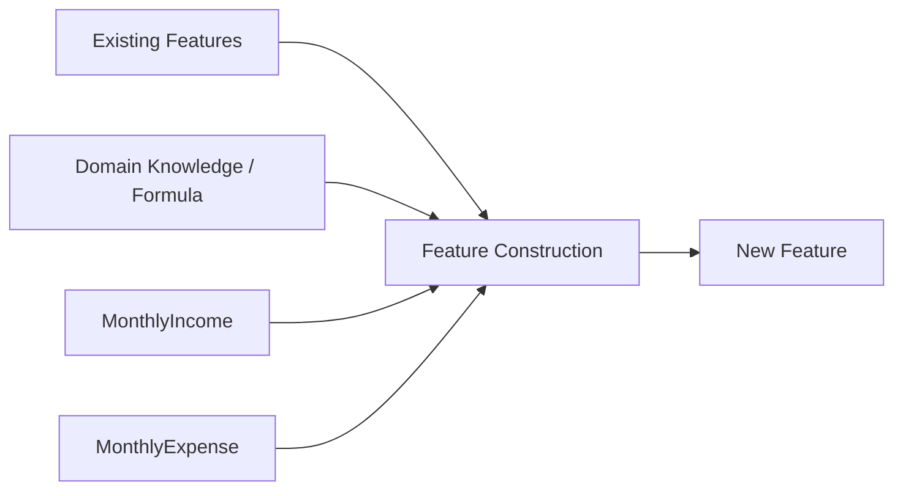
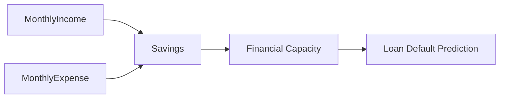

**Part (b)**
*   **(i) What is feature construction? [2 Marks]**
    Feature construction is the manual process of creating new features from existing raw data to highlight underlying patterns or relationships. It involves applying mathematical formulas, domain knowledge, or logical operations to combine or transform variables, thereby increasing the predictive power of the model.
*   **(ii) Suggest one new feature from `MonthlyIncome` and `MonthlyExpense` and explain its usefulness. [3 Marks]**
    *   **Constructed Feature:** `Savings` (Calculated as `MonthlyIncome` - `MonthlyExpense`) or `SavingsRatio` (Calculated as `Savings` / `MonthlyIncome`).
    *   **Usefulness:** This feature explicitly represents a person's disposable income and financial health. In a use case like predicting loan default, a person's actual remaining money (`Savings`) is a far stronger and more direct predictor of their ability to repay a loan than looking at their income and expenses separately.

# Part (b): Feature Construction

The easiest way to understand this is:

> **Feature extraction = finding useful information from existing data.**
> **Feature construction = creating a NEW feature from existing data.**

## (i) What is feature construction? [2 Marks]

Suppose your dataset already has:

| MonthlyIncome | MonthlyExpense |
| ------------: | -------------: |
|       ₹50,000 |        ₹35,000 |
|       ₹80,000 |        ₹60,000 |

You can **create a new column**:

| MonthlyIncome | MonthlyExpense | Savings |
| ------------: | -------------: | ------: |
|       ₹50,000 |        ₹35,000 | ₹15,000 |
|       ₹80,000 |        ₹60,000 | ₹20,000 |

That new `Savings` column did not exist originally. **You constructed it.**

### Formula

```text
Savings = MonthlyIncome - MonthlyExpense
```

### Core idea



### Exam answer

> **Feature construction is the process of creating new features from existing variables using mathematical formulas, logical operations, or domain knowledge to improve the predictive power of a machine learning model.**

---

# (ii) Construct a feature from MonthlyIncome and MonthlyExpense [3 Marks]

The simplest and strongest answer is:

### New Feature: `Savings`

```text
Savings = MonthlyIncome - MonthlyExpense
```

### Example

If:

```text
MonthlyIncome  = ₹50,000
MonthlyExpense = ₹35,000
```

Then:

```text
Savings = ₹50,000 - ₹35,000
        = ₹15,000
```

So:

| MonthlyIncome | MonthlyExpense | **Savings** |
| ------------: | -------------: | ----------: |
|       ₹50,000 |        ₹35,000 | **₹15,000** |
|       ₹80,000 |        ₹60,000 | **₹20,000** |
|       ₹40,000 |        ₹38,000 |  **₹2,000** |

---

## Why is `Savings` useful?

Imagine we're predicting **whether someone will default on a loan**.

Two people could have the same income:

```text
Person A:
Income   = ₹50,000
Expense  = ₹20,000
Savings  = ₹30,000

Person B:
Income   = ₹50,000
Expense  = ₹48,000
Savings  = ₹2,000
```

If we only look at `MonthlyIncome`, they look identical.

But `Savings` immediately tells us something important about their **remaining disposable money and ability to repay a loan**.



### Exam answer

> **A new feature called `Savings` can be constructed as `MonthlyIncome - MonthlyExpense`. It represents the amount of disposable income remaining after expenses. This can improve prediction of outcomes such as loan default because it directly indicates a person's financial capacity to repay the loan.**

---

# What about `SavingsRatio`?

You could also construct:

```text
SavingsRatio = Savings / MonthlyIncome
```

For example:

```text
Income  = ₹50,000
Expense = ₹35,000

Savings = ₹15,000

SavingsRatio = 15,000 / 50,000
             = 0.30
             = 30%
```

This tells us **what percentage of income the person actually saves**.

### `Savings` vs `SavingsRatio`

| Feature          | Formula          | Tells us                  |
| ---------------- | ---------------- | ------------------------- |
| **Savings**      | Income − Expense | Actual money left         |
| **SavingsRatio** | Savings / Income | Percentage of income left |

For a **3-mark exam question**, I'd use **Savings** because it's simpler, directly derived from both variables, and very easy to justify.

## The key distinction to memorize

```text
FEATURE EXTRACTION
Raw data → extract useful representation

FEATURE CONSTRUCTION
Existing features → CREATE a new feature
```

**Construction = creation.** That's the word to anchor on.
