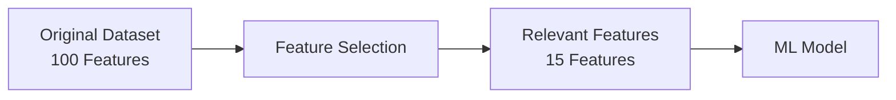
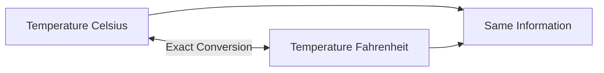

### **QUESTION 2 (10 Marks)**

**Part (a)**
*   **(i) What is feature selection? [3 Marks]**
    Feature selection is the process of choosing a subset of the most relevant and important features from the original dataset to use in model training. It helps to improve model accuracy, reduce training time, combat the "curse of dimensionality," and prevent overfitting by eliminating irrelevant or redundant data.
*   **(ii) Issue with `Temperature_Celsius` and `Temperature_Fahrenheit` and what should be done? [3 Marks]**
    *   **Issue:** Multicollinearity (Perfect correlation). These two features represent the exact same physical information, just on different scales. Using both adds redundant information, which can confuse certain algorithms (like linear regression) and unnecessarily increase model complexity.
    *   **Solution:** Drop one of the features. Keep either Celsius or Fahrenheit, but not both.

# QUESTION 2: Feature Selection

Let's build the intuition first. This is a very common exam concept.

## (a)(i) What is Feature Selection? [3 Marks]

Imagine your dataset has **100 features**:

```text
Age
Salary
Income
Height
Weight
City
Temperature
...
97 more features
```

But maybe only 15 of them actually help predict your target.

**Feature selection means choosing those useful features and removing the unnecessary ones.**



### Why do we do it?

| Benefit                            | What it means                                 |
| ---------------------------------- | --------------------------------------------- |
| **Reduce complexity**              | Model has fewer features to process           |
| **Reduce training time**           | Fewer inputs means less computation           |
| **Reduce overfitting**             | Removes irrelevant/noisy features             |
| **Improve model performance**      | Model focuses on useful information           |
| **Handle curse of dimensionality** | Avoids problems caused by too many dimensions |

### Exam answer

> **Feature selection is the process of selecting the most relevant and useful features from the original dataset for model training. It reduces dimensionality, training time and overfitting while potentially improving model performance.**

### Memory trick

**Feature selection = SELECT existing features.**

You aren't creating anything new.

---

# (a)(ii) Temperature_Celsius vs Temperature_Fahrenheit [3 Marks]

This one is actually very simple once you see the relationship.

Suppose:

| Temperature °C | Temperature °F |
| -------------: | -------------: |
|              0 |             32 |
|             10 |             50 |
|             20 |             68 |
|             30 |             86 |

They're giving you **the exact same information**.

The conversion is:

```text
°F = (°C × 9/5) + 32
```

So if you already know Celsius, Fahrenheit gives you nothing new.

## What's the problem?

**Redundancy / perfect correlation.**

Because one can be calculated exactly from the other.



In statistical/modeling terminology, using both can create **perfect multicollinearity**, particularly problematic for models such as linear regression.

### Why is this unnecessary?

Imagine the model receives:

```text
Temperature_Celsius = 25
Temperature_Fahrenheit = 77
```

It essentially receives the same piece of information twice.

```text
Celsius ──────┐
              ├──> Same information
Fahrenheit ───┘
```

## What should we do?

**Drop one of them.**

Keep either:

```text
Temperature_Celsius
```

**OR**

```text
Temperature_Fahrenheit
```

There is no need to keep both.

### Exam answer

> **The two features have perfect correlation because Celsius and Fahrenheit represent the same temperature and one can be exactly calculated from the other. This creates redundant information and can cause perfect multicollinearity in models such as linear regression. Therefore, one feature should be removed and only Celsius or Fahrenheit should be retained.**

---

# The distinction you need to remember

This connects directly to your previous question about feature construction.

| Technique                | What happens?                                                  | Example                             |
| ------------------------ | -------------------------------------------------------------- | ----------------------------------- |
| **Feature Selection**    | Keep some existing features, remove others                     | Keep `Celsius`, remove `Fahrenheit` |
| **Feature Construction** | Create a NEW feature                                           | `Savings = Income - Expense`        |
| **Feature Extraction**   | Transform raw/high-dimensional data into useful representation | Image → edges/shapes                |

### One-line memory trick

> **Selection = choose. Construction = create. Extraction = transform.**

That three-word distinction is worth remembering because exam questions love to mix these up.
