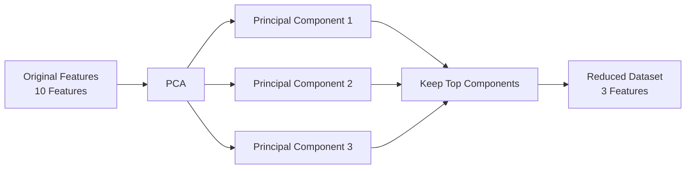

**Part (b)**
*   **(i) What is the purpose of dimensionality reduction? [1 Mark]**
    The purpose is to reduce the number of input variables (dimensions) in a dataset while retaining as much of the underlying meaningful variance and information as possible.
*   **(ii) Choose one method and explain how it reduces features. [3 Marks]**
    *   **Method:** Principal Component Analysis (PCA).
    *   **Explanation:** PCA looks at the correlations between all original features and mathematically transforms them into a new, smaller set of independent variables called "Principal Components." These new components are ranked by how much variance (information) they capture from the original data. By keeping only the top few components, PCA reduces the feature count while keeping the most important patterns intact.

# QUESTION 2(b): Dimensionality Reduction

This connects directly to **feature selection**, but there's one important difference.

## (i) Purpose of Dimensionality Reduction [1 Mark]

Suppose you have:

```text
100 features
    ↓
Dimensionality Reduction
    ↓
10 features
```

The goal is to **reduce the number of dimensions/features while preserving as much important information as possible.**

### Simple definition

> **Dimensionality reduction reduces the number of input variables while retaining the important information or patterns in the data.**

### Memory trick

**Dimensionality reduction = fewer dimensions, similar information.**

---

# (ii) PCA: How does it reduce features? [3 Marks]

The easiest way to understand PCA is:

> **PCA takes many related features and creates fewer new features that capture most of their information.**

Suppose we have:

```text
Height
Weight
BMI
Waist
Age
Blood Pressure
Cholesterol
...
```

Some of these variables may be related to each other.

PCA looks for the major patterns in the data.



## What exactly is PCA doing?

Imagine your data has two highly related features:

```text
Height ↑
       |       *
       |     *
       |   *
       | *
       +----------------> Weight
```

The points roughly follow one direction.

PCA finds that **main direction of variation**.

That direction becomes **Principal Component 1 (PC1)**.

If there is another important direction, PCA creates **PC2**.

So instead of working with the original features, we can work with:

```text
Original:
X1, X2, X3, X4, X5, X6, X7, X8

        ↓ PCA

New:
PC1, PC2, PC3
```

The important point is that **PC1, PC2, etc. are new features**, not simply selected original columns.

---

# Why does PCA work?

PCA ranks the components according to **variance**.

Think of variance here as:

> **How much of the important variation/information in the data does this component capture?**

For example:

| Component | Variance captured |
| --------- | ----------------: |
| PC1       |               60% |
| PC2       |               25% |
| PC3       |                8% |
| PC4       |                4% |
| PC5       |                3% |

Total = 100%

If we keep PC1 + PC2:

```text
60% + 25% = 85%
```

We've reduced:

```text
5 original dimensions
        ↓
2 principal components
```

while retaining **85% of the variance**.

That's the central idea behind PCA.

---

# The crucial distinction: Feature Selection vs PCA

This is VERY important for your exam.

### Feature Selection

You **keep existing columns**.

```text
Age
Salary
Height
Weight
Income

        ↓ Selection

Age
Salary
Income
```

You simply removed some features.

### PCA

You **create new transformed features**.

```text
Age
Salary
Height
Weight
Income

        ↓ PCA

PC1
PC2
```

PC1 and PC2 are combinations of the original variables.

So:

|                             | Feature Selection           | PCA                   |
| --------------------------- | --------------------------- | --------------------- |
| What happens?               | Select existing features    | Create new components |
| Original features retained? | Yes                         | No, transformed       |
| Example                     | Keep Age, Income            | PC1, PC2              |
| Main idea                   | Remove unnecessary features | Compress information  |

## Exam-ready answer

> **(i)** The purpose of dimensionality reduction is to reduce the number of input variables while retaining as much important information or variance as possible.
>
> **(ii)** **PCA (Principal Component Analysis)** transforms the original correlated features into a smaller set of new variables called principal components. The components are ranked according to the amount of variance they capture. By retaining only the top components, PCA reduces the number of features while preserving the major patterns in the data.

### One-line memory trick

**PCA = many features → fewer new components → preserve maximum variance.**
