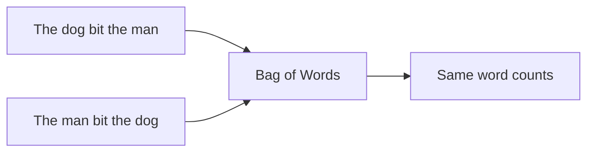
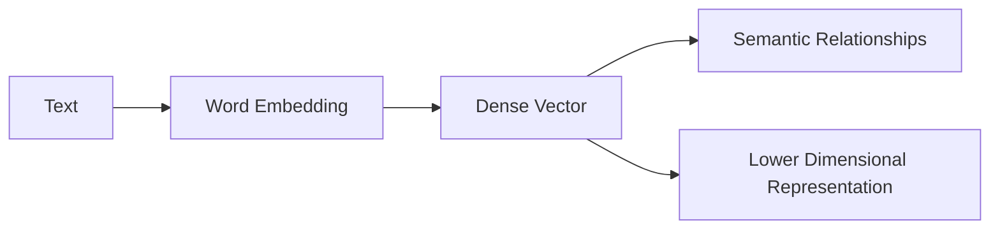
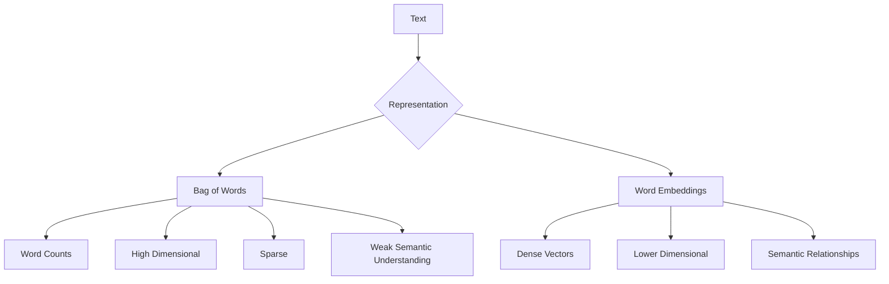

### **QUESTION 3 (10 Marks)**

**Part (a)**
*   **(i) What are the limitations of Bag of Words (BoW)? [3 Marks]**
    1.  **Ignores Context and Word Order:** BoW treats text as an unordered collection, so "The dog bit the man" and "The man bit the dog" have the exact same representation.
    2.  **Sparsity:** It creates massive, high-dimensional matrices where most values are zero (since most documents only use a tiny fraction of the total vocabulary).
    3.  **No Semantic Understanding:** It treats all words as completely independent. It does not recognize that "good" and "great" have similar meanings.
*   **(ii) Why are word embeddings considered better than BoW in some cases? [3 Marks]**
    Word embeddings (like Word2Vec or GloVe) map words to dense, low-dimensional vectors. They are better because they capture **semantic meaning and context**—words with similar meanings are placed close together in the vector space. Additionally, they solve the sparsity problem by using fixed-size dense arrays instead of massive sparse matrices.


# QUESTION 3: Bag of Words vs Word Embeddings

This one is much easier if you first understand **what BoW is actually doing**.

## First: What does Bag of Words do?

Suppose we have two sentences:

```text
"The cat is good"
"The dog is good"
```

BoW creates a vocabulary:

| the | cat | dog | is | good |
| --: | --: | --: | -: | ---: |
|   1 |   1 |   0 |  1 |    1 |
|   1 |   0 |   1 |  1 |    1 |

It basically asks:

> **"Which words appear, and how many times?"**

It does **not really understand the sentence**.

---

# (i) Limitations of Bag of Words [3 Marks]

There are three big limitations to remember.

## 1. Ignores word order and context

Consider:

```text
"The dog bit the man"
"The man bit the dog"
```

A human immediately understands that these mean different things.

But BoW sees essentially:

```text
dog
bit
man
```

in both cases.

So the representation is the same.



### Remember:

**BoW knows which words are present, but not their order.**

---

## 2. Creates sparse, high-dimensional data

Imagine your vocabulary contains:

**100,000 different words.**

Each document may contain only 50 of them.

So you might get:

```text
[0, 0, 0, 1, 0, 0, 0, 0, ... 0, 1, 0]
```

Most values are **zero**.

That's called **sparsity**.

And because the vocabulary can be huge, the representation becomes **high-dimensional**.

```text
Small vocabulary
      ↓
10,000 dimensions

Huge vocabulary
      ↓
100,000+ dimensions
```

---

## 3. Doesn't understand meaning

Consider:

```text
"good"
"great"
"excellent"
```

A human knows these words have related meanings.

BoW doesn't.

It simply treats them as three separate vocabulary entries:

```text
good       → Feature 1
great      → Feature 2
excellent  → Feature 3
```

There is no built-in understanding that:

```text
good ≈ great ≈ excellent
```

### So remember:

> **BoW counts words, but doesn't understand their meaning.**

---

# The 3 limitations in one table

| Limitation                | What happens?                                      | Memory phrase              |
| ------------------------- | -------------------------------------------------- | -------------------------- |
| **No word order/context** | "dog bit man" and "man bit dog" can look identical | Doesn't understand order   |
| **Sparsity**              | Huge vector with mostly zeros                      | Too many zeros             |
| **No semantics**          | "good" and "great" are unrelated features          | Doesn't understand meaning |

For the exam, these **three points are enough for 3 marks**.

---

# (ii) Why are Word Embeddings better than BoW? [3 Marks]

Now we get to the interesting part.

Instead of representing a word like this:

```text
good → [0, 0, 0, 0, 1, 0, 0, 0, ...]
```

an embedding represents it using a **dense numerical vector**:

```text
good → [0.42, -0.18, 0.73, 0.11, ...]
```

For example, conceptually:

```text
good       → [0.42, 0.81, 0.15]
great      → [0.45, 0.79, 0.18]
excellent  → [0.48, 0.83, 0.21]
```

Notice that the vectors can be **close to each other**.

That lets the model capture relationships between words.

---

## Advantage 1: Captures semantic meaning

Word embeddings can represent relationships between words.

Conceptually:

```text
          excellent
             ●
            /
           ● great
          /
         ● good


     completely different words
             ●
            dog
```

Words with similar meanings tend to have similar vector representations.

This is something basic BoW cannot naturally capture.

---

## Advantage 2: Dense instead of sparse

### BoW

```text
[0, 0, 0, 0, 0, 1, 0, 0, 0, 0, ...]
```

Lots of zeros.

### Embedding

```text
[0.32, -0.71, 0.44, 0.19, 0.63, ...]
```

Mostly meaningful numerical values.

So embeddings give us:

**Large sparse representation → smaller dense representation**

---

## Advantage 3: Lower dimensional

Imagine:

```text
BoW
100,000-word vocabulary
        ↓
100,000-dimensional vector
```

Whereas an embedding might use:

```text
Word Embedding
        ↓
300-dimensional vector
```

So:



---

# BoW vs Word Embeddings

This is the table I'd memorize:

|                | **Bag of Words**                | **Word Embeddings**                                             |
| -------------- | ------------------------------- | --------------------------------------------------------------- |
| Representation | Sparse                          | Dense                                                           |
| Dimensions     | Potentially very high           | Usually lower                                                   |
| Word meaning   | Does not capture well           | Captures semantic relationships                                 |
| Word order     | Not captured                    | Basic embeddings may still have limited order/context awareness |
| Example        | `good` and `great` are separate | `good` and `great` can have similar vectors                     |

### Important correction to your provided answer

Be careful with this statement:

> "Word embeddings capture semantic meaning and context."

That's **generally true for modern contextual embeddings**, but classic **Word2Vec and GloVe are not truly contextual**. A word generally gets one vector regardless of the sentence.

For your exam, you can safely say:

> **Word embeddings capture semantic relationships between words and provide dense, lower-dimensional representations.**

That's more technically precise.

---

# The whole question in one picture



## Exam memory trick

### BoW

**"Count words, don't understand them."**

Three problems:

**Order + Sparsity + Meaning**

### Embeddings

**"Turn words into meaningful dense vectors."**

Three advantages:

**Semantic relationships + Dense + Lower dimensional**
