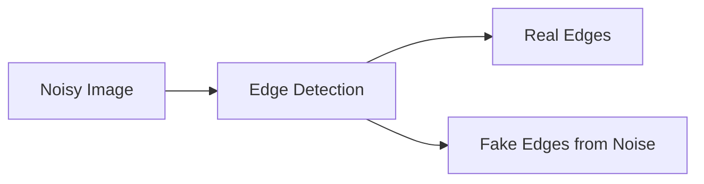

**Part (b)**
*   **(i) What is an edge in an image? [2 Marks]**
    An edge is a boundary or a region in an image where there is a sharp, sudden change in brightness, color, or pixel intensity. Edges typically correspond to the boundaries of objects, shadows, or structural changes in the scene.
*   **(ii) Why is smoothing (noise removal) important before feature extraction in images? [2 Marks]**
    Real-world images contain "noise" (random variations in pixel color/brightness due to camera sensors or lighting). Edge detection algorithms look for sudden pixel changes. If noise is not smoothed out (e.g., using Gaussian blur), the algorithm will mistakenly detect this noise as hundreds of fake edges, ruining the extraction process.

# QUESTION 3(b): Image Feature Extraction

This is basically about **edges** and **noise**.

Think of an image as a grid of pixels.

```text
Image
  ↓
Pixels
  ↓
Look for sudden changes
  ↓
Edges
  ↓
Extract useful features
```

## (i) What is an edge in an image? [2 Marks]

An **edge** is a location where the pixel intensity or color changes **sharply**.

### Simple example

Imagine this:

```text
Dark pixels          Bright pixels

████████████│░░░░░░░░░░
████████████│░░░░░░░░░░
████████████│░░░░░░░░░░
             ↑
            EDGE
```

The left side is dark and the right side is bright.

The sudden transition between them is an **edge**.

### Real-world examples

Edges often occur at:

* Boundary of an object
* Boundary between a person and the background
* Change from light to shadow
* Change between different surfaces


### Exam answer

> **An edge is a region in an image where there is a sharp change in pixel intensity, brightness, or color. Edges often represent object boundaries, shadows, or structural changes.**

### Memory trick

**Edge = sudden change in pixels.**

---

# (ii) Why is smoothing important before feature extraction? [2 Marks]

This is easier if you understand what **noise** is.

## What is noise?

Noise is random unwanted variation in an image.

For example, instead of having:

```text id="6qcy2j"
100 100 100 100 100
```

you might get:

```text id="u2b31d"
100 101  98 103 100
```

Those small random changes aren't actual objects or boundaries.

They're just **noise**.

---

## The problem

Remember:

> **Edge detection looks for sudden changes in pixel values.**

But noise can also create sudden changes.

So without smoothing:



The algorithm may think:

```text
Noise → Edge
Noise → Edge
Noise → Edge
Noise → Edge
```

You end up with a mess.

---

# Smoothing fixes this

A smoothing filter such as **Gaussian blur** reduces small random variations.


Think of smoothing as:

> **"Remove tiny random changes before looking for important changes."**

### Example

Before smoothing:

```text
100 101 98 103 100 97 102
 ↑    ↑   ↑   ↑   ↑   ↑
random fluctuations
```

After smoothing:

```text
100 100 100 101 100 100 101
```

The tiny fluctuations are reduced, making **real object boundaries easier to detect**.

---

# Exam answer

> **Smoothing is important because real-world images contain noise that creates random pixel intensity variations. Since edge detection identifies sudden changes in pixel intensity, noise can be incorrectly detected as false edges. Smoothing techniques such as Gaussian blur reduce noise and help extract more accurate and meaningful features.**

## 10-second revision

| Concept                        | Remember                               |
| ------------------------------ | -------------------------------------- |
| **Edge**                       | Sudden change in pixel intensity/color |
| **Noise**                      | Random unwanted pixel variation        |
| **Smoothing**                  | Reduces noise                          |
| **Why before edge detection?** | Prevents false edges                   |

### The entire concept in one line:

**Noise creates fake edges → smoothing removes noise → edge detection finds real edges.**
