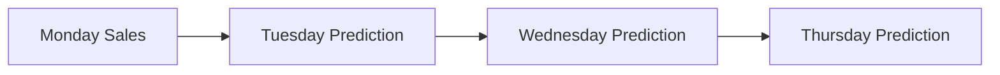
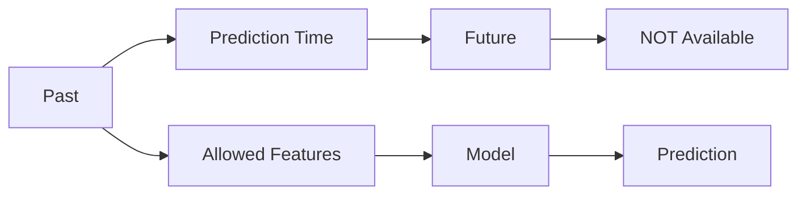
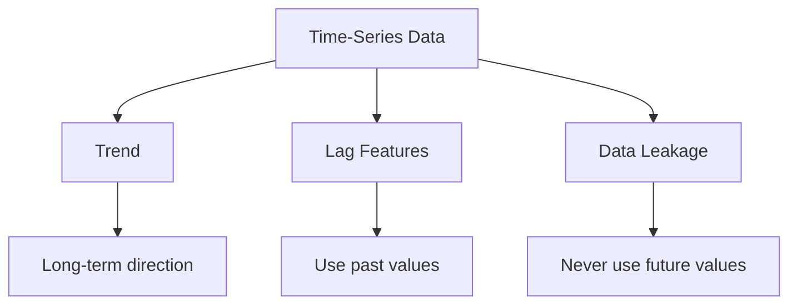

### **QUESTION 4 (10 Marks)**

**Part (a)**
*   **(i) What is a trend in time-series data? [2 Marks]**
    A trend is the long-term progression or general direction of the data over time. It shows whether the overall values are consistently increasing (upward trend), decreasing (downward trend), or remaining stable over a long period, ignoring short-term fluctuations.
*   **(ii) What is a lag feature? Give one example. [2 Marks]**
    A lag feature is a variable that contains the value of a time-series metric from a prior time step. It helps models understand past behaviors to predict future outcomes.
    *   **Example:** If you are predicting today's ice cream sales, a useful lag feature would be `Sales_Yesterday` (Lag 1) or `Sales_Last_Week` (Lag 7).
*   **(iii) Why should we avoid using future data while creating features? [3 Marks]**
    Using future data (which would not realistically be available at the time of making a prediction) causes a severe issue called **Data Leakage**. It allows the model to "cheat" during training, resulting in artificially high accuracy metrics. However, when deployed in the real world (where the future is unknown), the model will fail drastically.


# QUESTION 4(a): Time-Series Features

This whole part revolves around one simple idea:

> **In time-series data, the order of time matters.**

For example:

```text
Monday → Tuesday → Wednesday → Thursday → Friday
   ↓        ↓          ↓           ↓          ↓
 Sales     Sales      Sales       Sales      Sales
```

You can use **past information** to understand or predict the future.

---

# (i) What is a trend? [2 Marks]

A **trend** is the **long-term direction** of a time series.

It tells us whether the data is generally:

* Increasing
* Decreasing
* Stable

### Example: Upward trend

```text
Sales
 ^
 |                 *
 |             *
 |         *
 |      *
 |   *
 +--------------------> Time
```

Sales are generally increasing over time.

There may be some ups and downs, but the **overall direction is upward**.

### Important distinction

Don't confuse **trend** with individual fluctuations.

```text
Trend:
      ↗ ↗ ↗ ↗

Actual data:
      ↗ ↓ ↗ ↑ ↓ ↗ ↑
```

The actual values fluctuate, but the overall direction is increasing.

### Exam answer

> **A trend is the long-term general direction of a time-series variable over time. It can be upward, downward, or stable, while ignoring short-term fluctuations.**

### Memory trick

**Trend = long-term direction.**

---

# (ii) What is a lag feature? [2 Marks]

This is one of the most important time-series concepts.

A **lag feature uses a previous value as a feature for the current prediction.**

Suppose:

| Day       | Sales |
| --------- | ----: |
| Monday    |   100 |
| Tuesday   |   120 |
| Wednesday |   150 |
| Thursday  |   130 |

For Wednesday:

```text
Today's Sales = 150

Yesterday's Sales = 120
```

So we can create:

```text
Sales_Lag_1 = Yesterday's Sales
```

### Visually



Or more precisely:

```text
Today's prediction
       ↑
       |
Yesterday's value
```

### Common lags

| Lag        | Meaning              |
| ---------- | -------------------- |
| **Lag 1**  | Previous time period |
| **Lag 2**  | Two periods ago      |
| **Lag 7**  | Seven periods ago    |
| **Lag 30** | Thirty periods ago   |

For daily sales:

```text
Lag 1 = yesterday
Lag 7 = same day last week
Lag 30 = roughly same day last month
```

### Exam answer

> **A lag feature contains the value of a variable from a previous time period. For example, `Sales_Lag_1` represents yesterday's sales and can be used to predict today's sales.**

### Memory trick

**Lag = look backward.**

---

# (iii) Why can't we use future data? [3 Marks]

This is **Data Leakage**.

The easiest way to understand it is:

> **The model gets information that it would not actually have when making the prediction.**

Imagine you're trying to predict **Thursday's sales**.

You are allowed to use:

```text
Monday sales
Tuesday sales
Wednesday sales
```

But you cannot use:

```text
Friday sales
```

because Friday hasn't happened yet.



## Why is leakage dangerous?

Suppose we accidentally give the model:

```text
Sales_Tomorrow
```

as an input.

During training, the model thinks:

```text
"Oh, I know tomorrow's sales!"
```

So it gets extremely good accuracy.

But in the real world:

```text
Today
 ↓
Need prediction
 ↓
Tomorrow is unknown
```

The feature isn't available.

So the model's impressive training/test performance is **fake**.

---

## Simple example

Imagine predicting whether a customer will default on a loan.

You use:

```text
Income
Age
Credit Score
```

Good.

But you accidentally include:

```text
Default_Status_Next_Month
```

That's cheating.

The model can basically see the answer.

```text
Past information ──→ Model ──→ Prediction
                         ↑
                 Future information
                    [LEAKAGE]
```

### Exam answer

> **Future data should not be used when creating features because it causes data leakage. The model receives information that would not be available at prediction time, leading to artificially high performance during training and testing. When deployed in the real world, the future information is unavailable, causing the model's performance to deteriorate.**

---

# The three concepts together



## Quick revision table

| Concept          | One thing to remember                | Example                                 |
| ---------------- | ------------------------------------ | --------------------------------------- |
| **Trend**        | Long-term direction                  | Sales generally increasing              |
| **Lag feature**  | Past value used as feature           | `Sales_Lag_1` = yesterday's sales       |
| **Data leakage** | Future information accidentally used | Using tomorrow's sales to predict today |

### The ultimate memory trick

**Trend = direction**

**Lag = past**

**Leakage = future**

That is essentially the entire Part (a).
