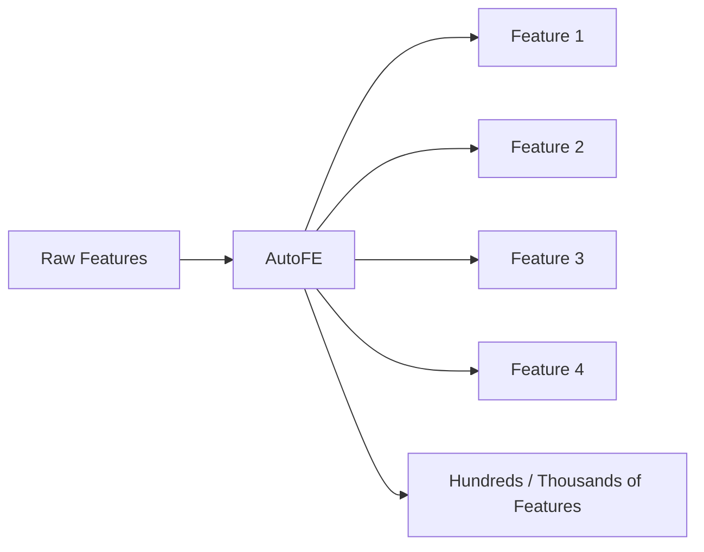
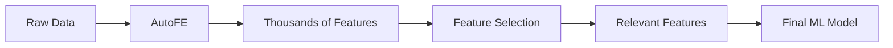

**Part (b)**
*   **(i) What is Automated Feature Engineering (AutoFE)? [1 Mark]**
    AutoFE is the process of using algorithms and software frameworks to automatically generate, transform, and evaluate hundreds or thousands of features from raw data without manual human intervention.
*   **(ii) Why is an additional step required after AutoFE before building the final model? [2 Marks]**
    AutoFE employs a "brute force" approach, generating massive amounts of features by combining everything. This results in highly correlated, redundant, or purely noisy features. An additional **Feature Selection** step is mandatory to filter out the useless features to prevent overfitting, reduce computational cost, and solve the curse of dimensionality.

# QUESTION 4(b): Automated Feature Engineering

This is actually a very logical sequence:

> **AutoFE creates lots of features. Feature Selection cleans them up.**

## (i) What is Automated Feature Engineering? [1 Mark]

Normally, **you** manually create features.

For example:

```text
MonthlyIncome
MonthlyExpense
       ↓
Savings = Income - Expense
```

With **AutoFE**, software does this automatically.

It can try many transformations and combinations:



For example, it might automatically try:

```text
Income - Expense
Income / Expense
Income × Age
log(Income)
Age²
...
```

### Exam answer

> **Automated Feature Engineering is the use of algorithms or software tools to automatically generate, transform, and evaluate features from raw data with minimal manual intervention.**

### Memory trick

**AutoFE = computer creates features automatically.**

---

# (ii) Why do we need another step after AutoFE? [2 Marks]

This is the important part.

AutoFE is basically a **feature-generating machine**.

It can create:

```text
10 original features
        ↓
      AutoFE
        ↓
10,000 generated features
```

But not all 10,000 features are useful.

Some might be:

```text
Useful
Useful
Redundant
Noise
Highly correlated
Useless
Useful
Noise
...
```

So we need:

> **Feature Selection**

---

## The complete process



### Why remove the bad features?

| Problem                     | What happens                                                |
| --------------------------- | ----------------------------------------------------------- |
| **Redundant features**      | Same information repeated                                   |
| **Noise**                   | Model learns random patterns                                |
| **Too many features**       | Higher computational cost                                   |
| **Overfitting**             | Model performs well on training data but poorly on new data |
| **Curse of dimensionality** | Too many dimensions make learning harder                    |

---

# Think of AutoFE like this

Imagine you ask someone:

> "Give me 10,000 possible features that might help predict loan default."

They give you:

```text
10,000 features
```

You don't blindly put all 10,000 into the model.

You say:

> "Great. Now tell me which ones are actually useful."

That's **Feature Selection**.

```text
AutoFE
   ↓
CREATE A LOT
   ↓
Feature Selection
   ↓
KEEP THE BEST
   ↓
Model
```

## Exam answer

> **An additional feature selection step is required because AutoFE can generate a large number of redundant, irrelevant, or noisy features. Feature selection removes these unnecessary features, reducing overfitting and computational cost while improving the efficiency of the final model.**

---

# The key distinction

This connects almost everything we've covered so far:

| Technique                    | Main job                                       |
| ---------------------------- | ---------------------------------------------- |
| **Feature Extraction**       | Transform raw data into useful representations |
| **Feature Construction**     | Create new features                            |
| **Feature Selection**        | Choose the useful features                     |
| **Dimensionality Reduction** | Reduce dimensions while preserving information |
| **AutoFE**                   | Automatically create many candidate features   |

### One-line memory trick

**AutoFE creates. Feature Selection cleans. Model learns.**
