# 1.1. The Foundations of Feature Engineering

Raw data is often messy or useless to an algorithm. **Feature Engineering** is the process of transforming raw data into meaningful inputs (features) that help Machine Learning models understand patterns easily and make better predictions. 

### Simple Example
*   **Raw Data:** A customer's "Date of Birth" (e.g., 1996-08-15) and "Purchase Amount" (e.g., $15, $25).
*   **Engineered Feature:** The customer's **"Age"** (30) and **"Total Spend"** ($40). *(Much easier for a machine to find patterns here!)*

### Visual Breakdown

```mermaid
flowchart LR
    A[(Raw Data\nMessy/Complex)] -->|Transform, Combine,\nExtract| B[Feature Engineering]
    B --> C[Engineered Features\nSimple/Informative]
    C --> D((ML Model\nLearns Faster))
    
    style B fill:#000000,stroke:#ff9900,stroke-width:2px
    style C fill:#000000,stroke:#28a745,stroke-width:2px
```

### The "Formulas" (Transformations)
There is no single formula, but rather mathematical transformations applied to your data. 

**1. Extraction:** $$\text{Age} = \text{Current Year} - \text{Birth Year}$$

**2. Combination (e.g., Body Mass Index):** 
$$\text{BMI} = \frac{\text{Weight}_{\text{kg}}}{(\text{Height}_{\text{m}})^2}$$
*By giving the model the $$BMI$$ directly, it doesn't have to struggle to figure out the relationship between Height and Weight on its own.*
