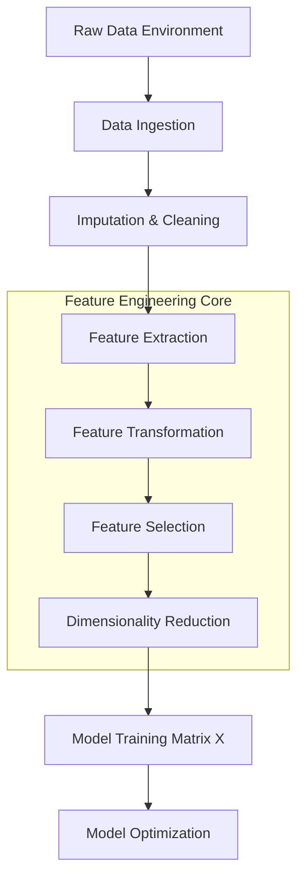

## Week 1: Overview of Feature Engineering

## [1. Concept Introduction](https://github.com/Balasubramanian-pg/MSC.-Data-Science-AI/blob/main/Trimester%201/Feature%20Engineering/W02%20-%20Handling%20Numeric%20Data/3.%20Feature%20Scaling.md#1-concept-introduction)

Feature engineering is the mathematical and programmatic process of transforming raw, unstructured, or semi-structured data into a structured vector space that optimally exposes the underlying problem to predictive algorithms. It is the bridge between domain reality and statistical learning.

A machine learning algorithm mathematically optimizes a cost function over a defined input space. If the input space (features) does not contain a linear or non-linear mapping to the target variable that the chosen algorithm can easily isolate, the model will fail, regardless of its theoretical complexity. Feature engineering reshapes this input space.

> [!IMPORTANT]
> Applied machine learning is fundamentally about representation. Better features will always beat better algorithms. A simple linear regression on a perfectly engineered feature space will outperform a deep neural network operating on noisy, unscaled, and uninformative raw data.

## [2. Intuition and Real-World Analogy](https://github.com/Balasubramanian-pg/MSC.-Data-Science-AI/blob/main/Trimester%201/Feature%20Engineering/W02%20-%20Handling%20Numeric%20Data/Readme.md#2-intuition-and-real-world-analogy)

Consider the task of identifying whether a building will collapse during an earthquake.

**Raw Data:** A continuous audio recording of the building groaning, a raw text report from an inspector, and an architect's blueprint.
**The ML Problem:** Models expect matrices of numbers $\mathbf{X} \in \mathbb{R}^{n \times d}$, not audio files or text blobs.

**The Feature Engineering Process (The "Sculpting" Analogy):**
Imagine you are handed a massive block of raw marble. You cannot build a wall with it directly. You must use a chisel (domain knowledge and math) to cut it into uniform, structured bricks (features).
- Extracting the frequency of the loudest audio spike (Fourier Transform) -> *Numerical feature*.
- Converting the inspector's text into a sentiment score (NLP) -> *Continuous feature*.
- Calculating the ratio of the building's height to its base width -> *Interaction feature*.

By doing this, you expose the "grain" of the problem to the algorithm.

## 3. Mathematical Foundations of the Feature Space

Mathematically, a raw [dataset](https://github.com/Balasubramanian-pg/MSC.-Data-Science-AI/blob/main/Trimester%201/Feature%20Engineering/W03%20-%20General%20Feature%20Engineering%20Techniques/Experiential%20Learning%20Activity.md#dataset) $\mathcal{D}$ consists of $N$ observations, where each observation $x_i$ exists in an arbitrary space $\mathcal{X}_{raw}$.

Feature engineering is a mapping function $\Phi$:

$$
\Phi: \mathcal{X}_{raw} \rightarrow \mathbb{R}^d
$$

Where $d$ is the dimensionality of the engineered feature space. The goal is to design $\Phi$ such that the target variable $y$ can be approximated by a function $f$:

$$
y \approx f(\Phi(x))
$$

### The Objective Function Link
If you are using a regularized linear model, the model attempts to minimize:

$$
\mathcal{L}(\theta) = \sum_{i=1}^N L(y_i, \theta^T \Phi(x_i)) + \lambda ||\theta||_p
$$

If $\Phi(x_i)$ is poorly engineered (e.g., highly collinear, improperly scaled, or lacking mutual information with $y_i$), the optimization landscape becomes ill-conditioned, and $\theta$ cannot converge to a meaningful global minimum.

## 4. Visual Architecture



## 5. Basic Feature Engineering Techniques

### A. Numerical Transformations
Models often assume data is normally distributed (Gaussian) or require features to be on the same scale to properly calculate gradients or distance metrics.

1. **Standardization (Z-Score Normalization):**
$$
x_{scaled} = \frac{x - \mu}{\sigma}
$$

2. **Log Transformation:** Handles extreme right-skewed data by compressing the long tail.
$$
x_{log} = \log(x + 1)
$$

### B. Categorical Encoding
Models cannot read text strings like "Red" or "Blue".

1. **One-Hot Encoding (OHE):** Maps categorical variables into orthogonal binary vectors.
2. **Target Encoding:** Replaces a categorical value with the mean of the target variable for that category.

> [!WARNING]
> Target encoding is highly prone to **Data Leakage**. If you calculate the mean target value using the validation/test set, the model will memorize the future rather than learn from the past. Always calculate target encodings based purely on the training set.

### Python Implementation: The Baseline Pipeline

This intermediate-level code demonstrates a robust, production-ready feature engineering pipeline using `scikit-learn`.

```python
import pandas as pd
import numpy as np
from sklearn.pipeline import Pipeline
from sklearn.compose import ColumnTransformer
from sklearn.preprocessing import StandardScaler, OneHotEncoder, FunctionTransformer
from sklearn.impute import SimpleImputer

## 1. Create Simulated Raw Dataset
data = {
    'age': [25, 30, np.nan, 45, 22],
    'income': [50000, 120000, 80000, 250000, 45000], # Highly skewed
    'city': ['NYC', 'SF', 'NYC', 'LA', 'LA'],
    'target': [0, 1, 0, 1, 0]
}
df = pd.DataFrame(data)

## 2. Define Feature Groups
num_features = ['age']
skewed_features = ['income']
cat_features = ['city']

## 3. Define Transformations
## Log transform for skewed data (income)
log_transformer = Pipeline(steps=[
    ('imputer', SimpleImputer(strategy='median')),
    ('log', FunctionTransformer(np.log1p, validate=False)),
    ('scaler', StandardScaler())
])

## Standard scaling for normal numerical data (age)
num_transformer = Pipeline(steps=[
    ('imputer', SimpleImputer(strategy='mean')),
    ('scaler', StandardScaler())
])

## One-Hot Encoding for categorical data (city)
cat_transformer = Pipeline(steps=[
    ('imputer', SimpleImputer(strategy='constant', fill_value='missing')),
    ('ohe', OneHotEncoder(handle_unknown='ignore', sparse_output=False))
])

## 4. Compose the Architecture
preprocessor = ColumnTransformer(
    transformers=[
        ('num', num_transformer, num_features),
        ('skewed', log_transformer, skewed_features),
        ('cat', cat_transformer, cat_features)
    ])

## 5. Execute Pipeline
X_engineered = preprocessor.fit_transform(df)

## Expected Output Representation (Features: Age_scaled, Income_log_scaled, City_NYC, City_SF, City_LA, City_missing)
print("Engineered Feature Matrix Shape:", X_engineered.shape)
print(np.round(X_engineered, 2))
```

## 6. Interpreting Feature Importance

Not all engineered features are useful. Feature importance measures the contribution of a specific feature to the predictive power of a model.

### Mathematical Definition: Mutual Information
Mutual Information (MI) measures the reduction in uncertainty for one variable given a known value of the other variable. It relies on Shannon Entropy $H$.

$$
I(X; Y) = \sum_{y \in Y} \sum_{x \in X} p(x,y) \log\left(\frac{p(x,y)}{p(x)p(y)}\right)
$$

Unlike correlation, Mutual Information can capture highly non-linear relationships.

### Tree-Based Feature Importance (Gini Importance)
In tree-based models (like Random Forests), importance is calculated as the sum of the decrease in Gini Impurity (or MSE for regression) across all nodes where the feature was used to split the data, weighted by the proportion of samples reaching that node.

### Python Implementation: Assessing Importance

```python
from sklearn.ensemble import RandomForestClassifier
from sklearn.inspection import permutation_importance
import matplotlib.pyplot as plt

## Using the X_engineered from previous block and df['target']
y = df['target']

## Train an exploratory model
rf = RandomForestClassifier(random_state=42)
rf.fit(X_engineered, y)

## 1. Impurity-based importance
importances = rf.feature_importances_

## Extract feature names (Requires sklearn 1.0+ methodology)
ohe_cols = preprocessor.named_transformers_['cat'].named_steps['ohe'].get_feature_names_out(cat_features)
feature_names = num_features + skewed_features + list(ohe_cols)

## Display importance
importance_dict = dict(zip(feature_names, importances))
print("Impurity-based Feature Importances:")
for k, v in sorted(importance_dict.items(), key=lambda item: item[1], reverse=True):
    print(f"{k}: {v:.4f}")
```

> [!TIP]
> Impurity-based importance is biased toward high-cardinality features (features with many unique values). In production, always prefer **Permutation Importance** which measures the drop in model performance when a feature is randomly shuffled.

## 7. High-Dimensional Data & The Curse of Dimensionality

As you engineer more features, the dimensionality $d$ of your space $\mathbb{R}^d$ increases. While adding features *seems* like adding information, it geometrically destabilizes machine learning algorithms. This is known as the **Curse of Dimensionality**.

### Mathematical Breakdown
In high-dimensional space, the volume of the space increases so fast that the available data becomes exponentially sparse. 

Consider a sphere of radius $r$ inscribed within a hypercube of length $2r$. The ratio of the volume of the hypersphere $V_S$ to the hypercube $V_C$ as dimensions $d \to \infty$:

$$
V_C(d) = (2r)^d
$$
$$
V_S(d) = \frac{\pi^{d/2}}{\Gamma(\frac{d}{2} + 1)} r^d
$$

$$
\lim_{d \to \infty} \frac{V_S(d)}{V_C(d)} = 0
$$

**Interpretation:** In high dimensions, almost all the volume of a hypercube is in its corners. The "center" is practically empty.

### The Distance Metric Breakdown
For algorithms relying on Euclidean distance (KNN, SVMs, K-Means), the concept of proximity collapses. The difference between the maximum distance and the minimum distance between any two points converges to zero.

$$
\lim_{d \to \infty} \frac{dist_{max} - dist_{min}}{dist_{min}} \to 0
$$

If all points are roughly equidistant from each other, a nearest-neighbor algorithm is equivalent to randomly guessing.

## 8. Python Simulation: The Curse of Dimensionality

This simulation proves that as dimensions increase, the variance of distances between random data points shrinks, destroying spatial algorithms.

```python
import numpy as np
import matplotlib.pyplot as plt
from scipy.spatial.distance import pdist

def simulate_curse_of_dimensionality(max_dim=1000, num_points=100):
    dimensions = [2, 10, 50, 100, 500, max_dim]
    
    plt.figure(figsize=(12, 6))
    
    for d in dimensions:
        # Generate random points in a d-dimensional unit hypercube
        points = np.random.rand(num_points, d)
        
        # Calculate pairwise Euclidean distances
        distances = pdist(points, metric='euclidean')
        
        # Normalize distances to show the distribution shape clearly
        normalized_distances = distances / np.sqrt(d)
        
        # Plot distribution
        plt.hist(normalized_distances, bins=30, alpha=0.5, label=f'D={d}', density=True)

    plt.title('Distribution of Pairwise Distances as Dimensions Increase')
    plt.xlabel('Normalized Euclidean Distance')
    plt.ylabel('Density')
    plt.legend()
    plt.grid(True, alpha=0.3)
    plt.show()

## Run the simulation
simulate_curse_of_dimensionality()
```

*Expected output visual logic*: At $D=2$, the distribution of distances is wide. At $D=1000$, the distribution becomes a narrow, sharp spike. Every point is effectively the same distance from every other point.

## 9. General Strategies for Effective Feature Engineering

1. **Domain Expertise First:** Consult SMEs (Subject Matter Experts). If building a credit risk model, a financial analyst's ratio of `Debt/Income` is vastly superior to 100 automatically generated polynomial features.
2. **Iterative Refinement:** Start with a baseline model using minimal features. Perform residual analysis. Engineer features specifically to explain the errors the baseline model is making.
3. **Handle Collinearity:** Correlated features confuse linear models and distort feature importance metrics. Use Variance Inflation Factor (VIF) to detect and remove highly correlated features.
4. **Dimensionality Reduction vs. Feature Selection:**
   * *Selection*: Keeps original features (Lasso regularization $L_1$, Recursive Feature Elimination). Better for interpretability.
   * *Reduction*: Projects data into a new, smaller space (PCA, t-SNE, UMAP). Good for performance, bad for understanding "why".

## 10. Edge Cases and Common Mistakes

- **Applying Fit_Transform on Test Data:** 
  A fatal mistake. `scaler.fit_transform(X_test)` calculates the mean/variance of the *test* set, leaking information.
  *Correct procedure:* `scaler.fit(X_train)`, then `scaler.transform(X_train)`, `scaler.transform(X_test)`.
- **Ignoring Scale-Invariant Models:**
  Tree-based models (XGBoost, Random Forest) are invariant to monotonic transformations. Scaling continuous variables for a Random Forest wastes computational resources and yields exactly the same tree structure.
- **OHE Cardinality Explosion:**
  Applying One-Hot Encoding to a ZIP code column creates 40,000+ extremely sparse columns. This crashes models through memory saturation and the Curse of Dimensionality.
  *Correct procedure:* Group rare categories into "Other", use Target Encoding, or use Embedding layers.

## 11. Performance & Computational Insights

- **Sparse Matrices:** When creating OHE variables, most values are `0`. Using NumPy dense arrays wastes RAM. Use SciPy's `csr_matrix` or Pandas `SparseDtype` to hold data in memory efficiently.
- **Vectorization:** Never write `for` loops in Python to engineer features over rows. Rely strictly on Pandas/NumPy vectorized operations (C-level execution) which are orders of magnitude faster.

## [12. Interview-Style Insights](https://github.com/Balasubramanian-pg/MSC.-Data-Science-AI/blob/main/Trimester%201/Feature%20Engineering/W04%20-%20Dimensionality%20Reduction%20Techniques/Readme.md#12-interview-style-insights)

**Q: Why would you use L1 regularization (Lasso) over L2 (Ridge) during feature engineering?**
**A:** L1 regularization penalizes the absolute value of the weights ($\sum |\theta|$). Because of the geometry of the L1 penalty (a diamond shape in 2D), the gradient descent trajectory hits the corners of the constraint space, driving coefficients of irrelevant features to exactly zero. Therefore, Lasso acts as a built-in *feature selection* mechanism, whereas L2 only shrinks them towards zero but rarely makes them exactly zero.

**Q: You have a feature "Time of Day" represented as an integer from 0 to 23. How do you engineer this?**
**A:** Time is cyclical. 23:00 and 01:00 are 2 hours apart, but standard linear distance calculates $23 - 1 = 22$. We must map this to a circle using Sine and Cosine transformations:
$$X_{sin} = \sin(2\pi \frac{\text{hour}}{24})$$
$$X_{cos} = \cos(2\pi \frac{\text{hour}}{24})$$
This preserves the cyclical proximity for the model.

## [13. Final Takeaways](https://github.com/Balasubramanian-pg/MSC.-Data-Science-AI/blob/main/Trimester%201/Feature%20Engineering/W04%20-%20Dimensionality%20Reduction%20Techniques/Readme.md#13-final-takeaways) and Learning Roadmap

### Key Takeaways
1. Feature engineering is the transformation of raw data into a mathematical representation that aligns with an algorithm's optimization geometry.
2. Information extraction > algorithm selection. 
3. Beware the Curse of Dimensionality: adding noise masquerading as features destroys distance metrics and exponentially increases sparsity.
4. Pipeline hygiene (avoiding data leakage during imputation/scaling) is the mark of a senior engineer.

### [Mental Models](https://github.com/Balasubramanian-pg/MSC.-Data-Science-AI/blob/main/Trimester%201/Feature%20Engineering/W02%20-%20Handling%20Numeric%20Data/Readme.md#mental-models)
- **The Signal-to-Noise Ratio (SNR):** Every feature you add brings a certain amount of signal (Mutual Information with target) and a certain amount of noise (variance, collinearity). Only add a feature if $\Delta \text{Signal} > \Delta \text{Noise}$.

### [Advanced Learning Roadmap](https://github.com/Balasubramanian-pg/MSC.-Data-Science-AI/blob/main/Trimester%201/Feature%20Engineering/W02%20-%20Handling%20Numeric%20Data/Readme.md#advanced-learning-roadmap)
To master feature engineering, proceed to study:
1. **Advanced Embeddings:** Using Neural Networks (Word2Vec, Graph Neural Networks) to automatically learn dense feature representations.
2. **Automated Feature Engineering:** Deep Feature Synthesis (e.g., Featuretools library).
3. **Advanced Missing Data Theory:** Understanding Missing Completely at Random (MCAR) vs. Missing Not at Random (MNAR), and handling MNAR via multiple imputation (MICE) or missingness indicators. 
4. **Manifold Learning:** Non-linear dimensionality reduction via UMAP or t-SNE for complex spatial mappings.


Tags: #statistics #machine-learning #data-science #statistical-modelling
