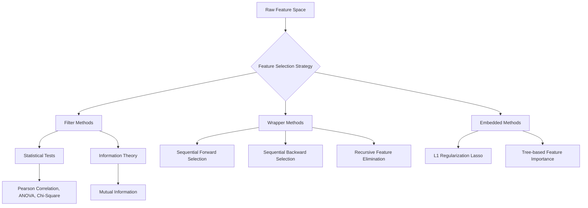

## Week 3: General Feature Engineering Techniques

## [1. Concept Introduction](https://github.com/Balasubramanian-pg/MSC.-Data-Science-AI/blob/main/Trimester%201/Feature%20Engineering/W01%20-%20Overview%20of%20Feature%20Engineering/Readme.md#1-concept-introduction)

General feature engineering is the process of manipulating the input feature space to maximize the predictive power of a statistical model while simultaneously minimizing complexity. It consists of three distinct mathematical paradigms:

1. **Feature Extraction:** Algorithmic projection of high-dimensional data into a lower-dimensional subspace (e.g., Principal Component Analysis, Autoencoders). It creates *new* representations where the original features are obfuscated.
2. **[Feature Construction](https://github.com/Balasubramanian-pg/MSC.-Data-Science-AI/blob/main/Trimester%201/Feature%20Engineering/W03%20-%20General%20Feature%20Engineering%20Techniques/L1/Demonstration.md#feature-construction):** The heuristic or domain-driven creation of new features from existing ones (e.g., calculating $X_3 = X_1 / X_2$ to represent a financial ratio).
3. **Feature Selection:** The algorithmic filtering of the existing feature space to identify the subset $S \subset F$ that contains the highest mutual information with the target $Y$, stripped of redundant or noisy dimensions.

This module focuses extensively on **Feature Selection**, which is categorized into three overarching methodologies: Filter methods, Wrapper methods, and Embedded methods.

> [!IMPORTANT]
> The fundamental theorem of feature selection relies on Occam's Razor: given two models of equal predictive power, the one with fewer features is mathematically superior. It operates in a lower-dimensional space, reduces variance, is more robust to distributional shifts in production, and demands vastly lower computational inference costs.

## [2. Intuition and Real-World Analogy](https://github.com/Balasubramanian-pg/MSC.-Data-Science-AI/blob/main/Trimester%201/Feature%20Engineering/W01%20-%20Overview%20of%20Feature%20Engineering/Readme.md#2-intuition-and-real-world-analogy)

Imagine you are assembling a Formula 1 racing team. 

- **[Feature Construction](https://github.com/Balasubramanian-pg/MSC.-Data-Science-AI/blob/main/Trimester%201/Feature%20Engineering/W03%20-%20General%20Feature%20Engineering%20Techniques/L1/Demonstration.md#feature-construction):** You calculate a new performance metric: `Driver Reflex Speed` $\times$ `Car Downforce`.
- **Feature Selection:** You have 100 candidate engineers, drivers, and analysts. You can only hire 10.
  - *Filter Method:* You give everyone a standardized IQ and reflex test. You hire the top 10 scorers. (Fast, evaluates individuals independently, but might result in hiring 10 drivers and 0 mechanics).
  - *Wrapper Method:* You simulate a race with a random team of 10. Then you swap one person out and simulate again. If the time improves, you keep the new person. (Incredibly slow, computationally massive, but guarantees the optimal synergistic team).
  - *Embedded Method:* You hire everyone, start the season, and automatically cut the pay of the least contributing members to zero as the races progress, firing them organically. (Efficiency built directly into the optimization phase).

## 3. Visual Architecture: Feature Selection Taxonomy



## 4. Filter-Based Methods

Filter methods act as a [preprocessing](https://github.com/Balasubramanian-pg/MSC.-Data-Science-AI/blob/main/Trimester%201/Feature%20Engineering/W03%20-%20General%20Feature%20Engineering%20Techniques/L1/Demonstration.md#preprocessing) step. They evaluate features purely on their intrinsic statistical properties relative to the target variable, ignoring the learning algorithm entirely.

### A. Correlation Metrics (Pearson & Spearman)
Evaluates linear (Pearson) or monotonic (Spearman) relationships between a continuous feature $X$ and a continuous target $Y$.

**Pearson Correlation Coefficient ($r$):**

$$
r_{XY} = \frac{\sum_{i=1}^{n}(X_i - \bar{X})(Y_i - \bar{Y})}{\sqrt{\sum_{i=1}^{n}(X_i - \bar{X})^2} \sqrt{\sum_{i=1}^{n}(Y_i - \bar{Y})^2}}
$$

> [!WARNING]
> Pearson only detects *linear* dependency. If $Y = X^2$, the Pearson correlation will be precisely $0$, completely missing a perfect mathematical relationship.

### B. Chi-Square Test ($\chi^2$)
Used when both the feature and the target are categorical. It evaluates whether the observed frequencies of categories deviate from the expected frequencies assuming the feature and target are independent.

$$
\chi^2 = \sum \frac{(O_i - E_i)^2}{E_i}
$$

Where $O_i$ is the observed frequency and $E_i$ is the expected frequency. Higher $\chi^2$ means the feature is highly dependent on the target (useful for the model).

### C. Information-Theoretic Measures (Mutual Information)
Mutual Information (MI) quantifies the "amount of information" obtained about one random variable through observing the other. Unlike correlation, MI captures completely non-linear relationships.

$$
I(X;Y) = \sum_{y \in Y} \sum_{x \in X} p(x,y) \log\left(\frac{p(x,y)}{p(x)p(y)}\right)
$$

If $X$ and $Y$ are strictly independent, $p(x,y) = p(x)p(y)$, the $\log(1)$ term evaluates to $0$, yielding an MI of $0$.

### Python Implementation: Filter Methods

```python
import numpy as np
import pandas as pd
from sklearn.feature_selection import SelectKBest, mutual_info_classif, chi2, f_classif

## 1. Create Simulated Dataset
np.random.seed(42)
N = 1000
X_continuous = np.random.randn(N, 3)
## Feature 0: Linear relation to target
## Feature 1: Non-linear relation (squared)
## Feature 2: Pure noise

X_categorical = np.random.randint(0, 3, size=(N, 2))
## Feature 3: Categorical noise
## Feature 4: Categorical signal

## Generate target variable based on linear feature and categorical signal
y = (X_continuous[:, 0] + X_categorical[:, 1] > 0.5).astype(int)

## Combine into DataFrame
feature_names = ['Linear_Cont', 'NonLinear_Cont', 'Noise_Cont', 'Noise_Cat', 'Signal_Cat']
X = pd.DataFrame(np.hstack((X_continuous, X_categorical)), columns=feature_names)

## Ensure categorical features are strictly positive integers for Chi-Square
X['Noise_Cat'] = X['Noise_Cat'] - X['Noise_Cat'].min()
X['Signal_Cat'] = X['Signal_Cat'] - X['Signal_Cat'].min()

## 2. Evaluate Continuous Features via ANOVA F-Value (Linear)
selector_f = SelectKBest(score_func=f_classif, k='all')
selector_f.fit(X[['Linear_Cont', 'NonLinear_Cont', 'Noise_Cont']], y)
print("ANOVA F-Values (Linear):", np.round(selector_f.scores_, 2))

## 3. Evaluate via Mutual Information (Captures Non-Linear)
selector_mi = SelectKBest(score_func=mutual_info_classif, k='all')
selector_mi.fit(X, y)
print("Mutual Information Scores:", np.round(selector_mi.scores_, 4))

## 4. Evaluate Categorical Features via Chi-Square
selector_chi2 = SelectKBest(score_func=chi2, k='all')
selector_chi2.fit(X[['Noise_Cat', 'Signal_Cat']], y)
print("Chi-Square Scores:", np.round(selector_chi2.scores_, 2))
```

## 5. Wrapper-Based Methods

Wrapper methods evaluate subsets of features by actually training the target machine learning model on them. They treat feature selection as a search problem over the space of $2^d$ possible feature combinations (where $d$ is the number of features). 

Because $2^d$ is computationally impossible for large $d$, we use greedy heuristic search algorithms: [Sequential Forward Selection (SFS)](https://github.com/Balasubramanian-pg/MSC.-Data-Science-AI/blob/main/Trimester%201/Feature%20Engineering/W03%20-%20General%20Feature%20Engineering%20Techniques/L2/Wrapper%20Methods%20-%20SFS%20%26%20SBS.md#sequential-forward-selection-sfs) and [Sequential Backward Selection (SBS)](https://github.com/Balasubramanian-pg/MSC.-Data-Science-AI/blob/main/Trimester%201/Feature%20Engineering/W03%20-%20General%20Feature%20Engineering%20Techniques/L2/Wrapper%20Methods%20-%20SFS%20%26%20SBS.md#sequential-backward-selection-sbs).

### [Sequential Forward Selection (SFS)](https://github.com/Balasubramanian-pg/MSC.-Data-Science-AI/blob/main/Trimester%201/Feature%20Engineering/W03%20-%20General%20Feature%20Engineering%20Techniques/L2/Wrapper%20Methods%20-%20SFS%20%26%20SBS.md#sequential-forward-selection-sfs) Flow


### Mathematical Trade-offs of Wrapper Methods
- **Pros:** Interacts directly with the model's cost function. Detects synergistic feature interactions (e.g., Feature A and Feature B are useless alone, but highly predictive together).
- **Cons:** Computationally devastating. Highly prone to overfitting on the training set because it runs the model repeatedly, adapting the feature space to the specific noise of the sample.

### Python Implementation: SFS and SBS

```python
from sklearn.feature_selection import SequentialFeatureSelector
from sklearn.linear_model import LogisticRegression
from sklearn.datasets import make_classification

## 1. Generate Complex Dataset with Redundancy
X_wrap, y_wrap = make_classification(n_samples=500, n_features=10, 
                                     n_informative=3, n_redundant=2, 
                                     random_state=42)
estimator = LogisticRegression()

## 2. Sequential Forward Selection
sfs = SequentialFeatureSelector(estimator, n_features_to_select=3, 
                                direction='forward', cv=3)
sfs.fit(X_wrap, y_wrap)
print("SFS Selected Features (Indices):", np.where(sfs.get_support())[0])

## 3. Sequential Backward Selection
sbs = SequentialFeatureSelector(estimator, n_features_to_select=3, 
                                direction='backward', cv=3)
sbs.fit(X_wrap, y_wrap)
print("SBS Selected Features (Indices):", np.where(sbs.get_support())[0])
```

## 6. Embedded Methods

Embedded methods perform feature selection automatically during the model training process. The algorithm's internal mathematical objective inherently suppresses or zeroes out irrelevant features.

### A. L1 Regularization (Lasso)
Regularized linear models add a penalty term to the loss function $\mathcal{L}$. While Ridge (L2) shrinks coefficients towards zero, Lasso (L1) forces them to exactly zero, creating a sparse weight vector.

**Lasso Objective Function:**

$$
\min_{\theta} \left[ \sum_{i=1}^{N} (y_i - \theta^T x_i)^2 + \lambda \sum_{j=1}^{d} |\theta_j| \right]
$$

**Step-by-Step Geometric Derivation for Sparsity:**
1. The L1 penalty $\sum |\theta_j| \le t$ forms a multi-dimensional diamond (or cross polytope) constraint region around the origin.
2. The ordinary least squares (OLS) loss function forms elliptical contours representing equal loss.
3. The optimization algorithm seeks the point where the OLS ellipse first intersects the regularization constraint region.
4. Because the L1 diamond has sharp corners directly on the axes, the elliptical contours will almost always intersect at a corner.
5. An intersection on an axis implies that the coefficient for the other axes is precisely $0$.

### B. Tree-Based Embedded Selection
Algorithms like Random Forests and Gradient Boosted Machines calculate Gini Importance (or Mean Decrease Impurity) during training. They naturally ignore uninformative features when searching for optimal split points in the tree nodes.

### Python Implementation: Embedded Feature Selection

```python
from sklearn.feature_selection import SelectFromModel
from sklearn.linear_model import LassoCV

## Using the X_wrap and y_wrap from the previous example

## 1. Train a Lasso model with built-in Cross Validation for the penalty parameter (alpha)
lasso = LassoCV(cv=5, random_state=42).fit(X_wrap, y_wrap)

## 2. Utilize SelectFromModel to automatically filter based on non-zero coefficients
embedded_selector = SelectFromModel(lasso, prefit=True)
X_embedded = embedded_selector.transform(X_wrap)

print(f"Original feature count: {X_wrap.shape[1]}")
print(f"Features strictly selected by L1 Regularization: {X_embedded.shape[1]}")
print("Lasso Coefficients:", np.round(lasso.coef_, 3))
```

## 7. Comparative Analysis and Computational Insights

| Methodology | Computational Complexity | Model Dependency | Risk of Overfitting | Best Use Case |
| :--- | :--- | :--- | :--- | :--- |
| **Filter** | Extremely Low ($\mathcal{O}(Nd)$) | Agnostic | Low | Initial screening on massive datasets (e.g., NLP, Genomics) |
| **Wrapper** | Extremely High ($\mathcal{O}(k \cdot N \cdot d^2)$) | Dependent | High | Small feature spaces where interaction effects are critical |
| **Embedded** | Medium (Built into training) | Dependent | Medium | Production machine learning pipelines (e.g., XGBoost, Lasso) |

## [8. Common Mistakes and Edge Cases](https://github.com/Balasubramanian-pg/MSC.-Data-Science-AI/blob/main/Trimester%201/Feature%20Engineering/W05%20-%20Feature%20Engineering%20Techniques%20for%20Text%20Data/Readme.md#8-common-mistakes-and-edge-cases)

> [!WARNING]
> **The Data Leakage Trap (The Most Common Interview Failure):**
> Applying feature selection (especially Filter or Wrapper methods) on the *entire [dataset](https://github.com/Balasubramanian-pg/MSC.-Data-Science-AI/blob/main/Trimester%201/Feature%20Engineering/W03%20-%20General%20Feature%20Engineering%20Techniques/Experiential%20Learning%20Activity.md#dataset)* before performing a Train/Test split causes catastrophic data leakage. The selection algorithm "sees" the target variable of the test set, creating heavily biased feature subsets.
> 
> **Correct Workflow:**
> 1. Split data into `X_train`, `X_test`.
> 2. Fit feature selector strictly on `X_train`.
> 3. Transform `X_train`.
> 4. Transform `X_test` using the rules learned from the train set.

- **Collinearity Trap in Trees:** Embedded tree models handle collinear features poorly for *interpretation*. If Feature A and Feature B are perfectly correlated and highly predictive, a Random Forest might split importance 50/50 between them, or give 100% to A and 0% to B randomly. This makes A and B look less important than they actually are.

## [9. Interview-Style Insights](https://github.com/Balasubramanian-pg/MSC.-Data-Science-AI/blob/main/Trimester%201/Feature%20Engineering/W05%20-%20Feature%20Engineering%20Techniques%20for%20Text%20Data/Readme.md#9-interview-style-insights)

**Q: Explain the difference between [Sequential Forward Selection (SFS)](https://github.com/Balasubramanian-pg/MSC.-Data-Science-AI/blob/main/Trimester%201/Feature%20Engineering/W03%20-%20General%20Feature%20Engineering%20Techniques/L2/Wrapper%20Methods%20-%20SFS%20%26%20SBS.md#sequential-forward-selection-sfs) and Recursive Feature Elimination (RFE).**
**A:** SFS is a bottom-up wrapper method. It starts with an empty set and iteratively adds features by evaluating model performance. It doesn't rely on the model's internal weights. RFE is a top-down embedded/wrapper hybrid. It requires a model that outputs feature weights (like linear regression coefficients or tree importances). It trains on all features, eliminates the feature with the lowest weight, and recursively repeats the process.

**Q: If you have a [dataset](https://github.com/Balasubramanian-pg/MSC.-Data-Science-AI/blob/main/Trimester%201/Feature%20Engineering/W03%20-%20General%20Feature%20Engineering%20Techniques/Experiential%20Learning%20Activity.md#dataset) with 1,000,000 observations and 10,000 features, how do you perform feature selection?**
**A:** A Wrapper method will never compute in a reasonable timeframe. I would use a multi-stage funnel approach:
1. Variance Thresholding to drop constant features.
2. Filter method (Mutual Information) to drop the bottom 9,000 features.
3. Embedded method (Lasso or LightGBM feature importance) on the remaining 1,000 features to select the final minimal subset.

## [10. Final Takeaways](https://github.com/Balasubramanian-pg/MSC.-Data-Science-AI/blob/main/Trimester%201/Feature%20Engineering/W05%20-%20Feature%20Engineering%20Techniques%20for%20Text%20Data/Readme.md#10-final-takeaways)

### [Mental Models](https://github.com/Balasubramanian-pg/MSC.-Data-Science-AI/blob/main/Trimester%201/Feature%20Engineering/W01%20-%20Overview%20of%20Feature%20Engineering/Readme.md#mental-models)
- **The Synergistic Pair:** Consider XOR logic. Feature 1 and Feature 2 individually have $0$ correlation with the target. However, combined, they perfectly predict the target. Filter methods will drop both features immediately. Wrapper and tree-based embedded methods will detect the synergy and keep them.
- **The Funnel:** Treat feature selection like an engineering funnel. Fast, cheap, and robust methods (Filters) at the top. Slow, accurate, and model-specific methods (Wrappers/Embedded) at the bottom.

### [Advanced Learning Roadmap](https://github.com/Balasubramanian-pg/MSC.-Data-Science-AI/blob/main/Trimester%201/Feature%20Engineering/W01%20-%20Overview%20of%20Feature%20Engineering/Readme.md#advanced-learning-roadmap)
1. **Boruta Algorithm:** An advanced wrapper method built around Random Forests that creates "shadow features" (randomized copies) to rigorously test if a feature is more predictive than pure statistical noise.
2. **SHAP (SHapley Additive exPlanations):** Move beyond simple Gini importance to game-theoretic calculation of marginal feature contributions for ultimate feature selection precision.
3. **Information Bottleneck Method:** Deep learning theoretical framework for finding the optimal representation that maximally compresses the input while preserving mutual information with the target.

Tags: #statistics #machine-learning #data-science #statistical-modelling
