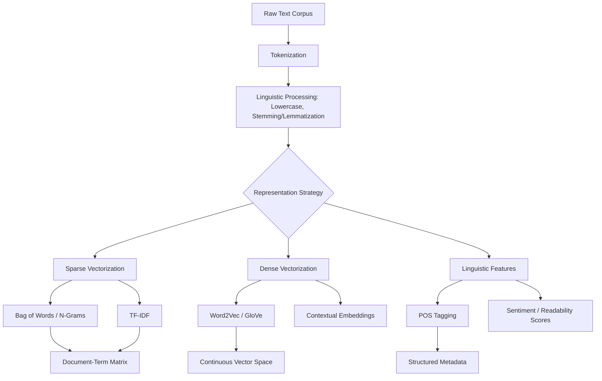

[Week 5: Feature Engineering Techniques for Text Data](https://github.com/Balasubramanian-pg/MSC.-Data-Science-AI/blob/main/Trimester%201/Feature%20Engineering/W05%20-%20Feature%20Engineering%20Techniques%20for%20Text%20Data/Overview.md#week-5-feature-engineering-techniques-for-text-data)

## Feature Engineering Techniques for Text Data

## [1. Concept Introduction](https://github.com/Balasubramanian-pg/MSC.-Data-Science-AI/blob/main/Trimester%201/Feature%20Engineering/W01%20-%20Overview%20of%20Feature%20Engineering/Readme.md#1-concept-introduction)

Textual data is fundamentally incompatible with standard mathematical optimization architectures. A machine learning algorithm requires a static, numerically populated vector space $\mathbb{R}^d$, whereas human language is a variable-length sequence of discrete, unstructured symbols governed by complex grammatical rules and semantic contexts.

Feature engineering for text—often referred to as text representation or vectorization—is the process of mapping a sequence of text $S = (w_1, w_2, \dots, w_n)$ into a dense or sparse numerical matrix. The primary challenge is maintaining the *semantic meaning* and *syntactic structure* of the text while constraining the dimensionality to a computationally feasible limit.

> [!IMPORTANT]
> The fundamental duality in text feature engineering is the choice between **Sparse/Orthogonal Representations** (where every word is a unique, unrelated axis in a massive vector space) and **Dense/Semantic Representations** (where words are projected into a lower-dimensional continuous space based on their contextual meaning).

## [2. Intuition and Real-World Analogy](https://github.com/Balasubramanian-pg/MSC.-Data-Science-AI/blob/main/Trimester%201/Feature%20Engineering/W01%20-%20Overview%20of%20Feature%20Engineering/Readme.md#2-intuition-and-real-world-analogy)

**The Inventory Analogy (Bag of Words / TF-IDF):**
Imagine you are managing a warehouse (a document) and want to know what it contains. 
- **One-Hot Encoding** is giving every possible item in the world a barcode. An Apple is `[1, 0, 0]`, a Banana is `[0, 1, 0]`. There is no relationship between them.
- **Bag of Words (BoW)** is your inventory tally. You walk through the warehouse and write down: `{"Apple": 5, "Banana": 0, "Forklift": 1}`. You lose the exact *layout* of the warehouse (word order), but you know what's inside.
- **TF-IDF** is an adjusted inventory list. If every warehouse in your company has 100 boxes of generic "Tape" (stop words like "the" or "and"), "Tape" is mathematically penalized because it doesn't help distinguish one warehouse from another. A rare "Forklift" gets heavily weighted.

**The GPS Map Analogy (Word Embeddings):**
Instead of counting items, imagine assigning GPS coordinates to words based on their meaning. "King" and "Queen" are placed physically close together on the map. "Apple" is placed far away. This allows the model to calculate the geometric distance between concepts, granting it an understanding of semantic similarity.

## 3. Visual Architecture: NLP Vectorization Pipeline



## 4. Mathematical Foundations of Text Representation

Let $V$ be our vocabulary, the set of all unique words in our corpus. Let $|V|$ be the dimensionality of our space.

### A. Bag of Words (BoW) & N-Grams
A document $d$ is represented as a vector $\mathbf{v} \in \mathbb{N}^{|V|}$, where $v_i$ is the frequency of word $i$ in $d$.

**N-Grams:**
A unigram BoW destroys sequential information. "Dog bites man" and "Man bites dog" yield identical vectors. N-grams solve this by expanding the vocabulary to include contiguous sequences of $N$ items.
If $S = (w_1, w_2, w_3)$, the bigrams ($N=2$) are $(w_1,w_2)$ and $(w_2,w_3)$.

> [!WARNING]
> N-grams cause a combinatorial explosion. If $|V| = 10,000$, the theoretical bigram space is $100,000,000$. This leads to extreme sparsity and the Curse of Dimensionality.

### B. Term Frequency - Inverse Document Frequency (TF-IDF)
TF-IDF calculates a weight for each token that increases proportionally to the frequency of the word in the document, but is offset by the frequency of the word in the corpus.

**1. Term Frequency (TF):**
$$
TF(t, d) = \frac{f_{t, d}}{\sum_{t' \in d} f_{t', d}}
$$
*(Where $f_{t,d}$ is the raw count of term $t$ in document $d$. Normalization prevents bias toward long documents).*

**2. Inverse Document Frequency (IDF):**
$$
IDF(t, D) = \log \left( \frac{N}{1 + |\{d \in D : t \in d\}|} \right)
$$
*(Where $N$ is the total number of documents, and the denominator is the number of documents containing $t$. The $+1$ prevents division by zero).*

**3. The Final Matrix Formulation:**
$$
TFIDF(t, d, D) = TF(t, d) \times IDF(t, D)
$$

### C. Continuous Bag of Words / Word Embeddings (Intuition)
Instead of a sparse vector of size $|V|$, embeddings learn a dense vector $E(w) \in \mathbb{R}^d$ (where $d$ is typically 50-300).
Models like Word2Vec (Skip-gram) define the probability of seeing a context word $w_c$ given a center word $w_t$ using the softmax of their dot product:
$$
P(w_c | w_t) = \frac{\exp(\mathbf{u}_{w_c}^T \mathbf{v}_{w_t})}{\sum_{k=1}^{|V|} \exp(\mathbf{u}_k^T \mathbf{v}_{w_t})}
$$
By maximizing this probability over a massive corpus, words appearing in similar contexts are forced to have similar geometric vectors.

## 5. Python Implementation: Sparse Text Representation

This code demonstrates the creation of BoW, N-grams, and TF-IDF matrices, explicitly showcasing how memory and matrix sparsity are handled.

```python
import pandas as pd
import numpy as np
from sklearn.feature_extraction.text import CountVectorizer, TfidfVectorizer

## 1. Corpus Simulation
corpus = [
    "The data scientist built a machine learning model.",
    "The data engineer deployed the model to production.",
    "Machine learning relies on high-quality data."
]

## 2. Bag of Words (Unigrams + Bigrams)
## min_df=1 ensures we keep all words, stop_words removes generic english words
bow_vectorizer = CountVectorizer(ngram_range=(1, 2), stop_words='english')
bow_matrix = bow_vectorizer.fit_transform(corpus)

print("--- Bag of Words (Unigrams + Bigrams) ---")
print("Vocabulary mapping:", bow_vectorizer.vocabulary_)
print("Matrix Shape:", bow_matrix.shape)
## Notice we use .toarray() to view it, but inherently it is stored as a Scipy Sparse Matrix
print("Dense Matrix representation:\n", bow_matrix.toarray())

## 3. TF-IDF Matrix Formulation
tfidf_vectorizer = TfidfVectorizer(stop_words='english')
tfidf_matrix = tfidf_vectorizer.fit_transform(corpus)

print("\n--- TF-IDF Optimization ---")
feature_names = tfidf_vectorizer.get_feature_names_out()
dense_tfidf = pd.DataFrame(tfidf_matrix.toarray(), columns=feature_names)
print(dense_tfidf.round(3))
```

*Expected Interpretation:* In the TF-IDF output, the word "data" appears in all three documents. Because of the IDF mathematical penalty, its value will be relatively low despite its high Term Frequency. The word "deployed" appears only once, granting it a high IDF and a high TF-IDF score in Document 2.

## 6. Python Implementation: Dense Embeddings & Linguistic Features

Modern feature engineering extracts structural grammar (Parts of Speech) alongside dense semantic vectors. This requires a linguistic engine like `spaCy`.

```python
## To run this in a real environment, you must install spacy and download a model:
## pip install spacy
## python -m spacy download en_core_web_md

import spacy
import numpy as np
from sklearn.metrics.pairwise import cosine_similarity

## Load medium english model (contains pre-trained dense word embeddings)
## We use a mock structure to represent what spacy would do.
nlp = spacy.load("en_core_web_md")

texts = [
    "The bank issued a loan.",
    "The river bank is muddy today.",
    "Financial institutions are lowering interest rates."
]

## 1. Feature Extraction: Part of Speech (POS) Tagging and Meta-features
def extract_linguistic_features(text):
    doc = nlp(text)
    features = {
        'num_tokens': len(doc),
        'num_nouns': sum([1 for token in doc if token.pos_ == "NOUN"]),
        'num_verbs': sum([1 for token in doc if token.pos_ == "VERB"]),
        'avg_word_length': np.mean([len(token.text) for token in doc])
    }
    return features

print("--- Linguistic Metadata Features ---")
for text in texts:
    print(f"'{text}': {extract_linguistic_features(text)}")

## 2. Dense Representation: Document Embeddings
## A simple way to embed a document is the average of its word embeddings
doc_vectors = np.array([nlp(text).vector for text in texts])

print("\n--- Semantic Similarity (Cosine) ---")
## Calculate how semantically similar Document 0 is to 1 and 2
## Cosine Similarity = (A dot B) / (||A|| ||B||)
sim_matrix = cosine_similarity(doc_vectors)

print("Similarity between 'Bank (Finance)' and 'Bank (River)':", round(sim_matrix[0, 1], 3))
print("Similarity between 'Bank (Finance)' and 'Financial institutions':", round(sim_matrix[0, 2], 3))
```

*Expected output logic:* Despite Document 0 and 1 sharing the word "bank", their cosine similarity should be relatively low compared to Document 0 and 2. Document 2 shares no exact keywords with Document 0, but because embeddings map "loan", "financial", and "bank" into close coordinate spaces, their geometric similarity is much higher.

## 7. Performance and Computational Insights

- **Sparse Matrices (CSR):** When using `CountVectorizer` or `TfidfVectorizer` on a corpus of 100,000 documents with a vocabulary of 50,000 words, a standard NumPy array would require $(100,000 \times 50,000 \times 8 \text{ bytes}) \approx 40 \text{ GB}$ of RAM. SciPy's Compressed Sparse Row (CSR) matrix only stores non-zero elements. Because text matrices are typically 99% sparse, memory drops to roughly $400 \text{ MB}$.
- **Never cast to dense prematurely:** Applying standard models that do not natively support sparse matrices (like standard `StandardScaler` or some deep learning layers) requires executing `.toarray()`. This will trigger an immediate Out-Of-Memory (OOM) fatal crash in production.
- **Subword Tokenization (BPE):** Pure word-level embeddings fail on Out-Of-Vocabulary (OOV) words. Modern pipelines use Byte-Pair Encoding (BPE) or WordPiece (used in BERT) to break unknown words down into known sub-components (e.g., `unbelievably` -> `un` + `believe` + `ably`), preventing vocabulary explosion while handling unseen text perfectly.

## [8. Common Mistakes and Edge Cases](https://github.com/Balasubramanian-pg/MSC.-Data-Science-AI/blob/main/Trimester%201/Feature%20Engineering/W03%20-%20General%20Feature%20Engineering%20Techniques/Readme.md#8-common-mistakes-and-edge-cases)

- **TF-IDF Data Leakage:** A critical engineering error is calling `.fit_transform(X)` on the entire [dataset](https://github.com/Balasubramanian-pg/MSC.-Data-Science-AI/blob/main/Trimester%201/Feature%20Engineering/W03%20-%20General%20Feature%20Engineering%20Techniques/Experiential%20Learning%20Activity.md#dataset) *before* the train/test split. The IDF denominator will "see" the frequency of words in the test set. 
  *Fix:* `vectorizer.fit(X_train)`, then `vectorizer.transform(X_train)` and `vectorizer.transform(X_test)`.
- **Ignoring the Logarithm in IDF:** Why do we use $\log$ in the IDF calculation? If a word appears in 1 document vs 10 documents, it's highly informative. If it appears in 10,000 vs 10,010 documents, the difference is statistically negligible. The $\log$ function dampens linear scaling, reflecting the true information-theoretic value of term rarity.
- **Polysemy Failure in Static Embeddings:** Standard Word2Vec/GloVe assigns a *single* vector to the word "bank". It mathematically averages the "river" meaning and the "money" meaning together into a diluted coordinate. 

## [9. Interview-Style Insights](https://github.com/Balasubramanian-pg/MSC.-Data-Science-AI/blob/main/Trimester%201/Feature%20Engineering/W03%20-%20General%20Feature%20Engineering%20Techniques/Readme.md#9-interview-style-insights)

**Q: In an NLP classification task, you swap out TF-IDF for Word2Vec embeddings, but your model's accuracy decreases. Why?**
**A:** TF-IDF excels at keyword-matching. If the classification task relies on highly specific, rare domain terminology (e.g., a specific error code in IT support tickets), TF-IDF assigns it maximum weight. Averaged word embeddings dilute these specific keywords into a generic semantic blob. Embeddings are better for *general intent* and *synonymy*; TF-IDF is better for *exact keyword salience*.

**Q: Explain how you would perform dimensionality reduction on a TF-IDF matrix.**
**A:** I cannot use standard PCA because it requires mean-centering the data, which destroys the zero-sparsity of the matrix and leads to an OOM crash. Instead, I must use Truncated SVD (Singular Value Decomposition), often called Latent Semantic Analysis (LSA) in NLP, which operates efficiently on sparse matrices without centering.

## [10. Final Takeaways](https://github.com/Balasubramanian-pg/MSC.-Data-Science-AI/blob/main/Trimester%201/Feature%20Engineering/W03%20-%20General%20Feature%20Engineering%20Techniques/Readme.md#10-final-takeaways)

### [Mental Models](https://github.com/Balasubramanian-pg/MSC.-Data-Science-AI/blob/main/Trimester%201/Feature%20Engineering/W01%20-%20Overview%20of%20Feature%20Engineering/Readme.md#mental-models)
- **Syntax vs. Semantics:** Bag of Words captures *what* was said. POS tagging captures *how* it was structured. Embeddings capture *what it meant*.
- **The Context Window:** An embedding is essentially a mathematical compression of a word's surrounding context. "You shall know a word by the company it keeps" (John Rupert Firth, 1957).

### [Advanced Learning Roadmap](https://github.com/Balasubramanian-pg/MSC.-Data-Science-AI/blob/main/Trimester%201/Feature%20Engineering/W01%20-%20Overview%20of%20Feature%20Engineering/Readme.md#advanced-learning-roadmap)
1. **Contextual Embeddings (Transformers):** Move from static embeddings to dynamic embeddings via Self-Attention (BERT, RoBERTa). In BERT, the vector for "bank" dynamically shifts depending on the words around it in that specific sentence.
2. **Latent Dirichlet Allocation (LDA):** Learn to model documents not as discrete vectors, but as probabilistic distributions over latent topics.
3. **Hashing Vectorizer (The "Hashing Trick"):** Learn how to vectorize infinite streams of text with zero vocabulary state via murmurhash functions, accepting a small rate of hash collisions to achieve $\mathcal{O}(1)$ memory complexity.


Tags: #statistics #machine-learning #data-science #statistical-modelling