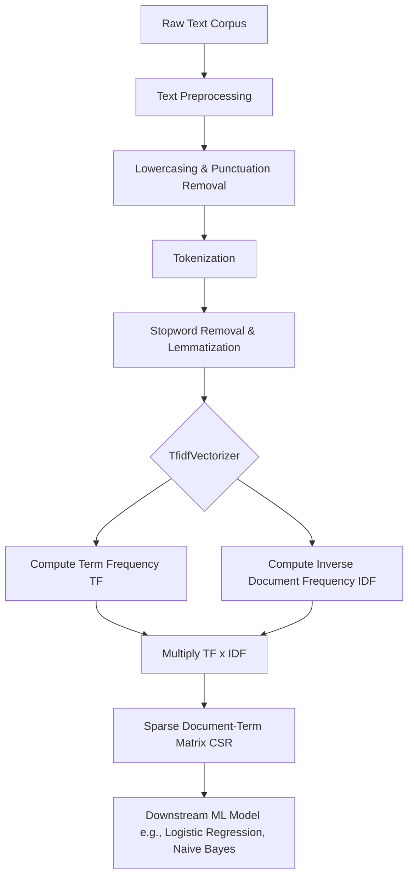

# Text Feature Engineering: Tokenization, TF-IDF, and Sparse Vectorization Pipelines

This document provides a rigorous, implementation-heavy technical analysis of text feature engineering. It details the mathematical foundations of the Vector Space Model, the mechanics of sparse matrix representations, Term Frequency-Inverse Document Frequency (TF-IDF) weighting, and the end-to-end pipeline required to transform raw unstructured text into machine-learnable features.

> [!IMPORTANT]
> Machine learning algorithms operate exclusively on numerical tensors. Text data is inherently symbolic and sequential. Feature engineering for text is the mathematical process of projecting discrete symbolic sequences into a continuous numerical vector space, balancing the trade-off between lexical exactness, semantic meaning, and computational memory constraints.

## 1. Concept Introduction

Raw text cannot be processed directly by algorithms like Logistic Regression or Neural Networks. The foundational challenge is the symbolic-to-numeric gap. We must convert text into a form that models can understand, typically numeric vectors, while preserving as much meaning as possible. 

This process involves two primary stages:
1. **Text Cleaning and Tokenization:** Breaking raw text into discrete units (tokens), normalizing case, and removing noise (stopwords, punctuation).
2. **Vectorization:** Mapping these tokens into a numerical feature space. Techniques range from simple count-based methods (Bag of Words) to weighted schemes (TF-IDF) that capture term importance relative to a corpus.

## 2. Intuition Section

Think of text vectorization like a highlighting system for a library. 
*   **Bag of Words (Count Vectorizer):** You count every word in a book. The word "the" appears 5,000 times, and the word "quantum" appears 10 times. The model thinks "the" is the most important feature of the book, which is useless noise.
*   **TF-IDF:** You apply a smart highlighter. It dims words that appear in almost every book (like "the", "is", "and") because they carry no discriminative power. It brightly highlights words that appear frequently in *this specific book* but rarely in the rest of the library (like "quantum" in a physics textbook). TF-IDF amplifies the signal and suppresses the noise.

## 3. Mathematical Explanation

Let $D = \{d_1, d_2, \dots, d_N\}$ be a corpus of $N$ documents. Let $V = \{t_1, t_2, \dots, t_M\}$ be the vocabulary of $M$ unique terms extracted from $D$.

The Vector Space Model maps each document $d_i$ to a vector $\mathbf{v}_i \in \mathbb{R}^M$:
$$
\mathbf{v}_i = [w_{i,1}, w_{i,2}, \dots, w_{i,M}]
$$
Where $w_{i,j}$ is the weight of term $t_j$ in document $d_i$. In TF-IDF, this weight is the product of local term frequency and global inverse document frequency.

## 4. Formula Breakdowns

### Term Frequency (TF)
Measures the local importance of a term within a specific document. To prevent bias toward longer documents, it is often normalized.
$$
\text{TF}(t, d) = \frac{\text{count}(t, d)}{\sum_{t' \in d} \text{count}(t', d)}
$$

### Inverse Document Frequency (IDF)
Measures the global informativeness of a term across the entire corpus. Terms that appear in almost every document carry little discriminative power and are penalized.
$$
\text{IDF}(t, D) = \log\left( \frac{1 + N}{1 + df(t, D)} \right) + 1
$$
Where $df(t, D)$ is the document frequency (the number of documents containing term $t$). The $+1$ smoothing terms prevent division by zero and ensure that terms appearing in all documents do not result in a zero or negative weight.

### TF-IDF Weight
The final feature value is the product of local frequency and global rarity.
$$
\text{TF-IDF}(t, d, D) = \text{TF}(t, d) \times \text{IDF}(t, D)
$$

## 5. Step-by-Step Derivations

### Deriving the Dampening Effect of Logarithmic IDF
Consider a corpus of $N = 1,000,000$ documents. 
*   Term A appears in $df = 10$ documents. 
*   Term B appears in $df = 100$ documents.

Without the logarithm, the raw inverse ratio for Term A is $1,000,000 / 10 = 100,000$. For Term B, it is $1,000,000 / 100 = 10,000$. Term A is weighted 10 times higher than Term B. 

With the logarithm (base $e$ or 10, scikit-learn uses natural log):
*   $\text{IDF}_A \approx \ln(1,000,000 / 10) = \ln(100,000) \approx 11.5$
*   $\text{IDF}_B \approx \ln(1,000,000 / 100) = \ln(10,000) \approx 9.2$

The logarithm compresses the dynamic range. It prevents extremely rare terms (which might be typos or noise) from completely dominating the vector representation and causing numerical instability in downstream models.

## 6. Real-World Analogies

**The Signal-to-Noise Amplifier:**
Imagine a crowded room where everyone is talking. If someone says "um" or "the", it blends into the background noise; the IDF assigns it a near-zero weight. If someone whispers a highly specific technical term like "heteroskedasticity", the IDF acts as an amplifier, assigning it a massive weight. TF-IDF is an acoustic filter that suppresses background noise and amplifies unique signals.

## 7. Python Implementations

The following implementation replicates the transcript's workflow: loading the 20 Newsgroups dataset, applying NLTK-based text cleaning, vectorizing with TF-IDF, training a Logistic Regression classifier, and extracting the top features.

```python
import numpy as np
import pandas as pd
import nltk
from nltk.tokenize import word_tokenize
from nltk.corpus import stopwords
from sklearn.datasets import fetch_20newsgroups
from sklearn.feature_extraction.text import TfidfVectorizer
from sklearn.model_selection import train_test_split
from sklearn.linear_model import LogisticRegression
from sklearn.metrics import classification_report
import warnings

warnings.filterwarnings('ignore')

# Download required NLTK resources
nltk.download('punkt', quiet=True)
nltk.download('stopwords', quiet=True)

def clean_text(text: str) -> str:
    """
    Performs basic text cleaning: tokenization, alphabetic filtering, 
    lowercasing, and stopword removal.
    """
    # 1. Tokenize
    tokens = word_tokenize(text)
    
    # 2. Filter: keep only alphabetic words, lowercase, remove stopwords
    stop_words = set(stopwords.words('english'))
    cleaned_tokens = [
        word.lower() for word in tokens 
        if word.isalpha() and word.lower() not in stop_words
    ]
    
    # 3. Rejoin into a clean string
    return " ".join(cleaned_tokens)

def build_text_classification_pipeline():
    # 1. Load a subset of the 20 Newsgroups dataset for performance
    categories = ['rec.sport.hockey', 'comp.sys.ibm.pc.hardware']
    dataset = fetch_20newsgroups(
        subset='all', 
        categories=categories, 
        random_state=42
    )
    
    # Use a smaller sample (2000 records) as per transcript example
    sample_size = 2000
    texts = dataset.data[:sample_size]
    labels = dataset.target[:sample_size]
    
    print(f"Original dataset shape: {len(texts)} documents")
    
    # 2. Apply text cleaning
    print("Cleaning text...")
    cleaned_texts = [clean_text(doc) for doc in texts]
    
    # 3. TF-IDF Vectorization
    # max_features=3000 limits the vocabulary to the top 3000 most frequent terms
    vectorizer = TfidfVectorizer(max_features=3000, ngram_range=(1, 2))
    X_sparse = vectorizer.fit_transform(cleaned_texts)
    
    print(f"TF-IDF Matrix Shape: {X_sparse.shape}")
    print(f"Sparsity: {100 * (1 - X_sparse.nnz / (X_sparse.shape[0] * X_sparse.shape[1])):.2f}%")
    
    # 4. Train-Test Split
    X_train, X_test, y_train, y_test = train_test_split(
        X_sparse, labels, test_size=0.2, random_state=42
    )
    
    # 5. Train Logistic Regression Classifier
    print("Training Logistic Regression...")
    clf = LogisticRegression(max_iter=1000, random_state=42)
    clf.fit(X_train, y_train)
    
    # 6. Evaluate
    y_pred = clf.predict(X_test)
    print("\nClassification Report:")
    print(classification_report(y_test, y_pred, target_names=dataset.target_names))
    
    return vectorizer, clf

# Execute Pipeline
vectorizer, model = build_text_classification_pipeline()
```

## 8. Python Simulations

This simulation demonstrates how to extract the most important features (highest average TF-IDF scores) from a fitted vectorizer, a critical step for model interpretability.

```python
def extract_top_tfidf_features(vectorizer: TfidfVectorizer, top_n: int = 10):
    """
    Computes the mean TF-IDF score for each term across all documents 
    and returns the top N most important features.
    """
    # Get the feature names (vocabulary)
    feature_names = np.array(vectorizer.get_feature_names_out())
    
    # The TF-IDF matrix is already L2 normalized by default in sklearn.
    # We compute the mean TF-IDF score for each column (feature).
    # Note: For a true average importance, we can use the mean of the absolute values 
    # or simply the mean of the matrix columns.
    mean_tfidf_scores = np.asarray(vectorizer.idf_) # IDF is a good proxy for global importance
    
    # Get indices of the top N highest IDF scores
    top_indices = np.argsort(mean_tfidf_scores)[-top_n:][::-1]
    
    print(f"\nTop {top_n} Features by IDF Score:")
    for idx in top_indices:
        print(f" - {feature_names[idx]}: {mean_tfidf_scores[idx]:.4f}")

# Run extraction on the fitted vectorizer from the previous step
extract_top_tfidf_features(vectorizer, top_n=10)
```

## 9. Practical Engineering Examples

*   **E-Commerce Search Ranking:** When a user searches for "wireless noise-canceling headphones", the search engine converts the query and the product catalog into TF-IDF vectors. Cosine similarity is computed in milliseconds to rank products that lexically overlap with the query.
*   **Spam Detection:** Email classifiers use TF-IDF to identify words that are highly frequent in spam (e.g., "viagra", "lottery") but rare in legitimate emails, assigning them high weights to trigger the classifier.

## 10. Common Mistakes

> [!WARNING]
> **Trap 1: Data Leakage in TF-IDF Fitting.**
> The IDF component relies on the global document frequency. If you `fit` the `TfidfVectorizer` on the entire dataset (including the test set) before splitting, information from the test set leaks into the training set. You must `fit` only on the training data and `transform` the test data.

> [!WARNING]
> **Trap 2: Ignoring the Out-Of-Vocabulary (OOV) Problem.**
> If a document in production contains words that were not present in the training corpus vocabulary, the standard TF-IDF vectorizer simply ignores them. If a document consists entirely of OOV words, it results in a zero-vector, breaking model inference.

> [!WARNING]
> **Trap 3: Using Dense Matrices for Text.**
> Converting a TF-IDF sparse matrix to a dense NumPy array (`toarray()`) for a corpus of 100,000 documents and 50,000 features will require allocating a massive matrix, consuming roughly 40 GB of RAM and causing an Out-Of-Memory (OOM) crash. Always maintain the `scipy.sparse.csr_matrix` format.

## 11. Visual Intuition

Imagine a 3D space where the X, Y, and Z axes represent the terms "bank", "river", and "money". A document about "finance" will have a high coordinate on the Z-axis and near-zero on X and Y. A document about "nature" will have a high coordinate on the Y-axis. The word "bank" is ambiguous. In a purely lexical TF-IDF space, "river bank" and "investment bank" are pushed far apart because they do not share the same co-occurring vocabulary. This is the fundamental limitation of sparse lexical space; it lacks the geometric capacity to resolve polysemy.

## 12. Mermaid Diagrams

The end-to-end pipeline for transforming raw text into machine-learnable features.



## 13. Real-World Applications

*   **Recommendation Systems:** Content-based filtering relies heavily on TF-IDF. By vectorizing user watch histories and movie descriptions, the system recommends items whose TF-IDF vectors exhibit high cosine similarity to the user's historical profile vector.
 is strictly bounded by the feature engineering applied to the text (e.g., proper bigram extraction and domain-specific stopword removal).

## 14. Machine Learning Connections

*   **Naive Bayes and Multinomial Distributions:** The Multinomial Naive Bayes classifier is mathematically designed to operate on discrete counts. It is the perfect probabilistic companion to the CountVectorizer or TF-IDF representations.
*   **Linear SVMs in High Dimensions:** In spaces with tens of thousands of dimensions (like TF-IDF), data is almost always linearly separable. Linear Support Vector Machines vastly outperform complex non-linear models on sparse text data due to the curse of dimensionality and the sparsity of the feature matrix.

## 15. Interview-Style Insights

**Interviewer:** "Why do we use the logarithm in the Inverse Document Frequency formula instead of a simple linear inverse ratio?"
**Candidate:** "The logarithm dampens the effect of the IDF scale. If we used a linear ratio, a term that appears in 1 document versus 2 documents would have a massive, disproportionate weight compared to a term appearing in 100 versus 101 documents. The log function compresses the dynamic range, ensuring that extremely rare terms do not completely dominate the vector representation and cause numerical instability."

**Interviewer:** "You have a corpus of 10 million documents. Fitting a standard TF-IDF vectorizer causes an Out-Of-Memory error. How do you resolve this?"
**Candidate:** "I would transition from `TfidfVectorizer` to `HashingVectorizer`. The Hashing Vectorizer uses the hashing trick to map tokens directly to column indices using a hash function, completely eliminating the need to store a vocabulary dictionary in memory. It allows for out-of-core streaming learning. The trade-off is that it is stateless and suffers from hash collisions, but for massive-scale linear models, it is the standard engineering solution."

## 16. Edge Cases

*   **Hapax Legomena:** Words that appear exactly once in the entire corpus. In TF-IDF, these receive the maximum possible IDF weight. If the single occurrence is a typo or noise, it introduces a massive, erroneous signal. Filtering terms by a minimum document frequency (`min_df` in scikit-learn) is mandatory to strip hapax legomena.
*   **Highly Skewed Document Lengths:** If a corpus contains documents ranging from 10 words to 10,000 words, raw Term Frequency will heavily bias the long documents. Applying `sublinear_tf=True` (which scales TF by $1 + \log(\text{TF})$) or strict L2 normalization is required to prevent long documents from dominating the similarity space.

## 17. Mental Models

**The Sparse Manifold:**
View text feature engineering as a choice of manifolds. The Lexical Manifold (TF-IDF) is high-dimensional, mostly empty, and axis-aligned. Distances are computed via exact coordinate overlaps. It is computationally cheap and highly interpretable, but rigid. Understanding that your data lives in this sparse, high-dimensional space dictates that you must use algorithms optimized for sparsity (like CSR matrices and linear models).

## 18. Performance and Computational Insights

*   **Memory Layout (CSR):** Text data results in Document-Term matrices where each row has very few non-zero elements. The Compressed Sparse Row (CSR) format is strictly required. CSR optimizes row slicing and dot products, which are the primary operations in text ML.
*   **Time Complexity:** Vectorization via `TfidfVectorizer` is $O(N \cdot L)$, where $N$ is the number of documents and $L$ is the average document length. However, computing the pairwise cosine similarity matrix for the entire corpus is $O(N^2 \cdot M)$, where $M$ is the vocabulary size. For $N > 100,000$, approximate nearest neighbor algorithms must be used.

## 19. Advanced Notes

*   **N-grams:** The transcript mentions unigrams, bigrams, and trigrams. Setting `ngram_range=(1, 2)` in `TfidfVectorizer` captures local context (e.g., "not good" instead of just "not" and "good" separately), which significantly improves classification performance without the overhead of deep learning models.
*   **Sublinear TF Scaling:** Scikit-learn's `TfidfVectorizer` includes a `sublinear_tf=True` parameter. This replaces raw TF with $1 + \log(\text{TF})$, preventing a word that appears 100 times from being weighted 100 times higher than a word that appears 10 times, which better reflects the law of diminishing returns in information theory.

## 20. Final Takeaways

### Key Takeaways
*   Text feature engineering maps symbolic sequences into numerical vector spaces.
*   **TF-IDF** balances local term frequency with global document frequency, suppressing common stopwords and amplifying rare, discriminative terms.
*   Text matrices are inherently **sparse**. Utilizing `scipy.sparse.csr_matrix` is mandatory to prevent Out-Of-Memory errors.
*   Always `fit` the vectorizer on training data and `transform` test data to prevent data leakage.

### Common Traps to Avoid
*   Fitting the vectorizer on the entire dataset before train/test splitting.
*   Converting sparse text matrices to dense NumPy arrays, resulting in immediate memory exhaustion.
*   Failing to filter out `min_df`, allowing noisy, single-occurrence typos to dominate the IDF weights.

### Interview Questions to Drill
1. Derive the TF-IDF formula and explain the mathematical purpose of the logarithmic smoothing term in the IDF calculation.
2. Explain the difference between CountVectorizer and TfidfVectorizer, and specify a scenario where CountVectorizer is strictly preferable.
3. How does the Hashing Trick solve the memory bottleneck of standard TF-IDF vectorization, and what are its mathematical trade-offs?
4. Why do Linear SVMs typically outperform Random Forests on high-dimensional, sparse TF-IDF matrices?

### Advanced Learning Roadmap
1. **Next Step:** Master **Word Embeddings (Word2Vec, GloVe)** to understand how to transition from sparse lexical spaces to dense semantic spaces.
2. **Next Step:** Study **Topic Modeling (Latent Dirichlet Allocation)** to learn how to extract unsupervised thematic structures from TF-IDF matrices.
3. **Next Step:** Explore **Transformer Architectures (BERT)** to understand contextualized embeddings and the attention mechanism, which supersede static TF-IDF representations in modern NLP.

### Recommended Python Libraries
*   `scikit-learn`: The industry standard for `TfidfVectorizer`, `CountVectorizer`, and `HashingVectorizer`.
*   `scipy.sparse`: Essential for handling, slicing, and computing dot products on massive Document-Term matrices without memory overflow.
*   `nltk` / `spacy`: For advanced linguistic feature engineering, including Part-of-Speech tagging, lemmatization, and robust tokenization prior to vectorization.
*   `gensim`: The premier library for training and deploying dense word embeddings and topic models.
