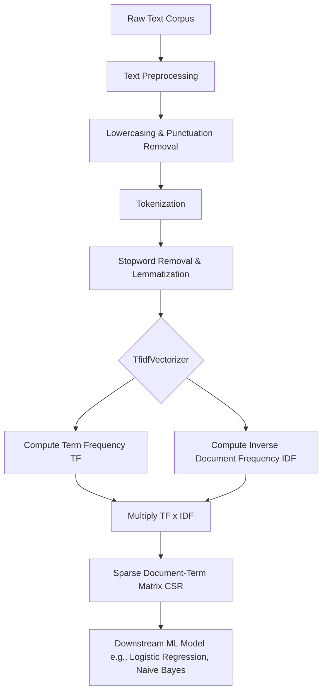

# 12. Mermaid Diagrams

The end-to-end pipeline for transforming raw text into machine-learnable features.

```mermaid
flowchart TD
    A[Raw Text Corpus] --> B[Text Preprocessing]
    B --> C[Lowercasing & Punctuation Removal]
    C --> D[Tokenization]
    D --> E[Stopword Removal & Lemmatization]
    E --> F{TfidfVectorizer}
    F --> G[Compute Term Frequency TF]
    F --> H[Compute Inverse Document Frequency IDF]
    G --> I[Multiply TF x IDF]
    H --> I
    I --> J[Sparse Document-Term Matrix CSR]
    J --> K[Downstream ML Model e.g., Logistic Regression, Naive Bayes]
```
