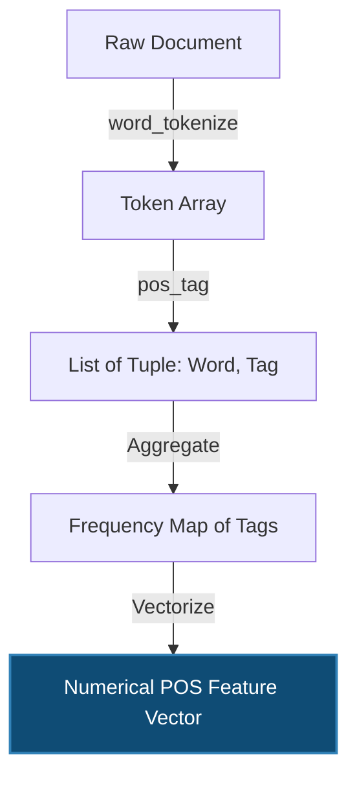

# Feature Engineering Techniques for Text Data

> [!NOTE]
> **Prerequisite Knowledge:** Basic probability theory, linear algebra (vectors, sparse matrices), and general familiarity with Python data structures.

## 1. Concept Introduction

Natural Language Processing (NLP) fundamentally battles the "representation problem": machine learning models optimize mathematical objective functions using linear algebra and calculus. Raw text (strings of characters) is intrinsically discrete and non-numeric. 

Feature engineering for text is the mathematical transformation $\phi : \mathcal{T} \rightarrow \mathbb{R}^d$, where a document in the text space $\mathcal{T}$ is mapped to a high-dimensional vector space $\mathbb{R}^d$. This mapping must preserve the informational signal (syntax, semantics, context) required for the downstream learning task (e.g., classification, sentiment analysis, clustering).

This document rigorously covers three foundational, non-parametric feature extraction algorithms:
1. **$N$-Grams (Unigrams, Bigrams, Trigrams)**: Capturing local sequence contexts.
2. **One-Hot Encoding**: Orthogonal categorical representation.
3. **Part-of-Speech (POS) Tagging**: Extracting syntactic meta-features.

> [!IMPORTANT]
> While modern NLP heavily relies on dense continuous representations (Transformers, Word2Vec), discrete techniques (N-grams, OHE, POS tags) remain crucial for baseline models, specific linguistic rule-based systems, and domains where interpretability and exact word matching are non-negotiable.

## 2. Unigrams and N-Grams

### Intuition
A unigram treats text as an unordered "Bag of Words" (BoW). Imagine taking a sentence, chopping it into individual words, and throwing them into a bucket. You know *what* words are present, but you lose *where* they were. 

An **$n$-gram** is a contiguous sequence of $n$ items from a given sample of text. By increasing $n$ (bigrams, trigrams), we expand our sliding window to capture local word dependencies. 

* **Unigrams ($n=1$):** `["machine", "learning", "is", "great"]`
* **Bigrams ($n=2$):** `["machine learning", "learning is", "is great"]` 
* **Trigrams ($n=3$):** `["machine learning is", "learning is great"]`

Bigrams allow a model to differentiate between "good movie" and "not good", which a pure unigram model would fail to distinguish because it simply counts the occurrences of "not" and "good" independently.

### Mathematical Formulation

Let a document $D$ be a sequence of tokens $D = (w_1, w_2, \dots, w_k)$.

An $n$-gram is a tuple of $n$ consecutive tokens:
$g_i^{(n)} = (w_i, w_{i+1}, \dots, w_{i+n-1})$

The vocabulary of all unique $n$-grams in the corpus $\mathcal{C}$ is denoted as $V^{(n)}$. The dimensionality of the feature space is $|V^{(n)}|$.

The feature vector for document $D$ using $n$-grams is $x_D \in \mathbb{N}^{|V^{(n)}|}$, where the $j$-th element is the term frequency:

$$
x_{D, j} = \sum_{i=1}^{k-n+1} \mathbb{I} \left[ g_i^{(n)} == v_j \right]
$$

Where:
* $v_j$ is the $j$-th $n$-gram in the vocabulary $V^{(n)}$.
* $\mathbb{I}[\cdot]$ is the indicator function evaluating to 1 if true, 0 otherwise.

> [!WARNING]
> **The Curse of Dimensionality:**
> If a vocabulary has size $|V|$, the theoretical maximum number of possible bigrams is $|V|^2$, and trigrams is $|V|^3$. While natural language is highly constrained (not all word combinations occur), the feature matrix grows exponentially and becomes extremely sparse.

### Visual Intuition: N-Gram Sliding Window

```mermaid
flowchart LR
    subgraph Document
        direction LR
        W01 - Overview of Feature Engineering(New) --> W2(York)
        W2 --> W03 - General Feature Engineering Techniques(City)
        W03 - General Feature Engineering Techniques --> W4(is)
        W4 --> W5(huge)
    end

    subgraph Bi-Grams
        B1["(New, York)"]
        B2["(York, City)"]
        B3["(City, is)"]
    end
    
    W01 - Overview of Feature Engineering -.-> B1
    W2 -.-> B1
    W2 -.-> B2
    W03 - General Feature Engineering Techniques -.-> B2
    W03 - General Feature Engineering Techniques -.-> B3
    W4 -.-> B3
```

### Python Implementation

We utilize `scikit-learn`'s `CountVectorizer`, which creates a sparse matrix representation.

```python
import pandas as pd
from sklearn.feature_extraction.text import CountVectorizer

# Simulated clean text corpus (e.g., from 20 Newsgroups subset)
corpus = [
    "machine learning is great",
    "the movie was not good",
    "deep learning is machine learning"
]

# 1. Unigram Vectorizer
unigram_vectorizer = CountVectorizer(ngram_range=(1, 1))
X_uni = unigram_vectorizer.fit_transform(corpus)

# 2. Unigram + Bigram + Trigram Vectorizer
# ngram_range=(1, 3) means extract n=1, n=2, and n=3
ngram_vectorizer = CountVectorizer(ngram_range=(1, 3))
X_ngram = ngram_vectorizer.fit_transform(corpus)

print(f"Unigram Feature Matrix Shape: {X_uni.shape}")
print(f"N-Gram Feature Matrix Shape: {X_ngram.shape}\n")

# Display features for the first document
vocab_ngrams = ngram_vectorizer.get_feature_names_out()
doc_1_vector = X_ngram.toarray()[0]

print("Document 1 ('machine learning is great') N-Gram Vector:")
for feature, count in zip(vocab_ngrams, doc_1_vector):
    if count > 0:
        print(f" - {feature}: {count}")

# Expected Output:
# Unigram Feature Matrix Shape: (3, 8)
# N-Gram Feature Matrix Shape: (3, 23)
# Document 1 N-Gram Vector:
#  - great: 1
#  - is: 1
#  - is great: 1
#  - learning: 1
#  - learning is: 1
#  - learning is great: 1
#  - machine: 1
#  - machine learning: 1
#  - machine learning is: 1
```

> [!TIP]
> **Production Engineering Insight:** 
> `fit_transform` returns a `scipy.sparse.csr_matrix` (Compressed Sparse Row). Never convert this to a dense array (`toarray()`) in production for large datasets like the 20,000 Newsgroups, as it will cause OOM (Out Of Memory) crashes. Machine learning models in `sklearn` accept CSR matrices natively.

## 3. One-Hot Encoding (OHE) for Text

### Intuition
Before word counts or frequency, the most primitive way to represent categorical data (like distinct words or distinct document classes) is One-Hot Encoding. You assign each category a unique column. If the category is present, the column gets a `1`, otherwise `0`.

For text, if our universe of words is `["science", "religion", "hockey"]`, we define a 3-dimensional space. "science" is the x-axis, "religion" is the y-axis, "hockey" is the z-axis.

### Mathematical Formulation
Let the vocabulary $V$ have size $N$. 
A mapping function maps every word $w_i \in V$ to a unique integer index $j \in \{1, 2, \dots, N\}$.
The One-Hot vector $v_w \in \{0,1\}^N$ for a word $w$ is defined via the Kronecker delta:

$$
v_{w, k} = \delta_{j, k} = 
\begin{cases} 
1 & \text{if } k = j \\
0 & \text{if } k \neq j 
\end{cases}
$$

> [!IMPORTANT]
> **The Geometric Limitation:**
> The dot product between any two distinct one-hot encoded words is exactly 0.
> $v_{science}^T \cdot v_{physics} = 0$
> Therefore, the cosine similarity between "science" and "physics" is 0. OHE assumes all words are completely orthogonal and strictly independent, which violates linguistic reality (semantics).

### Python Implementation

```python
import numpy as np
from sklearn.preprocessing import OneHotEncoder

# A list of categorical words to encode
words = np.array([["science"], ["religion"], ["hockey"], ["science"]])

# Initialize the OneHotEncoder
# sparse_output=False for demonstration purposes to see the dense array
encoder = OneHotEncoder(sparse_output=False)

# Fit and transform the words
one_hot_vectors = encoder.fit_transform(words)
categories = encoder.categories_[0]

print(f"Categories discovered: {categories}\n")
for word, vector in zip(words.flatten(), one_hot_vectors):
    print(f"Word: {word:<10} | OHE Vector: {vector}")

# Expected Output:
# Categories discovered: ['hockey' 'religion' 'science']
# 
# Word: science    | OHE Vector: [0. 0. 1.]
# Word: religion   | OHE Vector: [0. 1. 0.]
# Word: hockey     | OHE Vector: [1. 0. 0.]
# Word: science    | OHE Vector: [0. 0. 1.]
```

## 4. Part-of-Speech (POS) Tagging

### Intuition
Words alone carry meaning, but their grammatical role (noun, verb, adjective) carries structural and contextual meaning. POS tagging acts as an abstraction layer. 

Instead of an ML model learning that "awesome", "great", and "horrible" predict sentiment directly, it can learn that *the ratio of adjectives to nouns* is a strong meta-feature for opinionated text. Advanced models use POS sequences to parse syntactic dependency trees.

### Mathematical & Algorithmic Background
Historically, POS tagging is solved as a sequence classification problem. Given a sequence of words $\mathbf{w} = (w_1, \dots, w_T)$, we want to find the most probable sequence of tags $\mathbf{t} = (t_1, \dots, t_T)$.

Using a Hidden Markov Model (HMM), we maximize the joint probability:

$$
\hat{\mathbf{t}} = \arg\max_{\mathbf{t}} P(\mathbf{w}, \mathbf{t}) = \arg\max_{\mathbf{t}} \prod_{i=1}^{T} P(w_i | t_i) P(t_i | t_{i-1})
$$

Where:
* $P(w_i | t_i)$ is the **Emission Probability** (likelihood of a noun being the word "bank").
* $P(t_i | t_{i-1})$ is the **Transition Probability** (likelihood of an adjective being followed by a noun).
*(Modern systems use Conditional Random Fields (CRFs) or Transformers for this).*

### Mermaid Diagram: POS Feature Extraction Flow



### Python Implementation

We use the Natural Language Toolkit (`nltk`), the industry standard for classical text processing.

```python
import nltk
from collections import Counter
import pandas as pd

# Note: In a real environment, you must download the NLTK data bundles first:
# nltk.download('punkt')
# nltk.download('averaged_perceptron_tagger')

document = "The swift programmer carefully debugged the broken application."

# Step 1: Tokenize the document
tokens = nltk.word_tokenize(document)

# Step 2: Apply POS Tagging
# The Viterbi algorithm runs under the hood here
pos_tags = nltk.pos_tag(tokens)

print("Token -> Tag Mapping:")
for word, tag in pos_tags:
    print(f"{word:>12} -> {tag}")

# Step 3: Feature Engineering - Convert tags to counts
# Count frequencies of grammatical structures
tag_counts = Counter([tag for word, tag in pos_tags])

# Convert to a feature vector format (e.g., for a DataFrame)
pos_features = pd.DataFrame([tag_counts]).fillna(0).astype(int)

print("\nEngineered POS Features for the Document:")
print(pos_features.to_markdown(index=False))

# Expected Feature Output:
# DT (Determiner): 2
# JJ (Adjective): 2
# NN (Noun): 2
# RB (Adverb): 1
# VBD (Verb, past tense): 1
```

> [!NOTE]
> **Penn Treebank POS Tags (Common ones):**
> * `NN`: Noun, singular
> * `NNS`: Noun, plural
> * `JJ`: Adjective
> * `RB`: Adverb
> * `VBD`: Verb, past tense
> * `VBZ`: Verb, 3rd person singular present

## 5. Practical Engineering Examples

How do we combine these in a real Machine Learning pipeline?
You rarely use just unigrams or just POS counts. You concatenate them into a unified feature space. 

```python
from scipy.sparse import hstack

# Assume X_ngram is our (3, 23) CSR matrix from earlier.
# We extract POS counts for all 3 documents to create a (3, num_pos_tags) matrix.
# We then horizontally stack them:
# X_combined = hstack([X_ngram, X_pos_features])
```

## 6. Common Mistakes & Traps

1. **Information Leakage via Vectorizer:** Fitting the `CountVectorizer` on the entire dataset (Train + Test) before splitting. This leaks the test vocabulary into the training phase. Always use `fit_transform` on Train, and `transform` on Test.
2. **Ignoring Sparsity:** Converting a `CountVectorizer` output to a `numpy` dense array. It will consume gigabytes of RAM instantly. Keep it as `scipy.sparse.csr_matrix`.
3. **Overfitting with high $N$-grams:** Adding 4-grams and 5-grams often leads to severe overfitting. The model memorizes exact sentence structures rather than generalizable features. Regularize heavily (e.g., using L1/L2 penalties in Logistic Regression) when using $n \ge 3$.
4. **Case Sensitivity:** Failing to convert text to lowercase before n-gram extraction creates duplications (e.g., "Machine" and "machine" become two separate unigrams). `CountVectorizer` does lowercasing by default, but manual tokenization pipelines sometimes miss it.

## 7. Interview Questions & Insights

* **Q: What is the computational complexity of extracting bigrams versus unigrams?**
  * *Insight:* It's $O(N_{tokens})$ for both, as you pass a sliding window of size 1 or 2 over the token list. However, the *space complexity* (memory footprint) of the resulting vocabulary grows exponentially for bigrams, constrained ultimately by the size of the corpus.
* **Q: Why would you extract POS tags to use as features instead of just relying on the words themselves?**
  * *Insight:* Generalization. Words handle exact topic matching. POS tags handle writing *style*. If you are building a fake news detector or an authorship attribution model, the syntactic structure (how many adjectives or adverbs the author uses) is highly predictive, regardless of the topic.
* **Q: Why does One-Hot Encoding fail for language modeling?**
  * *Insight:* It fails to capture semantic similarity. The distance between "King" and "Queen" is the same as "King" and "Apple" in an OHE space. This necessitates continuous, dense embeddings like Word2Vec.

## 8. Advanced Learning Roadmap

To build upon these foundational concepts, study the following in order:
1. **TF-IDF (Term Frequency - Inverse Document Frequency):** The mathematical upgrade to $N$-Grams that down-weights common words (like "the", "is").
2. **Dense Embeddings (Word2Vec, GloVe):** Solving the OHE orthogonality problem using shallow neural networks.
3. **Sub-word Tokenization (BPE, WordPiece):** Modern tokenization techniques used in LLMs to handle Out-Of-Vocabulary (OOV) words smoothly.
4. **Sequence Models (RNNs, LSTMs, Transformers):** Moving from Bag-of-Words aggregations to temporally-aware structural modeling. 

**Recommended Libraries to Master:**
* `scikit-learn` (specifically `sklearn.feature_extraction.text`)
* `nltk` (for traditional syntax/morphology pipelines)
* `spacy` (production-grade NLP, much faster POS tagging than NLTK)
* `scipy.sparse` (essential for manipulating high-dimensional text feature matrices efficiently)
