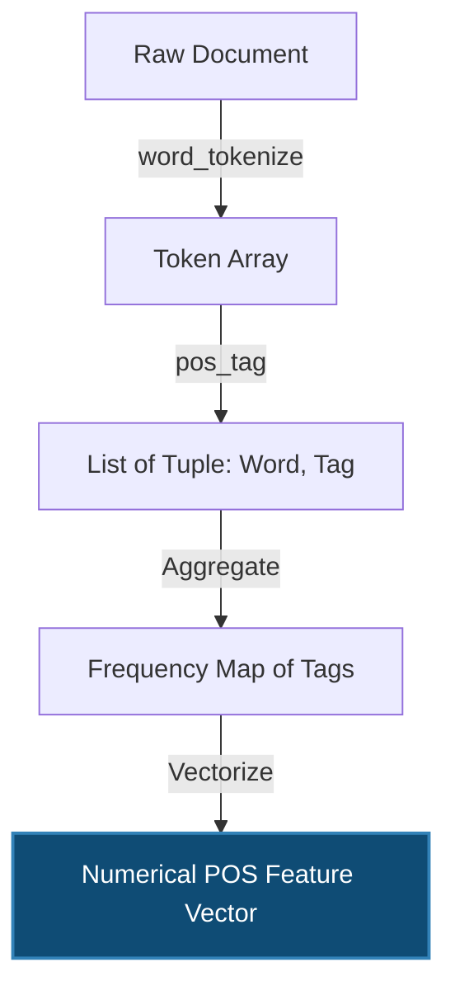

# 4. Part-of-Speech (POS) Tagging

### Intuition
Words alone carry meaning, but their grammatical role (noun, verb, adjective) carries structural and contextual meaning. POS tagging acts as an abstraction layer. 

Instead of an ML model learning that "awesome", "great", and "horrible" predict sentiment directly, it can learn that *the ratio of adjectives to nouns* is a strong meta-feature for opinionated text. Advanced models use POS sequences to parse syntactic dependency trees.

### Mathematical & Algorithmic Background
Historically, POS tagging is solved as a sequence classification problem. Given a sequence of words $\mathbf{w} = (w_1, \dots, w_T)$, we want to find the most probable sequence of tags $\mathbf{t} = (t_1, \dots, t_T)$.

Using a Hidden Markov Model (HMM), we maximize the joint probability:

$$
\hat{\mathbf{t}} = \arg\max_{\mathbf{t}} P(\mathbf{w}, \mathbf{t}) = \arg\max_{\mathbf{t}} \prod_{i=1}^{T} P(w_i | t_i) P(t_i | t_{i-1})
$$

Where:
* $P(w_i | t_i)$ is the **Emission Probability** (likelihood of a noun being the word "bank").
* $P(t_i | t_{i-1})$ is the **Transition Probability** (likelihood of an adjective being followed by a noun).
*(Modern systems use Conditional Random Fields (CRFs) or Transformers for this).*

### Mermaid Diagram: POS Feature Extraction Flow



### Python Implementation

We use the Natural Language Toolkit (`nltk`), the industry standard for classical text processing.

```python
import nltk
from collections import Counter
import pandas as pd
