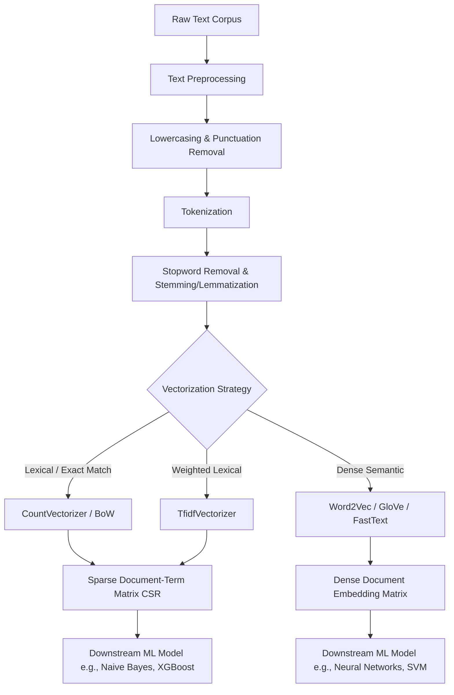

# Feature Engineering Techniques for Text Data: Vectorization, Semantics, and Sparse Representations

This document provides a rigorous technical analysis of feature engineering for unstructured text data. It details the mathematical foundations of the Vector Space Model, the mechanics of sparse matrix representations, Term Frequency-Inverse Document Frequency (TF-IDF) weighting, and the transition from lexical statistics to dense semantic embeddings.

> [!IMPORTANT]
> Machine learning algorithms operate exclusively on continuous or discrete numerical tensors. Text data is inherently symbolic, sequential, and high-dimensional. Feature engineering for text is the mathematical process of projecting discrete symbolic sequences into a continuous numerical vector space, balancing the trade-off between lexical exactness, semantic meaning, and computational memory constraints.

## 1. Concept Introduction

In traditional tabular data, features are pre-defined, bounded, and numerically explicit. Text data violates these assumptions. A text corpus consists of documents composed of tokens (words or subwords) drawn from a vocabulary of potentially millions of unique terms. 

The foundational challenge of text feature engineering is the **Symbolic-to-Numeric Gap**. Algorithms cannot process the string "apple"; they require a numerical coordinate. The most naive approach assigns a unique integer to every word (Label Encoding), but this falsely implies an ordinal relationship (e.g., "apple" > "banana"). The industry standard resolves this via the **Vector Space Model (VSM)**, where each document is represented as a vector in a high-dimensional space, where each dimension corresponds to a specific term in the corpus vocabulary.

## 2. Intuition Section

**The Library Index vs. The GPS Coordinate**
Consider two paradigms for representing text:
1.  **Sparse Lexical Space (TF-IDF):** Imagine a library with one million books. To describe a book, you create a checklist of one million possible words. You place a '1' if the word appears, and a '0' if it does not. Most of the checklist is empty. This is a sparse vector. It is excellent for exact keyword matching but blind to synonyms.
2.  **Dense Semantic Space (Embeddings):** Imagine a 300-dimensional GPS coordinate system. Instead of a checklist, the book is plotted at a specific coordinate based on its contextual usage. Books about "canines" and "dogs" are plotted at adjacent coordinates, even if they share zero exact vocabulary. This is a dense vector. It captures semantic geometry but requires massive computational overhead to construct.

## 3. Mathematical Explanation

Let $D = \{d_1, d_2, \dots, d_N\}$ be a corpus of $N$ documents. Let $V = \{t_1, t_2, \dots, t_M\}$ be the vocabulary of $M$ unique terms extracted from $D$.

The Vector Space Model maps each document $d_i$ to a vector $\mathbf{v}_i \in \mathbb{R}^M$:
$$
\mathbf{v}_i = [w_{i,1}, w_{i,2}, \dots, w_{i,M}]
$$
Where $w_{i,j}$ is the weight of term $t_j$ in document $d_i$. The choice of weighting scheme defines the feature engineering technique:
*   **Binary Weighting:** $w_{i,j} \in \{0, 1\}$ (Presence/Absence).
*   **Term Frequency (TF):** $w_{i,j} = \text{count}(t_j, d_i)$.
*   **TF-IDF:** $w_{i,j} = \text{TF}(t_j, d_i) \times \text{IDF}(t_j, D)$.

## 4. Formula Breakdowns

### Term Frequency (TF)
Measures the local importance of a term within a specific document. To prevent bias toward longer documents, TF is often normalized by the document length or the maximum term frequency in the document.
$$
\text{TF}(t, d) = \frac{\text{count}(t, d)}{\sum_{t' \in d} \text{count}(t', d)}
$$

### Inverse Document Frequency (IDF)
Measures the global informativeness of a term across the entire corpus. Terms that appear in almost every document (e.g., "the", "is") carry little discriminative power and are penalized.
$$
\text{IDF}(t, D) = \log\left( \frac{1 + N}{1 + df(t, D)} \right) + 1
$$
Where $df(t, D)$ is the document frequency (the number of documents containing term $t$). The $+1$ smoothing terms prevent division by zero and ensure that terms appearing in all documents do not result in a zero or negative weight.

### TF-IDF Weight
The final feature value is the product of local frequency and global rarity.
$$
\text{TF-IDF}(t, d, D) = \text{TF}(t, d) \times \text{IDF}(t, D)
$$

### Cosine Similarity
To measure the distance or similarity between two document vectors $\mathbf{v}_i$ and $\mathbf{v}_j$ in the high-dimensional space, Cosine Similarity is used. It measures the cosine of the angle between the vectors, normalizing for document length.
$$
\text{Cosine}(\mathbf{v}_i, \mathbf{v}_j) = \frac{\mathbf{v}_i \cdot \mathbf{v}_j}{\|\mathbf{v}_i\|_2 \|\mathbf{v}_j\|_2} = \frac{\sum_{k=1}^M v_{i,k} v_{j,k}}{\sqrt{\sum_{k=1}^M v_{i,k}^2} \sqrt{\sum_{k=1}^M v_{j,k}^2}}
$$

## 5. Step-by-Step Derivations

### Deriving the TF-IDF Matrix and L2 Normalization
In production systems, raw TF-IDF vectors are typically L2-normalized to ensure that document length does not dominate similarity calculations.

1.  **Compute Raw TF-IDF Vector:** For document $d_i$, compute the vector $\mathbf{u}_i = [u_{i,1}, \dots, u_{i,M}]$ where $u_{i,j} = \text{TF-IDF}(t_j, d_i, D)$.
2.  **Compute the L2 Norm:** Calculate the Euclidean length of the vector.
    $$
    \|\mathbf{u}_i\|_2 = \sqrt{\sum_{j=1}^M u_{i,j}^2}
    $$
3.  **Normalize:** Divide each component by the L2 norm to project the vector onto the unit hypersphere.
    $$
    \mathbf{v}_i = \frac{\mathbf{u}_i}{\|\mathbf{u}_i\|_2}
    $$
    After this transformation, the magnitude of every document vector is exactly 1. Consequently, the Cosine Similarity between any two documents simplifies to their standard dot product: $\mathbf{v}_i \cdot \mathbf{v}_j$.

## 6. Real-World Analogies

**The Signal-to-Noise Amplifier:**
Imagine a crowded room (the corpus) where everyone is talking. If someone says "um" or "the" (stopwords/high document frequency), it blends into the background noise; the IDF assigns it a near-zero weight. If someone whispers a highly specific technical term like "heteroskedasticity" (low document frequency), the IDF acts as an amplifier, assigning it a massive weight. TF-IDF is essentially an acoustic filter that suppresses background noise and amplifies unique signals.

## 7. Python Implementations

The following implementation demonstrates a production-grade text vectorization pipeline. It highlights the transition from raw text to a sparse TF-IDF matrix, and manually computes cosine similarity to expose the underlying linear algebra.

```python
import numpy as np
import pandas as pd
from sklearn.feature_extraction.text import TfidfVectorizer
from scipy.sparse import csr_matrix
import logging

logging.basicConfig(level=logging.INFO, format='%(asctime)s - %(levelname)s - %(message)s')
logger = logging.getLogger(__name__)

class TextFeatureEngineeringPipeline:
    """
    A production-grade pipeline for transforming raw text into 
    TF-IDF weighted sparse matrices with L2 normalization.
    """
    
    def __init__(self, max_features: int = 10000, ngram_range: tuple = (1, 2)):
        """
        Initializes the TF-IDF vectorizer.
        
        Args:
            max_features: Caps the vocabulary size to the top N most frequent terms 
                          to control memory footprint.
            ngram_range: Captures unigrams and bigrams to preserve local context.
        """
        self.vectorizer = TfidfVectorizer(
            max_features=max_features,
            ngram_range=ngram_range,
            stop_words='english',
            sublinear_tf=True,  # Applies 1 + log(TF) scaling to dampen high frequencies
            norm='l2'           # Enforces L2 normalization
        )
        self.vocabulary_ = None
        
    def fit_transform(self, corpus: list[str]) -> csr_matrix:
        """Fits the vocabulary and transforms the corpus into a sparse TF-IDF matrix."""
        logger.info(f"Fitting TF-IDF vectorizer on corpus of size {len(corpus)}...")
        tfidf_matrix = self.vectorizer.fit_transform(corpus)
        self.vocabulary_ = self.vectorizer.vocabulary_
        
        logger.info(f"Matrix shape: {tfidf_matrix.shape}")
        logger.info(f"Sparsity: {100 * (1 - tfidf_matrix.nnz / (tfidf_matrix.shape[0] * tfidf_matrix.shape[1])):.2f}%")
        
        return tfidf_matrix
        
    def transform(self, new_corpus: list[str]) -> csr_matrix:
        """Transforms new, unseen text using the fitted vocabulary."""
        if self.vocabulary_ is None:
            raise ValueError("Vectorizer must be fitted before transforming new data.")
        return self.vectorizer.transform(new_corpus)

    @staticmethod
    def compute_cosine_similarity_sparse(mat_a: csr_matrix, mat_b: csr_matrix) -> np.ndarray:
        """
        Computes pairwise cosine similarity between two sparse matrices.
        Because the matrices are L2-normalized, cosine similarity is just the dot product.
        """
        # Dot product of sparse matrices
        similarity_matrix = mat_a.dot(mat_b.T)
        return similarity_matrix.toarray()

# Execution Block
if __name__ == "__main__":
    corpus = [
        "Machine learning is a subset of artificial intelligence.",
        "Deep learning utilizes neural networks with many layers.",
        "Natural language processing deals with text and speech data.",
        "Artificial intelligence aims to create intelligent machines.",
        "I love eating pizza and pasta on weekends."
    ]
    
    pipeline = TextFeatureEngineeringPipeline(max_features=5000, ngram_range=(1, 2))
    tfidf_matrix = pipeline.fit_transform(corpus)
    
    # Compute similarity between the first 4 documents (tech-related) and the 5th (food-related)
    tech_docs = tfidf_matrix[:4]
    food_doc = tfidf_matrix[4:]
    
    similarities = pipeline.compute_cosine_similarity_sparse(tech_docs, food_doc)
    
    print("\nCosine Similarities (Tech Docs vs. Food Doc):")
    for i, sim in enumerate(simibilities.flatten()):
        print(f"Doc {i+1} vs Food Doc: {sim:.4f}")
```

## 8. Python Simulations

Visualizing high-dimensional text spaces is impossible without dimensionality reduction. This simulation generates a synthetic corpus, vectorizes it, and uses Truncated Singular Value Decomposition (SVD / LSA) to project the sparse TF-IDF space into 2D for visual analysis of cluster separability.

```python
import matplotlib.pyplot as plt
from sklearn.datasets import make_classification
from sklearn.decomposition import TruncatedSVD
from sklearn.pipeline import Pipeline

def simulate_and_visualize_text_space():
    """
    Simulates a text classification problem, reduces the sparse TF-IDF 
    dimensions using LSA, and visualizes the semantic clusters.
    """
    # 1. Generate synthetic text data (simulating 3 distinct topics)
    from sklearn.feature_extraction.text import make_multilabel_classification
    # For simplicity, we use a pre-defined dummy corpus structure
    np.random.seed(42)
    topics = ["finance market stocks", "sports football game", "technology software code"]
    corpus = []
    labels = []
    
    for label_idx, topic in enumerate(topics):
        words = topic.split()
        for _ in range(100):
            # Generate sentences with topic words and random noise
            sentence = " ".join(np.random.choice(words + ["data", "system", "play", "run", "fast", "good"], 10))
            corpus.append(sentence)
            labels.append(label_idx)
            
    # 2. Vectorize
    vectorizer = TfidfVectorizer(max_features=500)
    X_sparse = vectorizer.fit_transform(corpus)
    
    # 3. Dimensionality Reduction (Latent Semantic Analysis)
    svd = TruncatedSVD(n_components=2, random_state=42)
    X_reduced = svd.fit_transform(X_sparse)
    
    # 4. Visualization
    plt.figure(figsize=(10, 7))
    scatter = plt.scatter(X_reduced[:, 0], X_reduced[:, 1], c=labels, cmap='viridis', alpha=0.7, edgecolors='k')
    plt.title('2D Projection of TF-IDF Space via Truncated SVD (LSA)')
    plt.xlabel('Latent Semantic Dimension 1')
    plt.ylabel('Latent Semantic Dimension 2')
    plt.colorbar(scatter, label='Topic Cluster')
    plt.grid(True, alpha=0.3)
    plt.show()

simulate_and_visualize_text_space()
```

## 9. Practical Engineering Examples

*   **E-Commerce Search Ranking:** When a user searches for "wireless noise-canceling headphones", the search engine converts the query and the product catalog into TF-IDF vectors. Cosine similarity is computed in milliseconds to rank products that lexically overlap with the query, serving as the first-pass retrieval mechanism before heavier neural re-rankers are applied.
*   **Plagiarism Detection:** Academic institutions compare student submissions against a massive corpus of existing papers. By representing documents as TF-IDF vectors, the system can rapidly compute pairwise cosine similarities to flag documents with suspiciously high lexical overlap.

## 10. Common Mistakes

> [!WARNING]
> **Trap 1: Data Leakage in TF-IDF Fitting.**
> The IDF component relies on the global document frequency ($df$). If you fit the `TfidfVectorizer` on the entire dataset (including the test set) before splitting, information from the test set leaks into the training set. You must `fit` only on the training data and `transform` the test data.

> [!WARNING]
> **Trap 2: Ignoring the Out-Of-Vocabulary (OOV) Problem.**
> If a document in production contains words that were not present in the training corpus vocabulary, the standard TF-IDF vectorizer simply ignores them. If a document consists entirely of OOV words, it results in a zero-vector, which breaks similarity calculations and model inference.

> [!WARNING]
> **Trap 3: Using Dense Matrices for Text.**
> Converting a TF-IDF sparse matrix to a dense NumPy array (`toarray()`) for a corpus of 100,000 documents and 50,000 features will require allocating a $100,000 \times 50,000 \times 8$ byte matrix, consuming roughly 40 GB of RAM and likely causing an Out-Of-Memory (OOM) crash. Always maintain the `scipy.sparse.csr_matrix` format.

## 11. Visual Intuition

Imagine a 3D space where the X, Y, and Z axes represent the terms "bank", "river", and "money". 
*   A document about "finance" will have a high coordinate on the Z-axis and near-zero on X and Y.
*   A document about "nature" will have a high coordinate on the Y-axis.
*   The word "bank" is ambiguous. In a purely lexical TF-IDF space, "river bank" and "investment bank" are pushed far apart because they do not share the same co-occurring vocabulary. This is the fundamental limitation of the sparse lexical space; it lacks the geometric capacity to resolve polysemy without the introduction of dense embeddings.

## 12. Mermaid Diagrams

The end-to-end pipeline for transforming raw text into machine-learnable features.



## 13. Real-World Applications

*   **Recommendation Systems:** Content-based filtering relies heavily on TF-IDF. By vectorizing user watch histories and movie descriptions, the system recommends items whose TF-IDF vectors exhibit high cosine similarity to the user's historical profile vector.
*   **Topic Modeling (Latent Dirichlet Allocation):** LDA requires a Document-Term matrix as its primary input. The quality of the discovered topics is strictly bounded by the feature engineering applied to the text (e.g., proper bigram extraction and domain-specific stopword removal).

## 14. Machine Learning Connections

*   **Naive Bayes and Multinomial Distributions:** The Multinomial Naive Bayes classifier is mathematically designed to operate on discrete counts. It is the perfect probabilistic companion to the CountVectorizer (Bag of Words) or TF-IDF representations.
*   **Linear SVMs in High Dimensions:** In spaces with tens of thousands of dimensions (like TF-IDF), data is almost always linearly separable. Linear Support Vector Machines (using `LinearSVC` or `SGDClassifier`) vastly outperform complex non-linear models (like RBF kernels or Random Forests) on sparse text data due to the curse of dimensionality and the sparsity of the feature matrix.

## 15. Interview-Style Insights

**Interviewer:** "Why do we use the logarithm in the Inverse Document Frequency (IDF) formula instead of a simple linear inverse ratio?"
**Candidate:** "The logarithm dampens the effect of the IDF scale. If we used a linear ratio $\frac{N}{df}$, a term that appears in 1 document versus 2 documents would have a massive, disproportionate weight compared to a term appearing in 100 versus 101 documents. The log function compresses the dynamic range of the weights, ensuring that extremely rare terms do not completely dominate the vector representation and cause numerical instability in downstream models."

**Interviewer:** "You have a corpus of 10 million documents. Fitting a standard TF-IDF vectorizer causes an Out-Of-Memory error. How do you resolve this without losing the lexical matching capabilities?"
**Candidate:** "I would transition from `TfidfVectorizer` to `HashingVectorizer`. The Hashing Vectorizer uses the hashing trick to map tokens directly to column indices using a hash function, completely eliminating the need to store a vocabulary dictionary in memory. It allows for out-of-core (streaming) learning. The trade-off is that it is stateless (cannot invert the matrix) and suffers from hash collisions, but for massive-scale linear models, it is the standard engineering solution."

## 16. Edge Cases

*   **Hapax Legomena:** Words that appear exactly once in the entire corpus. In TF-IDF, these receive the maximum possible IDF weight. If the single occurrence is a typo or noise, it introduces a massive, erroneous signal into the model. Filtering terms by a minimum document frequency (`min_df` in scikit-learn) is mandatory to strip hapax legomena.
*   **Highly Skewed Document Lengths:** If a corpus contains documents ranging from 10 words to 10,000 words, raw Term Frequency will heavily bias the long documents. Applying `sublinear_tf=True` (which scales TF by $1 + \log(\text{TF})$) or strict L2 normalization is required to prevent long documents from dominating the similarity space.

## 17. Mental Models

**The Sparse vs. Dense Manifold:**
View text feature engineering as a choice between two manifolds. 
1.  **The Lexical Manifold (Sparse):** High-dimensional, mostly empty, axis-aligned. Distances are computed via exact coordinate overlaps. It is computationally cheap and highly interpretable, but rigid.
2.  **The Semantic Manifold (Dense):** Low-dimensional, fully populated, rotated. Distances are computed via angular proximity. It captures meaning and synonyms, but requires massive computational resources and acts as a "black box."
Understanding which manifold your specific business problem requires is the core of text feature engineering.

## 18. Performance and Computational Insights

*   **Memory Layout (CSR vs. CSC):** Text data results in Document-Term matrices where each row (document) has very few non-zero elements. The Compressed Sparse Row (CSR) format is strictly required. CSR optimizes row slicing (fetching a single document) and dot products (computing similarity), which are the primary operations in text ML. Column slicing (CSC) is highly inefficient for this data structure.
*   **Time Complexity:** Vectorization via `TfidfVectorizer` is $O(N \cdot L)$, where $N$ is the number of documents and $L$ is the average document length. However, computing the pairwise cosine similarity matrix for the entire corpus is $O(N^2 \cdot M)$, where $M$ is the vocabulary size. For $N > 100,000$, computing the full similarity matrix is computationally intractable; approximate nearest neighbor (ANN) algorithms like FAISS must be used.

## 19. Advanced Notes

*   **Subword Embeddings (FastText):** Standard Word2Vec treats every word as an atomic unit and fails on Out-Of-Vocabulary (OOV) words. FastText breaks words into character n-grams. The vector for "playing" is derived from the sum of vectors for "play", "playi", "layin", etc. This allows the model to generate robust vectors for misspelled words or morphological variants never seen in training.
*   **Contextualized Embeddings (Transformers):** TF-IDF and Word2Vec assign a single, static vector to a word regardless of context (e.g., "bank" in "river bank" and "investment bank" have the exact same vector). Modern architectures (BERT, RoBERTa) generate contextualized embeddings where the vector for a token is dynamically computed based on the surrounding sequence, resolving polysemy entirely.

## 20. Final Takeaways

### Key Takeaways
*   Text feature engineering maps symbolic sequences into numerical vector spaces using the Vector Space Model.
*   **TF-IDF** balances local term frequency with global document frequency, suppressing common stopwords and amplifying rare, discriminative terms.
*   Text matrices are inherently **sparse**. Utilizing `scipy.sparse.csr_matrix` is mandatory to prevent Out-Of-Memory errors.
*   **Cosine Similarity** is the standard metric for comparing document vectors, as it normalizes for varying document lengths.

### Common Traps to Avoid
*   Fitting the vectorizer on the entire dataset before train/test splitting, causing IDF data leakage.
*   Converting sparse text matrices to dense NumPy arrays, resulting in immediate memory exhaustion.
*   Failing to filter out `min_df` (minimum document frequency), allowing noisy, single-occurrence typos to dominate the IDF weights.

### Interview Questions to Drill
1. Derive the TF-IDF formula and explain the mathematical purpose of the logarithmic smoothing term in the IDF calculation.
2. Explain the difference between CountVectorizer and TfidfVectorizer, and specify a scenario where CountVectorizer is strictly preferable.
3. How does the Hashing Trick solve the memory bottleneck of standard TF-IDF vectorization, and what are its mathematical trade-offs?
4. Why do Linear SVMs typically outperform Random Forests on high-dimensional, sparse TF-IDF matrices?

### Advanced Learning Roadmap
1. **Next Step**: Master **Word Embeddings (Word2Vec, GloVe)** to understand how to transition from sparse lexical spaces to dense semantic spaces.
2. **Next Step**: Study **Topic Modeling (Latent Dirichlet Allocation)** to learn how to extract unsupervised thematic structures from TF-IDF matrices.
3. **Next Step**: Explore **Transformer Architectures (BERT)** to understand contextualized embeddings and the attention mechanism, which supersede static TF-IDF representations in modern NLP.

### Recommended Python Libraries
*   `scikit-learn`: The industry standard for `TfidfVectorizer`, `CountVectorizer`, and `HashingVectorizer`.
*   `scipy.sparse`: Essential for handling, slicing, and computing dot products on massive Document-Term matrices without memory overflow.
*   `Gensim`: The premier library for training and deploying dense word embeddings (Word2Vec, FastText) and topic models (LDAs).
*   `spaCy`: For advanced linguistic feature engineering, including Part-of-Speech (POS) tagging, lemmatization, and Named Entity Recognition (NER) prior to vectorization.


Tags: #statistics #machine-learning #data-science #statistical-modelling