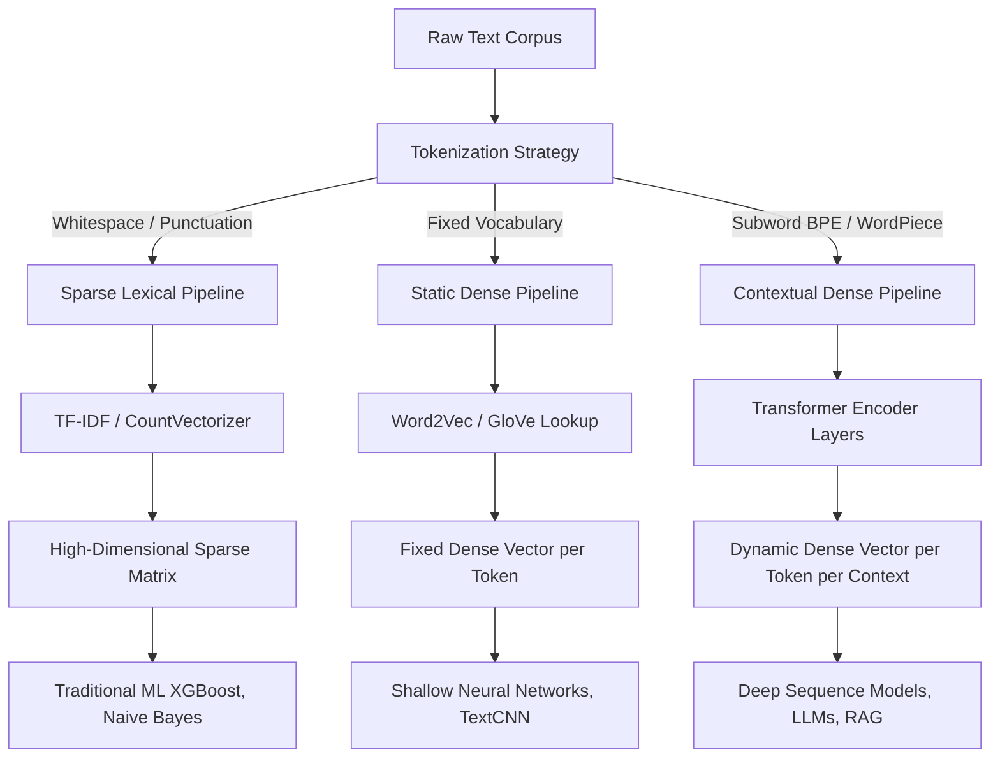

# Advanced Text Representations: From Sparse Lexical Spaces to Contextualized Embeddings

This document provides a rigorous technical analysis of the evolution of text feature engineering. It details the mathematical transition from sparse lexical representations (Bag-of-Words, TF-IDF) to dense semantic spaces (Word2Vec, GloVe), and culminates in the architecture of contextualized embeddings (BERT, GPT) driven by the Transformer mechanism.

> [!IMPORTANT]
> Text representation models have evolved through three distinct paradigms: Sparse Lexical (exact token matching), Dense Static (global semantic proximity), and Dense Contextual (dynamic, sequence-aware semantics). Modern Natural Language Processing (NLP) relies almost exclusively on contextualized embeddings, which resolve polysemy and capture complex syntactic dependencies that static vectors fundamentally cannot represent.

## 1. Concept Introduction

The foundational challenge of NLP is mapping discrete, symbolic human language into continuous, numerical vector spaces that machine learning algorithms can process. Early approaches treated text as a "bag of words," discarding syntax and order. While computationally efficient, these sparse representations fail to capture semantic relationships. 

The industry subsequently shifted to dense word embeddings, which map words to dense vectors based on global co-occurrence statistics. However, these static embeddings assign a single, fixed vector to each word, failing to account for polysemy (words with multiple meanings). The current state-of-the-art utilizes contextualized embeddings, where the vector representation of a token is dynamically computed based on its surrounding sequence, leveraging the self-attention mechanism of Transformer architectures.

## 2. Intuition Section

**The Dictionary vs. Encyclopedia vs. Novelist**
Consider three paradigms for representing the concept of a "bank":
1.  **Sparse Lexical (TF-IDF):** A dictionary index. It knows that "bank" appears in a document, but it has no idea what a bank is. It only knows that "bank" and "bank" are the exact same string.
2.  **Dense Static (Word2Vec):** An encyclopedia. It knows that "bank" is conceptually related to "finance", "money", and "institution". It places "bank" near these terms in a geometric space. However, it assigns the exact same coordinate to "bank" whether the context is finance or a river.
3.  **Dense Contextual (BERT):** A novelist. It reads the entire sentence. If the sentence is about withdrawing cash, it places "bank" in the financial region of the vector space. If the sentence is about fishing, it dynamically shifts the "bank" vector to the geographical region.

## 3. Mathematical Explanation

Let $V$ be the vocabulary size. 
In the **Sparse Lexical** paradigm, a document $d$ is represented as $\mathbf{v} \in \mathbb{R}^V$, where $v_i$ is the TF-IDF weight of the $i$-th term. The space is high-dimensional and extremely sparse.

In the **Dense Static** paradigm, each word $w \in V$ is mapped to a dense vector $\mathbf{e}_w \in \mathbb{R}^d$, where $d \ll V$ (typically 100 to 300). A document is represented by aggregating (e.g., averaging) its constituent word vectors.

In the **Dense Contextual** paradigm, the embedding of a token $w_i$ at position $i$ in a sequence of length $L$ is a function of the entire sequence:
$$\mathbf{h}_i = f(w_1, w_2, \dots, w_L; \theta)$$
Where $\mathbf{h}_i \in \mathbb{R}^d$ and $f$ is a deep neural network (the Transformer encoder). The vector $\mathbf{h}_i$ changes if any other word $w_j$ in the sequence changes.

## 4. Formula Breakdowns

### The Skip-Gram Objective (Word2Vec)
Given a sequence of words $w_1, w_2, \dots, w_T$, the Skip-Gram model maximizes the log-probability of predicting context words within a window of size $c$ given a center word:
$$\mathcal{L} = \frac{1}{T} \sum_{t=1}^T \sum_{-c \le j \le c, j \neq 0} \log P(w_{t+j} | w_t)$$
The conditional probability is modeled using a softmax function over the vocabulary:
$$P(w_{t+j} | w_t) = \frac{\exp(\mathbf{u}_{w_{t+j}}^T \mathbf{v}_{w_t})}{\sum_{w=1}^V \exp(\mathbf{u}_w^T \mathbf{v}_{w_t})}$$
Where $\mathbf{v}$ is the center word vector and $\mathbf{u}$ is the context word vector.

### The GloVe Objective (Global Vectors)
GloVe combines global co-occurrence statistics with local context window methods. It factorizes the logarithm of the word co-occurrence matrix $X$:
$$J = \sum_{i,j=1}^V f(X_{ij}) \left( \mathbf{w}_i^T \tilde{\mathbf{w}}_j + b_i + \tilde{b}_j - \log X_{ij} \right)^2$$
Where $f(X_{ij})$ is a weighting function that prevents extremely frequent word pairs from dominating the loss.

### Scaled Dot-Product Attention (Transformers)
Contextual embeddings are generated via the self-attention mechanism, which computes the relevance of each token to every other token in the sequence:
$$\text{Attention}(\mathbf{Q}, \mathbf{K}, \mathbf{V}) = \text{softmax}\left(\frac{\mathbf{Q}\mathbf{K}^T}{\sqrt{d_k}}\right)\mathbf{V}$$
Where $\mathbf{Q}$, $\mathbf{K}$, and $\mathbf{V}$ are the query, key, and value matrices projected from the input embeddings, and $d_k$ is the dimension of the keys, used to stabilize gradients.

## 5. Step-by-Step Derivations

### Deriving Negative Sampling for Skip-Gram
The softmax denominator in the Skip-Gram model requires summing over the entire vocabulary $V$, making each gradient update $O(V \cdot d)$, which is computationally prohibitive for large vocabularies. 

Mikolov et al. introduced Negative Sampling, which replaces the softmax with a binary classification loss. The model is trained to distinguish the true context word from $k$ "negative" samples drawn from a noise distribution $P_n(w)$.

1.  **Define the Positive Loss:** Maximize the probability that the true context word $w_O$ is predicted.
    $$\log \sigma(\mathbf{u}_{w_O}^T \mathbf{v}_{w_I})$$
2.  **Define the Negative Loss:** Minimize the probability that $k$ sampled noise words $w_i \sim P_n(w)$ are predicted.
    $$\sum_{i=1}^k \mathbb{E}_{w_i \sim P_n(w)} \left[ \log \sigma(-\mathbf{u}_{w_i}^T \mathbf{v}_{w_I}) \right]$$
3.  **Combine:** The final objective to maximize is:
    $$\mathcal{L}_{\text{neg}} = \log \sigma(\mathbf{u}_{w_O}^T \mathbf{v}_{w_I}) + \sum_{i=1}^k \log \sigma(-\mathbf{u}_{w_i}^T \mathbf{v}_{w_I})$$
    This reduces the computational complexity per update from $O(V \cdot d)$ to $O(k \cdot d)$, where $k \ll V$.

## 6. Real-World Analogies

**The GPS Coordinate System:**
Imagine a 300-dimensional GPS system. 
*   In a **Sparse** model, every city is a separate, isolated dimension. "New York" and "New York City" are completely unrelated dimensions unless explicitly linked.
*   In a **Static Dense** model, cities are plotted on a physical map. "New York" and "Boston" are close together. The numbers in the coordinate (latitude, longitude) don't mean anything individually, but the distance between them represents physical proximity.
*   In a **Contextual** model, the map is alive. If you are looking for "financial banks", the map shifts to show Wall Street. If you are looking for "river banks", the map shifts to show the Hudson River. The coordinates of the word "bank" physically move depending on your query.

## 7. Python Implementations

The following implementation demonstrates the extraction of contextual embeddings using a pre-trained Transformer model. It explicitly handles subword tokenization to isolate the embedding of a specific target word, proving that the vector changes based on context.

```python
import numpy as np
import torch
from transformers import AutoTokenizer, AutoModel

class ContextualEmbeddingExtractor:
    """
    Extracts contextualized word embeddings from a Transformer model,
    handling subword tokenization artifacts inherent to WordPiece/BPE.
    """
    
    def __init__(self, model_name: str = 'bert-base-uncased'):
        self.tokenizer = AutoTokenizer.from_pretrained(model_name)
        self.model = AutoModel.from_pretrained(model_name)
        self.model.eval()
        
    def get_word_embedding(self, text: str, target_word: str) -> np.ndarray:
        """
        Extracts the embedding for a specific word by averaging the 
        hidden states of its constituent subword tokens.
        """
        inputs = self.tokenizer(text, return_tensors='pt')
        
        with torch.no_grad():
            outputs = self.model(**inputs, output_hidden_states=True)
            
        # Extract the last layer's hidden states (batch_size, seq_len, hidden_dim)
        last_hidden = outputs.hidden_states[-1][0]
        
        # Tokenize the text and the target word to find subword matches
        text_tokens = self.tokenizer.convert_ids_to_tokens(inputs.input_ids[0])
        target_subwords = self.tokenizer.tokenize(target_word)
        
        # Find the starting index of the target word in the tokenized sequence
        start_idx = -1
        for i in range(len(text_tokens) - len(target_subwords) + 1):
            if text_tokens[i:i+len(target_subwords)] == target_subwords:
                start_idx = i
                break
                
        if start_idx == -1:
            raise ValueError(f"Target word '{target_word}' not found in the tokenized sequence.")
            
        # Average the embeddings of the subwords that make up the target word
        end_idx = start_idx + len(target_subwords)
        word_vector = last_hidden[start_idx:end_idx].mean(dim=0).numpy()
        
        return word_vector

# Execution Block
if __name__ == "__main__":
    extractor = ContextualEmbeddingExtractor()
    
    text1 = "I went to the bank to withdraw money."
    text2 = "I sat by the river bank to fish."
    
    vec1 = extractor.get_word_embedding(text1, "bank")
    vec2 = extractor.get_word_embedding(text2, "bank")
    
    # Compute Cosine Similarity
    similarity = np.dot(vec1, vec2) / (np.linalg.norm(vec1) * np.linalg.norm(vec2))
    
    print(f"Context 1: {text1}")
    print(f"Context 2: {text2}")
    print(f"Cosine Similarity of 'bank' across contexts: {similarity:.4f}")
    print("Note: A similarity significantly less than 1.0 proves the vectors are context-aware.")
```

## 8. Python Simulations

This simulation trains a small Word2Vec model on a synthetic corpus and visualizes the resulting dense vector space using PCA, demonstrating how semantic relationships (e.g., gender, tense) form linear substructures in the embedding geometry.

```python
import matplotlib.pyplot as plt
from sklearn.decomposition import PCA
from gensim.models import Word2Vec

def simulate_and_visualize_word2vec():
    """
    Trains a Word2Vec model and visualizes the semantic geometry 
    of the resulting dense vector space.
    """
    # 1. Synthetic corpus designed to capture specific relationships
    corpus = [
        "the king sat on the throne", "the queen sat on the throne",
        "the man walked to the castle", "the woman walked to the castle",
        "the king is a man", "the queen is a woman",
        "the prince is a young man", "the princess is a young woman",
        "he walked", "she walked", "he sat", "she sat"
    ]
    sentences = [sentence.split() for sentence in corpus]
    
    # 2. Train Word2Vec (Skip-Gram)
    model = Word2Vec(sentences, vector_size=50, window=3, min_count=1, sg=1, epochs=100)
    
    # 3. Extract vectors for specific words
    words_to_plot = ['king', 'queen', 'man', 'woman', 'prince', 'princess', 'he', 'she']
    vectors = np.array([model.wv[w] for w in words_to_plot])
    
    # 4. Dimensionality Reduction for Visualization
    pca = PCA(n_components=2)
    vectors_2d = pca.fit_transform(vectors)
    
    # 5. Plotting
    plt.figure(figsize=(10, 7))
    plt.scatter(vectors_2d[:, 0], vectors_2d[:, 1], color='blue', s=100)
    
    for i, word in enumerate(words_to_plot):
        plt.annotate(word, (vectors_2d[i, 0], vectors_2d[i, 1]), 
                     textcoords="offset points", xytext=(5, 5), fontsize=12)
        
    # Draw vectors to show linear relationships (e.g., King - Man + Woman = Queen)
    plt.title('2D Projection of Word2Vec Semantic Space')
    plt.xlabel('Principal Component 1')
    plt.ylabel('Principal Component 2')
    plt.grid(True, alpha=0.3)
    plt.show()

simulate_and_visualize_word2vec()
```

## 9. Practical Engineering Examples

*   **Semantic Search Engines:** Traditional search relies on TF-IDF lexical overlap. Modern semantic search converts both the user query and the document corpus into dense contextual embeddings (e.g., using Sentence-BERT). The search engine retrieves documents with the highest cosine similarity in the dense vector space, allowing it to find documents about "canines" when the user queries "dogs", even if the word "dog" never appears in the text.
*   **Retrieval-Augmented Generation (RAG):** Large Language Models (LLMs) suffer from knowledge cutoffs. RAG architectures convert a proprietary knowledge base into dense vector chunks. When a user asks a question, the question is embedded, and the most semantically similar document chunks are retrieved and injected into the LLM's context window, grounding the generation in factual, proprietary data.

## 10. Common Mistakes

> [!WARNING]
> **Trap 1: Using Static Embeddings for Polysemous Tasks.**
> If you use GloVe or Word2Vec for a sentiment analysis task where the word "cold" can mean "temperature" or "unfriendly", the model will assign the exact same vector to both. This fundamentally limits the model's accuracy. Contextual embeddings (BERT) must be used when polysemy is prevalent.

> [!WARNING]
> **Trap 2: Training Embeddings from Scratch on Small Datasets.**
> Word embeddings require massive corpora (billions of tokens) to learn stable, meaningful geometric relationships. Training Word2Vec on a dataset of 10,000 sentences will yield noisy, useless vectors. Always use pre-trained embeddings (e.g., GloVe trained on Common Crawl, or BERT trained on Wikipedia+BookCorpus) and fine-tune them on your downstream task.

> [!WARNING]
> **Trap 3: Ignoring Subword Tokenization in Transformer Pipelines.**
> Models like BERT and GPT do not tokenize by whitespace; they use subword algorithms (WordPiece, BPE). If you attempt to extract the embedding for the word "playing" by looking for the exact token "playing", you will fail, as it is tokenized as "play" + "##ing". You must map tokens back to words or average subword embeddings.

## 11. Visual Intuition

In a dense embedding space, semantic relationships manifest as parallel translation vectors. 
If you plot the vectors for "Man", "Woman", "King", and "Queen", you will observe that the vector pointing from "Man" to "Woman" is nearly identical in direction and magnitude to the vector pointing from "King" to "Queen". 
Mathematically: $\mathbf{v}_{\text{king}} - \mathbf{v}_{\text{man}} + \mathbf{v}_{\text{woman}} \approx \mathbf{v}_{\text{queen}}$. 
This linear substructure proves that the model has learned abstract concepts (like gender or royalty) as directional shifts in the latent geometry.

## 12. Mermaid Diagrams

The architectural evolution of text representation pipelines.



## 13. Real-World Applications

*   **Recommendation Systems:** E-commerce platforms use dense embeddings to represent user reviews and product descriptions. By computing the cosine similarity between a user's historical review embeddings and new product embeddings, the system recommends items with high semantic alignment, surpassing simple keyword matching.
*   **Anomaly Detection in Logs:** IT operations ingest millions of system log lines. By embedding these logs using a contextual model, normal operational sequences cluster tightly in the vector space. Logs that represent novel errors or cyber attacks fall into low-density regions, triggering automated alerts.

## 14. Machine Learning Connections

*   **Embeddings as Neural Network Layers:** In deep learning, the embedding layer is simply a lookup table that maps discrete token IDs to dense vectors. The weights of this lookup table are updated via backpropagation alongside the rest of the network. In NLP, the first layer of almost every neural network is an embedding layer.
*   **Attention as Soft Dictionary Lookup:** The self-attention mechanism in Transformers can be mathematically interpreted as a soft, differentiable dictionary lookup. The Query vector asks a question, the Key vectors provide the index, and the Value vectors provide the content. The softmax output determines the weighted average of the values to return.

## 15. Interview-Style Insights

**Interviewer:** "Why does BERT outperform Word2Vec on downstream NLP tasks like Named Entity Recognition?"
**Candidate:** "Word2Vec generates static embeddings, meaning the word 'Apple' has the exact same vector whether it refers to the fruit or the technology company. This ambiguity severely limits performance on tasks requiring disambiguation. BERT generates contextualized embeddings using the self-attention mechanism, meaning the vector for 'Apple' is dynamically computed based on the surrounding words. If the sentence contains 'pie', the vector shifts toward the fruit manifold; if it contains 'iPhone', it shifts toward the corporate manifold."

**Interviewer:** "Explain the computational bottleneck of the Softmax function in Word2Vec and how Negative Sampling resolves it."
**Candidate:** "In the Skip-Gram model, calculating the softmax probability for a context word requires computing the dot product of the center word vector with every single word in the vocabulary $V$ to normalize the denominator. For a vocabulary of 1 million words, this requires 1 million dot products per training step, making it $O(V \cdot d)$. Negative Sampling resolves this by discarding the softmax entirely. It frames the problem as a set of independent binary logistic regressions: one positive sample and $k$ negative samples. This reduces the computational complexity per step from $O(V \cdot d)$ to $O(k \cdot d)$, where $k$ is typically between 5 and 20, yielding a massive speedup."

## 16. Edge Cases

*   **Domain Shift:** Pre-trained embeddings (like GloVe trained on Wikipedia) perform poorly on highly specialized domains (e.g., clinical notes or legal contracts) because the co-occurrence statistics and semantic relationships differ drastically. In these cases, embeddings must be fine-tuned on domain-specific corpora, or domain-specific models (like ClinicalBERT) must be utilized.
*   **Bias in Static Embeddings:** Word2Vec and GloVe learn societal biases present in their training corpora. The famous analogy $\mathbf{v}_{\text{man}} : \mathbf{v}_{\text{computer\_programmer}} :: \mathbf{v}_{\text{woman}} : \mathbf{v}_{\text{homemaker}}$ emerges naturally from the data. Contextual models also exhibit bias, but it is more complex and harder to isolate. Debiasing algorithms must be applied before deploying embeddings in production systems.

## 17. Mental Models

**The Manifold Hypothesis in NLP:**
Human language exists in a discrete, combinatorial space of astronomical size. However, the subset of language that is actually meaningful and used by humans lies on a much lower-dimensional, continuous manifold. 
*   Sparse models (TF-IDF) operate in the ambient, high-dimensional discrete space.
*   Dense models (Word2Vec, BERT) learn to project the data onto this lower-dimensional continuous manifold. By operating on the manifold, models can generalize to unseen word combinations by interpolating through the continuous geometric space.

## 18. Performance and Computational Insights

*   **Memory Footprint:** A sparse TF-IDF matrix for 1 million documents and a 100,000-word vocabulary requires storing only the non-zero elements (typically $< 1\%$ density), consuming roughly 1-2 GB of RAM. A dense BERT embedding matrix for the same corpus (768 dimensions per token, assuming 10 tokens per document) requires $1,000,000 \times 10 \times 768 \times 4$ bytes, consuming roughly 30 GB of RAM. Dense representations trade massive memory overhead for semantic richness.
*   **Inference Latency:** Computing TF-IDF and running a Linear SVM takes milliseconds per document. Extracting contextual embeddings via BERT requires passing the text through 12 to 24 Transformer layers, taking tens to hundreds of milliseconds per document on a GPU. In high-throughput production systems, contextual embeddings are often pre-computed and cached, or distilled into smaller, faster models.

## 19. Advanced Notes

*   **Subword Tokenization (BPE, WordPiece, Unigram):** To solve the Out-Of-Vocabulary (OOV) problem in static embeddings, modern models break words into subword units. The word "unbelievable" might be split into "un", "believ", and "##able". This allows the model to construct a reasonable vector for a completely unseen word by composing the vectors of its known subword parts.
*   **Causal vs. Masked Attention:** BERT uses Masked Language Modeling (MLM), where tokens attend to both their left and right context simultaneously (bidirectional). GPT uses Causal Language Modeling (CLM), where tokens can only attend to their left context (unidirectional). This architectural difference dictates their use cases: BERT excels at understanding tasks (classification, extraction), while GPT excels at generation tasks.

## 20. Final Takeaways

### Key Takeaways
*   Text feature engineering has evolved from sparse lexical matching (TF-IDF) to dense static semantics (Word2Vec) to dense contextual semantics (BERT).
*   **Static embeddings** capture global semantic relationships but fail on polysemy. **Contextual embeddings** resolve polysemy by dynamically computing token vectors based on the entire sequence.
*   The **Transformer architecture** relies on the self-attention mechanism to compute contextualized embeddings, allowing each token to aggregate information from all other tokens in the sequence.
*   Subword tokenization is mandatory in modern NLP to handle out-of-vocabulary words and morphological variations.

### Common Traps to Avoid
*   Using static embeddings for tasks requiring word-sense disambiguation.
*   Training dense embeddings from scratch on small datasets, resulting in noisy, uninformative vectors.
*   Failing to account for subword tokenization when extracting word-level embeddings from Transformer models.

### Interview Questions to Drill
1. Derive the Negative Sampling loss function for Word2Vec and explain its computational advantage over Hierarchical Softmax.
2. Explain the mathematical mechanics of the Scaled Dot-Product Attention mechanism in Transformers.
3. Why do static embeddings like GloVe fail on polysemous words, and how does BERT's architecture resolve this?
4. What is the difference between Masked Language Modeling (BERT) and Causal Language Modeling (GPT)?

### Advanced Learning Roadmap
1. **Next Step**: Master **Prompt Engineering and In-Context Learning** to understand how to leverage massive pre-trained LLMs without updating their weights.
2. **Next Step**: Study **Parameter-Efficient Fine-Tuning (LoRA, QLoRA)** to adapt massive contextual models to specific downstream tasks with minimal computational overhead.
3. **Next Step**: Explore **Vector Databases (FAISS, Milvus)** to understand the engineering required to store and query billions of dense embeddings in real-time production systems.

### Recommended Python Libraries
*   `transformers` (HuggingFace): The absolute industry standard for loading, fine-tuning, and extracting embeddings from pre-trained contextual models (BERT, RoBERTa, Llama).
*   `gensim`: The premier library for training and analyzing static word embeddings (Word2Vec, FastText, GloVe) and topic models.
*   `sentence-transformers`: An extension of HuggingFace that provides optimized models specifically for generating high-quality sentence and paragraph-level dense embeddings.
*   `faiss` (Facebook AI Similarity Search): The standard library for efficient similarity search and clustering of dense vector embeddings at a massive scale.