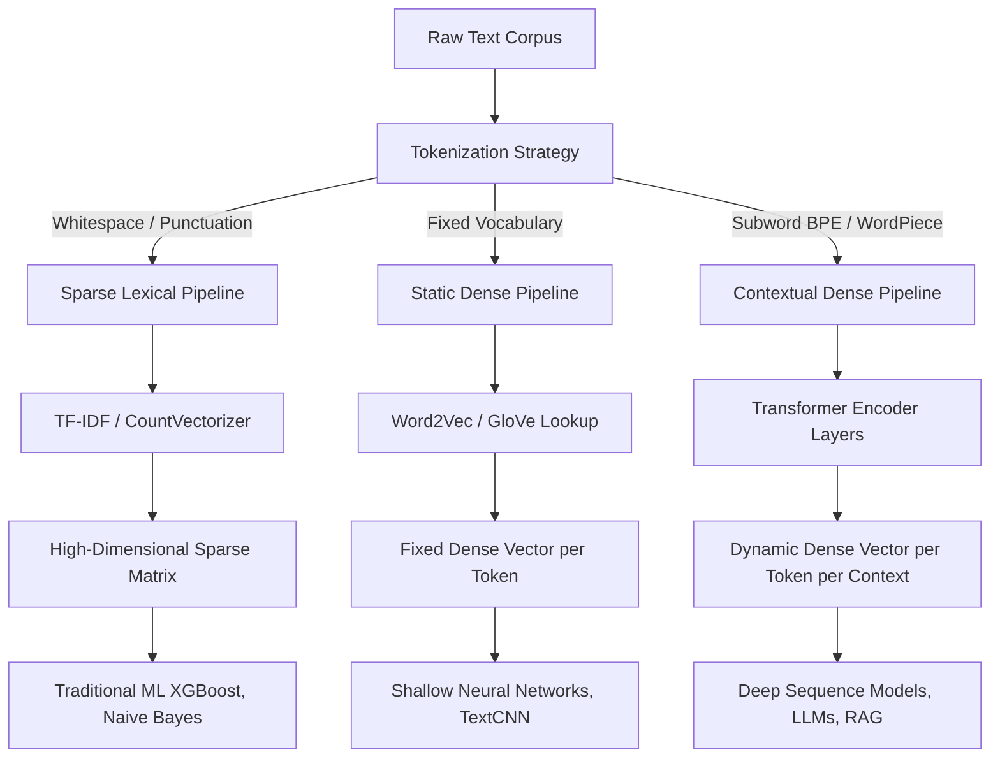

# 12. Mermaid Diagrams

The architectural evolution of text representation pipelines.

```mermaid
flowchart TD
    A[Raw Text Corpus] --> B[Tokenization Strategy]
    
    B -->|Whitespace / Punctuation| C[Sparse Lexical Pipeline]
    B -->|Fixed Vocabulary| D[Static Dense Pipeline]
    B -->|Subword BPE / WordPiece| E[Contextual Dense Pipeline]
    
    C --> F[TF-IDF / CountVectorizer]
    F --> G[High-Dimensional Sparse Matrix]
    
    D --> H[Word2Vec / GloVe Lookup]
    H --> I[Fixed Dense Vector per Token]
    
    E --> J[Transformer Encoder Layers]
    J --> K[Dynamic Dense Vector per Token per Context]
    
    G --> L[Traditional ML XGBoost, Naive Bayes]
    I --> M[Shallow Neural Networks, TextCNN]
    K --> N[Deep Sequence Models, LLMs, RAG]
```
