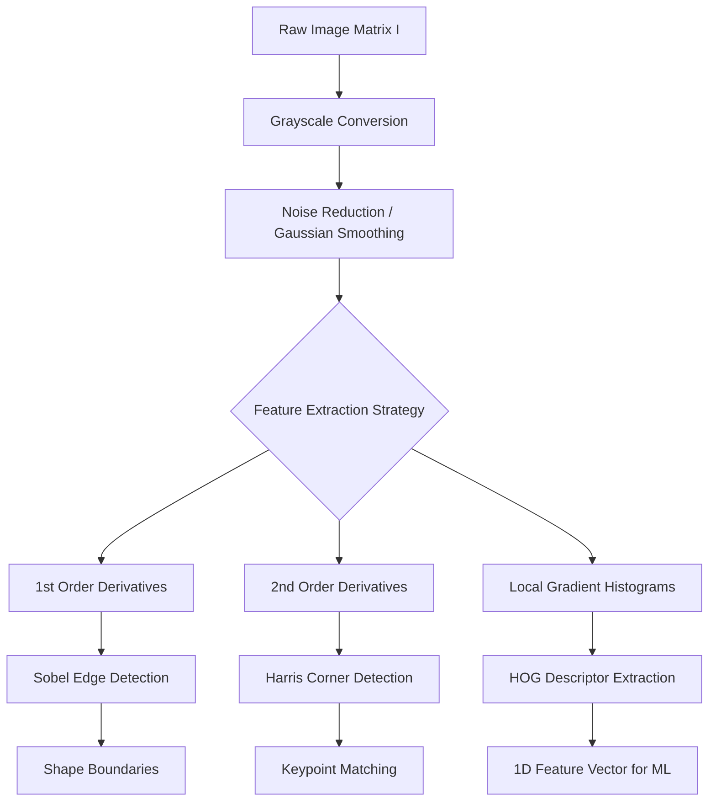

## Week 6: Feature Engineering Techniques for Image Data

## Feature Engineering Techniques for Image Data

## [1. Concept Introduction](https://github.com/Balasubramanian-pg/MSC.-Data-Science-AI/blob/main/Trimester%201/Feature%20Engineering/W01%20-%20Overview%20of%20Feature%20Engineering/Readme.md#1-concept-introduction)

Image data represents a profound challenge in machine learning. Unlike tabular data, where each feature column possesses independent semantic meaning (e.g., "Age" or "Income"), a single pixel in an image contains almost zero semantic information on its own. The "meaning" of an image exists strictly in the *spatial relationships* and *intensity gradients* between localized groups of pixels.

Feature engineering for image data is the mathematical extraction of these local spatial structures—such as edges, corners, and texture patterns—and translating them into a mathematically invariant, lower-dimensional vector space. Without this step, traditional machine learning algorithms (like SVMs or Random Forests) completely fail on raw image matrices due to their extreme dimensionality and sensitivity to minor translations, rotations, and lighting changes.

> [!IMPORTANT]
> The fundamental goal of classical image feature engineering is **Invariance**. A good engineered feature must yield the exact same mathematical output even if the object in the image is shifted (translation invariance), brightened (illumination invariance), or scaled (scale invariance).

## [2. Intuition and Real-World Analogy](https://github.com/Balasubramanian-pg/MSC.-Data-Science-AI/blob/main/Trimester%201/Feature%20Engineering/W01%20-%20Overview%20of%20Feature%20Engineering/Readme.md#2-intuition-and-real-world-analogy)

**The Sketch Artist Analogy:**
Imagine you must describe a human face to a police sketch artist over the phone. 
- **Raw Pixels (The Wrong Way):** You read out an Excel sheet of 3 million numbers representing the RGB color values of every point on the face from top-left to bottom-right. The artist cannot draw this.
- **Feature Extraction (The Right Way):** You describe the *features*. "Sharp edges along the jawline" (Edge Detection). "Two distinct corners where the eyes meet the nose" (Corner Detection). "A rough, porous texture on the cheeks" (Histogram of Oriented Gradients).

Image feature engineering is the process of writing algorithms that act as the sketch artist, converting a dense grid of colors into a sparse set of highly informative geometric descriptions.

## 3. Mathematical Foundations: The Image Matrix and Convolution

An image is mathematically defined as a discrete 2D function $I(x, y)$, where $x$ and $y$ are spatial coordinates, and the amplitude of $f$ is the intensity (brightness) of the image at that point.

To engineer features, we apply mathematical operators to this matrix. The most fundamental operation is the **Discrete Convolution**, which slides a small matrix $K$ (a kernel or filter) over the image matrix $I$ to compute a new matrix $S$.

$$
S(x, y) = (I * K)(x, y) = \sum_{i=-m}^{m} \sum_{j=-n}^{n} I(x - i, y - j) K(i, j)
$$

By carefully designing the weights inside the kernel $K$, we can mathematically force the convolution to calculate derivatives, blur the image, or highlight specific geometric patterns.

## [4. Visual Architecture](https://github.com/Balasubramanian-pg/MSC.-Data-Science-AI/blob/main/Trimester%201/Feature%20Engineering/W01%20-%20Overview%20of%20Feature%20Engineering/Readme.md#4-visual-architecture): The Feature Pipeline



## 5. Edge Detection: The Spatial Derivative

Edges represent boundaries between objects. In mathematics, a boundary is simply a region of rapid change. To find regions of rapid change, we calculate the derivative (gradient) of the image function $I(x, y)$.

Because images are discrete grids, we use finite differences to approximate derivatives using the **Sobel Operator**.

**The Sobel Kernels:**
We calculate the gradient in the x-direction ($G_x$) and y-direction ($G_y$) using two orthogonal convolution kernels:

$$
K_x = \begin{bmatrix} -1 & 0 & 1 \\ -2 & 0 & 2 \\ -1 & 0 & 1 \end{bmatrix}, \quad
K_y = \begin{bmatrix} -1 & -2 & -1 \\ 0 & 0 & 0 \\ 1 & 2 & 1 \end{bmatrix}
$$

**Gradient Magnitude and Direction:**
Once we convolve $I$ with $K_x$ and $K_y$, we calculate the total edge magnitude and the angle of the edge at every single pixel.

$$
|G| = \sqrt{G_x^2 + G_y^2}
$$
$$
\theta = \arctan\left(\frac{G_y}{G_x}\right)
$$

> [!NOTE]
> The Canny Edge Detector is an advanced extension of Sobel. It adds **Non-Maximum Suppression** (thinning edges down to a single pixel width) and **Hysteresis Thresholding** (using dual thresholds to connect broken edge lines while ignoring isolated noise).

## 6. Corner Detection: The Harris Corner Algorithm

Edges are lines, which means sliding a window along the edge yields no change. Corners are intersections of edges. Sliding a window in *any* direction over a corner results in a massive change in pixel intensity.

To detect this, the Harris algorithm computes the **Structure Tensor Matrix** $M$ for a local window $W$:

$$
M = \sum_{x,y \in W} w(x,y) \begin{bmatrix} G_x^2 & G_x G_y \\ G_x G_y & G_y^2 \end{bmatrix}
$$

Where $w(x,y)$ is a Gaussian weighting function, and $G_x, G_y$ are the image gradients.

We determine if a corner exists by analyzing the eigenvalues $\lambda_1, \lambda_2$ of $M$:
- If both $\lambda_1, \lambda_2$ are small: It's a flat region.
- If one $\lambda$ is large and the other small: It's an edge.
- If both $\lambda_1, \lambda_2$ are large: It's a corner.

To avoid computing eigenvalues directly (which is computationally expensive), Harris defined the corner response function $R$:

$$
R = \det(M) - k(\text{trace}(M))^2
$$
$$
R = (\lambda_1 \lambda_2) - k(\lambda_1 + \lambda_2)^2
$$
If $R > \text{threshold}$, a corner is detected.

## 7. Python Implementation: Edge and Corner Detection

This code uses `scikit-image` to mathematically isolate edges and corners from a standard test image.

```python
import numpy as np
import matplotlib.pyplot as plt
from skimage import data, color
from skimage.filters import sobel, gaussian
from skimage.feature import corner_harris, corner_peaks

## 1. Load an image and convert to grayscale
## (Grayscale collapses 3D RGB tensors into 2D matrices, simplifying spatial gradients)
image = color.rgb2gray(data.astronaut())

## 2. Smooth the image to remove high-frequency noise that causes false edges
smoothed_image = gaussian(image, sigma=1.0)

## 3. Apply Sobel Edge Detection (Approximates the gradient magnitude |G|)
edges = sobel(smoothed_image)

## 4. Apply Harris Corner Detection
## R is the response matrix containing the corner score for every pixel
harris_response = corner_harris(smoothed_image, k=0.05)

## Extract coordinates of the peaks in the response matrix
## min_distance ensures we don't detect multiple corners tightly clustered together
corner_coords = corner_peaks(harris_response, min_distance=5, threshold_rel=0.02)

## 5. Visualization Pipeline
fig, axes = plt.subplots(1, 3, figsize=(15, 5))

axes[0].imshow(image, cmap='gray')
axes[0].set_title('Original Grayscale Image')

axes[1].imshow(edges, cmap='magma')
axes[1].set_title('Sobel Edge Magnitude')

axes[2].imshow(image, cmap='gray')
axes[2].plot(corner_coords[:, 1], corner_coords[:, 0], 'r+', markersize=8)
axes[2].set_title('Harris Corner Keypoints')

for ax in axes:
    ax.axis('off')

plt.tight_layout()
plt.show()
```

## 8. Histogram of Oriented Gradients (HOG)

HOG is one of the most powerful handcrafted feature descriptors in computer vision. It captures the global shape of an object by analyzing the distribution of local intensity gradients.

### [Step-by-Step Derivation](https://github.com/Balasubramanian-pg/MSC.-Data-Science-AI/blob/main/Trimester%201/Feature%20Engineering/W04%20-%20Dimensionality%20Reduction%20Techniques/Readme.md#step-by-step-derivation)

**Step 1: Compute Gradients**
Calculate $G_x$, $G_y$, Magnitude $|G|$, and Angle $\theta$ for every pixel.

**Step 2: Cell Histograms (Spatial Aggregation)**
Divide the image into small spatial cells (e.g., $8 \times 8$ pixels). For each cell, create a histogram of gradient angles (typically 9 bins covering $0^\circ$ to $180^\circ$).
- Every pixel in the cell "votes" for a bin based on its angle $\theta$.
- The *weight* of the vote is the pixel's gradient magnitude $|G|$.
*(Intuition: A strong, sharp edge casts a heavy vote; a weak, blurry edge casts a weak vote).*

**Step 3: Block Normalization (Illumination Invariance)**
Lighting changes alter gradient magnitudes drastically. To fix this, we group cells into larger blocks (e.g., $2 \times 2$ cells = $16 \times 16$ pixels).
We normalize the histogram vector $v$ of the block using the $L_2$ norm:

$$
v_{normalized} = \frac{v}{\sqrt{||v||_2^2 + \epsilon}}
$$

**Step 4: Vector Flattening**
The normalized block histograms are concatenated into a single, massive 1D array. This array is the final engineered feature vector, ready to be fed into a Support Vector Machine (SVM) or Random Forest.

## 9. Python Implementation: HOG Extraction

This simulation extracts the HOG descriptor and visualizes the gradient orientation maps that the algorithm actually "sees".

```python
from skimage.feature import hog
from skimage import exposure

## 1. Load image and resize to a standard dimension (crucial for fixed-length ML vectors)
from skimage.transform import resize
image_resized = resize(image, (128, 64), anti_aliasing=True)

## 2. Extract HOG Features
## orientations = 9 bins
## pixels_per_cell = (8, 8) local aggregation
## cells_per_block = (2, 2) normalization scope
hog_feature_vector, hog_image = hog(
    image_resized, 
    orientations=9, 
    pixels_per_cell=(8, 8),
    cells_per_block=(2, 2), 
    block_norm='L2-Hys', # L2 norm followed by clipping (Hysteresis)
    visualize=True, 
    feature_vector=True
)

print(f"Original Image Dimensions: {image_resized.shape}")
print(f"HOG Feature Vector Length: {len(hog_feature_vector)}")

## 3. Enhance HOG image for visualization (stretches contrast)
hog_image_rescaled = exposure.rescale_intensity(hog_image, in_range=(0, 10))

## 4. Plotting
fig, (ax1, ax2) = plt.subplots(1, 2, figsize=(10, 5), sharex=True, sharey=True)

ax1.imshow(image_resized, cmap='gray')
ax1.set_title('Input Image (128x64)')

## Plot the HOG visualization
## The lines represent the dominant gradient direction in each 8x8 cell
## Brighter lines indicate stronger gradients
ax2.imshow(hog_image_rescaled, cmap='gray')
ax2.set_title('HOG Gradient Map')

plt.show()
```

*Expected output logic:* The original image's shape is heavily compressed. The feature vector length will be exactly `3780` features ($7 \text{ horizontal blocks} \times 15 \text{ vertical blocks} \times 4 \text{ cells} \times 9 \text{ bins}$). The HOG image displays a wireframe-like representation showing the dominant angles of edges, proving that color and texture have been discarded in favor of pure geometric structure.

## [10. Performance and Computational Insights](https://github.com/Balasubramanian-pg/MSC.-Data-Science-AI/blob/main/Trimester%201/Feature%20Engineering/W02%20-%20Handling%20Numeric%20Data/Readme.md#10-performance-and-computational-insights)

- **Convolution Complexity:** A naive 2D convolution has a time complexity of $\mathcal{O}(N \cdot M \cdot K^2)$ for an image of size $N \times M$ and a kernel of size $K \times K$. For large kernels (e.g., heavily blurred Gaussian filters), this becomes impossibly slow. In production, spatial convolutions are converted to the frequency domain using the **Fast Fourier Transform (FFT)**, multiplied, and converted back, reducing complexity to $\mathcal{O}(NM \log(NM))$.
- **Data Types:** Raw images load as `uint8` (integers from $0-255$). Mathematical derivatives (Sobel) produce negative numbers and decimals. You must cast image arrays to `float32` or `float64` before applying gradients, or you will suffer catastrophic integer underflow, wrapping negative gradients around to `255` (pure white noise).

## 11. Edge Cases and Common Mistakes

- **Assuming Rotation Invariance in HOG:** HOG is strictly translation and illumination invariant. It is **not** rotation invariant. If you train an SVM on a HOG vector of an upright pedestrian, and then feed it an image of a pedestrian lying down, the spatial blocks will misalign, and the model will fail. You must augment your training data with rotated images to force the ML algorithm to learn rotational variations.
- **Ignoring Scale:** If a corner exists at a $5 \times 5$ pixel resolution, and you zoom the image by 10x, that corner becomes a smooth, flat curve. [Harris Corner Detection](https://github.com/Balasubramanian-pg/MSC.-Data-Science-AI/blob/main/Trimester%201/Feature%20Engineering/W06%20-%20Feature%20Engineering%20Techniques%20for%20Image%20Data/2.%20Corner%20Detection.md#harris-corner-detection) is not scale-invariant. For scale invariance, you must calculate features across an **Image Pyramid** (repeatedly downsampling the image and recalculating features).

## 12. ML Connections: The Pre-Deep Learning Era

Before the rise of Convolutional Neural Networks (CNNs) in 2012, the absolute State-of-the-Art for object detection was the combination of **HOG feature extraction + Support Vector Machines (SVMs)**. 

While a CNN learns the convolution kernels via backpropagation, classical feature engineering manually defines the kernels (Sobel, Harris) using mathematical axioms. CNNs require millions of images to learn what an edge is; handcrafted features like HOG allow you to train highly accurate, lightweight models on datasets of fewer than 1,000 images, making them still relevant for highly constrained, low-compute edge devices.

## [13. Interview-Style Insights](https://github.com/Balasubramanian-pg/MSC.-Data-Science-AI/blob/main/Trimester%201/Feature%20Engineering/W07%20-%20Feature%20Engineering%20Techniques%20for%20Time-Series%20Data/Readme.md#13-interview-style-insights)

**Q: Why do we use Gaussian [smoothing](https://github.com/Balasubramanian-pg/MSC.-Data-Science-AI/blob/main/Trimester%201/Feature%20Engineering/W02%20-%20Handling%20Numeric%20Data/Readme.md#smoothing) before applying Sobel edge detection?**
**A:** The Sobel operator calculates mathematical derivatives. The derivative of high-frequency noise (like a single dead pixel or film grain) produces an extremely massive gradient magnitude, resulting in a false edge. Gaussian [smoothing](https://github.com/Balasubramanian-pg/MSC.-Data-Science-AI/blob/main/Trimester%201/Feature%20Engineering/W02%20-%20Handling%20Numeric%20Data/Readme.md#smoothing) acts as a low-pass filter, mathematically blurring out pixel-level noise so the derivative only reacts to macro-level structural boundaries.

**Q: In HOG, why do we normalize blocks of cells, rather than normalizing the entire image vector at once?**
**A:** Global illumination changes rarely happen uniformly. A person might have half their face in deep shadow and half in bright sunlight. By normalizing locally (over $16 \times 16$ pixel blocks), the algorithm achieves *local contrast invariance*, ensuring that the features in the shadowed region are mathematically scaled up to be comparable with the sunlit region.

## [14. Final Takeaways](https://github.com/Balasubramanian-pg/MSC.-Data-Science-AI/blob/main/Trimester%201/Feature%20Engineering/W07%20-%20Feature%20Engineering%20Techniques%20for%20Time-Series%20Data/Readme.md#14-final-takeaways)

### [Mental Models](https://github.com/Balasubramanian-pg/MSC.-Data-Science-AI/blob/main/Trimester%201/Feature%20Engineering/W01%20-%20Overview%20of%20Feature%20Engineering/Readme.md#mental-models)
- **The Derivative Funnel:** Think of image engineering as a sequence of derivatives. 0th Order = Raw pixels. 1st Order = Edges (Lines). 2nd Order = Corners (Intersections). 3rd Order / Aggregations = Shapes (HOG).
- **Invariance Engineering:** Whenever applying a transformation, ask yourself: "If I dim the lights by 50%, does my output matrix change?" If yes, your feature is unstable and needs normalization.

### [Advanced Learning Roadmap](https://github.com/Balasubramanian-pg/MSC.-Data-Science-AI/blob/main/Trimester%201/Feature%20Engineering/W01%20-%20Overview%20of%20Feature%20Engineering/Readme.md#advanced-learning-roadmap)
1. **SIFT (Scale-Invariant Feature Transform):** Learn how SIFT achieves full scale and rotation invariance using the Difference of Gaussians (DoG) pyramid, forming the bedrock of modern panorama stitching and 3D reconstruction.
2. **ORB (Oriented FAST and Rotated BRIEF):** A highly optimized, binary feature descriptor used in real-time robotics and SLAM (Simultaneous Localization and Mapping) because it operates orders of magnitude faster than SIFT.
3. **Transition to Deep Learning:** Study how the first layers of a trained ResNet or VGG16 network mathematically converge to mimic the exact Sobel and Gabor filters explored in this module.


Tags: #statistics #machine-learning #data-science #statistical-modelling