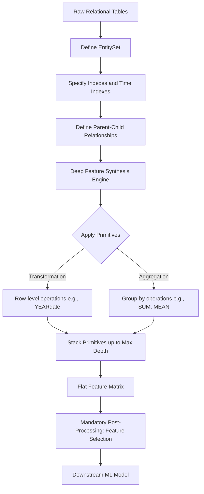

# Automated Feature Engineering for Relational Data: Deep Feature Synthesis and Featuretools

This document provides a rigorous technical analysis of automated feature engineering for structured, relational data. It details the algorithmic foundations of Deep Feature Synthesis (DFS), the mathematical formulation of feature primitives, and the computational trade-offs required for production deployment using the Featuretools framework.

> [!IMPORTANT]
> Deep Feature Synthesis (DFS) is an algorithm that automates the creation of features across multiple related tables by systematically stacking mathematical operations (primitives) along relational paths. It transforms normalized, multi-table relational databases into flat, high-dimensional feature matrices suitable for machine learning, eliminating the need for manual, error-prone SQL joins and aggregations.

## 1. Concept Introduction

In traditional machine learning workflows, data is often stored in normalized relational databases (e.g., a `customers` table linked to an `orders` table, which is linked to an `order_items` table). Machine learning algorithms, however, require a flat, two-dimensional feature matrix (one row per observation, one column per feature). 

Manually bridging this gap requires writing complex `GROUP BY` and `JOIN` operations. Featuretools automates this process. It treats the relational schema as a directed acyclic graph (DAG) and applies a search algorithm to traverse this graph, applying predefined mathematical functions (primitives) to generate new features systematically.

## 2. Intuition Section

Imagine you are an analyst trying to understand customer behavior. You have a list of customers and their individual transactions. 
*   **Manual Approach:** You write a SQL query to calculate the total spend per customer. Then you write another query to find the average transaction size. Then you realize you need the maximum transaction size, and so on. This is tedious and scales poorly.
*   **DFS Approach:** You tell the system, "Here are my tables, and here is how they connect." You provide a toolkit of operations (sum, mean, max, count). The system automatically explores all valid paths through the data, applying these operations to generate hundreds of features (e.g., "Mean of Sum of Transaction Amounts") in seconds. It is an algorithmic exploration of the feature space.

## 3. Mathematical Explanation

Let the relational database be represented as a Directed Acyclic Graph (DAG) $G = (V, E)$, where $V$ is the set of entities (tables) and $E$ is the set of relationships (foreign key links). 

Let $P$ be a set of feature primitives. Primitives are functions that map input data to output features. They are categorized into two types:
1.  **Transformation Primitives ($T$):** Functions applied to a single row within an entity. $t: \mathbb{R}^k \to \mathbb{R}$, where $k$ is the number of input columns.
2.  **Aggregation Primitives ($A$):** Functions applied to a set of rows in a child entity, grouped by a parent entity's key, returning a single value to the parent. $a: \mathbb{R}^{n} \to \mathbb{R}$, where $n$ is the number of child records.

Deep Feature Synthesis is the recursive application of these primitives up to a maximum depth $d$. A feature $F$ at depth $d$ is defined as:
$$ F_d = p_d(p_{d-1}(\dots p_1(X) \dots)) $$
Where $p_i \in P$ and $X$ is the base data.

## 4. Formula Breakdowns

### Transformation Primitive Example
Given a column of timestamps $T = [t_1, t_2, \dots, t_n]$, a transformation primitive `HOUR` extracts the hour of the day:
$$ \text{HOUR}(t_i) = h_i \in \{0, 1, \dots, 23\} $$

### Aggregation Primitive Example
Given a parent entity (Customer $c$) and a child entity (Transactions), the `SUM` aggregation primitive calculates the total transaction amount for customer $c$:
$$ \text{SUM}(\text{Amount}_c) = \sum_{j=1}^{n_c} \text{amount}_{c,j} $$
Where $n_c$ is the number of transactions for customer $c$.

### Deep Feature Synthesis (Stacking)
DFS allows the output of an aggregation to be the input of another aggregation (across multiple levels of the hierarchy). For example, calculating the average of the maximum transaction amounts across different product categories for a single customer:
$$ \text{MEAN}_{\text{category}} \left( \text{MAX}_{\text{transaction}} (\text{Amount}) \right) $$

## 5. Step-by-Step Derivations: DFS Execution Path

Consider a schema: `Customers` (Parent) $\leftarrow$ `Orders` (Child) $\leftarrow$ `Order_Items` (Grandchild).

1. **Depth 0 (Base Features):** The algorithm starts with the raw columns of the target entity (`Customers`): `age`, `signup_date`.
2. **Depth 1 (Direct Aggregations):** The algorithm traverses to `Orders`. It applies aggregation primitives to `order_total` grouped by `customer_id`.
   *   Generated: `SUM(orders.order_total)`, `MEAN(orders.order_total)`, `COUNT(orders)`.
3. **Depth 2 (Deep Features):** The algorithm traverses further to `Order_Items`. It first aggregates to the `Orders` level, then aggregates those results to the `Customers` level.
   *   Step A: Calculate `SUM(order_items.price)` for each order.
   *   Step B: Calculate `MEAN` of those sums for each customer.
   *   Generated: `MEAN(orders.SUM(order_items.price))`.

## 6. Real-World Analogies

**The Corporate Reporting Structure:**
Think of a retail company. The `Order_Items` are the cashiers scanning products. The `Orders` are the store managers summarizing daily sales. The `Customers` are the regional directors. 
*   A transformation is a cashier applying a discount to a single item.
*   A Depth 1 aggregation is the store manager summing up all daily sales.
*   A Depth 2 aggregation (Deep Feature) is the regional director calculating the *average* of the *maximum* daily sales across all stores in their region. DFS automates the generation of every possible report a manager could ask for.

## 7. Python Implementations

The following implementation demonstrates a production-grade Featuretools pipeline using a synthetic e-commerce dataset. It defines the EntitySet, establishes relationships, and executes Deep Feature Synthesis.

```python
import pandas as pd
import numpy as np
import featuretools as ft
from datetime import datetime, timedelta
import warnings

warnings.filterwarnings('ignore')

def generate_synthetic_relational_data():
    """Generates a mock e-commerce dataset with Customers, Orders, and Order_Items."""
    np.random.seed(42)
    
    # 1. Customers Table
    n_customers = 100
    customers_df = pd.DataFrame({
        'customer_id': range(1, n_customers + 1),
        'signup_date': pd.date_range(start='2022-01-01', periods=n_customers, freq='D'),
        'age': np.random.randint(18, 70, n_customers)
    })
    
    # 2. Orders Table
    n_orders = 500
    orders_df = pd.DataFrame({
        'order_id': range(1001, 1001 + n_orders),
        'customer_id': np.random.choice(customers_df['customer_id'], n_orders),
        'order_date': pd.date_range(start='2022-02-01', periods=n_orders, freq='6H'),
        'shipping_cost': np.random.uniform(5.0, 25.0, n_orders)
    })
    
    # 3. Order Items Table
    n_items = 1500
    order_items_df = pd.DataFrame({
        'item_id': range(5001, 5001 + n_items),
        'order_id': np.random.choice(orders_df['order_id'], n_items),
        'product_category': np.random.choice(['Electronics', 'Clothing', 'Home'], n_items),
        'price': np.random.uniform(10.0, 200.0, n_items),
        'quantity': np.random.randint(1, 5, n_items)
    })
    
    return customers_df, orders_df, order_items_df

def build_featuretools_pipeline():
    """Executes the Deep Feature Synthesis pipeline."""
    customers_df, orders_df, order_items_df = generate_synthetic_relational_data()
    
    # Step 1: Initialize the EntitySet
    es = ft.EntitySet(id="ecommerce_data")
    
    # Step 2: Add Dataframes (Entities) and specify indexes/time indexes
    es.add_dataframe(
        dataframe_name="customers",
        dataframe=customers_df,
        index="customer_id",
        time_index="signup_date"
    )
    
    es.add_dataframe(
        dataframe_name="orders",
        dataframe=orders_df,
        index="order_id",
        time_index="order_date"
    )
    
    es.add_dataframe(
        dataframe_name="order_items",
        dataframe=order_items_df,
        index="item_id"
    )
    
    # Step 3: Define Relationships (Parent to Child)
    # Relationship format: (parent_dataframe, parent_column, child_dataframe, child_column)
    rel_customer_order = ft.Relationship(
        entityset=es,
        parent_dataframe_name="customers",
        parent_column_name="customer_id",
        child_dataframe_name="orders",
        child_column_name="customer_id"
    )
    
    rel_order_item = ft.Relationship(
        entityset=es,
        parent_dataframe_name="orders",
        parent_column_name="order_id",
        child_dataframe_name="order_items",
        child_column_name="order_id"
    )
    
    es = es.add_relationships([rel_customer_order, rel_order_item])
    
    # Step 4: Execute Deep Feature Synthesis
    # We restrict max_depth to 2 and specify primitives for demonstration speed
    feature_matrix, feature_defs = ft.dfs(
        entityset=es,
        target_dataframe_name="customers",
        agg_primitives=["sum", "mean", "max", "count", "mode"],
        trans_primitives=["year", "month", "day", "hour"],
        max_depth=2,
        verbose=False
    )
    
    return feature_matrix, feature_defs

# Execute Pipeline
feature_matrix, feature_definitions = build_featuretools_pipeline()

print(f"Generated Feature Matrix Shape: {feature_matrix.shape}")
print(f"Total Features Generated: {len(feature_definitions)}")
print("\nSample of Generated Features:")
print(feature_matrix[['age', 'orders.SUM(order_items.price)', 'orders.MEAN(shipping_cost)']].head())
```

## 8. Python Simulations

This simulation demonstrates the "Curse of Dimensionality" and feature correlation inherent in DFS. It generates a correlation heatmap to illustrate why post-processing feature selection is mandatory.

```python
import matplotlib.pyplot as plt
import seaborn as sns

def visualize_feature_correlation(feature_matrix):
    """
    Visualizes the correlation matrix of DFS-generated features 
    to highlight redundancy and the need for feature selection.
3. **Computational Expense:** DFS explores a combinatorial space. For large datasets with high cardinality, the time and memory complexity grow exponentially with `max_depth`.
    
4. **Ignoring Time Indices:** Failing to define `time_index` columns allows the algorithm to aggregate future data into past predictions, causing catastrophic data leakage in time-series forecasting.

## 11. Visual Intuition

Visualize the relational schema as a series of funnels stacked on top of each other. The bottom funnel (`Order_Items`) contains thousands of granular, noisy data points. The first aggregation primitive acts as a sieve, summarizing these into hundreds of `Order`-level metrics. The second aggregation primitive acts as another sieve, summarizing the `Order` metrics into a single, dense row for the `Customer`. DFS automates the creation of every possible combination of sieves.

## 12. Mermaid Diagrams

The architectural pipeline of Deep Feature Synthesis.



## 13. Real-World Applications

*   **Credit Risk Scoring:** Aggregating a borrower's historical checking account transactions, credit card usage, and employment history to generate thousands of behavioral features (e.g., "Maximum single-day withdrawal amount over the last 6 months") to predict loan default.
*   **Predictive Maintenance in Manufacturing:** Relating `Machine` $\leftarrow$ `Maintenance_Logs` $\leftarrow$ `Sensor_Readings`. DFS automatically generates features like "Mean of the maximum temperature spikes between maintenance events" to predict component failure.

## 14. Machine Learning Connections

*   **Tree-Based Models:** The wide, sparse, and highly correlated feature matrices generated by DFS are ideally suited for tree-based ensemble methods (XGBoost, LightGBM, Random Forest). These models inherently handle multicollinearity and perform implicit feature selection via split criteria.
*   **Graph Neural Networks (GNNs):** While DFS is a feature engineering technique, modern approaches often bypass explicit feature generation entirely. GNNs (like GraphSAGE or GAT) learn representations directly from the relational graph structure via message passing, serving as an end-to-end alternative to DFS + XGBoost pipelines.

## 15. Interview-Style Insights

**Interviewer:** "Explain the computational complexity of Deep Feature Synthesis and how you would scale it for a dataset with 10 million rows."
**Candidate:** "The time complexity of DFS is roughly $O(E \cdot P^D \cdot N)$, where $E$ is the number of entities, $P$ is the number of primitives, $D$ is the maximum depth, and $N$ is the number of rows. This combinatorial explosion makes it intractable for 10 million rows on a single machine. To scale this, I would utilize Featuretools' integration with Dask or Spark. This allows the EntitySet to be partitioned and the primitive applications to be distributed across a compute cluster, preventing Out-Of-Memory errors."

**Interviewer:** "How do you prevent data leakage when using DFS on time-series relational data?"
**Candidate:** "Data leakage occurs if an aggregation includes future events. To prevent this, I must strictly define the `time_index` for every entity in the EntitySet. Furthermore, when calling `ft.dfs()`, I must provide a `cutoff_time` dataframe. This ensures that for each row in the target entity, the algorithm only aggregates child records that occurred *before* the specified cutoff time, simulating a realistic production inference environment."

## 16. Edge Cases

*   **Cyclic Relationships:** DFS requires a Directed Acyclic Graph (DAG). If Table A links to Table B, and Table B links back to Table A, the algorithm will fail. The schema must be normalized to break cycles.
 to `NaN`. DFS handles this gracefully, but the resulting feature will have low variance and should be dropped during post-processing.
*   **Highly Skewed Child Distributions:** If one parent entity has 10,000 child records and another has 2, simple `MEAN` aggregations can be misleading. In these cases, robust aggregation primitives (like `MEDIAN` or `PERCENTILE`) must be explicitly included in the `agg_primitives` list.

## 17. Mental Models

**The Relational Graph as a Computational Pipeline:**
Do not view your database tables as static spreadsheets. View them as nodes in a directed graph. The edges (foreign keys) dictate the direction of information flow. Information only flows "up" the graph, from the granular child nodes to the abstract parent nodes. DFS is simply the automated routing of mathematical functions through this pipeline.

## 18. Performance and Computational Insights

*   **Memory Footprint:** The transition from normalized tables to a flat feature matrix can increase memory usage by an order of magnitude. A 1GB relational dataset can easily expand to a 10GB+ dense feature matrix after DFS with `max_depth=3`.
*   **Caching:** Featuretools implements intelligent caching. If you run DFS multiple times with slight variations in primitives, it caches previously calculated intermediate features, significantly reducing subsequent execution times.
*   **Primitive Optimization:** Built-in primitives are heavily optimized using NumPy and Pandas vectorization. However, custom Python primitives will execute via standard loops, creating severe bottlenecks. Custom primitives must be written using vectorized operations or Numba/JIT compilation.

## 19. Advanced Notes

*   **Cutoff Times:** The most critical advanced feature of DFS is the `cutoff_time` argument. It accepts a dataframe with `instance_id` and `time` columns, ensuring that the feature matrix is constructed as a series of point-in-time snapshots, which is mandatory for valid time-series cross-validation.
*   **Custom Primitives:** You can define domain-specific logic using the `ft.primitives.make_trans_primitive` or `make_agg_primitive` decorators. For example, creating a custom aggregation that calculates the "Gini coefficient" of transaction amounts for a specific customer.
*   **Approximate DFS:** For massive datasets, Featuretools offers an `approximate` parameter. This buckets time into windows (e.g., 1 day) and calculates aggregations for the entire window at once, trading a small amount of precision for massive gains in computational speed.

## 20. Final Takeaways

### Key Takeaways
*   Deep Feature Synthesis (DFS) automates the creation of relational features by systematically stacking transformation and aggregation primitives across a defined EntitySet.
*   The output of DFS is a high-dimensional, often highly correlated feature matrix that requires rigorous post-processing (feature selection) before modeling.
*   Defining `time_index` and utilizing `cutoff_time` is mandatory to prevent catastrophic data leakage in temporal datasets.
*   DFS is a prototyping force multiplier, but computational constraints require careful management of `max_depth` and primitive selection.

### Common Traps to Avoid
*   Treating DFS as a "black box" and feeding all generated features directly into a model without checking for business logic validity or multicollinearity.
*   Forgetting to define relationships correctly, resulting in an empty or trivial feature matrix.
*   Ignoring the memory implications of high `max_depth` settings on large datasets.

### Interview Questions to Drill
1. Explain the difference between a transformation primitive and an aggregation primitive, providing a mathematical example of each.
2. How does the `cutoff_time` parameter in Featuretools prevent data leakage, and why is it critical for time-series data?
3. Describe the computational complexity of DFS and the strategies available to scale it for big data (e.g., Dask integration).
4. Why is feature selection mandatory after running DFS, and what specific techniques (e.g., variance threshold, correlation filtering) would you apply?

### Advanced Learning Roadmap
1. **Next Step:** Master **Cutoff Times and Temporal Validation** to ensure your DFS pipelines are robust against data leakage in production forecasting.
2. **Next Step:** Explore **Custom Primitive Development** in Featuretools to inject proprietary, domain-specific business logic into the automated generation process.
3. **Next Step:** Investigate **Graph Neural Networks (GNNs)** to understand how modern deep learning approaches bypass explicit feature engineering by learning representations directly from relational graphs.

### Recommended Python Libraries
*   `featuretools`: The core library for Deep Feature Synthesis and relational data automation.
*   `dask`: For scaling Featuretools EntitySets and DFS execution across distributed clusters for large datasets.
*   `scikit-learn`: For mandatory post-DFS feature selection (e.g., `VarianceThreshold`, `SelectKBest`) and downstream modeling.
*   `networkx`: For visualizing and analyzing the underlying Directed Acyclic Graph (DAG) structure of your EntitySet before running DFS.
