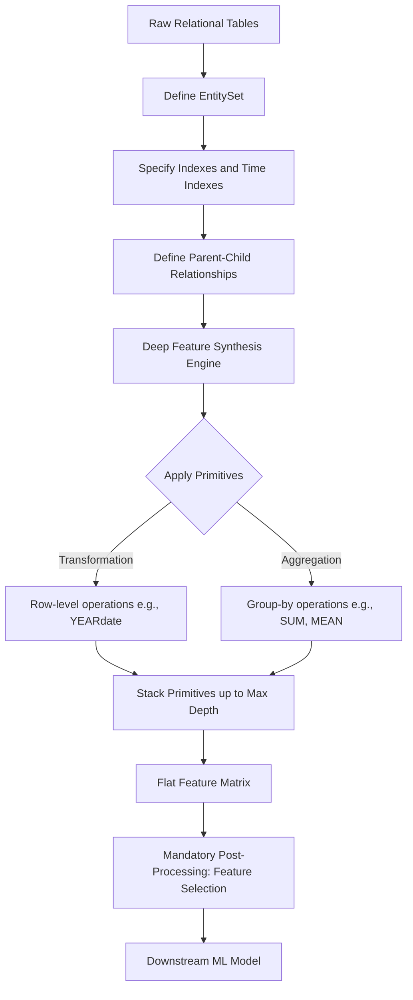

# 12. Mermaid Diagrams

The architectural pipeline of Deep Feature Synthesis.

```mermaid
flowchart TD
    A[Raw Relational Tables] --> B[Define EntitySet]
    B --> C[Specify Indexes and Time Indexes]
    C --> D[Define Parent-Child Relationships]
    D --> E[Deep Feature Synthesis Engine]
    
    E --> F{Apply Primitives}
    F -->|Transformation| G[Row-level operations e.g., YEARdate]
    F -->|Aggregation| H[Group-by operations e.g., SUM, MEAN]
    
    G --> I[Stack Primitives up to Max Depth]
    H --> I
    
    I --> J[Flat Feature Matrix]
    J --> K[Mandatory Post-Processing: Feature Selection]
    K --> L[Downstream ML Model]
```
