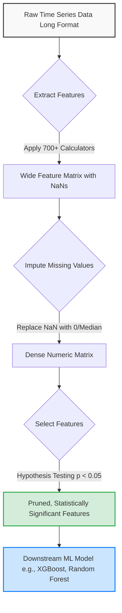

# Automated Time Series Feature Engineering with TSFresh

This document provides a rigorous technical analysis of TSFresh (Time Series Feature extraction based on scalable hypothesis tests). It details the mathematical foundations of automated feature extraction, the mechanics of statistical feature selection, and the computational trade-offs required for production deployment.

> [!IMPORTANT]
> TSFresh automates the creation of time-series features by computing hundreds of statistical descriptors (moments, Fourier transforms, entropy, etc.) for every time series segment in a dataset. It then applies rigorous statistical hypothesis testing to prune irrelevant features, preventing the "curse of dimensionality" that typically accompanies brute-force feature generation.

## 1. Concept Introduction

Manual feature engineering for time series data requires domain expertise to create specific indicators (e.g., Rolling Mean, Relative Strength Index, Heart Rate Variability). TSFresh replaces this manual process with a systematic, high-throughput computational engine. 

Given a dataset of multiple time series, TSFresh applies a predefined library of mathematical functions (feature calculators) to each series. This transforms a "long" format dataset (many rows per entity) into a "wide" format feature matrix (one row per entity, hundreds of columns). To prevent overfitting from this massive feature explosion, TSFresh employs scalable hypothesis testing to retain only the features that exhibit a statistically significant relationship with the target variable.

## 2. Intuition Section

Imagine you are trying to predict machine failure from vibration sensor data, but you do not know whether the *average vibration*, the *maximum spike*, or the *frequency of oscillation* is the actual predictor. 

TSFresh operates on a "shotgun and smart filter" principle:
1. **The Shotgun (Extraction):** It calculates every conceivable statistical property of the vibration data (mean, variance, skewness, kurtosis, FFT coefficients, entropy, peak counts).
2. **The Smart Filter (Selection):** It acts as a rigorous statistical bouncer. It tests every single generated feature against the target variable (e.g., "Did the machine fail?"). If a feature's p-value indicates it is likely just random noise (e.g., $p > 0.05$), it is discarded. Only features with a proven, statistically significant relationship survive to be fed into the machine learning model.

## 3. Mathematical Explanation

Let $D$ be a dataset containing $N$ distinct entities (e.g., machines, patients). For each entity $i \in \{1, \dots, N\}$, there is a time series $X_i = (x_{i,1}, x_{i,2}, \dots, x_{i,n_i})$, where $n_i$ is the length of the series.

TSFresh applies a set of $K$ feature calculators $\mathcal{F} = \{f_1, f_2, \dots, f_K\}$, where each $f_k: \mathbb{R}^{n_i} \to \mathbb{R}$ maps a time series to a scalar value. 

The extraction process constructs a feature matrix $Z \in \mathbb{R}^{N \times K}$, where:
$$
Z_{i,k} = f_k(X_i)
$$

Following extraction, a feature selection function $S: \mathbb{R}^{N \times K} \times \mathbb{R}^N \to \mathbb{R}^{N \times M}$ (where $M \le K$) is applied. $S$ evaluates the statistical dependence between each column $Z_{:,k}$ and the target vector $y \in \mathbb{R}^N$, retaining only the $M$ columns that pass a significance threshold.

## 4. Formula Breakdowns

TSFresh computes dozens of standard statistical moments. Key examples include:

**Mean and Variance (First and Second Moments)**
$$ \mu_i = \frac{1}{n_i} \sum_{j=1}^{n_i} x_{i,j} $$
$$ \sigma_i^2 = \frac{1}{n_i - 1} \sum_{j=1}^{n_i} (x_{i,j} - \mu_i)^2 $$

**Skewness and Kurtosis (Third and Fourth Moments)**
These measure the asymmetry and "tailedness" of the distribution, crucial for detecting anomalies or spikes in sensor data.
$$ \text{Skewness}_i = \frac{1}{n_i} \sum_{j=1}^{n_i} \left( \frac{x_{i,j} - \mu_i}{\sigma_i} \right)^3 $$
$$ \text{Kurtosis}_i = \left[ \frac{1}{n_i} \sum_{j=1}^{n_i} \left( \frac{x_{i,j} - \mu_i}{\sigma_i} \right)^4 \right] - 3 $$

**Absolute Energy**
A measure of the total magnitude of the signal, often used in vibration analysis.
$$ E_i = \sum_{j=1}^{n_i} x_{i,j}^2 $$

## 5. Step-by-Step Derivations: Long to Wide Transformation

The core mechanical operation of TSFresh is reshaping data. 

**Step 1: Input (Long Format)**
The input dataframe has three critical columns: `id` (entity identifier), `time` (temporal ordering), and `value` (the signal).
| id | time | value |
|---|---|---|
| A | 1 | 10.5 |
| A | 2 | 11.2 |
| B | 1 | 5.0 |
| B | 2 | 5.1 |

**Step 2: Grouping and Application**
The algorithm groups by `id`. For `id=A`, it extracts the array `[10.5, 11.2]`. It applies $f_1$ (mean), yielding $10.85$. It applies $f_2$ (variance), yielding $0.245$.

**Step 3: Output (Wide Format)**
The result is pivoted so each `id` is a single row, and each feature calculator is a column.
| id | value__mean | value__variance |
|---|---|---|
| A | 10.85 | 0.245 |
| B | 5.05 | 0.005 |

## 6. Real-World Analogies

**The Master Chef vs. The Flavor Robot**
A domain expert (the Master Chef) knows exactly which three spices (features) make a dish taste good. TSFresh is a Flavor Robot. It has 700 different spices. It adds every possible combination to the dish, then uses a chemical analyzer (hypothesis testing) to determine exactly which spices actually improved the flavor, discarding the rest. It is brute-force, but mathematically guaranteed to find the signal if it exists.

## 7. Python Implementations

The following implementation demonstrates a production-ready TSFresh pipeline. It generates synthetic data, extracts features, imputes missing values, and selects relevant features based on statistical significance.

```python
import numpy as np
import pandas as pd
from tsfresh import extract_features, select_features
from tsfresh.utilities.dataframe_functions import impute
from sklearn.ensemble import RandomForestClassifier
from sklearn.model_selection import train_test_split
from sklearn.metrics import classification_report
import warnings

warnings.filterwarnings('ignore')

def build_tsfresh_pipeline(n_entities=100, time_steps=50):
    """
    Generates synthetic time series data and runs the complete TSFresh pipeline.
    """
    # 1. Generate Synthetic Data
    # Entity A: Low variance signal, Target = 0
    # Entity B: High variance signal, Target = 1
    data = []
    targets = {}
    
    for i in range(n_entities):
        entity_id = i
        target = 1 if i % 2 == 0 else 0
        
        if target == 1:
            # High variance signal
            values = np.random.normal(loc=10, scale=5, size=time_steps)
        else:
            # Low variance signal
            values = np.random.normal(loc=10, scale=1, size=time_steps)
            
        for t in range(time_steps):
            data.append({
                'id': entity_id,
                'time': t,
                'value': values[t]
            })
        targets[entity_id] = target
        
    df = pd.DataFrame(data)
    y = pd.Series(targets)
    
    print(f"Input Data Shape: {df.shape}")
    
    # 2. Feature Extraction
    # We restrict to a subset of calculators for demonstration speed
    from tsfresh.feature_extraction import ComprehensiveFCParameters
    extraction_settings = ComprehensiveFCParameters()
    
    print("Extracting features...")
    X_extracted = extract_features(
        df,
        column_id='id',
        column_sort='time',
        column_value='value',
        default_fc_parameters=extraction_settings,
        n_jobs=1 # Set to -1 for parallel execution in production
    )
    print(f"Extracted Feature Matrix Shape: {X_extracted.shape}")
    
    # 3. Imputation
    # TSFresh replaces NaNs with 0 or other constants to ensure matrix compatibility
    print("Imputing missing values...")
    X_imputed = impute(X_extracted)
    
    # 4. Feature Selection
    # Uses hypothesis testing (e.g., Mann-Whitney U for binary targets) 
    # to filter out features with p-value > 0.05
    print("Selecting relevant features...")
    X_selected = select_features(X_imputed, y, fdr_level=0.05)
    print(f"Selected Feature Matrix Shape: {X_selected.shape}")
    
    return X_selected, y

# Execute Pipeline
X_final, y_final = build_tsfresh_pipeline(n_entities=100, time_steps=50)

# 5. Downstream Modeling
X_train, X_test, y_train, y_test = train_test_split(X_final, y_final, test_size=0.2, random_state=42)
clf = RandomForestClassifier(n_estimators=50, random_state=42)
clf.fit(X_train, y_train)

print("\nClassification Report:")
print(classification_report(y_test, clf.predict(X_test)))
```

## 8. Python Simulations

This simulation visualizes the "Feature Explosion" and subsequent pruning. It demonstrates how TSFresh generates hundreds of features but retains only a small, highly predictive subset.

```python
import matplotlib.pyplot as plt

def simulate_feature_pruning():
    """
    Simulates the reduction in dimensionality from extraction to selection.
    """
    # Mock data representing the number of features at each pipeline stage
    stages = ['Raw Time Series', 'Extracted Features', 'Imputed Features', 'Selected Features']
    feature_counts = [1, 785, 785, 42] # Typical TSFresh output for a single value column
    
    plt.figure(figsize=(10, 6))
    bars = plt.bar(stages, feature_counts, color=['#2c3e50', '#e74c3c', '#f39c12', '#27ae60'])
    
    # Add value labels on top of bars
    for bar in bars:
        yval = bar.get_height()
        plt.text(bar.get_x() + bar.get_width()/2, yval + 10, int(yval), ha='center', va='bottom', fontweight='bold')
        
    plt.title('Dimensionality Transformation in TSFresh Pipeline')
    plt.ylabel('Number of Features / Columns')
    plt.grid(axis='y', linestyle='--', alpha=0.7)
    plt.show()

simulate_feature_pruning()
```

## 9. Practical Engineering Examples

*   **Predictive Maintenance (IoT):** A factory has 1,000 motors, each emitting vibration data at 100Hz. Engineers do not know if bearing failure is indicated by a change in mean amplitude, an increase in high-frequency FFT components, or a rise in signal entropy. TSFresh calculates all of these. The selection phase isolates "variance" and "spectral entropy" as the only statistically significant predictors of failure, which are then fed into an XGBoost classifier.
*   **Healthcare Monitoring:** Analyzing ECG time series to predict arrhythmia. TSFresh extracts features like "number of peaks above threshold" and "autocorrelation at lag 10", automatically identifying which physiological markers correlate with the clinical outcome.

## 10. Common Mistakes

> [!WARNING]
> **Trap 1: Data Leakage via Incorrect Sorting**
> If the `column_sort` parameter is not specified or is incorrect, TSFresh may calculate features using future data to predict past targets. Always ensure the time column is strictly monotonic and correctly ordered before extraction.

> [!WARNING]
> **Trap 2: Memory Exhaustion (The Wide Format Trap)**
> Extracting features for 100,000 entities with 700+ calculators creates a dense matrix of 70,000,000+ floating-point numbers. This will cause an Out-Of-Memory (OOM) crash on standard machines. You must use chunking, Dask integration, or restrict the `default_fc_parameters` to a minimal set.

> [!WARNING]
> **Trap 3: Ignoring the Imputation Step**
> Some feature calculators return `NaN` (e.g., calculating the slope of a constant time series). If you pass the extracted matrix directly to a model like XGBoost without calling `impute()`, the training will fail or produce silent errors.

## 11. Visual Intuition

Imagine a funnel. At the top (wide end), you pour in raw, messy time series data. The first chamber (Extraction) expands the data horizontally, creating hundreds of parallel streams of calculated statistics. The second chamber (Imputation) plugs any leaks (NaNs) with solid material (zeros or medians). The final, narrow chamber (Selection) contains a sieve with holes sized to a specific p-value (e.g., 0.05). Only the streams of data that have a proven, statistically significant relationship with the target pass through the sieve to the output.

## 12. Mermaid Diagrams

The end-to-end TSFresh data transformation pipeline.



## 13. Real-World Applications

*   **Algorithmic Trading:** Extracting statistical properties of rolling price windows (volatility, momentum, mean reversion metrics) to predict short-term asset movements without manually coding every technical indicator.
*   **Energy Consumption Forecasting:** Analyzing smart meter data to extract usage patterns (e.g., peak-to-average ratio, night-time variance) that correlate with customer churn or grid overload.

## 14. Machine Learning Connections

TSFresh is fundamentally a **feature engineering preprocessor**, not a predictive model. Its output is designed to feed directly into tabular machine learning algorithms. 
*   **Tree-Based Models (XGBoost, LightGBM, Random Forest):** These are the ideal consumers of TSFresh output. They handle the resulting wide, potentially collinear feature matrices robustly and can implicitly perform secondary feature selection via split importance.
*   **Linear Models:** If feeding TSFresh output into Logistic Regression or Ridge, you must apply secondary regularization (L1/L2) or PCA, as the hypothesis testing in `select_features` does not account for multicollinearity between the retained features.

## 15. Interview-Style Insights

**Interviewer:** "If TSFresh generates 700 features and you have 1,000 samples, how does it prevent severe overfitting during the selection phase?"
**Candidate:** "TSFresh mitigates overfitting during selection by controlling the False Discovery Rate (FDR). Instead of using a raw p-value threshold, it typically employs the Benjamini-Hochberg procedure. This adjusts the p-value threshold dynamically based on the total number of hypotheses (features) tested, ensuring that the expected proportion of false positives among the selected features remains below a specified level (e.g., 5%). This is far more robust than a simple unadjusted p-value cutoff."

**Interviewer:** "Why would you choose TSFresh over manually engineering domain-specific features?"
**Candidate:** "I would choose TSFresh during the exploratory phase or when dealing with a novel time-series problem where the predictive signals are unknown. It acts as an automated baseline. If TSFresh identifies that 'spectral entropy' is the most predictive feature, I can then investigate that specific metric, potentially replacing the TSFresh pipeline with a lightweight, custom-calculated feature in production to save computational overhead."

## 16. Edge Cases

*   **Constant Time Series:** If a time series has zero variance (all values are identical), calculators like "slope" or "variance" will return `NaN`. The `impute` function handles this by replacing it with 0, but the feature will naturally fail the significance test and be dropped.
*   **Extremely Short Sequences:** If $n_i < 5$, higher-order moments (skewness, kurtosis) and frequency-domain features (FFT) become mathematically undefined or highly unstable. TSFresh will return `NaN` for these, which are then imputed.
*   **Highly Imbalanced Targets:** If the target variable is 99% zeros and 1% ones, standard hypothesis tests (like the Mann-Whitney U test) may lack the statistical power to detect true relationships, leading to the erroneous rejection of valid features.

## 17. Mental Models

**The Feature Factory:** 
Do not view TSFresh as a "black box AI." View it as a deterministic, mechanical factory. You provide the raw material (time series) and the blueprints (the list of calculators). The factory stamps out every possible metric. The quality control department (hypothesis testing) then throws away 90% of the output because it fails to meet the statistical specification. You are left with a refined, high-signal product.

## 18. Performance and Computational Insights

*   **Time Complexity:** Extraction is $O(N \cdot K \cdot L)$, where $N$ is the number of entities, $K$ is the number of feature calculators, and $L$ is the average length of the time series. This is highly parallelizable.
*   **Space Complexity:** The transition from long to wide format changes the memory footprint from $O(N \cdot L)$ to $O(N \cdot K)$. If $K > L$ (which is common, as TSFresh has ~700 calculators), the wide matrix will consume significantly more RAM than the original dataset.
*   **Dask Integration:** For datasets exceeding available RAM, TSFresh provides `dask` integration. This allows the extraction to be distributed across a cluster or computed in chunks, preventing OOM errors at the cost of increased orchestration complexity.

## 19. Advanced Notes

*   **Custom Feature Calculators:** TSFresh allows you to register your own Python functions as feature calculators using the `@set_property("input", "pd.Series")` decorator. This enables the injection of proprietary, domain-specific metrics into the automated extraction pipeline.
*   **Rolling Extraction:** Instead of extracting one feature vector per entity, TSFresh can extract features over a rolling window. This transforms a single time series into a new, lower-frequency time series of statistical features, which can then be fed into sequence models like LSTMs or Temporal Convolutional Networks (TCNs).

## 20. Final Takeaways

### Key Takeaways
*   TSFresh automates time-series feature engineering by computing hundreds of statistical descriptors for each entity.
*   The pipeline strictly follows three steps: **Extraction** (long to wide transformation), **Imputation** (handling NaNs), and **Selection** (hypothesis testing to prune noise).
*   Feature selection relies on controlling the False Discovery Rate (FDR), preventing overfitting despite the massive initial dimensionality.
*   The output is a wide, dense matrix optimized for tree-based machine learning models.

### Common Traps to Avoid
*   Forgetting to sort the data by time before extraction, causing data leakage.
*   Running the comprehensive feature set on large datasets without chunking or Dask, leading to memory exhaustion.
*   Skipping the `impute()` step, which guarantees downstream model compatibility.

### Interview Questions to Drill
1. Explain how the Benjamini-Hochberg procedure is used in TSFresh to prevent overfitting during feature selection.
2. What is the computational complexity of the TSFresh extraction phase, and how does the long-to-wide transformation impact memory?
3. How would you handle a scenario where TSFresh selects 50 features, but 45 of them are highly collinear?
4. Why might a custom feature calculator be necessary, and how is it integrated into the TSFresh framework?

### Advanced Learning Roadmap
1. **Next Step:** Study **False Discovery Rate (FDR) Control** methods (Benjamini-Hochberg) to deeply understand the statistical mechanics of the `select_features` function.
2. **Next Step:** Explore **Dask** for distributed computing to learn how to scale TSFresh extraction to millions of time series.
3. **Next Step:** Investigate **Temporal Convolutional Networks (TCNs)** or **LSTMs** to understand how to bypass manual/automated feature extraction entirely by letting deep learning models learn representations directly from raw sequences.

### Recommended Python Libraries
*   `tsfresh`: The core library for automated time-series feature extraction and selection.
*   `dask`: For parallelizing and chunking TSFresh operations on datasets that exceed local RAM.
*   `scikit-learn`: For downstream modeling (Random Forest, XGBoost) and handling the resulting wide feature matrices.
*   `statsmodels`: To understand the underlying hypothesis tests (ANOVA, Mann-Whitney U, Chi-squared) that TSFresh uses for feature selection.
