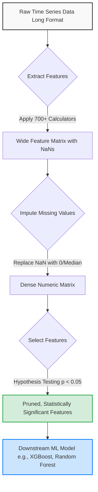

# 12. Mermaid Diagrams

The end-to-end TSFresh data transformation pipeline.

```mermaid
flowchart TD
    A[Raw Time Series Data Long Format] --> B{Extract Features}
    B -->|Apply 700+ Calculators| C[Wide Feature Matrix with NaNs]
    C --> D{Impute Missing Values}
    D -->|Replace NaN with 0/Median| E[Dense Numeric Matrix]
    E --> F{Select Features}
    F -->|Hypothesis Testing p < 0.05| G[Pruned, Statistically Significant Features]
    G --> H[Downstream ML Model e.g., XGBoost, Random Forest]
    
    style A fill:#f9f9f9,stroke:#333,stroke-width:2px
    style G fill:#d4edda,stroke:#28a745,stroke-width:2px
    style H fill:#cce5ff,stroke:#007bff,stroke-width:2px
```
