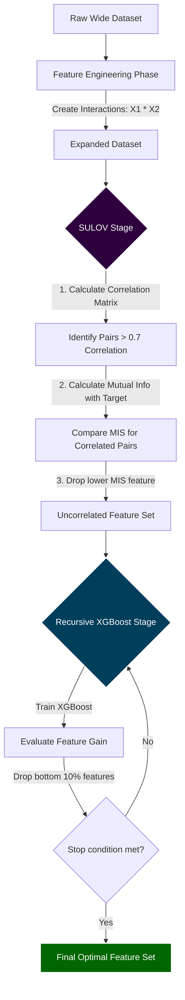

## Automated Feature Engineering: SULOV and Recursive Elimination

> [!NOTE]
> **Prerequisite Knowledge:** Solid understanding of Pearson correlation, multicollinearity, decision trees, and basic information theory (entropy/mutual information).

## 1. Concept Introduction

As datasets grow wider (thousands of columns), manual feature selection and engineering become computationally impossible and highly prone to human bias. **Automated Feature Engineering** attempts to algorithmically discover, construct, and filter features to maximize predictive signal while minimizing dimensionality.

The `featurewiz` library represents a modern architectural approach to this problem. Instead of relying on naive variance thresholds or purely model-based pruning, it utilizes a rigorous two-stage mathematical pipeline:
1.  **SULOV (Searching for Uncorrelated List of Variables):** A graph-theoretical filter that eliminates multicollinearity using Information Theory.
2.  **Recursive XGBoost Feature Elimination:** A model-driven wrapper method that evaluates the non-linear predictive power of the remaining features.

> [!WARNING]
> **Correction to User Text:** The provided text incorrectly defines SULOV as "Searching for Uncorrelated Lowest Variance". The correct academic and library definition is **Searching for Uncorrelated List of Variables**. It does *not* use variance to drop features; it uses **Mutual Information**.

## 2. Intuition: Why not just use correlation?

Multicollinearity (highly correlated features) destroys the interpretability of linear models and unnecessarily consumes memory/compute for tree-based models. 

**The Naive Approach:** Calculate a correlation matrix. If Feature A and Feature B are 95% correlated, drop one randomly or drop the one with lower variance.
**The Flaw:** What if Feature B has lower variance, but perfectly separates the target variable, while Feature A is just noisy? Dropping Feature B destroys your model.

**The SULOV Approach:** If Feature A and Feature B are highly correlated, evaluate both against the **target variable ($y$)** using Mutual Information. Keep the feature that shares the most information with the target; discard the redundant one.

### Real-World Analogy
Imagine you are managing a football team and have two strikers (Feature A and Feature B) who play identically and constantly get in each other's way (High Correlation). You must bench one. Instead of benching the shorter one (Variance), you look at who has scored more goals in actual matches (Mutual Information with the Target). You keep the better scorer and bench the other.

## 3. Mathematical Formulation

### Stage 1: SULOV (Searching for Uncorrelated List of Variables)

SULOV operates at the intersection of Linear Algebra and Information Theory.

**Step 1: Pearson Correlation (Linear Redundancy)**
For every pair of features $(X_i, X_j)$, calculate the absolute Pearson correlation:

$$
|\rho_{X_i, X_j}| = \left| \frac{\text{cov}(X_i, X_j)}{\sigma_{X_i} \sigma_{X_j}} \right|
$$

If $|\rho_{X_i, X_j}| > \tau$ (where $\tau$ is a threshold, e.g., $0.7$), an "edge" is drawn between them in a mathematical graph. They are deemed highly redundant.

**Step 2: Mutual Information Score (Predictive Power)**
For every feature $X_i$, calculate its Mutual Information with the target variable $Y$. Mutual information quantifies the reduction in uncertainty about $Y$ given knowledge of $X_i$:

$$
I(X_i; Y) = \sum_{y \in Y} \sum_{x \in X_i} P(x, y) \log \left( \frac{P(x, y)}{P(x)P(y)} \right)
$$

**Step 3: Graph Pruning**
For every pair $(X_i, X_j)$ where $|\rho_{X_i, X_j}| > \tau$:
*   If $I(X_i; Y) > I(X_j; Y)$, remove $X_j$.
*   Else, remove $X_i$.

### Stage 2: Recursive XGBoost Elimination (RFE)

Once SULOV removes linear redundancies, the remaining subset $S$ is passed to an XGBoost model.

1. Train $M(S) \rightarrow Y$ using XGBoost.
2. Extract the Feature Importance vector, typically using **Gain** (the average training loss reduction gained when using a feature for splitting).
3. Identify the lowest performing $k\%$ of features.
4. Remove them from $S$.
5. Repeat until the performance metric (e.g., AUC-ROC) on a validation set drops beyond a tolerable threshold.

## 4. Visual Intuition: The Architecture



## 5. Python Implementations

### Intermediate: Building SULOV from First Principles
To truly understand the technique, let us implement the exact mathematical logic of SULOV manually using `pandas` and `scikit-learn`.

```python
import pandas as pd
import numpy as np
from sklearn.feature_selection import mutual_info_classif

def manual_sulov(X: pd.DataFrame, y: pd.Series, corr_limit: float = 0.7) -> list:
    """
    First-principles implementation of the SULOV algorithm.
    """
    # 1. Calculate absolute Pearson Correlation Matrix
    corr_matrix = X.corr().abs()
    
    # 2. Calculate Mutual Information Scores for all features
    # Note: random_state ensures reproducibility
    mis_scores = mutual_info_classif(X, y, random_state=42)
    mis_dict = {feat: score for feat, score in zip(X.columns, mis_scores)}
    
    features_to_drop = set()
    
    # 3. Iterate through the upper triangle of the correlation matrix
    for i in range(len(corr_matrix.columns)):
        for j in range(i + 1, len(corr_matrix.columns)):
            feat_A = corr_matrix.columns[i]
            feat_B = corr_matrix.columns[j]
            
            # If features are highly correlated and haven't been dropped yet
            if corr_matrix.iloc[i, j] > corr_limit:
                if feat_A not in features_to_drop and feat_B not in features_to_drop:
                    
                    # Compare Mutual Information Scores
                    if mis_dict[feat_A] > mis_dict[feat_B]:
                        features_to_drop.add(feat_B)
                    else:
                        features_to_drop.add(feat_A)
                        
    # 4. Return the uncorrelated list of variables
    selected_features = [f for f in X.columns if f not in features_to_drop]
    return selected_features

## Example Usage:
## X_train, y_train = load_my_data()
## optimized_features = manual_sulov(X_train, y_train, corr_limit=0.75)
```

### Production: Using the `featurewiz` library
In a real engineering workflow, we abstract the pipeline into a single automated call that handles SULOV, encoding, and recursive elimination.

```python
from featurewiz import FeatureWiz
import pandas as pd

## Assume df is our wide dataset containing categorical and numerical features
## Assume 'target' is a binary classification target (0 or 1)

## Initialize the FeatureWiz pipeline
fwiz = FeatureWiz(
    corr_limit=0.70,           # SULOV Threshold
    feature_engg="interactions", # Automatically create X1*X2, X1/X2 polynomial features
    category_encoders="ordinal", # Memory-efficient encoding for tree models
    verbose=1                  # Print internal optimization steps
)

## Fit and transform the training data
## Note: FeatureWiz internally splits data to evaluate the XGBoost model without overfitting
X_train_selected, y_train_selected = fwiz.fit_transform(X_train, y_train)

## Transform the test data using the learned features
X_test_selected = fwiz.transform(X_test)

## Extract the final list of features chosen by the meta-algorithm
optimal_feature_list = fwiz.features
print(f"Reduced feature space from {X_train.shape[1]} to {len(optimal_feature_list)} features.")
```

## 6. Common Mistakes and Trade-offs

> [!IMPORTANT]
> **The Accuracy Drop Paradox**
> When users apply strict automated feature selection, they often observe a slight drop in training/validation accuracy (e.g., from 76% to 71% on a dataset like German Credit). 
> 
> *Why does this happen?* Highly correlated features often contain tiny, orthogonal shreds of noise that deep trees memorize to perfectly fit the training set. By removing redundancy, SULOV acts as a **strong regularizer**. The model's training accuracy drops, but its real-world generalization (and robustness to data drift) usually improves. 

1. **Information Leakage via Interaction Terms:** Setting `feature_engg='interactions'` will multiply features together. If one of your features is highly correlated with the target due to data leakage (e.g., "Account Closed Date" predicting "Churn"), interactions will aggressively magnify this leak. SULOV must run on rigorously sanitized data.
2. **Ignoring Categorical Explosion:** If you use One-Hot Encoding before automated feature engineering, you flood the correlation matrix with sparse binary vectors. SULOV struggles with extreme sparsity. **Always use Ordinal Encoding or Target Encoding** before correlation-based filtering.
3. **Setting `corr_limit` too low:** Setting the SULOV threshold to `0.3` means you assert that *any* slight correlation is unacceptable. This will aggressively gut your dataset and destroy predictive power. Standard industry limits range from `0.7` to `0.9`.

## 7. Interview-Style Insights

**Q: SULOV calculates Mutual Information (MIS) between features and the target. Since MIS handles non-linear relationships, why do we need the XGBoost Recursive Elimination step at all?**
*Insight:* Mutual Information evaluates features **independently**. It calculates $I(X_i; Y)$. It completely ignores multivariate interactions. Feature A and Feature B might both have a low MIS score independently, but combined $(A \oplus B)$, they might perfectly predict $Y$ (the XOR problem). XGBoost recursive elimination evaluates features **conditionally** in the presence of other features.

**Q: Why is SULOV performed before XGBoost Recursive Feature Elimination (RFE)? Why not just run RFE on everything?**
*Insight:* Computational Complexity. If you have 10,000 features, training XGBoost iteratively and dropping the bottom 10% takes hours or days. SULOV is an $O(N^2)$ matrix operation that takes seconds. By using SULOV as a pre-filter, we reduce the feature space from 10,000 to perhaps 500, making the computationally expensive XGBoost RFE mathematically feasible.

## 8. Summary & Key Takeaways

*   Automated feature engineering is a pipeline of **creation** (interactions, polynomials) and **pruning** (SULOV + XGBoost RFE).
*   **SULOV** relies on Pearson correlation to find redundant pairs, and Mutual Information to decide which half of the pair contains the purest signal.
*   **Recursive Feature Elimination (RFE)** trims variables that provide no gain in non-linear tree structures.
*   Automated selection is not meant to artificially inflate accuracy on your current test set; it is meant to provide a lean, stable, computationally efficient baseline model that resists overfitting.


Tags: #statistics #machine-learning #data-science #statistical-modelling