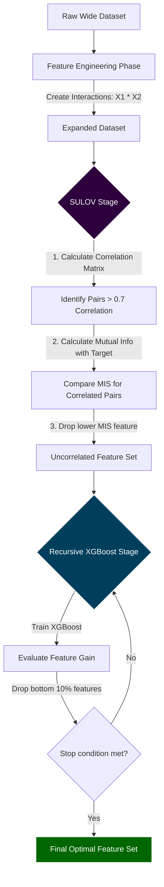

# 4. Visual Intuition: The Architecture

```mermaid
flowchart TD
    A[Raw Wide Dataset] --> B[Feature Engineering Phase]
    B -->|Create Interactions: X1 * X2| C[Expanded Dataset]
    
    C --> D{SULOV Stage}
    D -->|1. Calculate Correlation Matrix| E[Identify Pairs > 0.7 Correlation]
    E -->|2. Calculate Mutual Info with Target| F[Compare MIS for Correlated Pairs]
    F -->|3. Drop lower MIS feature| G[Uncorrelated Feature Set]
    
    G --> H{Recursive XGBoost Stage}
    H -->|Train XGBoost| I[Evaluate Feature Gain]
    I -->|Drop bottom 10% features| J{Stop condition met?}
    J -->|No| H
    J -->|Yes| K[Final Optimal Feature Set]
    
    style D fill:#2e003e,stroke:#fff,stroke-width:2px,color:#fff
    style H fill:#003f5c,stroke:#fff,stroke-width:2px,color:#fff
    style K fill:#006600,stroke:#fff,stroke-width:2px,color:#fff
```
