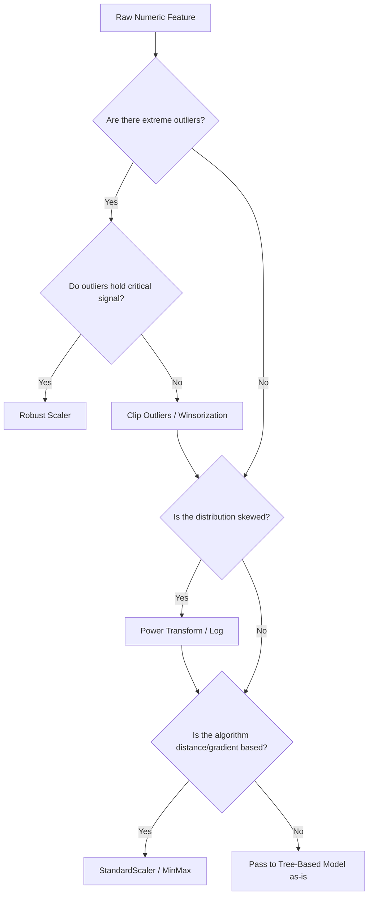

# Week 2: Handling Numeric Data

## 1. Concept Introduction

Handling numeric data is the mathematical core of feature engineering. While raw numbers might seem immediately ingestible by machine learning algorithms, their native representations—scale, variance, distribution shape, and noise levels—often violently violate the statistical assumptions of the underlying models.

Numeric feature engineering is the process of applying monotonic, non-monotonic, and geometric transformations to continuous data. The objective is to stabilize variance, normalize scale, inject non-linear relationships, and suppress noise, thereby conditioning the feature space for optimal gradient descent convergence and accurate distance metric calculations.

> [!IMPORTANT]
> A machine learning model is blind to units. It does not know that $100,000$ represents a house price in dollars and $3$ represents the number of bedrooms. Without proper numeric transformations, the algorithm will mathematically assume that the house price is $33,333$ times more "important" than the bedroom count purely due to scalar magnitude.

## 2. Intuition and Real-World Analogy

Imagine trying to determine the "similarity" between two athletes based on two metrics:
1. Weight in kilograms (Range: $60 - 120$)
2. Annual salary in dollars (Range: $\$50,000 - \$50,000,000$)

If you plot these points on a 2D plane and measure the physical distance between them, the salary axis completely collapses the weight axis. The distance is effectively just the difference in their salaries. The weight metric is erased from the geometric reality of the model.

Numeric engineering is like converting different currencies into a single, universal standardized metric system so that models can compute relative value, similarity, and gradients without scalar bias.

## 3. Feature Scaling: Mathematics and Mechanics

Scaling restricts the domain of numeric features. It does not change the shape of the distribution (unless non-linear transformations are used); it only translates and scales the axes.

### A. Min-Max Scaling (Normalization)
Rescales the feature to a hard-bounded interval, typically $[0, 1]$.

$$
X_{scaled} = \frac{X - X_{min}}{X_{max} - X_{min}}
$$

- **Properties:** Preserves the exact original distribution shape. Bounded output.
- **Vulnerability:** Extremely sensitive to outliers. A single massive outlier will compress all legitimate data points into a microscopic range near $0$.

### B. Standardization (Z-Score Scaling)
Centers the data around a mean of zero and scales it to a standard deviation of one.

$$
X_{standardized} = \frac{X - \mu}{\sigma}
$$

- **Properties:** Unbounded output (typically ranges from $[-3, 3]$ but can exceed this). Assumes data is roughly Gaussian.
- **Optimization Link:** Crucial for Gradient Descent. If features have different variances, the loss function's contour becomes an elongated ellipse. Gradient descent will oscillate wildly across the narrow axis and converge painfully slowly along the elongated axis. Standardization reshapes the loss contour into a sphere, allowing direct, fast convergence to the global minimum.

### C. Robust Scaling
Uses statistics that are resistant to outliers: the median and the Interquartile Range (IQR).

$$
X_{robust} = \frac{X - \text{Median}(X)}{Q_{3}(X) - Q_{1}(X)}
$$

- **Properties:** Outliers remain untouched in their extreme values, but the bulk of the "normal" data is scaled properly without being squashed by the outliers.

> [!WARNING]
> Applying StandardScaler to sparse matrices (like TF-IDF or One-Hot Encoded text) will destroy sparsity because it subtracts the mean (a non-zero value) from all zero elements. This transforms a highly efficient sparse matrix into a massive dense matrix, causing immediate out-of-memory (OOM) crashes. Use `MaxAbsScaler` for sparse data.

## 4. Visual Architecture: Numeric Transformation Decision Flow



## 5. Attribute Transformations: Changing the Distribution

Unlike scaling, transformations change the geometric shape of the distribution, usually to force it to approximate a Gaussian (Normal) distribution, which stabilizes variance and reduces skew.

### Logarithmic Transformation
Applies the natural logarithm. It compresses large values more heavily than small values, expanding the lower end of the scale. Excellent for right-skewed data (e.g., income, website traffic).

$$
X_{log} = \log_e(X + 1)
$$

*(Note: $+1$ prevents undefined errors for $\log(0)$).*

### Power Transformations (Box-Cox & Yeo-Johnson)
A generalized family of transformations parameterized by $\lambda$, solved via Maximum Likelihood Estimation (MLE) to find the exact mathematical power that makes the data most Gaussian.

**Box-Cox Formula:**
$$
y(\lambda) = 
\begin{cases} 
\frac{y^\lambda - 1}{\lambda} & \text{if } \lambda \neq 0 \\
\ln(y) & \text{if } \lambda = 0 
\end{cases}
$$

> [!NOTE]
> Box-Cox requires all input data to be strictly positive ($X > 0$). If your data contains zeros or negative numbers, you must use the **Yeo-Johnson** transformation, which is an extension of Box-Cox designed to handle the entire real number line.

## 6. Discretization and Smoothing

### Discretization (Binning)
Converts continuous variables into categorical representations. 

1. **Equal Width Binning:** Divides the range into $N$ intervals of the same size. Vulnerable to skewed data.
2. **Equal Frequency (Quantile) Binning:** Divides data into $N$ intervals containing the same number of samples. Highly robust to outliers.

*Mathematical intuition for Quantiles:* Bins are defined by the empirical Cumulative Distribution Function (CDF) $F(x)$, choosing split points $x_i$ such that $F(x_i) = \frac{i}{N}$.

### Smoothing
Used primarily in time-series numeric data to isolate the signal from high-frequency stochastic noise.

**Exponentially Weighted Moving Average (EWMA):**
$$
S_t = \alpha X_t + (1 - \alpha) S_{t-1}
$$
Where $\alpha \in [0,1]$ is the smoothing factor. As $\alpha \to 0$, the curve becomes perfectly smooth (ignoring new data). As $\alpha \to 1$, the curve perfectly tracks the raw noisy data.

## 7. Impact on Proximity-Based Models

Proximity models (K-Nearest Neighbors, K-Means Clustering, Support Vector Machines) rely on calculating the $L_p$ norm (Minkowski distance) between vectors.

**Euclidean Distance ($L_2$ Norm):**
$$
d(p, q) = \sqrt{\sum_{i=1}^n (p_i - q_i)^2}
$$

If feature $i=1$ varies between $0$ and $10,000$, and feature $i=2$ varies between $0$ and $1$, the squared difference $(p_1 - q_1)^2$ will completely dominate the summation. The model will mathematically behave as if feature $2$ does not exist. Feature scaling guarantees that all axes contribute equally to the geometric distance.

## 8. Python Implementation: Scaling and Transformation

This code demonstrates the practical difference between scalers and distribution transformations.

```python
import numpy as np
import pandas as pd
import matplotlib.pyplot as plt
from sklearn.preprocessing import MinMaxScaler, StandardScaler, RobustScaler, PowerTransformer
import seaborn as sns

# 1. Generate Synthetic Data (Skewed with Outliers)
np.random.seed(42)
# Log-normal distribution (heavy right skew)
base_data = np.random.lognormal(mean=2.0, sigma=1.0, size=1000)
# Inject severe outliers
outliers = np.array([500, 600, 700])
data = np.concatenate([base_data, outliers]).reshape(-1, 1)

# 2. Apply Transformations
# Note: Scalers expect 2D arrays, hence reshape(-1, 1)
scalers = {
    'Original Data': None,
    'Min-Max Scaled': MinMaxScaler(),
    'Standard Scaled': StandardScaler(),
    'Robust Scaled': RobustScaler(),
    'Yeo-Johnson Transform': PowerTransformer(method='yeo-johnson')
}

# 3. Visualization Pipeline
fig, axes = plt.subplots(1, 5, figsize=(25, 5))

for i, (title, scaler) in enumerate(scalers.items()):
    if scaler is None:
        transformed_data = data
    else:
        transformed_data = scaler.fit_transform(data)
    
    # Plot Distribution
    sns.histplot(transformed_data, bins=50, ax=axes[i], kde=True, color='blue', alpha=0.6)
    axes[i].set_title(title)
    
    # Show variance and range properties
    stats = f"Min: {transformed_data.min():.2f}\nMax: {transformed_data.max():.2f}\nVar: {np.var(transformed_data):.2f}"
    axes[i].text(0.5, 0.8, stats, transform=axes[i].transAxes, fontsize=10, 
                 bbox=dict(facecolor='white', alpha=0.8))

plt.tight_layout()
plt.show()
```

*Expected output visual logic:*
*   **Original:** Heavy right skew, massive tail to 700.
*   **Min-Max:** Same shape, but x-axis is exactly 0 to 1. The bulk of data is compressed near 0 due to outliers.
*   **Standard:** Same shape, mean becomes 0. Variance is 1, but outliers are heavily penalized into extreme Z-scores.
*   **Robust:** Same shape, but the core data is perfectly scaled around 0, ignoring the pull of the 700-value outliers.
*   **Yeo-Johnson:** Shape fundamentally changes to look like a perfect Gaussian bell curve. Outliers are pulled inward mathematically.

## 9. Python Simulation: The Disastrous Impact of Unscaled Data on KNN

This simulation proves mathematically and programmatically how lack of scaling destroys distance-based models.

```python
from sklearn.neighbors import KNeighborsClassifier
from sklearn.metrics import accuracy_score
from sklearn.model_selection import train_test_split

# 1. Create a dataset where a "hidden" feature is highly predictive, but on a tiny scale
# Feature 1: Irrelevant noise, huge scale (0 to 1,000,000)
# Feature 2: Perfect signal, tiny scale (0 to 1)
# Target: 1 if Feature 2 > 0.5 else 0

N = 1000
f1_noise = np.random.uniform(0, 1000000, N)
f2_signal = np.random.uniform(0, 1, N)
target = (f2_signal > 0.5).astype(int)

X = np.column_stack((f1_noise, f2_signal))
y = target

X_train, X_test, y_train, y_test = train_test_split(X, y, test_size=0.3, random_state=42)

# 2. Train KNN on UNSCALED data
knn_unscaled = KNeighborsClassifier(n_neighbors=5)
knn_unscaled.fit(X_train, y_train)
preds_unscaled = knn_unscaled.predict(X_test)
acc_unscaled = accuracy_score(y_test, preds_unscaled)

# 3. Train KNN on SCALED data
scaler = StandardScaler()
X_train_scaled = scaler.fit_transform(X_train)
X_test_scaled = scaler.transform(X_test)

knn_scaled = KNeighborsClassifier(n_neighbors=5)
knn_scaled.fit(X_train_scaled, y_train)
preds_scaled = knn_scaled.predict(X_test_scaled)
acc_scaled = accuracy_score(y_test, preds_scaled)

print(f"KNN Accuracy (Unscaled Data): {acc_unscaled:.4f}")
print(f"KNN Accuracy (Standardized Data): {acc_scaled:.4f}")

# Expected Output:
# KNN Accuracy (Unscaled Data): ~0.5000 (Random Guessing, F1 overpowers F2)
# KNN Accuracy (Standardized Data): 1.0000 (Perfect accuracy, F2 signal unlocked)
```

## 10. Performance and Computational Insights

- **Tree-Based Models:** Random Forests and Gradient Boosted Trees (XGBoost, LightGBM) make orthogonal splits on features ($X_j < t$). They do not compute gradients over the feature space or distances between points. Therefore, scaling features for tree-based models is mathematically useless and wastes CPU cycles.
- **Matrix Operations:** Standard scaling requires computing the mean across columns. For massive datasets, doing this in-memory with Pandas will cause an OOM. Use PySpark or `scikit-learn`'s `PartialFit` methods with `StandardScaler` to compute running means and variances in chunks.

## 11. Interview-Style Insights

**Q: You notice that after applying a log transformation, your model's performance on the validation set drops significantly. What could cause this?**
**A:** A log transformation compresses the right tail of a distribution. If the target variable has a strong linear relationship with the *extreme values* of that right tail, applying a log transform destroys that signal. The extreme values were not noise; they were high-leverage predictive signals. Always verify feature-to-target mutual information before and after transformation.

**Q: Explain the mathematical leakage risk when standardizing data.**
**A:** If you execute `scaler.fit(X_all)`, you compute $\mu$ and $\sigma$ using the entire dataset, including the test set. When the model later predicts on the test set, it is evaluating data that has been centered using statistics influenced by its own values. This violates the IID (Independent and Identically Distributed) assumption of the test set, creating a falsely optimistic evaluation metric. You must exclusively `fit` on `X_train`.

## 12. Final Takeaways

### Mental Models
- **The Spherical Optimization Constraint:** Think of scaling as reshaping a stretched rubber sheet (the cost function) back into a perfect circle, allowing gradient descent algorithms to roll smoothly to the bottom rather than bouncing side-to-side.
- **The Information Funnel:** Binning (discretization) is inherently a lossy compression algorithm. You are intentionally throwing away the granular precision of a continuous variable to gain robustness against noise. Only do this if the noise outweighs the signal.

### Advanced Learning Roadmap
1. **Target-Aware Discretization:** Study Decision Tree discretizers (using a shallow decision tree to find the mathematically optimal bin edges that maximize purity of the target).
2. **Polynomial Feature Explosion:** Understand the combinatorial explosion of `PolynomialFeatures`. If you have 100 features and apply a degree-3 polynomial, you generate over 170,000 features. Learn how to combine this with Ridge regularization to prevent memory/variance collapse.
3. **Spline Transformations:** Move beyond simple polynomials to Piecewise Polynomials (Splines) to model highly complex, non-linear numeric continuous relationships without runaway asymptotic behavior at the boundaries.
