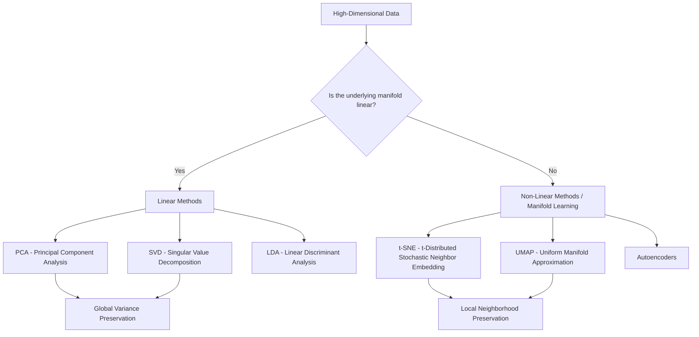

# Week 4: Dimensionality Reduction Techniques

## [1. Concept Introduction](https://github.com/Balasubramanian-pg/MSC.-Data-Science-AI/blob/main/Trimester%201/Feature%20Engineering/W1/Readme.md#1-concept-introduction)

High-dimensional data is structurally unstable. As the number of features (dimensions) grows, the volume of the feature space expands exponentially, causing data points to become increasingly sparse. This "Curse of Dimensionality" degrades the statistical significance of distance metrics, induces multicollinearity, and massively inflates computational inference costs.

Dimensionality Reduction is the mathematical framework for projecting a high-dimensional feature space $\mathbb{R}^d$ into a lower-dimensional subspace $\mathbb{R}^k$ (where $k \ll d$) while preserving the maximum possible amount of underlying structural information, variance, or local geometry.

It fundamentally addresses the hypothesis that high-dimensional data actually lies on or near a lower-dimensional manifold embedded within the higher-dimensional space.

## [2. Intuition and Real-World Analogy](https://github.com/Balasubramanian-pg/MSC.-Data-Science-AI/blob/main/Trimester%201/Feature%20Engineering/W1/Readme.md#2-intuition-and-real-world-analogy)

**The Shadow Analogy (Linear Dimensionality Reduction)**
Imagine holding a complex 3D wireframe object, like a bicycle, and shining a flashlight on it to cast a shadow on a 2D wall. 
- If you shine the light from the front, the shadow looks like a chaotic jumble of overlapping lines. You have lost the "bicycle structure."
- If you shine the light from the side, the shadow perfectly reveals the wheels, frame, and handlebars. 
Dimensionality reduction algorithms (like PCA) mathematically compute the "optimal angle" to shine the light so that the resulting shadow (the lower-dimensional projection) retains the maximum possible structural variance.

**The Map Analogy (Non-Linear Dimensionality Reduction)**
Imagine trying to flatten a 3D globe into a 2D map. You cannot simply smash the globe with a hammer (linear projection); it will tear and distort wildly. Instead, you must carefully unfold it, stretching and squashing certain regions to preserve the *local* relationships (so that France remains next to Germany), even if the *global* distances (the distance between Alaska and Russia) become distorted. This is the geometry of algorithms like t-SNE.

## 3. Principal Component Analysis (PCA): Mathematical Foundations

PCA is a deterministic, linear transformation algorithm. Its objective is to find a set of orthogonal axes (Principal Components) along which the variance of the data is maximized. 

### [Step-by-Step Derivation](https://github.com/Balasubramanian-pg/MSC.-Data-Science-AI/blob/main/Trimester%201/Feature%20Engineering/W6/Readme.md#step-by-step-derivation)

Given a [dataset](https://github.com/Balasubramanian-pg/MSC.-Data-Science-AI/blob/main/Trimester%201/Feature%20Engineering/W3/Experiential%20Learning%20Activity.md#dataset) $X \in \mathbb{R}^{n \times d}$ (where $n$ is samples, $d$ is features).

**Step 1: Mean Centering**
We must center the data so the origin is the center of mass.
$$
X_c = X - \mu
$$
Where $\mu$ is the vector of column means.

**Step 2: The Covariance Matrix**
We calculate the covariance matrix $\Sigma \in \mathbb{R}^{d \times d}$, which captures the pairwise variance between all features.
$$
\Sigma = \frac{1}{n-1} X_c^T X_c
$$

**Step 3: Eigendecomposition**
We solve for the eigenvectors $V$ and eigenvalues $\Lambda$ of the covariance matrix.
$$
\Sigma V = V \Lambda
$$
- **Eigenvectors ($v_i \in V$):** Represent the *directions* of the new feature axes (Principal Components). They are strictly orthogonal.
- **Eigenvalues ($\lambda_i \in \Lambda$):** Represent the *magnitude of variance* captured along each corresponding eigenvector.

**Step 4: Subspace Projection**
We sort the eigenvectors in descending order of their corresponding eigenvalues. We select the top $k$ eigenvectors to form a projection matrix $W_k \in \mathbb{R}^{d \times k}$. The compressed data $Z$ is computed by:
$$
Z = X_c W_k
$$

> [!IMPORTANT]
> The first principal component (PC1) is the line of best fit that minimizes the orthogonal projection error from the data points to the line. It is geometrically identical to maximizing the variance of the projected points.

## [4. Visual Architecture](https://github.com/Balasubramanian-pg/MSC.-Data-Science-AI/blob/main/Trimester%201/Feature%20Engineering/W1/Readme.md#4-visual-architecture): The Dimensionality Reduction Tree



## 5. Singular Value Decomposition (SVD)

While PCA requires computing the covariance matrix $X^T X$, which can be computationally disastrous and numerically unstable for large dimensions, **SVD** decomposes the data matrix $X$ directly.

### The Mathematics of SVD
Any matrix $X \in \mathbb{R}^{n \times d}$ can be factored into three matrices:
$$
X = U \Sigma V^T
$$

- **$U \in \mathbb{R}^{n \times n}$ (Left Singular Vectors):** Orthogonal matrix representing the basis for the column space.
- **$\Sigma \in \mathbb{R}^{n \times d}$ (Singular Values):** Diagonal matrix of singular values ($\sigma_i$), which are the square roots of the eigenvalues from PCA ($\sigma_i = \sqrt{\lambda_i}$).
- **$V^T \in \mathbb{R}^{d \times d}$ (Right Singular Vectors):** Orthogonal matrix identical to the eigenvectors calculated in PCA.

### Truncated SVD (Optimal Low-Rank Approximation)
According to the **Eckart-Young-Mirsky Theorem**, if we want to compress $X$ into a lower-rank matrix $X_k$ (where $k < d$) that minimizes the Frobenius norm $||X - X_k||_F$, we simply keep the top $k$ singular values and vectors:
$$
X_k \approx U_k \Sigma_k V_k^T
$$

> [!TIP]
> In production machine learning, libraries like `scikit-learn` actually use SVD under the hood to perform PCA, as computing SVD on the centered matrix $X_c$ is numerically more stable than computing $X^T X$ directly. Truncated SVD is also capable of running on sparse matrices (like TF-IDF text features), whereas PCA is not.

## 6. Python Implementation: PCA & SVD (Noise Reduction)

This implementation demonstrates mathematical equivalence between PCA and SVD, and shows SVD acting as a compression and noise-reduction algorithm on images.

```python
import numpy as np
import matplotlib.pyplot as plt
from sklearn.decomposition import PCA

# --- Part 1: Proving PCA and SVD Equivalence ---
np.random.seed(42)
X = np.random.rand(100, 5) # 100 samples, 5 features

# 1. Standard PCA via Scikit-Learn
X_centered = X - np.mean(X, axis=0)
pca = PCA(n_components=2)
Z_pca = pca.fit_transform(X_centered)

# 2. PCA via Mathematical SVD from scratch
U, S, Vt = np.linalg.svd(X_centered, full_matrices=False)
# Z = U * S (for top k components)
Z_svd = U[:, :2] * S[:2]

# Verify mathematical equivalence (accounting for potential sign flips in eigenvectors)
print("Max difference between Sklearn PCA and numpy SVD:", np.max(np.abs(np.abs(Z_pca) - np.abs(Z_svd))))
# Expected Output: Max difference... approaches 0 (e.g., 1e-15)


# --- Part 2: SVD for Image Compression and Noise Reduction ---
# Create a synthetic image (a simple cross)
image = np.zeros((50, 50))
image[20:30, :] = 1
image[:, 20:30] = 1

# Inject Gaussian Noise
noise = np.random.normal(0, 0.5, (50, 50))
noisy_image = image + noise

# Apply SVD
U_img, S_img, Vt_img = np.linalg.svd(noisy_image, full_matrices=False)

# Truncate to top k singular values (k=5)
k = 5
S_k = np.diag(S_img[:k])
reconstructed_image = U_img[:, :k] @ S_k @ Vt_img[:k, :]

# Visualization
fig, axes = plt.subplots(1, 3, figsize=(15, 5))
axes[0].imshow(image, cmap='gray'); axes[0].set_title('Original Clean Signal')
axes[1].imshow(noisy_image, cmap='gray'); axes[1].set_title('Noisy Observation (Full Rank)')
axes[2].imshow(reconstructed_image, cmap='gray'); axes[2].set_title(f'SVD Reconstructed (Rank {k})')
for ax in axes: ax.axis('off')
plt.show()
```

*Expected output visual logic:* The noisy image looks like television static. The SVD reconstructed image strips away the high-frequency static, revealing the clean cross structure underneath, purely by dropping the lowest-variance singular values.

## 7. [t-Distributed Stochastic Neighbor Embedding (t-SNE)](https://github.com/Balasubramanian-pg/MSC.-Data-Science-AI/blob/main/Trimester%201/Feature%20Engineering/W4/t-SNE.md#t-distributed-stochastic-neighbor-embedding-t-sne)

PCA and SVD fail completely when the data lies on a complex, non-linear manifold (e.g., a rolled-up sheet of paper). **t-SNE** is a probabilistic algorithm specifically designed to untangle non-linear data for human visualization.

### Step 1: High-Dimensional Probabilities
t-SNE computes the probability that point $x_i$ would pick point $x_j$ as its neighbor if neighbors were picked in proportion to a Gaussian probability density centered at $x_i$.
$$
p_{j|i} = \frac{\exp(-||x_i - x_j||^2 / 2\sigma_i^2)}{\sum_{k \neq i} \exp(-||x_i - x_k||^2 / 2\sigma_i^2)}
$$
We symmetrize this: $p_{ij} = \frac{p_{j|i} + p_{i|j}}{2n}$

### Step 2: Low-Dimensional Probabilities (The Crowding Problem Solution)
If we use a Gaussian distribution in the low-dimensional space $\mathbb{R}^2$, points that are moderately far apart in high dimensions will be squashed directly on top of each other in 2D (the "crowding problem"). 
t-SNE solves this by using a **Student's t-distribution with 1 degree of freedom** (a heavy-tailed Cauchy distribution) for the low-dimensional affinities $q_{ij}$:
$$
q_{ij} = \frac{(1 + ||y_i - y_j||^2)^{-1}}{\sum_{k \neq l} (1 + ||y_k - y_l||^2)^{-1}}
$$
The heavy tail allows moderately distant points in high-dimensional space to be pushed much further apart in the 2D map.

### Step 3: Gradient Descent on KL Divergence
t-SNE finds the optimal 2D coordinates $y_i$ by minimizing the Kullback-Leibler (KL) divergence between the high-dimensional distribution $P$ and the low-dimensional distribution $Q$:
$$
C = KL(P || Q) = \sum_i \sum_j p_{ij} \log \frac{p_{ij}}{q_{ij}}
$$

> [!WARNING]
> Because KL divergence is asymmetric, t-SNE heavily penalizes putting close high-dimensional points far apart in 2D ($p_{ij}$ is high, $q_{ij}$ is low). However, it barely penalizes putting distant high-dimensional points close together in 2D. Therefore, **t-SNE purely preserves local neighborhoods. Distances between distant clusters in a t-SNE plot are mathematically meaningless.**

## 8. Python Simulation: PCA vs t-SNE on a Non-Linear Manifold

This simulation uses the classic "Swiss Roll" [dataset](https://github.com/Balasubramanian-pg/MSC.-Data-Science-AI/blob/main/Trimester%201/Feature%20Engineering/W3/Experiential%20Learning%20Activity.md#dataset) to prove the necessity of non-linear techniques.

```python
import numpy as np
import matplotlib.pyplot as plt
from sklearn.datasets import make_swiss_roll
from sklearn.decomposition import PCA
from sklearn.manifold import TSNE

# 1. Generate Non-Linear 3D Manifold (Swiss Roll)
X_roll, color_labels = make_swiss_roll(n_samples=1500, noise=0.05, random_state=42)

# 2. Apply Linear PCA (Will fail to unroll)
pca = PCA(n_components=2)
X_pca = pca.fit_transform(X_roll)

# 3. Apply Non-Linear t-SNE (Will successfully unroll)
# Note: perplexity determines the balance between local and global attention
tsne = TSNE(n_components=2, perplexity=30, random_state=42, init='pca', learning_rate='auto')
X_tsne = tsne.fit_transform(X_roll)

# 4. Visualization Architecture
fig = plt.figure(figsize=(18, 5))

# 3D Original
ax1 = fig.add_subplot(131, projection='3d')
ax1.scatter(X_roll[:, 0], X_roll[:, 1], X_roll[:, 2], c=color_labels, cmap=plt.cm.Spectral)
ax1.set_title("Original 3D Swiss Roll")

# 2D PCA
ax2 = fig.add_subplot(132)
ax2.scatter(X_pca[:, 0], X_pca[:, 1], c=color_labels, cmap=plt.cm.Spectral)
ax2.set_title("PCA Projection (Fails to Unroll)")

# 2D t-SNE
ax3 = fig.add_subplot(133)
ax3.scatter(X_tsne[:, 0], X_tsne[:, 1], c=color_labels, cmap=plt.cm.Spectral)
ax3.set_title("t-SNE Projection (Successfully Unrolled)")

plt.show()
```

## 9. Comparative Analysis

| Feature | PCA | Truncated SVD | t-SNE |
| :--- | :--- | :--- | :--- |
| **Geometry** | Linear Projection | Linear Projection | Non-Linear Manifold |
| **Objective** | Maximize Variance | Low-Rank Approximation | Preserve Local Neighbors |
| **Global Structure** | Yes | Yes | No (Destroyed) |
| **Input Requirement**| Dense, Centered Matrix | Dense or Sparse Matrix | Dense Matrix |
| **Computational Cost**| Low / Medium | Low / Medium | Very High ($\mathcal{O}(N \log N)$) |
| **Primary Use Case** | Feature Eng, Noise Removal | TF-IDF text, Recommenders | Human 2D/3D Visualization |
| **Transform New Data**| Yes (`.transform(X_new)`)| Yes (`.transform(X_new)`)| **No** (Must rerun entirely) |

## 10. Common Mistakes and Edge Cases

- **Failing to Scale Before PCA:** PCA is variance-maximizing. If Feature A is in millions and Feature B is in decimals, PC1 will perfectly align with Feature A simply due to magnitude, completely ignoring the structural signal in Feature B. *Always use `StandardScaler` before PCA.*
- **Using t-SNE features for downstream Machine Learning Models:** t-SNE is a nonparametric mapping. It does not yield a function $f(x)$ to project new unseen data into the same space. You cannot easily `fit` on train and `transform` on test. Furthermore, t-SNE destroys data density (clusters appear uniformly sized). It is for *eyes*, not for *algorithms*.
- **Misinterpreting t-SNE Perplexity:** Perplexity roughly equates to the number of expected nearest neighbors. Using a perplexity of 5 on a [dataset](https://github.com/Balasubramanian-pg/MSC.-Data-Science-AI/blob/main/Trimester%201/Feature%20Engineering/W3/Experiential%20Learning%20Activity.md#dataset) of 10,000 will result in fragmented, noisy clusters. Using a perplexity of 5,000 will collapse the entire [dataset](https://github.com/Balasubramanian-pg/MSC.-Data-Science-AI/blob/main/Trimester%201/Feature%20Engineering/W3/Experiential%20Learning%20Activity.md#dataset) into a central blob.

## [11. Performance and Computational Insights](https://github.com/Balasubramanian-pg/MSC.-Data-Science-AI/blob/main/Trimester%201/Feature%20Engineering/W8/Readme.md#11-performance-and-computational-insights)

- **Covariance vs SVD Complexity:** The covariance matrix in PCA takes $\mathcal{O}(nd^2)$ to compute, and eigendecomposition takes $\mathcal{O}(d^3)$. If you have text data with 100,000 features, PCA will freeze your machine. Truncated SVD uses iterative solvers (like ARPACK or Randomized SVD) that calculate only the top $k$ components in $\mathcal{O}(k \cdot n \cdot d)$, representing a massive computational optimization.
- **t-SNE Barnes-Hut Approximation:** Exact t-SNE calculates pairwise distances between all $N$ points, yielding an $\mathcal{O}(N^2)$ complexity. Production t-SNE uses the Barnes-Hut algorithm (a quadtree optimization algorithm originally used in astrophysics for N-body simulations), reducing complexity to $\mathcal{O}(N \log N)$.

## [12. Interview-Style Insights](https://github.com/Balasubramanian-pg/MSC.-Data-Science-AI/blob/main/Trimester%201/Feature%20Engineering/W1/Readme.md#12-interview-style-insights)

**Q: In PCA, how do you decide the optimal number of components $k$?**
**A:** I evaluate the cumulative explained variance ratio. I calculate the eigenvalues, normalize them by their sum, and compute a cumulative sum. I typically select $k$ such that the cumulative explained variance exceeds a threshold, like 90% or 95%. Alternatively, I look for the "elbow" in a Scree Plot.

**Q: What is the geometric interpretation of a singular value equal to zero?**
**A:** A singular value of zero indicates that the feature space has collapsed along that dimension. Geometrically, it means the data lies precisely on a lower-dimensional hyperplane. There is perfect linear dependence (collinearity) among some of the original features.

**Q: Can you use PCA on categorical data?**
**A:** Strictly speaking, no. PCA assumes continuous data and relies on variance and covariance, which are statistically meaningless for one-hot encoded nominal variables. For categorical data, you must use **Multiple Correspondence Analysis (MCA)**.

## [13. Final Takeaways](https://github.com/Balasubramanian-pg/MSC.-Data-Science-AI/blob/main/Trimester%201/Feature%20Engineering/W8/Readme.md#13-final-takeaways)

### [Mental Models](https://github.com/Balasubramanian-pg/MSC.-Data-Science-AI/blob/main/Trimester%201/Feature%20Engineering/W1/Readme.md#mental-models)
- **Information Conservation:** Think of dimensionality reduction not as deleting data, but as compressing an mp3. The highest-energy frequencies (Principal Components) are kept, and the low-energy frequencies (noise, minor variances) are discarded.
- **The PCA Orthogonality:** Remember that every Principal Component is $90^\circ$ orthogonal to the others in multi-dimensional space. This guarantees that each new feature created by PCA is perfectly uncorrelated (Pearson $r = 0$) with the others, completely eradicating multicollinearity.

### [Advanced Learning Roadmap](https://github.com/Balasubramanian-pg/MSC.-Data-Science-AI/blob/main/Trimester%201/Feature%20Engineering/W1/Readme.md#advanced-learning-roadmap)
1. **UMAP (Uniform Manifold Approximation and Projection):** The modern successor to t-SNE. Based on algebraic topology, it preserves both local and global structure, and is capable of projecting new unseen data.
2. **Autoencoders:** Neural network-based non-linear dimensionality reduction. An encoder compresses data into a low-dimensional "bottleneck" (latent space), and a decoder attempts to reconstruct the original data, learning complex non-linear manifolds.
3. **Kernel PCA:** Applying the kernel trick (similar to SVMs) to project data into a higher-dimensional infinite space, performing linear PCA there, and projecting back, effectively achieving non-linear PCA.
