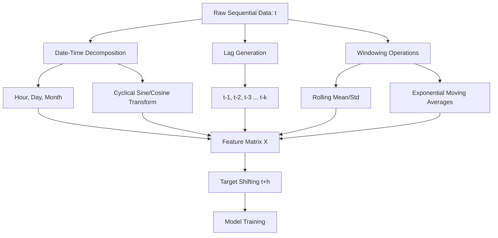

# Week 7: Feature Engineering Techniques for Time-Series Data
# Feature Engineering Techniques for Time-Series Data

## 1. Concept Introduction

In standard machine learning, datasets are assumed to be independent and identically distributed (I.I.D.). Time-series data violently violates this assumption. In a time series, the temporal order is the primary carrier of information; the value of a variable at time $t$ is mathematically and causally dependent on its values at $t-1, t-2, \dots, t-k$.

Feature engineering for time-series is the process of transforming a 1-dimensional sequential vector of observations into a standard 2-dimensional tabular matrix $\mathbf{X} \in \mathbb{R}^{n \times d}$, where each row contains sufficient historical context for a non-sequential model (like XGBoost, Random Forest, or Linear Regression) to map it to a future target $y_{t+h}$.

> [!IMPORTANT]
> The primary objective of time-series feature engineering is converting **implicit temporal dependence** into **explicit spatial dependence** (columns in a matrix). If you fail to do this correctly, tabular models will treat adjacent time steps as completely unrelated entities.

## 2. Intuition and Real-World Analogy

**The Rearview Mirror Analogy:**
Imagine driving a car where the windshield is completely blacked out. Your goal is to steer the car accurately (predict the future). You cannot see the road ahead. However, you have an incredibly detailed rearview mirror. 

- **Lag Features:** Looking directly behind you to see exactly where you were 1 second ago, 2 seconds ago, and 3 seconds ago.
- **Rolling Statistics:** Calculating your average speed over the last 10 seconds (momentum) or measuring how sharply you've been turning the wheel over the last 5 seconds (volatility).
- **Date/Time Features:** Checking your clock to know it's 5:00 PM (identifying the rush-hour cyclical pattern).

By structuring this historical information into a dashboard (the feature matrix), you can mathematically deduce the curvature of the road ahead without ever looking through the windshield.

## 3. Mathematical Foundations of Time-Series Features

Let a time-series be a sequence of observations $X = \{x_1, x_2, \dots, x_T\}$ indexed by time $t$.

### A. The Backshift (Lag) Operator
The backshift operator $B$ (or $L$ for Lag) transforms an observation to its previous state:
$$
B x_t = x_{t-1}
$$
Generalizing to $k$ periods:
$$
B^k x_t = x_{t-k}
$$

### B. Differencing (Stationarity Transformation)
Many machine learning models require data to be stationary (constant mean and variance over time). Differencing removes trends.
First-order differencing:
$$
\nabla x_t = x_t - B x_t = x_t - x_{t-1}
$$

### C. Rolling (Window) Statistics
A rolling window applies a mathematical aggregation function $f$ over a subset of the most recent $w$ periods.
The rolling mean:
$$
\mu_t(w) = \frac{1}{w} \sum_{i=0}^{w-1} x_{t-i}
$$
The rolling variance:
$$
\sigma_t^2(w) = \frac{1}{w-1} \sum_{i=0}^{w-1} (x_{t-i} - \mu_t(w))^2
$$

## 4. Visual Architecture: The Temporal-to-Tabular Pipeline



## 5. Date-Time and Cyclical Features

Extracting `hour`, `day`, or `month` directly as integers creates a geometric paradox. If `hour` goes from $0$ to $23$, the linear distance between $23:00$ and $0:00$ is $23$. In reality, they are $1$ hour apart.

**Step-by-Step Derivation of Cyclical Encoding:**
To preserve cyclical geometry, we map the discrete time component onto a unit circle using sine and cosine transformations.
Let $T_{max}$ be the maximum value of the cycle (e.g., $24$ for hours, $12$ for months).
1. Normalize the time $t$ to a range of $[0, 2\pi]$: $\theta = \frac{2\pi t}{T_{max}}$
2. Project onto the Cartesian plane:
$$
X_{sin} = \sin\left(\frac{2\pi t}{T_{max}}\right)
$$
$$
X_{cos} = \cos\left(\frac{2\pi t}{T_{max}}\right)
$$

> [!NOTE]
> You must include **both** sine and cosine. Using only sine creates ambiguity. For example, $\sin(\pi/4)$ and $\sin(3\pi/4)$ yield the exact same value. The cosine feature acts as the disambiguator, allowing the model to pinpoint the exact quadrant of the cycle.

## 6. Python Implementation: Fundamental Temporal Features

This intermediate script demonstrates how to efficiently construct lags, rolling stats, and cyclical features strictly using Pandas vectorization.

```python
import pandas as pd
import numpy as np

# 1. Generate Simulated Time-Series Data
dates = pd.date_range(start='2023-01-01', periods=100, freq='h') # Hourly data
np.random.seed(42)
sales = np.cumsum(np.random.randn(100)) + 50 # Random walk with positive base

df = pd.DataFrame({'timestamp': dates, 'sales': sales})
df.set_index('timestamp', inplace=True)

# 2. Date-Time & Cyclical Features
df['hour'] = df.index.hour
df['hour_sin'] = np.sin(2 * np.pi * df['hour'] / 24)
df['hour_cos'] = np.cos(2 * np.pi * df['hour'] / 24)

# 3. Lag Features
# Sales exactly 1, 2, and 24 hours ago
df['sales_lag_1'] = df['sales'].shift(1)
df['sales_lag_2'] = df['sales'].shift(2)
df['sales_lag_24'] = df['sales'].shift(24) # Daily seasonal lag

# 4. Rolling Window Features
# Moving average and volatility over the last 3 hours
df['sales_roll_mean_3'] = df['sales'].rolling(window=3).mean()
df['sales_roll_std_3'] = df['sales'].rolling(window=3).std()

# 5. Expanding Window Features
# Cumulative metrics from the beginning of the dataset up to time t
df['sales_expanding_mean'] = df['sales'].expanding().mean()

# Notice that shifting creates NaNs. We must drop them to train a model.
print("Before Drop NA Shape:", df.shape)
df_clean = df.dropna()
print("After Drop NA Shape:", df_clean.shape)

print("\nEngineered Feature Matrix Head:")
print(df_clean[['sales', 'hour_sin', 'sales_lag_1', 'sales_roll_mean_3']].head().round(3))
```

## 7. Domain-Specific Feature Creation: Finance

Financial time-series data is notoriously noisy. Feature engineering focuses on momentum, mean-reversion, and volatility.

### A. Bollinger Bands (Volatility)
Calculates a moving average and surrounds it with standard deviation bands. It helps models detect structural anomalies or trend reversals.
Upper Band: $UB_t = \mu_t(w) + k \cdot \sigma_t(w)$
Lower Band: $LB_t = \mu_t(w) - k \cdot \sigma_t(w)$
*(Typically, $w=20, k=2$)*.

### B. Relative Strength Index (RSI - Momentum)
Measures the speed and magnitude of recent price changes to evaluate overbought or oversold conditions.
$$
RS = \frac{\text{Exponential Moving Average of Gains}(w)}{\text{Exponential Moving Average of Losses}(w)}
$$
$$
RSI = 100 - \left( \frac{100}{1 + RS} \right)
$$

### Python Implementation: Financial Indicators

```python
def engineer_financial_features(price_series, window=14):
    df = price_series.to_frame(name='price')
    
    # Bollinger Bands
    df['roll_mean'] = df['price'].rolling(window=20).mean()
    df['roll_std'] = df['price'].rolling(window=20).std()
    df['bollinger_upper'] = df['roll_mean'] + (2 * df['roll_std'])
    df['bollinger_lower'] = df['roll_mean'] - (2 * df['roll_std'])
    
    # RSI
    delta = df['price'].diff()
    gain = delta.where(delta > 0, 0)
    loss = -delta.where(delta < 0, 0)
    
    # Exponential Weighted Moving Average (EWMA)
    avg_gain = gain.ewm(alpha=1/window, min_periods=window).mean()
    avg_loss = loss.ewm(alpha=1/window, min_periods=window).mean()
    
    rs = avg_gain / avg_loss
    df['rsi'] = 100 - (100 / (1 + rs))
    
    return df.dropna()

# Simulated stock price
prices = pd.Series(np.cumsum(np.random.randn(200)) + 100)
fin_df = engineer_financial_features(prices)
print(fin_df[['price', 'bollinger_upper', 'rsi']].tail().round(2))
```

## 8. Domain-Specific Feature Creation: Physiology (HRV)

In healthcare, extracting features from continuous signals (like an ECG) focuses on variability and intervals.
Heart Rate Variability (HRV) uses the Root Mean Square of Successive Differences (RMSSD) between R-R intervals (heartbeats).

$$
RMSSD = \sqrt{\frac{1}{N-1} \sum_{i=1}^{N-1} (RR_{i+1} - RR_i)^2}
$$

A high RMSSD feature indicates parasympathetic nervous system dominance (rest and digest), serving as a powerful predictive feature for stress or sleep phase modeling.

## 9. The Greatest Trap: Data Leakage & Lookahead Bias

The most fatal mistake in time-series feature engineering is **Lookahead Bias**. This occurs when the mathematical calculation at time $t$ inadvertently includes information from time $t+1$.

> [!WARNING]
> **The `pandas.rolling(center=True)` Trap:**
> Never use `center=True` when building predictive features. If you are predicting sales on Wednesday, and use a centered 3-day rolling mean, pandas averages (Tuesday + Wednesday + Thursday). Your feature for Wednesday now mathematically contains Thursday's data. Your model will score 99% accuracy in training and completely fail in production.
> Always ensure rolling windows strictly use the past.

**Target Leakage via Normalization:**
Applying `StandardScaler` to the entire feature matrix before splitting into Train/Test leaks future mean and variance into historical data. Scaling must be done purely sequentially using a temporal split.

## 10. Python Simulation: The Full Predictive Pipeline

This block demonstrates how to structure features relative to a shifted target for forecasting, avoiding lookahead bias.

```python
from sklearn.ensemble import RandomForestRegressor
from sklearn.metrics import mean_squared_error
from sklearn.model_selection import TimeSeriesSplit

# 1. Base Data
data = pd.DataFrame({'timestamp': pd.date_range('2023-01-01', periods=500, freq='D')})
data['price'] = np.cumsum(np.random.randn(500)) + 100
data.set_index('timestamp', inplace=True)

# 2. Feature Engineering (Strictly Historical)
data['lag_1'] = data['price'].shift(1)
data['lag_7'] = data['price'].shift(7)
data['roll_mean_7'] = data['price'].rolling(window=7).mean()
data['day_of_week'] = data.index.dayofweek

# 3. Target Engineering (The Future)
# Goal: Predict the price 3 days from now
FORECAST_HORIZON = 3
data['target_price_in_3_days'] = data['price'].shift(-FORECAST_HORIZON)

# 4. Clean up NaNs (Top NaNs from lags, Bottom NaNs from target shift)
model_data = data.dropna()

X = model_data[['lag_1', 'lag_7', 'roll_mean_7', 'day_of_week']]
y = model_data['target_price_in_3_days']

# 5. Temporal Cross Validation (No Random Splitting!)
tscv = TimeSeriesSplit(n_splits=3)
rf = RandomForestRegressor(n_estimators=50, random_state=42)

fold = 1
for train_index, test_index in tscv.split(X):
    X_train, X_test = X.iloc[train_index], X.iloc[test_index]
    y_train, y_test = y.iloc[train_index], y.iloc[test_index]
    
    rf.fit(X_train, y_train)
    preds = rf.predict(X_test)
    rmse = np.sqrt(mean_squared_error(y_test, preds))
    print(f"Fold {fold} RMSE: {rmse:.2f}")
    fold += 1
```

## 11. Machine Learning Connections

**The Tree-Based Trend Problem:**
Algorithms like XGBoost, LightGBM, and Random Forests **cannot extrapolate**. If the training dataset contains sales ranging from $\$10,000$ to $\$50,000$, the highest prediction a tree can ever make is $\approx \$50,000$. 

If your time-series has an upward trend, next year's sales might hit $\$60,000$. A tree-based model will flatline its predictions at $\$50,000$. 
*Solution via Feature Engineering:* Do not predict the absolute value. Difference the target variable ($y_t = x_t - x_{t-1}$). Train the model to predict the *change* in price. Reconstruct the absolute value later by adding the predicted difference to the last known real value.

## 12. Performance and Computational Insights

- **Avoiding the `iterrows` Anti-pattern:** Calculating rolling metrics using a `for` loop over rows is $\mathcal{O}(N)$. Using Pandas `.rolling().mean()` triggers Cythonized, contiguous memory C-blocks, achieving near $\mathcal{O}(1)$ execution per window.
- **Memory Saturation with Lags:** If you create 100 lag features for 10 million rows, you will duplicate your memory footprint 100 times, causing an OOM error. Instead of dense lag grids, use **Dilated Lags** (e.g., $t-1, t-7, t-14, t-30$). This captures recent granularity and distant seasonality without saturating memory.

## 13. Interview-Style Insights

**Q: How do you handle missing values (NaNs) in time-series data before feature engineering?**
**A:** Standard mean/median imputation destroys temporal sequences. For short gaps, I use linear or spline interpolation. For financial data, I use Forward Fill (`ffill()`), assuming the last known price remains valid until a new trade occurs. Never use Backward Fill (`bfill()`) as it leaks future data into the past.

**Q: If you have highly autocorrelated data, how do you decide which lag features to include?**
**A:** I plot the Partial Autocorrelation Function (PACF). While ACF shows the correlation between $t$ and $t-k$ including all intermediate effects, PACF isolates the direct, marginal contribution of precisely lag $k$. I only engineer features for the lags where the PACF spike crosses the statistical significance threshold.

## 14. Final Takeaways

### Mental Models
- **The Information Horizon:** Every rolling or lag feature you create represents a specific "memory horizon" for your model. A 3-day moving average gives the model short-term reflex capacity; a 365-day lag gives it long-term structural memory. A robust matrix requires a synthesis of both.
- **The Stationarity Goal:** The less stationary the raw data, the more feature engineering is required. Your engineered features should essentially "flatten" the temporal dynamics into mathematical constants.

### Advanced Learning Roadmap
1. **Frequency Domain Engineering:** Learn to apply the Fast Fourier Transform (FFT) to convert sequential time-domain data into frequency-domain features (amplitudes and phases of underlying cycles).
2. **Automated Extraction with TSFresh:** Explore the `tsfresh` Python library, which mathematically extracts thousands of time-series features (entropy, continuous wavelet transforms) and performs massive parallel hypothesis testing for feature selection.
3. **Transition to Deep State-Space:** When manual tabular engineering reaches its limit, transition to understanding how LSTMs (Long Short-Term Memory) and Time-Series Transformers (like Temporal Fusion Transformers) learn these lag and window relationships dynamically within their hidden states.
