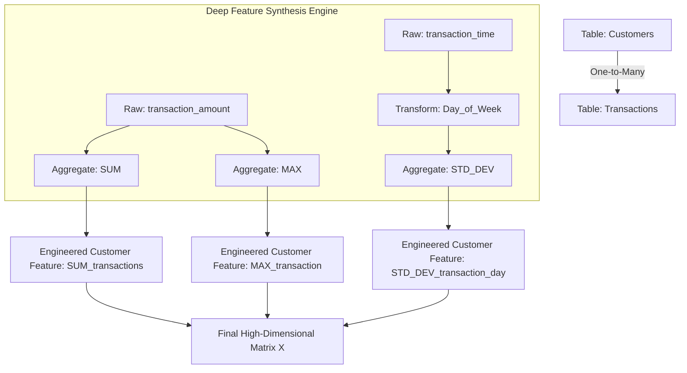

# Week 8: Automated Feature Engineering

## 1. Concept Introduction

Automated Feature Engineering (AutoFE) is the programmatic, algorithmic generation of high-dimensional feature spaces from raw relational, temporal, or tabular data. Instead of relying on domain experts to heuristically construct individual features (e.g., manually calculating "average transaction value over the last 30 days"), AutoFE leverages mathematical combinatorics to systematically apply transformation and aggregation primitives across multiple related datasets.

While manual feature engineering is highly precise but structurally constrained by human imagination and time, AutoFE acts as a brute-force mathematical expansion of the hypothesis space. It hypothesizes thousands of potential localized geometries (features) and relies on downstream selection algorithms or regularized machine learning models to prune the generated space, isolating the signals that maximize mutual information with the target variable.

> [!IMPORTANT]
> AutoFE does not replace domain knowledge; it systematizes it. The engineer's job shifts from manually coding mathematical operations to defining the structural relationships between datasets and the bounds of the algorithmic search space.

## 2. Intuition and Real-World Analogy

**The Fractal Assembly Line Analogy:**
Imagine you are trying to predict the durability of a car engine. 
- **Manual Feature Engineering:** An engineer manually measures the thickness of the piston and the heat resistance of the block, creating exactly two highly informative features.
- **Automated Feature Engineering:** You feed the blueprint into a robotic assembly line. The robot systematically cross-multiplies every dimension with every material property. It creates measurements for "Ratio of spark plug length to exhaust pipe radius" and "Logarithm of steering wheel circumference." It generates 10,000 metrics. 9,950 of them are pure noise. However, 50 of them represent hidden thermodynamic interactions that the human engineer never considered.

AutoFE is the robot. Downstream feature selection (like Lasso or Tree-based importance) is the filter that throws away the 9,950 useless metrics.

## 3. Mathematical Foundations of AutoFE

Let $\mathcal{D}$ be a dataset consisting of raw features $x_1, x_2, \dots, x_d$. 
Automated feature engineering applies a set of mathematical primitives $\mathcal{P}$ to expand the feature space. 

Primitives are divided into two distinct families:
1.  **Transformation Primitives ($T$):** Map a vector to a new vector of the exact same length. 
    $T: \mathbb{R}^n \rightarrow \mathbb{R}^n$ (e.g., Logarithm, Absolute Value, Time-since-event).
2.  **Aggregation Primitives ($A$):** Map a vector (usually representing a one-to-many relationship) to a single scalar value.
    $A: \mathbb{R}^n \rightarrow \mathbb{R}$ (e.g., Mean, Sum, Standard Deviation, Max).

The expanded feature space $\Phi(X)$ is generated by functionally composing these primitives to a defined **Depth ($k$)**.

## 4. Formula Breakdowns: Deep Feature Synthesis (DFS)

Deep Feature Synthesis (DFS), the core algorithm behind `Featuretools`, mathematically stacks these primitives across relational tables.

If Table A (Customers) has a one-to-many relationship with Table B (Transactions), DFS calculates aggregated features for Table A based on the raw columns of Table B.

**Depth 1 Feature ($d=1$):** Applying an aggregation primitive directly to raw data.
$$
F^{(1)} = A(x_{raw}) = \text{Mean}(\text{Transaction\_Amount})
$$

**Depth 2 Feature ($d=2$):** Stacking a transformation primitive inside an aggregation primitive, or stacking two aggregations across three relational tables.
$$
F^{(2)} = A(T(x_{raw})) = \text{Mean}(\text{Absolute\_Value}(\text{Transaction\_Amount}))
$$
Alternatively, if Table C (Logins) relates to Table B (Sessions) which relates to Table A (Users):
$$
F^{(2)} = A_{B \to A}(A_{C \to B}(x_{raw})) = \text{Sum}(\text{Mean\_Session\_Login\_Duration})
$$

### The Combinatorial Explosion Space
If you have $m$ original features, $p_t$ transformation primitives, $p_a$ aggregation primitives, and a maximum depth $K$, the theoretical upper bound of generated features $N_F$ grows exponentially:

$$
N_F \approx \mathcal{O}\left( m \cdot (p_t + p_a)^K \right)
$$

## 5. Visual Architecture: Deep Feature Synthesis



## 6. Python Implementation: Featuretools (Relational AutoFE)

This intermediate implementation demonstrates how to use `featuretools` to synthesize a highly complex feature matrix from relational data, crucially handling **Cutoff Times** to prevent data leakage.

```python
import pandas as pd
import numpy as np
import featuretools as ft

# 1. Simulate Relational Database
# Table 1: Customers
customers_df = pd.DataFrame({
    'customer_id': [1, 2, 3],
    'signup_date': pd.to_datetime(['2023-01-01', '2023-01-15', '2023-02-01']),
    'country': ['US', 'UK', 'US']
})

# Table 2: Transactions (One-to-Many with Customers)
np.random.seed(42)
transactions_df = pd.DataFrame({
    'transaction_id': range(1, 11),
    'customer_id': [1, 1, 1, 2, 2, 3, 3, 3, 3, 3],
    'amount': np.random.uniform(10, 500, 10),
    'transaction_time': pd.date_range(start='2023-01-02', periods=10, freq='D')
})

# 2. Define the EntitySet (The blueprint of the database)
es = ft.EntitySet(id="e-commerce_data")

# Add Customers DataFrame
es = es.add_dataframe(
    dataframe_name="customers",
    dataframe=customers_df,
    index="customer_id",
    time_index="signup_date"
)

# Add Transactions DataFrame
es = es.add_dataframe(
    dataframe_name="transactions",
    dataframe=transactions_df,
    index="transaction_id",
    time_index="transaction_time"
)

# Define the Relational Graph
es = es.add_relationship("customers", "customer_id", "transactions", "customer_id")

# 3. Define Cutoff Times (CRITICAL for preventing data leakage)
# We want to predict something for Customer 1 on Jan 5th. 
# The algorithm must mathematically ignore all transactions after Jan 5th.
cutoff_times = pd.DataFrame({
    'customer_id': [1, 2, 3],
    'time': pd.to_datetime(['2023-01-05', '2023-01-20', '2023-02-15'])
})

# 4. Execute Deep Feature Synthesis (DFS)
feature_matrix, feature_defs = ft.dfs(
    entityset=es,
    target_dataframe_name="customers",
    cutoff_time=cutoff_times, # Enforce time-travel restrictions
    agg_primitives=["sum", "max", "mean", "count"],
    trans_primitives=["day", "month"],
    max_depth=2,
    verbose=False
)

print("Generated Feature Matrix Shape:", feature_matrix.shape)
print("\nSample of Synthesized Features:")
print(feature_matrix[['SUM(transactions.amount)', 'COUNT(transactions)', 'DAY(signup_date)']].round(2))
```

> [!WARNING]
> **The Cutoff Time Data Leakage Trap:** If you use AutoFE on historical data without specifying `cutoff_time`, `featuretools` will aggregate *all* transactions, including those that happened after the target event you are trying to predict. This guarantees 100% data leakage and a useless model. `cutoff_time` enforces strict chronological masking.

## 7. Python Implementation: TSFresh (Time-Series AutoFE)

`tsfresh` (Time Series Feature extraction based on scalable hypothesis tests) takes a fundamentally different mathematical approach. Instead of relational primitives, it applies hundreds of signal processing, statistical, and topological algorithms to sequential arrays.

### Mathematics of TSFresh Extraction
TSFresh calculates features such as:
1.  **Approximate Entropy ($ApEn$):** Quantifies the amount of regularity and the unpredictability of fluctuations over time-series data.
2.  **Fast Fourier Transform (FFT) Coefficients:** Extracts the amplitudes of underlying sinusoidal frequencies.
3.  **Continuous Wavelet Transform (CWT):** Captures multi-resolution time-frequency geometries.

```python
import pandas as pd
import numpy as np
from tsfresh import extract_features, select_features
from tsfresh.utilities.dataframe_functions import make_forecasting_frame
from tsfresh.utilities.dataframe_functions import impute

# 1. Simulate a Noisy Time-Series Signal
np.random.seed(42)
time_steps = np.arange(0, 100)
# A sine wave target buried in noise
signal = np.sin(time_steps * 0.1) + np.random.normal(0, 0.5, 100)
df_ts = pd.DataFrame({'id': 1, 'time': time_steps, 'value': signal})
target = pd.Series(signal + np.random.normal(0, 0.1, 100), index=time_steps) # Simulated target

# 2. Extract massive feature space automatically
# Comprehensive feature extraction generates ~800 features per time series
extracted_features = extract_features(
    df_ts, 
    column_id="id", 
    column_sort="time",
    impute_function=impute, # Fills NaNs generated by complex math functions
    disable_progressbar=True
)

print(f"Number of features extracted from a single 1D array: {extracted_features.shape[1]}")

# 3. Hypothesis Testing Feature Selection
# tsfresh uses the Benjamini-Yekutieli procedure to control the False Discovery Rate (FDR)
# It mathematically evaluates the p-value of each feature against the target.

# Note: In a real scenario, you need multiple IDs (samples) for select_features.
# This code simulates the function call structure.
try:
    filtered_features = select_features(extracted_features, target)
    print(f"Features remaining after FDR selection: {filtered_features.shape[1]}")
except Exception as e:
    # Capturing error as we only have 1 sample ID in this toy dataset, which breaks p-value tests
    print("\n[NOTE]: Selection requires a matrix of multiple independent time-series samples (IDs) to compute p-values.")
```

## 8. Automated Feature Selection: Featurewiz

Generating 10,000 features creates severe multicollinearity and massive memory overhead. **Featurewiz** algorithmically reduces this space using the **SULOV** method.

### The SULOV Algorithm (Searching for Uncorrelated List of Variables)
1.  **Calculate the Pearson Correlation Matrix** $\Sigma$ for all features.
2.  Find pairs of highly correlated features ($|r| > \text{threshold}$).
3.  Calculate the Mutual Information Score $I(X; Y)$ between each feature and the target variable.
4.  For every highly correlated pair, **drop the feature with the lower Mutual Information Score**.
5.  Pass the remaining uncorrelated features into Recursive XGBoost, adding SHAP (SHapley Additive exPlanations) values to find the minimal optimal subset.

### Python Concept: Featurewiz Execution Workflow

```python
# Note: Featurewiz requires pip install featurewiz
# This is an architectural template for integration.

from featurewiz import FeatureWiz

# Initialize the AutoFE Selector
fwiz = FeatureWiz(
    corr_limit=0.70,          # SULOV threshold: drop features correlated > 0.7
    feature_engg='',          # Can trigger internal interactions
    category_encoders='',     # Auto-encode categorical strings
    dask_xgboost_flag=False,  
    nrows=None,
    verbose=0
)

# Execute SULOV -> XGBoost -> SHAP pipeline
# X_train_selected, y_train = fwiz.fit_transform(X_train, y_train)
# X_test_selected = fwiz.transform(X_test)

# The output is a highly pruned, strictly orthogonal feature space.
```

## 9. Common Mistakes and Edge Cases

- **Memory OOM (Out of Memory):** Running DFS with `max_depth=3` on a 5GB dataset can require 500GB of RAM. The combinatorics scale exponentially. 
  *Solution:* Use Dask integration with Featuretools, or aggressively prune the `trans_primitives` to strictly mathematically sound operations (e.g., don't apply `log` to categorical one-hot vectors).
- **The Categorical Explosion:** If you have an ID column with 10,000 unique strings, and an AutoFE tool applies One-Hot Encoding followed by a polynomial interaction primitive ($X_1 \times X_2$), you will instantly generate $100,000,000$ sparse features, crashing the Python kernel. Categoricals must be Target Encoded or hashed *before* high-depth AutoFE.
- **Stationarity Blindness in TSFresh:** TSFresh extracts statistical moments (mean, variance). If your time-series is non-stationary (e.g., an upward trending stock price), the global mean is mathematically meaningless. You must apply first-order differencing ($\nabla x_t$) before passing the array to TSFresh.

## 10. Machine Learning Connections

When you utilize AutoFE, the feature space $D$ often exceeds the number of observations $N$ ($D \gg N$). This places the model in the high-dimensional regime where Ordinary Least Squares (OLS) regression matrices become singular and cannot be inverted.

**Algorithmic Requirements Post-AutoFE:**
1.  **Lasso Regularization (L1):** Essential for linear models. The L1 penalty forces the optimization geometry to intersect exactly on the axes of the coordinate space, driving $99\%$ of the AutoFE generated coefficients to exactly zero, creating a sparse predictive vector.
2.  **Gradient Boosted Trees (XGBoost/LightGBM):** Trees are immune to monotonic multicollinearity. Furthermore, column sub-sampling (`colsample_bytree`) allows the model to randomly sample subsets of the massive AutoFE space during tree construction, naturally acting as an ensemble feature selector.

## 11. Performance and Computational Insights

- **Vectorization Limits:** AutoFE relies on iterative groupby operations across relational tables. This breaks contiguous memory access. To optimize, ensure your foreign keys are typed as `int32` or `int64` rather than `object` (strings), which accelerates hash-map lookups during aggregations by up to $50\times$.
- **Parallelization:** `tsfresh.extract_features` leverages Python's `multiprocessing` library out of the box. However, because of the Global Interpreter Lock (GIL), high-core counts can cause memory thrashing. If extracting features from millions of time-series, migrate the logic to an Apache Spark cluster or use PySpark UDFs (User Defined Functions).

## 12. Interview-Style Insights

**Q: You use Featuretools to generate 5,000 features, and your Random Forest model achieves 99% accuracy on the test set. However, in production, the accuracy drops to 50%. What is the most mathematically probable cause?**
**A:** Target leakage via improper temporal framing. If the `cutoff_time` parameter was not correctly implemented, the aggregation primitives mathematically reached into the future relative to the prediction timestamp, summarizing data that wouldn't exist at the moment of inference. 

**Q: Explain the statistical rationale behind the Benjamini-Yekutieli procedure used in TSFresh.**
**A:** When evaluating 1,000 engineered features for statistical significance against the target, using a standard $p$-value threshold of $0.05$ guarantees that roughly 50 useless features will be deemed significant purely by random chance (the Multiple Testing Problem). Benjamini-Yekutieli mathematically adjusts the $p$-value threshold dynamically, controlling the False Discovery Rate (FDR) even when the engineered features possess high positive or negative covariance.

**Q: Why would you limit the DFS depth to 2 instead of 3 or 4?**
**A:** Three reasons:
1.  **Computational Complexity:** The feature space grows exponentially.
2.  **Curse of Dimensionality:** Expanding dimensions faster than available samples destroys the spatial density required by optimization algorithms.
3.  **Interpretability:** A depth-2 feature is understandable: "Mean of the absolute transaction value." A depth-4 feature is illegible: "Standard deviation of the logarithm of the mean of the time-since-signup." If the model must be audited for regulatory compliance, depth > 2 is usually prohibited.

## 13. Final Takeaways

### Mental Models
- **The Hypothesis Generator:** Do not think of AutoFE as an intelligence. Think of it as a mathematically exhaustive hypothesis generator. It simply asks: "Does the geometry of $\log(A \times B)$ align with the target $Y$?" Downstream math must answer the question.
- **The Information Funnel:** The modern AutoFE pipeline is a funnel. 
  1. Relational Synthesis (Generate 10,000 features) $\rightarrow$ 
  2. SULOV / Collinearity Filter (Drop to 1,000 features) $\rightarrow$ 
  3. L1/SHAP Embedded Selection (Drop to 50 features) $\rightarrow$ 
  4. Final Model Inference.

### Advanced Learning Roadmap
1.  **Dask-Featuretools:** Learn how to distribute Deep Feature Synthesis across a distributed cluster of machines to scale AutoFE to terabyte-sized datasets.
2.  **Automated Machine Learning (AutoML):** Study how AutoFE integrates into end-to-end AutoML frameworks like H2O.ai, TPOT, or AutoGluon, where the feature engineering bounds are jointly optimized with the model hyperparameters.
3.  **Graph Neural Networks (GNNs):** For relational data, GNNs are the deep learning successor to AutoFE. Instead of manually synthesizing aggregations via DFS, algorithms like GraphSAGE mathematically learn the optimal aggregation weights (message passing) between related entities directly via backpropagation.
