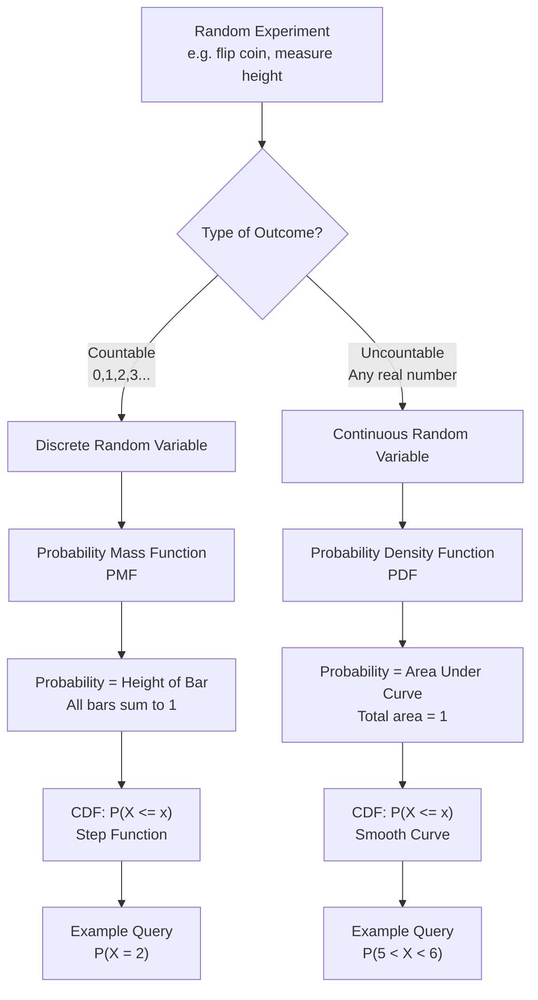

## 1. What We Are Building Toward

Before diving into distributions, understand the chain of reasoning:

1. **Random events** happen in the world (coin flips, heights of people, biscuit production counts)
2. We attach **numbers** to these events → this creates a **random variable**
3. Random variables take **many possible values**
4. We need to know **how likely each value is** → this is a **probability distribution**

A probability distribution is simply a rule that assigns a probability to every possible value (or range of values) a random variable can take.

## 2. Random Variables: The Foundation

### The Core Idea

A random variable is a **function** that maps random outcomes to numbers.

**[Example](https://github.com/Balasubramanian-pg/MSC.-Data-Science-AI/blob/main/Trimester%201/Statistical%20Modelling%20%26%20Inferencing/W07 - Multiple Regression/L0/Module%207%20Introduction%20-%20Multiple%20Linear%20Regression.md#example) — Coin flips:**
- Experiment: Flip a fair coin twice
- Outcomes: {HH, HT, TH, TT}
- Random variable $X$ = "number of heads"
- $X$ can take values: 0, 1, or 2

| Outcome | HH | HT | TH | TT |
|---------|----|----|----|----|
| $X$ (heads) | 2 | 1 | 1 | 0 |

**Key insight:** Before the experiment, $X$ is unknown. After the experiment, $X$ becomes a concrete number. Probability theory lets us reason about $X$ *before* we observe it.

### Discrete vs. Continuous

| Discrete | Continuous |
|----------|------------|
| Countable values | Uncountable values |
| "How many?" | "How much?" |
| Gaps between values | No gaps; infinite possibilities in any interval |
| [Examples](https://github.com/Balasubramanian-pg/MSC.-Data-Science-AI/blob/main/Trimester%201/Statistical%20Modelling%20%26%20Inferencing/W08 - Forecasting & Time Series Analysis/L0/Time%20Series%20Analysis.md#examples): number of heads, biscuits produced, people in a room | [Examples](https://github.com/Balasubramanian-pg/MSC.-Data-Science-AI/blob/main/Trimester%201/Statistical%20Modelling%20%26%20Inferencing/W08 - Forecasting & Time Series Analysis/L0/Time%20Series%20Analysis.md#examples): height, weight, temperature, time |

**Discrete [example](https://github.com/Balasubramanian-pg/MSC.-Data-Science-AI/blob/main/Trimester%201/Statistical%20Modelling%20%26%20Inferencing/W07 - Multiple Regression/L0/Module%207%20Introduction%20-%20Multiple%20Linear%20Regression.md#example):** A factory produces 50, 100, or 200 biscuits. It never produces 105.7 biscuits.

**Continuous [example](https://github.com/Balasubramanian-pg/MSC.-Data-Science-AI/blob/main/Trimester%201/Statistical%20Modelling%20%26%20Inferencing/W07 - Multiple Regression/L0/Module%207%20Introduction%20-%20Multiple%20Linear%20Regression.md#example):** A person's height can be 5.4, 5.41, 5.411, 5.4111... feet. Between any two heights, there are infinitely many possibilities.

## [3. Probability Distributions](https://github.com/Balasubramanian-pg/MSC.-Data-Science-AI/blob/main/Trimester%201/Statistical%20Modelling%20%26%20Inferencing/W01 - Basic Probability & Statistics/L1/Reading%202%20Random%20Variables%20%26%20Distributions.md#3-probability-distributions): The Big Picture

### [Definition](https://github.com/Balasubramanian-pg/MSC.-Data-Science-AI/blob/main/Trimester%201/Statistical%20Modelling%20%26%20Inferencing/W06 - Simple Linear Regression/L2/Residual%20Analysis.md#[definition](https://github.com/Balasubramanian-pg/MSC.-Data-Science-AI/blob/main/Trimester%201/Statistical%20Modelling%20%26%20Inferencing/W06 - Simple Linear Regression/L2/Residual%20Analysis.md#[definition](https://github.com/Balasubramanian-pg/MSC.-Data-Science-AI/blob/main/Trimester%201/Statistical%20Modelling%20%26%20Inferencing/W06 - Simple Linear Regression/L2/Residual%20Analysis.md#[definition](https://github.com/Balasubramanian-pg/MSC.-Data-Science-AI/blob/main/Trimester%201/Statistical%20Modelling%20%26%20Inferencing/W06 - Simple Linear Regression/L2/Residual%20Analysis.md#definition))))

A **probability distribution** describes how probability is spread across all possible values of a random variable.

For every value (or interval) the random variable can take, the distribution tells you:
- **How likely** is that value?
- **What pattern** do the likelihoods follow?

### Two Types of Distributions

**Discrete Probability Distribution**
- Defined by a **[Probability Mass Function (PMF)](https://github.com/Balasubramanian-pg/MSC.-Data-Science-AI/blob/main/Trimester%201/Statistical%20Modelling%20%26%20Inferencing/W01 - Basic Probability & Statistics/L1/Random%20Variables%20%26%20Distributions.md#probability-mass-function-pmf)**
- $P(X = x)$ gives the exact probability of each specific value
- Sum of all [probabilities](https://github.com/Balasubramanian-pg/MSC.-Data-Science-AI/blob/main/Trimester%201/Statistical%20Modelling%20%26%20Inferencing/W01 - Basic Probability & Statistics/L2/Reading%201%20An%20Introduction%20to%20Decision%20Theory.md#probabilities) must equal 1: $\sum_x P(X=x) = 1$

**Continuous Probability Distribution**
- Defined by a **[Probability Density Function (PDF)](https://github.com/Balasubramanian-pg/MSC.-Data-Science-AI/blob/main/Trimester%201/Statistical%20Modelling%20%26%20Inferencing/W01 - Basic Probability & Statistics/L1/Random%20Variables%20%26%20Distributions.md#probability-density-function-pdf)**
- $f(x)$ does NOT give the probability of exactly $x$ (that is always 0 for continuous variables)
- Instead, $f(x)$ gives **density**; probability is area under the curve over an interval
- Total area under the curve must equal 1: $\int_{-\infty}^{\infty} f(x) \, dx = 1$

## 4. Building [Intuition](https://github.com/Balasubramanian-pg/MSC.-Data-Science-AI/blob/main/Trimester%201/Statistical%20Modelling%20%26%20Inferencing/W06 - Simple Linear Regression/L2/Residual%20Analysis.md#[intuition](https://github.com/Balasubramanian-pg/MSC.-Data-Science-AI/blob/main/Trimester%201/Statistical%20Modelling%20%26%20Inferencing/W06 - Simple Linear Regression/L2/Residual%20Analysis.md#[intuition](https://github.com/Balasubramanian-pg/MSC.-Data-Science-AI/blob/main/Trimester%201/Statistical%20Modelling%20%26%20Inferencing/W06 - Simple Linear Regression/L2/Residual%20Analysis.md#[intuition](https://github.com/Balasubramanian-pg/MSC.-Data-Science-AI/blob/main/Trimester%201/Statistical%20Modelling%20%26%20Inferencing/W06 - Simple Linear Regression/L2/Residual%20Analysis.md#intuition))))

### The "Allocation" Mental Model

Imagine you have **1 unit of probability** (like 1 liter of water). A distribution is simply how you pour that water across all possible values of your random variable.

- **Discrete:** You pour discrete drops onto specific points (0, 1, 2, 3...). The size of each drop is $P(X=x)$.
- **Continuous:** You spray a fine mist across a continuous range. The thickness of the mist at point $x$ is the density $f(x)$. The probability of landing in any interval is the amount of mist in that interval.

### Why "Exact Probability = 0" for Continuous Variables

Consider height: What is the probability a randomly selected person is *exactly* 5.5 feet tall?

Not "about 5.5", not "between 5.495 and 5.505", but **exactly** 5.500000...?

Since there are infinitely many possible heights, the probability of hitting any single precise value is infinitesimally small — mathematically, zero. This is why continuous distributions use **intervals** (e.g., $P(5.4 \leq X \leq 5.6)$) rather than point [probabilities](https://github.com/Balasubramanian-pg/MSC.-Data-Science-AI/blob/main/Trimester%201/Statistical%20Modelling%20%26%20Inferencing/W01 - Basic Probability & Statistics/L2/Reading%201%20An%20Introduction%20to%20Decision%20Theory.md#probabilities).

## 5. Mathematical Foundations

### Discrete Distributions: PMF

For a discrete random variable $X$ taking values $x_1, x_2, x_3, \ldots$:

$$
P(X = x_i) = p(x_i)
$$

**Requirements:**
1. $0 \leq p(x_i) \leq 1$ for all $i$
2. $\sum_{i} p(x_i) = 1$

**[Example](https://github.com/Balasubramanian-pg/MSC.-Data-Science-AI/blob/main/Trimester%201/Statistical%20Modelling%20%26%20Inferencing/W07 - Multiple Regression/L0/Module%207%20Introduction%20-%20Multiple%20Linear%20Regression.md#example) — Two coin flips:**

$$
P(X=0) = \frac{1}{4}, \quad P(X=1) = \frac{1}{2}, \quad P(X=2) = \frac{1}{4}
$$

Check: $\frac{1}{4} + \frac{1}{2} + \frac{1}{4} = 1$ ✓

### Continuous Distributions: PDF

For a continuous random variable $X$:

$$
P(a \leq X \leq b) = \int_{a}^{b} f(x) \, dx
$$

**Requirements:**
1. $f(x) \geq 0$ for all $x$
2. $\int_{-\infty}^{\infty} f(x) \, dx = 1$

**Important:** $f(x)$ can be greater than 1. It is a density, not a probability.

### Cumulative Distribution Function (CDF)

Both discrete and continuous distributions share a unified concept: the **CDF**.

$$
F(x) = P(X \leq x)
$$

**Discrete:**
$$
F(x) = \sum_{x_i \leq x} P(X = x_i)
$$

**Continuous:**
$$
F(x) = \int_{-\infty}^{x} f(t) \, dt
$$

**Why CDF matters:** It always gives a true probability (between 0 and 1), works for both types of variables, and makes "greater than" questions easy:
$$
P(X > x) = 1 - F(x)
$$

## 6. Common Discrete Distributions

### Bernoulli Distribution
- **One trial**, two outcomes: success (1) or failure (0)
- $P(X=1) = p$, $P(X=0) = 1-p$

$$
P(X=x) = p^x (1-p)^{1-x}, \quad x \in \{0, 1\}
$$

### Binomial Distribution
- **$n$ independent Bernoulli trials**
- $X$ = number of successes

$$
P(X=k) = \binom{n}{k} p^k (1-p)^{n-k}
$$

Where $\binom{n}{k} = \frac{n!}{k!(n-k)!}$ counts the number of ways to get $k$ successes in $n$ trials.

**Coin flip [intuition](https://github.com/Balasubramanian-pg/MSC.-Data-Science-AI/blob/main/Trimester%201/Statistical%20Modelling%20%26%20Inferencing/W06 - Simple Linear Regression/L2/Residual%20Analysis.md#[intuition](https://github.com/Balasubramanian-pg/MSC.-Data-Science-AI/blob/main/Trimester%201/Statistical%20Modelling%20%26%20Inferencing/W06 - Simple Linear Regression/L2/Residual%20Analysis.md#[intuition](https://github.com/Balasubramanian-pg/MSC.-Data-Science-AI/blob/main/Trimester%201/Statistical%20Modelling%20%26%20Inferencing/W06 - Simple Linear Regression/L2/Residual%20Analysis.md#[intuition](https://github.com/Balasubramanian-pg/MSC.-Data-Science-AI/blob/main/Trimester%201/Statistical%20Modelling%20%26%20Inferencing/W06 - Simple Linear Regression/L2/Residual%20Analysis.md#intuition)))):** Flip a fair coin 10 times. The probability of exactly 6 heads is:
$$
P(X=6) = \binom{10}{6} \left(\frac{1}{2}\right)^6 \left(\frac{1}{2}\right)^4 = 210 \cdot \frac{1}{1024} \approx 0.205
$$

## 7. Common Continuous Distributions

### Uniform Distribution
Every value in interval $[a, b]$ is equally likely.

$$
f(x) = \begin{cases} \frac{1}{b-a} & a \leq x \leq b \\ 0 & \text{otherwise} \end{cases}
$$

### Normal (Gaussian) Distribution
The "bell curve." Central to statistics due to the Central Limit Theorem.

$$
f(x) = \frac{1}{\sigma\sqrt{2\pi}} e^{-[\frac{](https://github.com/Balasubramanian-pg/MSC.-Data-Science-AI/blob/main/Trimester%201/Statistical%20Modelling%20%26%20Inferencing/W04 - Estimation And Hypothesis Testing Cont/L1/Inferences%20for%20Two%20Population%20Means.md#frac)(x-\mu)^2}{2\sigma^2}}
$$

Where:
- $\mu$ = [mean](https://github.com/Balasubramanian-pg/MSC.-Data-Science-AI/blob/main/Trimester%201/Statistical%20Modelling%20%26%20Inferencing/W04 - Estimation And Hypothesis Testing Cont/L2/Testing%20Population%20Proportions.md#mean) (center of the bell)
- $\sigma$ = standard deviation (width of the bell)
- $\sigma^2$ = variance

**Why it appears everywhere:** Sums of many small, independent random effects tend toward normal. Heights, weights, measurement errors, test scores — all often approximately normal.

## 8. Python Implementation: From Simulation to [Visualization](https://github.com/Balasubramanian-pg/MSC.-Data-Science-AI/blob/main/Trimester%201/Statistical%20Modelling%20%26%20Inferencing/W06 - Simple Linear Regression/L2/The%20Coefficient%20of%20Determination%20%28R%C2%B2%29.md#visualization)

```python
import numpy as np
import matplotlib.pyplot as plt
from scipy import stats

## ============================================
## 1. DISCRETE: Binomial Distribution (Coin Flips)
## ============================================

n_trials = 10
p_success = 0.5

## Theoretical PMF
k_values = np.arange(0, n_trials + 1)
pmf_values = stats.binom.pmf(k_values, n_trials, p_success)

print("Binomial PMF (10 fair coin flips):")
for k, prob in zip(k_values, pmf_values):
    print(f"  P(X = {k}) = {prob:.4f}")

## Verify sum equals 1
print(f"\nSum of all probabilities: {np.sum(pmf_values):.6f}")

## Monte Carlo simulation: actually flip coins many times
n_simulations = 100_000
simulated_heads = np.random.binomial(n_trials, p_success, n_simulations)

## Compare simulation to theory
simulated_counts = np.bincount(simulated_heads) / n_simulations

plt.figure(figsize=(12, 5))

plt.subplot(1, 2, 1)
plt.bar(k_values, pmf_values, alpha=0.7, label='Theoretical PMF', color='steelblue')
plt.bar(k_values, simulated_counts[:len(k_values)], alpha=0.5, label='Simulation (100k)', color='orange')
plt.xlabel('Number of Heads (k)')
plt.ylabel('Probability')
plt.title('Binomial Distribution: Theory vs Simulation')
plt.legend()
plt.xticks(k_values)

## ============================================
## 2. CONTINUOUS: Normal Distribution (Heights)
## ============================================

mu = 170  # mean height in cm
sigma = 10  # standard deviation

## Theoretical PDF
x = np.linspace(mu - 4*sigma, mu + 4*sigma, 1000)
pdf_values = stats.norm.pdf(x, mu, sigma)

## Simulate 100,000 heights
simulated_heights = np.random.normal(mu, sigma, 100_000)

plt.subplot(1, 2, 2)
plt.plot(x, pdf_values, 'b-', linewidth=2, label='Theoretical PDF')
plt.hist(simulated_heights, bins=50, density=True, alpha=0.6, color='green', label='Simulation (100k)')
plt.xlabel('Height (cm)')
plt.ylabel('Density')
plt.title('Normal Distribution: Theory vs Simulation')
plt.legend()

plt.tight_layout()
plt.show()

## ============================================
## 3. KEY INSIGHT: Why density > 1 is OK
## ============================================

## For a narrow normal with small sigma, density at peak exceeds 1
narrow_pdf = stats.norm.pdf(x, mu, 2)
print(f"\nPeak density for σ=2: {np.max(narrow_pdf):.4f} (greater than 1!)")
print("This is valid because PDF is density, not probability.")

## Probability is AREA under curve
prob_160_to_180 = stats.norm.cdf(180, mu, sigma) - stats.norm.cdf(160, mu, sigma)
print(f"P(160 < Height < 180) = {prob_160_to_180:.4f}")
```

## 9. Visual [Intuition](https://github.com/Balasubramanian-pg/MSC.-Data-Science-AI/blob/main/Trimester%201/Statistical%20Modelling%20%26%20Inferencing/W06 - Simple Linear Regression/L2/Residual%20Analysis.md#[intuition](https://github.com/Balasubramanian-pg/MSC.-Data-Science-AI/blob/main/Trimester%201/Statistical%20Modelling%20%26%20Inferencing/W06 - Simple Linear Regression/L2/Residual%20Analysis.md#[intuition](https://github.com/Balasubramanian-pg/MSC.-Data-Science-AI/blob/main/Trimester%201/Statistical%20Modelling%20%26%20Inferencing/W06 - Simple Linear Regression/L2/Residual%20Analysis.md#[intuition](https://github.com/Balasubramanian-pg/MSC.-Data-Science-AI/blob/main/Trimester%201/Statistical%20Modelling%20%26%20Inferencing/W06 - Simple Linear Regression/L2/Residual%20Analysis.md#intuition)))): Probability Flow


## 10. [Engineering](https://github.com/Balasubramanian-pg/MSC.-Data-Science-AI/blob/main/Trimester%201/Statistical%20Modelling%20%26%20Inferencing/W03 - Estimation And Hypothesis Testing/L2/Errors%2C%20P-values%2C%20and%20Significance.md#engineering) and Real-World Connections

| Domain | Discrete [Example](https://github.com/Balasubramanian-pg/MSC.-Data-Science-AI/blob/main/Trimester%201/Statistical%20Modelling%20%26%20Inferencing/W07 - Multiple Regression/L0/Module%207%20Introduction%20-%20Multiple%20Linear%20Regression.md#example) | Continuous [Example](https://github.com/Balasubramanian-pg/MSC.-Data-Science-AI/blob/main/Trimester%201/Statistical%20Modelling%20%26%20Inferencing/W07 - Multiple Regression/L0/Module%207%20Introduction%20-%20Multiple%20Linear%20Regression.md#example) |
|--------|-----------------|-------------------|
| **E-commerce** | Items in cart (0, 1, 2, 3...) | Time spent on page |
| **[Manufacturing](https://github.com/Balasubramanian-pg/MSC.-Data-Science-AI/blob/main/Trimester%201/Statistical%20Modelling%20%26%20Inferencing/W03 - Estimation And Hypothesis Testing/L2/Errors%2C%20P-values%2C%20and%20Significance.md#manufacturing)** | Defective units per batch | Weight of each product |
| **Healthcare** | Number of patients admitted | Blood pressure reading |
| **[Finance](https://github.com/Balasubramanian-pg/MSC.-Data-Science-AI/blob/main/Trimester%201/Statistical%20Modelling%20%26%20Inferencing/W04 - Estimation And Hypothesis Testing Cont/L1/Inferences%20for%20Two%20Population%20Variances.md#[finance](https://github.com/Balasubramanian-pg/MSC.-Data-Science-AI/blob/main/Trimester%201/Statistical%20Modelling%20%26%20Inferencing/W06 - Simple Linear Regression/L2/The%20Coefficient%20of%20Determination%20%28R%C2%B2%29.md#finance))** | Number of trades executed | Stock price movement |
| **ML Systems** | Click/no-click (Bernoulli) | Feature normalization (Gaussian) |

### In Machine Learning

- **Classification:** Output is often a Bernoulli or Categorical probability
- **Regression:** Errors often assumed normally distributed
- **Naive Bayes:** Uses probability distributions to model features
- **Anomaly Detection:** Points far in the tails of a distribution are flagged

## 11. Common Beginner Traps

| Mistake | Why It Is Wrong | The Truth |
|---------|----------------|-----------|
| "PDF value > 1 means probability > 1" | Confusing density with probability | PDF is density; only area (integral) is probability |
| "P(X = 5.5) for height" | Applying discrete thinking to continuous | For continuous, $P(X = x) = 0$ always |
| "All distributions are normal" | Overgeneralizing | Many real-world phenomena are skewed, heavy-tailed, or discrete |
| "PMF bars must sum to 1, so PDF curve must too" | Forgetting integral vs sum | PDF integrates to 1; individual values can exceed 1 |
| "Simulation with 100 samples is enough" | Underestimating variance | Monte Carlo needs thousands+ for stable estimates |

## 12. [Key Takeaways](https://github.com/Balasubramanian-pg/MSC.-Data-Science-AI/blob/main/Trimester%201/Statistical%20Modelling%20%26%20Inferencing/W11 - Maximum Likelihood Methods - Maximum Likelihood Methods - Maximum Likelihood Methods - Maximum Likelihood Methods - Maximum Likelihood Methods - Maximum Likelihood Methods - Maximum Likelihood Methods - Maximum Likelihood Methods - Maximum Likelihood Methods - Maximum Likelihood Methods - Maximum Likelihood Methods - Maximum Likelihood Methods/L1/The%20Inverse%20Perspective.md#key-takeaways)

1. **Random variable** = numerical [summary](https://github.com/Balasubramanian-pg/MSC.-Data-Science-AI/blob/main/Trimester%201/Statistical%20Modelling%20%26%20Inferencing/W01 - Basic Probability & Statistics/L2/Reading%202%20Parametric%20vs.%20Non-Parametric%20Methods.md#[summary](https://github.com/Balasubramanian-pg/MSC.-Data-Science-AI/blob/main/Trimester%201/Statistical%20Modelling%20%26%20Inferencing/W07 - Multiple Regression/L0/Module%207%20Introduction%20-%20Multiple%20Linear%20Regression.md#[summary](https://github.com/Balasubramanian-pg/MSC.-Data-Science-AI/blob/main/Trimester%201/Statistical%20Modelling%20%26%20Inferencing/W07 - Multiple Regression/L1/The%20Multiple%20Regression%20Model.md#summary))) of a random experiment
2. **Distribution** = how probability is allocated across all possible values
3. **Discrete** uses PMF ([probabilities](https://github.com/Balasubramanian-pg/MSC.-Data-Science-AI/blob/main/Trimester%201/Statistical%20Modelling%20%26%20Inferencing/W01 - Basic Probability & Statistics/L2/Reading%201%20An%20Introduction%20to%20Decision%20Theory.md#probabilities) at points); **Continuous** uses PDF (density, area = probability)
4. **CDF** unifies both: $F(x) = P(X \leq x)$ always gives a valid probability
5. **Normal distribution** appears everywhere because of the Central Limit Theorem
6. **Simulation** (Monte Carlo) is your friend for building [intuition](https://github.com/Balasubramanian-pg/MSC.-Data-Science-AI/blob/main/Trimester%201/Statistical%20Modelling%20%26%20Inferencing/W06 - Simple Linear Regression/L2/Residual%20Analysis.md#[intuition](https://github.com/Balasubramanian-pg/MSC.-Data-Science-AI/blob/main/Trimester%201/Statistical%20Modelling%20%26%20Inferencing/W06 - Simple Linear Regression/L2/Residual%20Analysis.md#[intuition](https://github.com/Balasubramanian-pg/MSC.-Data-Science-AI/blob/main/Trimester%201/Statistical%20Modelling%20%26%20Inferencing/W06 - Simple Linear Regression/L2/Residual%20Analysis.md#[intuition](https://github.com/Balasubramanian-pg/MSC.-Data-Science-AI/blob/main/Trimester%201/Statistical%20Modelling%20%26%20Inferencing/W06 - Simple Linear Regression/L2/Residual%20Analysis.md#intuition)))) — always verify theory with code

## 13. Next Steps on the Roadmap

```
Random Variables → Probability Distributions → Expectation & Variance
                                              ↓
                              Joint Distributions → Marginal & Conditional
                                              ↓
                              Limit Theorems (LLN, CLT) → Statistical Inference
                                              ↓
                              Maximum Likelihood → Bayesian Methods
```

**Recommended next topics:**
- Expected value and variance (how to summarize a distribution with numbers)
- Joint distributions (when multiple random variables interact)
- Central Limit Theorem (why normal distributions dominate)
- Maximum Likelihood Estimation (fitting distributions to data)
## 14. Recommended Libraries for Practice

| Library                  | Purpose                                 |
| ------------------------ | --------------------------------------- |
| `numpy.random`           | Simulation and sampling                 |
| `scipy.stats`            | PMFs, PDFs, CDFs, and statistical tests |
| `matplotlib` / `seaborn` | [Visualization](https://github.com/Balasubramanian-pg/MSC.-Data-Science-AI/blob/main/Trimester%201/Statistical%20Modelling%20%26%20Inferencing/W06 - Simple Linear Regression/L2/The%20Coefficient%20of%20Determination%20%28R%C2%B2%29.md#visualization)                           |
| `pandas`                 | Real-world data handling                |
| `statsmodels`            | Statistical modeling and inference      |

Tags: #statistics #machine-learning #data-science #statistical-modelling