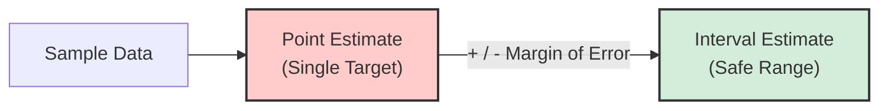

# 1.3.5. Interval Estimation

Because single point estimates are derived from specific finite samples, they are inherently imprecise and highly vulnerable to sampling variability. Confidence intervals upgrade our analysis by quantifying this exact mathematical uncertainty, replacing a single isolated guess with a defined range of highly plausible values for the parameter.

### The Core Concept
A **single guess** (Point Estimate) is usually slightly wrong because it only comes from a small sample. An **interval** (Confidence Interval) adds a mathematical "safe zone" (Margin of Error) to give a range where the true answer likely lives.

### Simple Example
*   **Point Estimate:** "The average pizza delivery takes **exactly 30 minutes**." *(Risky, easily wrong)*
*   **Interval Estimate:** "The average delivery takes **between 25 and 35 minutes**." *(Safe, quantifies uncertainty)*

### Visual Breakdown

### The Formula
At its core, the formula is:
$$\text{Confidence Interval} = \text{Point Estimate} \pm \text{Margin of Error}$$

For a sample mean (average), it looks like this:
$$\bar{x} \pm Z \left( \frac{s}{\sqrt{n}} \right)$$

*   **$\bar{x}$** = Your single guess (Sample Mean)
*   **$Z$** = How confident you want to be (e.g., 95%)
*   **$s$** = How scattered your data is (Standard Deviation)
*   **$n$** = How much data you collected (Sample Size)

<!-- NAVIGATION FOOTER START -->
 

---

[ **Previous File:** 1.3.04. The Central Limit Theorem](./1.3.04.%20The%20Central%20Limit%20Theorem.md) &nbsp;&nbsp;&nbsp;&nbsp;&nbsp;&nbsp; [ **Next File:** 1.3.06. Confidence Interval Structure](./1.3.06.%20Confidence%20Interval%20Structure.md)

<!-- NAVIGATION FOOTER END -->