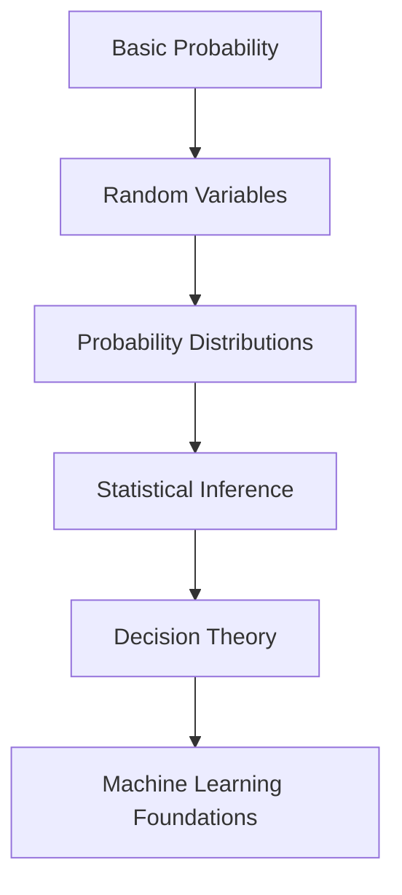

# W01 - Basic Probability & Statistics

Foundational module covering probability theory, random variables, statistical inference, and decision-making principles that later become the backbone of machine learning, Bayesian reasoning, hypothesis testing, and predictive modelling.

Repository:

[MSC Data Science AI - W01 Repository](https://github.com/Balasubramanian-pg/MSC.-Data-Science-AI/tree/main/Trimester%201/Statistical%20Modelling%20%26%20Inferencing/W01%20-%20Basic%20Probability%20%26%20Statistics)

---

# Learning Objectives

This module gradually builds the transition from:

* deterministic thinking → probabilistic thinking
* raw observations → statistical inference
* data description → uncertainty modelling
* intuition → mathematical formalism

By the end of this section, the core goal is to understand:

* how uncertainty is represented mathematically
* how distributions describe real-world processes
* why inference works
* when statistical assumptions fail
* how statistical reasoning powers modern AI systems

---

# Module Structure

```text
W01 - Basic Probability & Statistics
│
├── L0 → Foundations & Module Orientation
├── L1 → Probability, Random Variables & Distributions
├── L2 → Statistical Inference & Decision Theory
└── Probability.py → Practical Python Implementations
```

---

# L0 · Foundations & Orientation

The opening section establishes the mental framework for statistical modelling and inferential thinking.

## Core Themes

* What statistical modelling actually means
* Difference between data and evidence
* Why uncertainty must be quantified
* How inference differs from pure observation
* The role of assumptions in modelling

## Resources

### [Inference & Modelling](https://github.com/Balasubramanian-pg/MSC.-Data-Science-AI/blob/main/Trimester%201/Statistical%20Modelling%20%26%20Inferencing/W01%20-%20Basic%20Probability%20%26%20Statistics/L0/Inference%20%26%20Modelling.md)

Introduces the conceptual bridge between observed data and inferential conclusions. This is effectively the philosophical foundation of statistics.

### [Module Introduction](https://github.com/Balasubramanian-pg/MSC.-Data-Science-AI/blob/main/Trimester%201/Statistical%20Modelling%20%26%20Inferencing/W01%20-%20Basic%20Probability%20%26%20Statistics/L0/Module%20Introduction.pdf)

High-level orientation for the module structure, expectations, and learning trajectory.

---

# L1 · Probability & Distributions

This is where the mathematics of uncertainty begins.

The section moves from simple probability rules into formal random variable theory and probability distributions.

## Key Concepts Covered

### Probability Foundations

* sample spaces
* events
* conditional probability
* independence
* Bayes reasoning
* combinatorics intuition

### Random Variables

Transition from raw events to numerical representations of uncertainty.

Topics include:

* discrete random variables
* continuous random variables
* PMF vs PDF
* expectation
* variance
* covariance intuition

### Probability Distributions

The core statistical distributions used throughout data science and ML:

* Bernoulli
* Binomial
* Poisson
* Uniform
* Gaussian / Normal
* Exponential

These become critical later for:

* regression assumptions
* likelihood estimation
* Bayesian inference
* generative modelling
* anomaly detection

---

## Resources

### [Probability and Distributions (PDF)](https://github.com/Balasubramanian-pg/MSC.-Data-Science-AI/blob/main/Trimester%201/Statistical%20Modelling%20%26%20Inferencing/W01%20-%20Basic%20Probability%20%26%20Statistics/L1/Probability%20and%20Distributions.pdf)

Formal lecture material introducing the mathematical structure of probability distributions and uncertainty modelling.

### [Random Variables & Distributions (PDF)](https://github.com/Balasubramanian-pg/MSC.-Data-Science-AI/blob/main/Trimester%201/Statistical%20Modelling%20%26%20Inferencing/W01%20-%20Basic%20Probability%20%26%20Statistics/L1/Random%20Variables%20%26%20Distributions.pdf)

Focuses on how random variables are constructed and interpreted mathematically.

### [Revision of Basic Probability](https://github.com/Balasubramanian-pg/MSC.-Data-Science-AI/blob/main/Trimester%201/Statistical%20Modelling%20%26%20Inferencing/W01%20-%20Basic%20Probability%20%26%20Statistics/L1/Revision%20of%20Basic%20Probability.pdf)

Useful for rebuilding intuition around foundational probability operations before entering inference-heavy sections.

### [Probability and Distribution](https://github.com/Balasubramanian-pg/MSC.-Data-Science-AI/blob/main/Trimester%201/Statistical%20Modelling%20%26%20Inferencing/W01%20-%20Basic%20Probability%20%26%20Statistics/L1/Probability%20and%20Distribution.md)

Markdown notes version with easier navigation and quick revision value.

### [Random Variables & Distributions](https://github.com/Balasubramanian-pg/MSC.-Data-Science-AI/blob/main/Trimester%201/Statistical%20Modelling%20%26%20Inferencing/W01%20-%20Basic%20Probability%20%26%20Statistics/L1/Random%20Variables%20%26%20Distributions.md)

Companion markdown notes emphasizing conceptual understanding and interpretation.

### [Reading 2 Random Variables & Distributions](https://github.com/Balasubramanian-pg/MSC.-Data-Science-AI/blob/main/Trimester%201/Statistical%20Modelling%20%26%20Inferencing/W01%20-%20Basic%20Probability%20%26%20Statistics/L1/Reading%202%20Random%20Variables%20%26%20Distributions.md)

Additional reinforcement material intended to deepen probabilistic intuition.

### [Reading 3 Common Probability Distributions](https://github.com/Balasubramanian-pg/MSC.-Data-Science-AI/blob/main/Trimester%201/Statistical%20Modelling%20%26%20Inferencing/W01%20-%20Basic%20Probability%20%26%20Statistics/L1/Reading%203%20Common%20Probability%20Distributions.md)

Critical reference material for understanding when specific distributions emerge in real-world systems.

Examples:

* Poisson → event arrivals
* Gaussian → aggregated noise processes
* Exponential → waiting times
* Binomial → repeated trial systems

---

# L2 · Statistical Inference & Decision Theory

This section shifts from describing data to making decisions under uncertainty.

This is where statistics becomes operational.

## Core Ideas

### Statistical Inference

How we infer population-level properties from limited samples.

Key themes:

* estimation
* confidence
* uncertainty propagation
* sampling variability
* inferential assumptions

### Parametric vs Non-Parametric Thinking

One of the most important conceptual splits in statistics.

#### Parametric Methods

Assume a known distributional structure.

Examples:

* linear regression
* Gaussian models
* t-tests

Advantages:

* efficient
* mathematically tractable

Failure mode:

* collapses under violated assumptions

#### Non-Parametric Methods

Avoid strong distribution assumptions.

Examples:

* rank tests
* kernel methods
* bootstrap methods

Advantages:

* flexible
* robust

Tradeoff:

* often computationally heavier
* requires more data

### Decision Theory

Connects statistics with action.

Instead of asking:

> "What is true?"

Decision theory asks:

> "What action minimizes expected loss?"

This becomes foundational later in:

* machine learning optimization
* Bayesian AI
* reinforcement learning
* risk systems

---

## Resources

### [Foundations of Statistical Inference](https://github.com/Balasubramanian-pg/MSC.-Data-Science-AI/blob/main/Trimester%201/Statistical%20Modelling%20%26%20Inferencing/W01%20-%20Basic%20Probability%20%26%20Statistics/L2/Foundations%20of%20Statistical%20Inference.md)

Core inferential framework connecting samples, estimators, and population reasoning.

### [Parametric vs. Non-Parametric 1](https://github.com/Balasubramanian-pg/MSC.-Data-Science-AI/blob/main/Trimester%201/Statistical%20Modelling%20%26%20Inferencing/W01%20-%20Basic%20Probability%20%26%20Statistics/L2/Parametric%20vs.%20Non-Parametric%201.pdf)

Detailed comparison between assumption-heavy and assumption-light statistical frameworks.

### [Reading 1 An Introduction to Decision Theory](https://github.com/Balasubramanian-pg/MSC.-Data-Science-AI/blob/main/Trimester%201/Statistical%20Modelling%20%26%20Inferencing/W01%20-%20Basic%20Probability%20%26%20Statistics/L2/Reading%201%20An%20Introduction%20to%20Decision%20Theory.md)

Introduces utility, loss functions, and rational decision-making under uncertainty.

### [Reading 2 Parametric vs. Non-Parametric Methods](https://github.com/Balasubramanian-pg/MSC.-Data-Science-AI/blob/main/Trimester%201/Statistical%20Modelling%20%26%20Inferencing/W01%20-%20Basic%20Probability%20%26%20Statistics/L2/Reading%202%20Parametric%20vs.%20Non-Parametric%20Methods.md)

Supplementary conceptual reading expanding on modelling assumptions and robustness.

# Python Implementation Layer

## [Probability.py](https://github.com/Balasubramanian-pg/MSC.-Data-Science-AI/blob/main/Trimester%201/Statistical%20Modelling%20%26%20Inferencing/W01%20-%20Basic%20Probability%20%26%20Statistics/Probability.py)

Practical implementation layer likely intended to bridge:

* probability theory
* simulations
* computational statistics
* distribution visualization
* numerical experimentation

This is where abstract probability becomes tangible.

Strong recommendation:
use this file actively alongside the theory material instead of treating it as supplementary.

---

# Recommended Learning Order



# Why This Module Matters

Most students underestimate this module because the mathematics initially appears elementary.

That is a mistake.

Almost every advanced AI or ML system later depends on ideas introduced here:

| Concept                 | Later Appears In                    |
| ----------------------- | ----------------------------------- |
| Probability             | Bayesian AI, uncertainty estimation |
| Distributions           | Generative models, likelihoods      |
| Expectation             | Loss functions, optimization        |
| Variance                | Bias-variance tradeoff              |
| Inference               | Hypothesis testing, ML evaluation   |
| Decision Theory         | Reinforcement learning              |
| Sampling                | Monte Carlo methods                 |
| Conditional Probability | Bayesian networks                   |

This module is not "intro stats."

It is the operating system underneath statistical machine learning.

