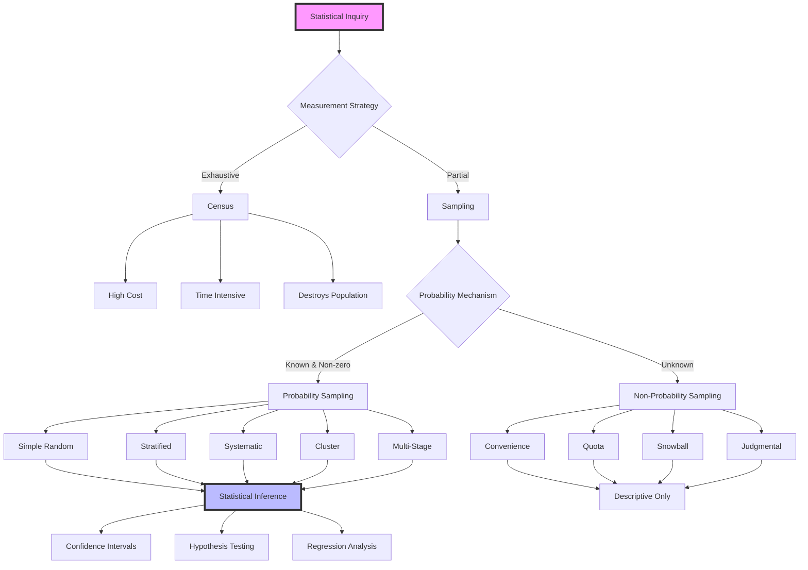
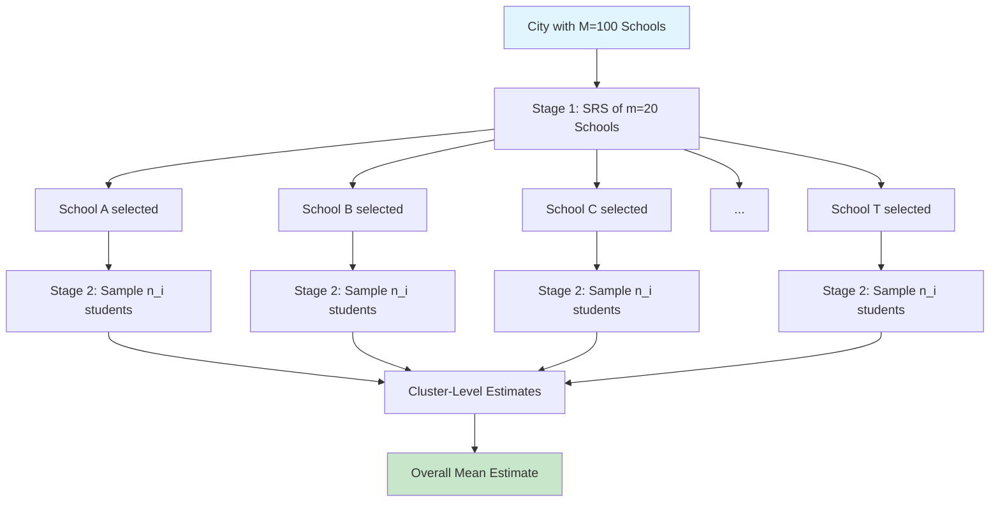
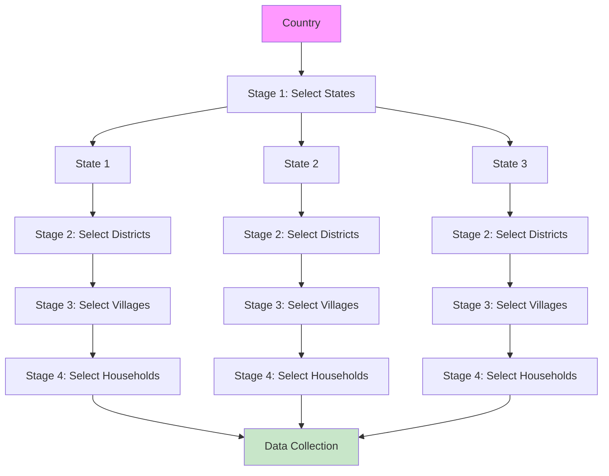
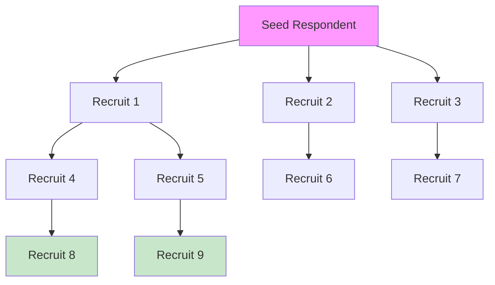
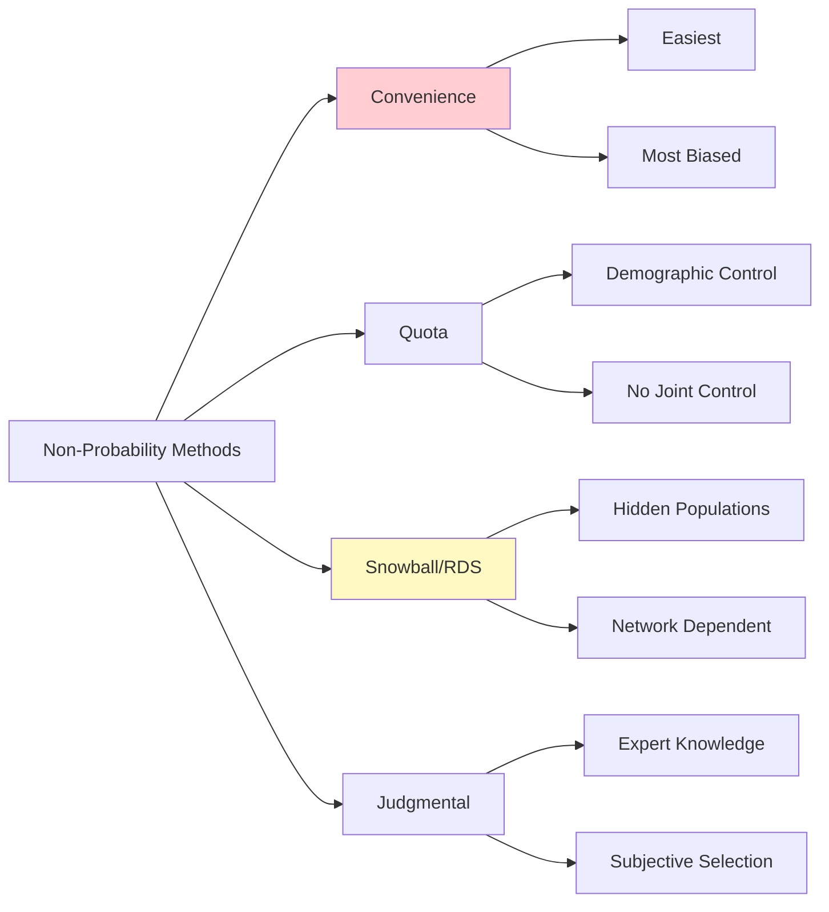
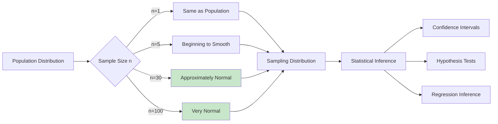
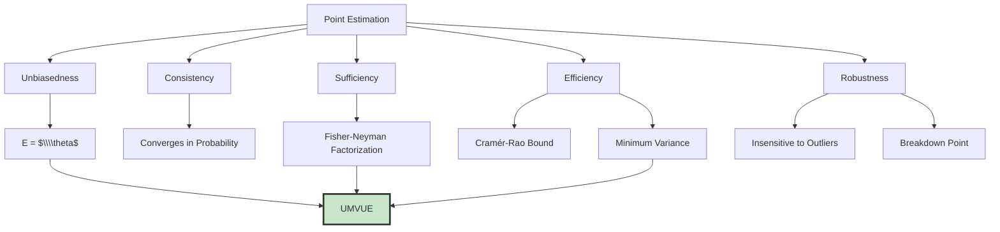
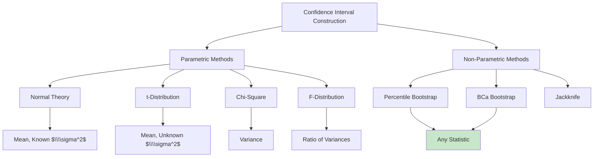

## Table of Contents

1. [Introduction to Sampling Theory](#1-introduction-to-sampling-theory)
2. [Foundational Concepts](#2-foundational-concepts)
3. [Probability Sampling Methods](#3-probability-sampling-methods)
4. [Non-Probability Sampling Methods](#4-non-probability-sampling-methods)
5. [Sampling Distributions and CLT](#5-sampling-distributions)
6. [Point Estimation](#6-point-estimation)
7. [Confidence Intervals](#7-confidence-intervals)
8. [Sample Size Determination](#8-sample-size-determination)
9. [Bias, Variance, and MSE](#9-bias-variance-mse)
10. [Advanced Topics](#10-advanced-topics)
11. [Computational Implementation](#11-computational-implementation)
12. [Case Studies](#12-case-studies)
13. [Appendices](#13-appendices)

---

## 1. Introduction to Sampling Theory

## 1.1 The Soup Analogy: Gateway to Understanding

Imagine standing before a massive pot of soup, simmering gently over an open flame. The pot contains a complex mixture of ingredients. As the chef, you face a critical decision: **How do you determine if the soup is properly seasoned?**

You have two fundamental options:

1. **Exhaustive Consumption:** Pour the entire pot into a container, consume every drop, and render a judgment. This approach, while definitive, is utterly impractical. The soup is destroyed, the effort is immense.

2. **Representative Tasting:** Dip a tablespoon into the pot, ensuring you capture broth, vegetables, and seasonings from various depths. Taste this small portion and extrapolate.

The tablespoon represents a **sample**; the entire pot represents the **population**.

## 1.2 Why Sample? The Practical Imperatives

### 1.2.1 Resource Constraints

Every statistical inquiry consumes resources. For a population of size $N$ and sample of size $n$, the total cost function $TC$ can be modeled as:

$$
TC(N) = \\alpha N + \\beta N^2 + \\gamma
$$

where:
- $\\alpha$ = per-unit linear cost
- $\\beta$ = quadratic coordination overhead
- $\\gamma$ = fixed infrastructure costs

In contrast, the sampling cost function $TC_s$ is:

$$
TC_s(n) = \\alpha n + \\beta_s n^{1.2} + \\gamma_s + \\delta \\sqrt{N}
$$

### 1.2.2 Temporal Constraints

Time operates as a binding constraint. Consider epidemic spread where characteristic time scale $\\tau_c$ is shorter than census completion time $T_{\\text{census}}$.

$$
\\text{Sampling is necessary when: } T_{\\text{sample}} < \\tau_c < T_{\\text{census}}
$$

### 1.2.3 Destructive Testing

If measurement operator $\\mathcal{M}$ satisfies $\\mathcal{M}(u_i) = \\text{measurement}_i$ and $u_i \\rightarrow \\emptyset$, a census is logically impossible.

### 1.2.4 Accessibility Limitations

The observable population $N_{\\text{obs}}$ is a subset of the true population $N_{\\text{true}}$:

$$
N_{\\text{obs}} = \\int_{\\Omega_{\\text{accessible}}} d\\omega \\leq \\int_{\\Omega_{\\text{total}}} d\\omega = N_{\\text{true}}
$$

## 1.3 [The Mathematical Framework](https://github.com/Balasubramanian-pg/MSC.-Data-Science-AI/blob/main/Trimester%201/Statistical%20Modelling%20%26%20Inferencing/W11 - Maximum Likelihood Methods - Maximum Likelihood Methods - Maximum Likelihood Methods - Maximum Likelihood Methods - Maximum Likelihood Methods - Maximum Likelihood Methods - Maximum Likelihood Methods - Maximum Likelihood Methods - Maximum Likelihood Methods - Maximum Likelihood Methods - Maximum Likelihood Methods/L1/Maximum%20Likelihood%20Estimation.md#the-mathematical-framework)

Let $(\\Omega, \\mathcal{F}, P)$ be a probability space where $\\Omega$ is the population, $\\mathcal{F}$ is a $\\sigma$-algebra, and $P$ is the sampling design.

A **sample** $s$ is an element of $\\mathcal{F}$ with $|s| = n \\leq N = |\\Omega|$.

The **inclusion probability** $\\pi_i$ of unit $i$ is:

$$
\\pi_i = P(i \\in s) = \\sum_{s \\ni i} p(s)
$$

For a fixed-size design:

$$
\\sum_{s: |s|=n} p(s) = 1
$$

### 1.3.1 Horvitz-Thompson Estimator

For any population total $Y = \\sum_{i=1}^N y_i$:

$$
\\hat{Y}_{HT} = \\sum_{i \\in s} \\frac{y_i}{\\pi_i}
$$

with design-unbiasedness:

$$
E[\\hat{Y}_{HT}] = \\sum_{s} p(s) \\sum_{i \\in s} \\frac{y_i}{\\pi_i} = \\sum_{i=1}^N y_i \\sum_{s \\ni i} \\frac{p(s)}{\\pi_i} = \\sum_{i=1}^N y_i = Y
$$

## 1.4 Conceptual Architecture



---

## 2. Foundational Concepts

## 2.1 The Population

### 2.1.1 Target vs. Survey Population

- **Target Population ($U$):** The idealized group.
- **Survey Population ($U_{\\text{sur}}$):** The operational accessible subset.

**Coverage Error:**

$$
\\text{Coverage Error} = U \\setminus U_{\\text{sur}} \\cup U_{\\text{sur}} \\setminus U
$$

### 2.1.2 Population Parameters

**Population Total:**
$$
Y = \\sum_{i=1}^N y_i
$$

**Population [Mean](https://github.com/Balasubramanian-pg/MSC.-Data-Science-AI/blob/main/Trimester%201/Statistical%20Modelling%20%26%20Inferencing/W04 - Estimation And Hypothesis Testing Cont/L2/Testing%20Population%20Proportions.md#mean):**
$$
\[\bar{Y}](https://github.com/Balasubramanian-pg/MSC.-Data-Science-AI/blob/main/Trimester%201/Statistical%20Modelling%20%26%20Inferencing/W06 - Simple Linear Regression/L1/The%20Method%20of%20Least%20Squares.md#bary) = \\frac{1}{N} \\sum_{i=1}^N y_i = \\frac{Y}{N}
$$

**Population Variance:**
$$
\\sigma^2 = \\frac{1}{N} \\sum_{i=1}^N (y_i - \[\bar{Y}](https://github.com/Balasubramanian-pg/MSC.-Data-Science-AI/blob/main/Trimester%201/Statistical%20Modelling%20%26%20Inferencing/W06 - Simple Linear Regression/L1/The%20Method%20of%20Least%20Squares.md#bary))^2 = \\frac{1}{N} \\sum_{i=1}^N y_i^2 - \[\bar{Y}](https://github.com/Balasubramanian-pg/MSC.-Data-Science-AI/blob/main/Trimester%201/Statistical%20Modelling%20%26%20Inferencing/W06 - Simple Linear Regression/L1/The%20Method%20of%20Least%20Squares.md#bary)^2
$$

**Corrected Population Variance:**
$$
S^2 = \\frac{1}{N-1} \\sum_{i=1}^N (y_i - \[\bar{Y}](https://github.com/Balasubramanian-pg/MSC.-Data-Science-AI/blob/main/Trimester%201/Statistical%20Modelling%20%26%20Inferencing/W06 - Simple Linear Regression/L1/The%20Method%20of%20Least%20Squares.md#bary))^2 = \\frac{N}{N-1} \\sigma^2
$$

**Population Standard Deviation:**
$$
\\sigma = \\sqrt{\\sigma^2}
$$

**Population Proportion:**
$$
P = \\frac{1}{N} \\sum_{i=1}^N y_i \\quad \\text{where} \\quad y_i \\in \\{0, 1\\}
$$

**Population Covariance:**
$$
\\sigma_{xy} = \\frac{1}{N} \\sum_{i=1}^N (x_i - \\bar{X})(y_i - \[\bar{Y}](https://github.com/Balasubramanian-pg/MSC.-Data-Science-AI/blob/main/Trimester%201/Statistical%20Modelling%20%26%20Inferencing/W06 - Simple Linear Regression/L1/The%20Method%20of%20Least%20Squares.md#bary))
$$

**Population Correlation:**
$$
\\rho = \[\frac{](https://github.com/Balasubramanian-pg/MSC.-Data-Science-AI/blob/main/Trimester%201/Statistical%20Modelling%20%26%20Inferencing/W04 - Estimation And Hypothesis Testing Cont/L1/Inferences%20for%20Two%20Population%20Means.md#frac)\\sigma_{xy}}{\\sigma_x \\sigma_y}
$$

### 2.1.3 Population Moments

$k$-th raw moment:
$$
\\mu_k' = \\frac{1}{N} \\sum_{i=1}^N y_i^k
$$

$k$-th central moment:
$$
\\mu_k = \\frac{1}{N} \\sum_{i=1}^N (y_i - \[\bar{Y}](https://github.com/Balasubramanian-pg/MSC.-Data-Science-AI/blob/main/Trimester%201/Statistical%20Modelling%20%26%20Inferencing/W06 - Simple Linear Regression/L1/The%20Method%20of%20Least%20Squares.md#bary))^k
$$

[Skewness](https://github.com/Balasubramanian-pg/MSC.-Data-Science-AI/blob/main/Trimester%201/Statistical%20Modelling%20%26%20Inferencing/W06 - Simple Linear Regression/L2/Residual%20Analysis.md#skewness):
$$
\\gamma_1 = \[\frac{](https://github.com/Balasubramanian-pg/MSC.-Data-Science-AI/blob/main/Trimester%201/Statistical%20Modelling%20%26%20Inferencing/W04 - Estimation And Hypothesis Testing Cont/L1/Inferences%20for%20Two%20Population%20Means.md#frac)\\mu_3}{\\sigma^3} = \[\frac{](https://github.com/Balasubramanian-pg/MSC.-Data-Science-AI/blob/main/Trimester%201/Statistical%20Modelling%20%26%20Inferencing/W04 - Estimation And Hypothesis Testing Cont/L1/Inferences%20for%20Two%20Population%20Means.md#frac)\\mu_3}{(\\mu_2)^{3/2}}
$$

Kurtosis:
$$
\\gamma_2 = \[\frac{](https://github.com/Balasubramanian-pg/MSC.-Data-Science-AI/blob/main/Trimester%201/Statistical%20Modelling%20%26%20Inferencing/W04 - Estimation And Hypothesis Testing Cont/L1/Inferences%20for%20Two%20Population%20Means.md#frac)\\mu_4}{\\sigma^4} - 3 = \[\frac{](https://github.com/Balasubramanian-pg/MSC.-Data-Science-AI/blob/main/Trimester%201/Statistical%20Modelling%20%26%20Inferencing/W04 - Estimation And Hypothesis Testing Cont/L1/Inferences%20for%20Two%20Population%20Means.md#frac)\\mu_4}{\\mu_2^2} - 3
$$

## 2.2 Parameter Hierarchy

```mermaid
graph LR
    A[Population Parameters] --> B[Location]
    A --> C[Dispersion]
    A --> D[Shape]
    A --> E[Association]
    B --> B1[Mean: $\\\\bar{Y}$]
    B --> B2[Median: $M$]
    B --> B3[Mode]
    C --> C1[Variance: $\\\\sigma^2$]
    C --> C2[SD: $\\\\sigma$]
    C --> C3[Range: $R$]
    D --> D1[Skewness: $\\\\gamma_1$]
    D --> D2[Kurtosis: $\\\\gamma_2$]
    E --> E1[Covariance: $\\\\sigma_{xy}$]
    E --> E2[Correlation: $\\\\rho$]
```

## 2.3 The Sample

### 2.3.1 Sample Statistics as Random Variables

**Sample [Mean](https://github.com/Balasubramanian-pg/MSC.-Data-Science-AI/blob/main/Trimester%201/Statistical%20Modelling%20%26%20Inferencing/W04 - Estimation And Hypothesis Testing Cont/L2/Testing%20Population%20Proportions.md#mean):**
$$
\[\bar{y}](https://github.com/Balasubramanian-pg/MSC.-Data-Science-AI/blob/main/Trimester%201/Statistical%20Modelling%20%26%20Inferencing/W06 - Simple Linear Regression/L1/The%20Method%20of%20Least%20Squares.md#bary) = \\frac{1}{n} \\sum_{i=1}^n y_i
$$

**Sample Variance (Bessel-corrected):**
$$
s^2 = \\frac{1}{n-1} \\sum_{i=1}^n (y_i - \[\bar{y}](https://github.com/Balasubramanian-pg/MSC.-Data-Science-AI/blob/main/Trimester%201/Statistical%20Modelling%20%26%20Inferencing/W06 - Simple Linear Regression/L1/The%20Method%20of%20Least%20Squares.md#bary))^2 = \\frac{1}{n-1} \\left[ \\sum_{i=1}^n y_i^2 - n\\bar{y}^2 \\right]
$$

Unbiasedness property:
$$
E[s^2] = S^2
$$

**Sample Standard Deviation:**
$$
s = \\sqrt{s^2}
$$

**Sample Proportion:**
$$
p = \\frac{1}{n} \\sum_{i=1}^n y_i
$$

**Sample Covariance:**
$$
s_{xy} = \\frac{1}{n-1} \\sum_{i=1}^n (x_i - \\bar{x})(y_i - \[\bar{y}](https://github.com/Balasubramanian-pg/MSC.-Data-Science-AI/blob/main/Trimester%201/Statistical%20Modelling%20%26%20Inferencing/W06 - Simple Linear Regression/L1/The%20Method%20of%20Least%20Squares.md#bary))
$$

**Sample Correlation:**
$$
r = \\frac{s_{xy}}{s_x s_y}
$$

### 2.3.2 The Estimation Framework

**Estimator:**
$$
\\hat{\\theta} = g(y_1, y_2, \\ldots, y_n)
$$

## 2.4 Philosophy of Inductive Inference

$$
\\begin{aligned}
& \\text{Premise 1:} && \\text{Sample } s \\text{ selected via design } p(\\cdot) \\\\
& \\text{Premise 2:} && \\text{Statistic } \\hat{\\theta}(s) \\text{ calculated} \\\\
& \\text{Premise 3:} && \\text{Design ensures representativeness} \\\\
& \\text{Conclusion:} && \\hat{\\theta}(s) \\approx \\theta \\text{ with quantifiable uncertainty}
\\end{aligned}
$$

**[Standard Error](https://github.com/Balasubramanian-pg/MSC.-Data-Science-AI/blob/main/Trimester%201/Statistical%20Modelling%20%26%20Inferencing/W04 - Estimation And Hypothesis Testing Cont/L2/Testing%20Population%20Proportions.md#standard-error):** $SE(\\hat{\\theta}) = \\sqrt{Var(\\hat{\\theta})}$

**Confidence Interval:** $CI = \\hat{\\theta} \\pm z_{\\alpha/2} \\cdot SE(\\hat{\\theta})$

**Margin of Error:** $ME = z_{\\alpha/2} \\cdot SE(\\hat{\\theta})$

### 2.4.1 Soup Analogy Formalized

Population [mean](https://github.com/Balasubramanian-pg/MSC.-Data-Science-AI/blob/main/Trimester%201/Statistical%20Modelling%20%26%20Inferencing/W04 - Estimation And Hypothesis Testing Cont/L2/Testing%20Population%20Proportions.md#mean) flavor:
$$
\[\bar{Y}](https://github.com/Balasubramanian-pg/MSC.-Data-Science-AI/blob/main/Trimester%201/Statistical%20Modelling%20%26%20Inferencing/W06 - Simple Linear Regression/L1/The%20Method%20of%20Least%20Squares.md#bary) = \\frac{1}{N} \\sum_{i=1}^N y_i
$$

Sample estimate:
$$
\[\bar{y}](https://github.com/Balasubramanian-pg/MSC.-Data-Science-AI/blob/main/Trimester%201/Statistical%20Modelling%20%26%20Inferencing/W06 - Simple Linear Regression/L1/The%20Method%20of%20Least%20Squares.md#bary) = \\frac{1}{n} \\sum_{i \\in s} y_i
$$

With perfect randomization:
$$
E[\\bar{y}] = \[\bar{Y}](https://github.com/Balasubramanian-pg/MSC.-Data-Science-AI/blob/main/Trimester%201/Statistical%20Modelling%20%26%20Inferencing/W06 - Simple Linear Regression/L1/The%20Method%20of%20Least%20Squares.md#bary) \\quad \\text{and} \\quad Var(\[\bar{y}](https://github.com/Balasubramanian-pg/MSC.-Data-Science-AI/blob/main/Trimester%201/Statistical%20Modelling%20%26%20Inferencing/W06 - Simple Linear Regression/L1/The%20Method%20of%20Least%20Squares.md#bary)) = \\left(\\frac{N-n}{N-1}\\right) \[\frac{](https://github.com/Balasubramanian-pg/MSC.-Data-Science-AI/blob/main/Trimester%201/Statistical%20Modelling%20%26%20Inferencing/W04 - Estimation And Hypothesis Testing Cont/L1/Inferences%20for%20Two%20Population%20Means.md#frac)\\sigma^2}{n}
$$

---

## 3. Probability Sampling Methods

## 3.1 Simple [Random Sampling](https://github.com/Balasubramanian-pg/MSC.-Data-Science-AI/blob/main/Trimester%201/Statistical%20Modelling%20%26%20Inferencing/W04 - Estimation And Hypothesis Testing Cont/L2/Reading%20Material%20The%20Chi-Square%20Test%20of%20Independence.md#random-sampling) (SRS)

### 3.1.1 [Definition](https://github.com/Balasubramanian-pg/MSC.-Data-Science-AI/blob/main/Trimester%201/Statistical%20Modelling%20%26%20Inferencing/W01 - Basic Probability & Statistics/L1/Probability%20and%20Distribution.md#[definition](https://github.com/Balasubramanian-pg/MSC.-Data-Science-AI/blob/main/Trimester%201/Statistical%20Modelling%20%26%20Inferencing/W06 - Simple Linear Regression/L2/Residual%20Analysis.md#[definition](https://github.com/Balasubramanian-pg/MSC.-Data-Science-AI/blob/main/Trimester%201/Statistical%20Modelling%20%26%20Inferencing/W06 - Simple Linear Regression/L2/Residual%20Analysis.md#[definition](https://github.com/Balasubramanian-pg/MSC.-Data-Science-AI/blob/main/Trimester%201/Statistical%20Modelling%20%26%20Inferencing/W06 - Simple Linear Regression/L2/Residual%20Analysis.md#[definition](https://github.com/Balasubramanian-pg/MSC.-Data-Science-AI/blob/main/Trimester%201/Statistical%20Modelling%20%26%20Inferencing/W06 - Simple Linear Regression/L2/Residual%20Analysis.md#definition)))))

SRSWOR: Every possible combination of $n$ units has equal selection probability.

Number of possible samples:
$$
\\binom{N}{n} = \\frac{N!}{n!(N-n)!}
$$

Design probability:
$$
p(s) = \\frac{1}{\\binom{N}{n}}
$$

### 3.1.2 Inclusion [Probabilities](https://github.com/Balasubramanian-pg/MSC.-Data-Science-AI/blob/main/Trimester%201/Statistical%20Modelling%20%26%20Inferencing/W01 - Basic Probability & Statistics/L2/Reading%201%20An%20Introduction%20to%20Decision%20Theory.md#probabilities)

First-order:
$$
\\pi_i = \\frac{n}{N}
$$

Second-order:
$$
\\pi_{ij} = \\frac{n(n-1)}{N(N-1)} \\quad \\text{for } i \\neq j
$$

### 3.1.3 Estimation Theory

**Unbiased [Mean](https://github.com/Balasubramanian-pg/MSC.-Data-Science-AI/blob/main/Trimester%201/Statistical%20Modelling%20%26%20Inferencing/W04 - Estimation And Hypothesis Testing Cont/L2/Testing%20Population%20Proportions.md#mean) Estimator:**
$$
\\hat{\[\bar{Y}](https://github.com/Balasubramanian-pg/MSC.-Data-Science-AI/blob/main/Trimester%201/Statistical%20Modelling%20%26%20Inferencing/W06 - Simple Linear Regression/L1/The%20Method%20of%20Least%20Squares.md#bary)}_{SRS} = \[\bar{y}](https://github.com/Balasubramanian-pg/MSC.-Data-Science-AI/blob/main/Trimester%201/Statistical%20Modelling%20%26%20Inferencing/W06 - Simple Linear Regression/L1/The%20Method%20of%20Least%20Squares.md#bary) = \\frac{1}{n} \\sum_{i \\in s} y_i
$$

**Variance of Sample [Mean](https://github.com/Balasubramanian-pg/MSC.-Data-Science-AI/blob/main/Trimester%201/Statistical%20Modelling%20%26%20Inferencing/W04 - Estimation And Hypothesis Testing Cont/L2/Testing%20Population%20Proportions.md#mean):**
$$
Var(\[\bar{y}](https://github.com/Balasubramanian-pg/MSC.-Data-Science-AI/blob/main/Trimester%201/Statistical%20Modelling%20%26%20Inferencing/W06 - Simple Linear Regression/L1/The%20Method%20of%20Least%20Squares.md#bary)) = \\left(\\frac{N-n}{N-1}\\right) \[\frac{](https://github.com/Balasubramanian-pg/MSC.-Data-Science-AI/blob/main/Trimester%201/Statistical%20Modelling%20%26%20Inferencing/W04 - Estimation And Hypothesis Testing Cont/L1/Inferences%20for%20Two%20Population%20Means.md#frac)\\sigma^2}{n} = \\left(1 - \\frac{n}{N}\\right) \\frac{S^2}{n}
$$

**Unbiased Variance Estimator:**
$$
\\widehat{Var}(\[\bar{y}](https://github.com/Balasubramanian-pg/MSC.-Data-Science-AI/blob/main/Trimester%201/Statistical%20Modelling%20%26%20Inferencing/W06 - Simple Linear Regression/L1/The%20Method%20of%20Least%20Squares.md#bary)) = \\left(1 - \\frac{n}{N}\\right) \\frac{s^2}{n}
$$

**Confidence Interval:**
$$
CI_{1-\\alpha} = \[\bar{y}](https://github.com/Balasubramanian-pg/MSC.-Data-Science-AI/blob/main/Trimester%201/Statistical%20Modelling%20%26%20Inferencing/W06 - Simple Linear Regression/L1/The%20Method%20of%20Least%20Squares.md#bary) \\pm t_{\\alpha/2, n-1} \\sqrt{\\left(1 - \\frac{n}{N}\\right) \\frac{s^2}{n}}
$$

**Population Total:**
$$
\\hat{Y} = N\[\bar{y}](https://github.com/Balasubramanian-pg/MSC.-Data-Science-AI/blob/main/Trimester%201/Statistical%20Modelling%20%26%20Inferencing/W06 - Simple Linear Regression/L1/The%20Method%20of%20Least%20Squares.md#bary) = \\frac{N}{n} \\sum_{i \\in s} y_i
$$

**Variance of Total:**
$$
Var(\\hat{Y}) = N^2 \\left(1 - \\frac{n}{N}\\right) \\frac{S^2}{n}
$$

**Population Proportion:**
$$
\\hat{P} = p = \\frac{1}{n} \\sum_{i \\in s} y_i
$$

**Variance of Proportion:**
$$
Var(p) = \\left(1 - \\frac{n}{N}\\right) \\frac{P(1-P)}{n-1} \\approx \\left(1 - \\frac{n}{N}\\right) \\frac{p(1-p)}{n-1}
$$

### 3.1.4 SRS With Replacement (SRSWR)

Number of ordered samples: $N^n$

Variance:
$$
Var(\\bar{y}_{wr}) = \[\frac{](https://github.com/Balasubramanian-pg/MSC.-Data-Science-AI/blob/main/Trimester%201/Statistical%20Modelling%20%26%20Inferencing/W04 - Estimation And Hypothesis Testing Cont/L1/Inferences%20for%20Two%20Population%20Means.md#frac)\\sigma^2}{n} = \\frac{N-1}{N} \\frac{S^2}{n}
$$

Efficiency ratio:
$$
\\text{Efficiency} = \\frac{Var(\\bar{y}_{wr})}{Var(\\bar{y}_{wor})} = \\frac{N-1}{N-n} > 1
$$

### 3.1.5 Numerical [Example](https://github.com/Balasubramanian-pg/MSC.-Data-Science-AI/blob/main/Trimester%201/Statistical%20Modelling%20%26%20Inferencing/W07 - Multiple Regression/L0/Module%207%20Introduction%20-%20Multiple%20Linear%20Regression.md#example): University GPA

**Given:** $N = 10,000$, $n = 100$, $\[\bar{y}](https://github.com/Balasubramanian-pg/MSC.-Data-Science-AI/blob/main/Trimester%201/Statistical%20Modelling%20%26%20Inferencing/W06 - Simple Linear Regression/L1/The%20Method%20of%20Least%20Squares.md#bary) = 3.42$, $s^2 = 0.25$

Sampling fraction: $f = 100/10000 = 0.01$

FPC: $1 - f = 0.99$

[Standard error](https://github.com/Balasubramanian-pg/MSC.-Data-Science-AI/blob/main/Trimester%201/Statistical%20Modelling%20%26%20Inferencing/W04 - Estimation And Hypothesis Testing Cont/L2/Testing%20Population%20Proportions.md#standard-error):
$$
SE(\[\bar{y}](https://github.com/Balasubramanian-pg/MSC.-Data-Science-AI/blob/main/Trimester%201/Statistical%20Modelling%20%26%20Inferencing/W06 - Simple Linear Regression/L1/The%20Method%20of%20Least%20Squares.md#bary)) = \\sqrt{0.99 \\times \\frac{0.25}{100}} = \\sqrt{0.002475} \\approx 0.04975
$$

95% CI:
$$
CI = 3.42 \\pm 1.96 \\times 0.04975 = 3.42 \\pm 0.0975 = [3.3225, 3.5175]
$$

### 3.1.6 SRS Process Flow

```mermaid
flowchart LR
    A[Population N=10000] --> B{Assign IDs 1-10000}
    B --> C[Random Number Generator]
    C --> D[Select n=100 unique IDs]
    D --> E[Locate Units]
    E --> F[Collect Data y_i]
    F --> G[Compute Statistics]
    G --> H[Sample Mean $\\\\bar{y}$]
    G --> I[Sample Variance $s^2$]
    G --> J[Standard Error SE]
    J --> K[Confidence Interval]
    style A fill:#e1f5ff
    style K fill:#c8e6c9
```

## 3.2 Stratified [Random Sampling](https://github.com/Balasubramanian-pg/MSC.-Data-Science-AI/blob/main/Trimester%201/Statistical%20Modelling%20%26%20Inferencing/W04 - Estimation And Hypothesis Testing Cont/L2/Reading%20Material%20The%20Chi-Square%20Test%20of%20Independence.md#random-sampling)

### 3.2.1 Conceptual Foundation

Population partitioned into $H$ mutually exclusive strata $U_1, U_2, \\ldots, U_H$:

$$
\\bigcup_{h=1}^H U_h = U \\quad \\text{and} \\quad U_h \\cap U_k = \\emptyset \\text{ for } h \\neq k
$$

With $\\sum_{h=1}^H N_h = N$.

### 3.2.2 [Variance Decomposition](https://github.com/Balasubramanian-pg/MSC.-Data-Science-AI/blob/main/Trimester%201/Statistical%20Modelling%20%26%20Inferencing/W06 - Simple Linear Regression/L2/The%20Coefficient%20of%20Determination%20%28R%C2%B2%29.md#variance-decomposition)

Total [variance decomposition](https://github.com/Balasubramanian-pg/MSC.-Data-Science-AI/blob/main/Trimester%201/Statistical%20Modelling%20%26%20Inferencing/W06 - Simple Linear Regression/L2/The%20Coefficient%20of%20Determination%20%28R%C2%B2%29.md#variance-decomposition):

$$
\\sigma^2 = \\underbrace{\\sum_{h=1}^H W_h \\sigma_h^2}_{\\text{Within}} + \\underbrace{\\sum_{h=1}^H W_h (\\bar{Y}_h - \[\bar{Y}](https://github.com/Balasubramanian-pg/MSC.-Data-Science-AI/blob/main/Trimester%201/Statistical%20Modelling%20%26%20Inferencing/W06 - Simple Linear Regression/L1/The%20Method%20of%20Least%20Squares.md#bary))^2}_{\\text{Between}}
$$

where $W_h = N_h/N$.

### 3.2.3 Allocation Methods

**Proportional Allocation:**
$$
n_h = n \\cdot \\frac{N_h}{N} = n \\cdot W_h
$$

Variance under proportional allocation:
$$
Var(\\bar{y}_{st})_{prop} = \\sum_{h=1}^H W_h^2 \\left(1 - \\frac{n_h}{N_h}\\right) \\frac{S_h^2}{n_h}
$$

**Neyman (Optimal) Allocation:**
$$
n_h = n \\cdot \\frac{W_h S_h}{\\sum_{k=1}^H W_k S_k} = n \\cdot \\frac{N_h S_h}{\\sum_{k=1}^H N_k S_k}
$$

Minimum variance:
$$
Var(\\bar{y}_{st})_{Neyman} = \\frac{1}{n} \\left(\\sum_{h=1}^H W_h S_h\\right)^2 - \\frac{1}{N} \\sum_{h=1}^H W_h S_h^2
$$

**Cost-Optimal Allocation:**

Cost function:
$$
C = c_0 + \\sum_{h=1}^H c_h n_h
$$

Optimal allocation:
$$
n_h = \[\frac{](https://github.com/Balasubramanian-pg/MSC.-Data-Science-AI/blob/main/Trimester%201/Statistical%20Modelling%20%26%20Inferencing/W04 - Estimation And Hypothesis Testing Cont/L1/Inferences%20for%20Two%20Population%20Means.md#frac)(C - c_0) W_h S_h / \\sqrt{c_h}}{\\sum_{k=1}^H W_k S_k \\sqrt{c_k}}
$$

Or for fixed $n$:
$$
n_h = n \\cdot \\frac{W_h S_h / \\sqrt{c_h}}{\\sum_{k=1}^H W_k S_k / \\sqrt{c_k}}
$$

### 3.2.4 Estimation

**Stratified [Mean](https://github.com/Balasubramanian-pg/MSC.-Data-Science-AI/blob/main/Trimester%201/Statistical%20Modelling%20%26%20Inferencing/W04 - Estimation And Hypothesis Testing Cont/L2/Testing%20Population%20Proportions.md#mean):**
$$
\\bar{y}_{st} = \\sum_{h=1}^H W_h \\bar{y}_h = \\sum_{h=1}^H \\frac{N_h}{N} \\cdot \\frac{1}{n_h} \\sum_{i \\in s_h} y_{hi}
$$

**Variance:**
$$
Var(\\bar{y}_{st}) = \\sum_{h=1}^H W_h^2 \\left(1 - \\frac{n_h}{N_h}\\right) \\frac{S_h^2}{n_h}
$$

**Variance Estimator:**
$$
\\widehat{Var}(\\bar{y}_{st}) = \\sum_{h=1}^H W_h^2 \\left(1 - \\frac{n_h}{N_h}\\right) \\frac{s_h^2}{n_h}
$$

**Population Total:**
$$
\\hat{Y}_{st} = N \\bar{y}_{st} = \\sum_{h=1}^H N_h \\bar{y}_h
$$

### 3.2.5 Gain in Precision

Relative Efficiency:
$$
RE = \\frac{Var(\\bar{y}_{SRS})}{Var(\\bar{y}_{st})}
$$

Under proportional allocation with small $n/N$:
$$
RE \\approx \\frac{S^2}{\\sum_{h=1}^H W_h S_h^2} = \[\frac{](https://github.com/Balasubramanian-pg/MSC.-Data-Science-AI/blob/main/Trimester%201/Statistical%20Modelling%20%26%20Inferencing/W04 - Estimation And Hypothesis Testing Cont/L1/Inferences%20for%20Two%20Population%20Means.md#frac)\\sigma^2_{\\text{total}}}{\\sigma^2_{\\text{within}}}
$$

### 3.2.6 [Example](https://github.com/Balasubramanian-pg/MSC.-Data-Science-AI/blob/main/Trimester%201/Statistical%20Modelling%20%26%20Inferencing/W07 - Multiple Regression/L0/Module%207%20Introduction%20-%20Multiple%20Linear%20Regression.md#example): Height by Region

| Stratum | Region | $N_h$ (M) | $W_h$ | $S_h$ (cm) | $n_h$ (prop) | $n_h$ (Neyman) |
|:---|:---|:---:|:---:|:---:|:---:|:---:|
| 1 | North | 350 | 0.25 | 6.2 | 25 | 28 |
| 2 | South | 280 | 0.20 | 5.8 | 20 | 21 |
| 3 | East | 420 | 0.30 | 7.1 | 30 | 38 |
| 4 | West | 210 | 0.15 | 5.5 | 15 | 16 |
| 5 | Central | 140 | 0.10 | 6.8 | 10 | 17 |
| **Total** | | **1400** | **1.00** | | **100** | **120** |

Stratified [mean](https://github.com/Balasubramanian-pg/MSC.-Data-Science-AI/blob/main/Trimester%201/Statistical%20Modelling%20%26%20Inferencing/W04 - Estimation And Hypothesis Testing Cont/L2/Testing%20Population%20Proportions.md#mean) calculation:
$$
\\bar{y}_{st} = 0.25(165.2) + 0.20(162.8) + 0.30(168.1) + 0.15(164.5) + 0.10(166.9) = 165.43 \\text{ cm}
$$

### 3.2.7 Stratified Sampling Diagram

```mermaid
graph TD
    A[Population N=1400M] --> B[Stratification by Region]
    B --> C1[North: N1=350M]
    B --> C2[South: N2=280M]
    B --> C3[East: N3=420M]
    B --> C4[West: N4=210M]
    B --> C5[Central: N5=140M]
    C1 --> D1[SRS within Stratum]
    C2 --> D2[SRS within Stratum]
    C3 --> D3[SRS within Stratum]
    C4 --> D4[SRS within Stratum]
    C5 --> D5[SRS within Stratum]
    D1 --> E1[Sample n1]
    D2 --> E2[Sample n2]
    D3 --> E3[Sample n3]
    D4 --> E4[Sample n4]
    D5 --> E5[Sample n5]
    E1 --> F[Weighted Mean]
    E2 --> F
    E3 --> F
    E4 --> F
    E5 --> F
    F --> G[Stratified Estimate $\\\\bar{y}_{st}$]
    style G fill:#c8e6c9,stroke:#333,stroke-width:3px
```

## 3.3 Systematic Sampling

### 3.3.1 Mechanics

Select every $k$-th unit from a randomly ordered or listed population, where $k = N/n$ (sampling interval).

1. Choose random start $r$ from $\\{1, 2, \\ldots, k\\}$
2. Select units: $r, r+k, r+2k, \\ldots, r+(n-1)k$

### 3.3.2 Circular Systematic Sampling

For non-integer $k$, use circular arrangement:

$$
r_j = [(r + (j-1)k) \\mod N] + 1
$$

### 3.3.3 Variance Estimation Challenge

Systematic sampling is equivalent to selecting one cluster from $k$ possible clusters, each of size $n$.

**Variance under random ordering:**

If the population is randomly ordered, systematic sampling behaves like SRS:

$$
Var(\\bar{y}_{sys}) \\approx \\left(1 - \\frac{n}{N}\\right) \\frac{S^2}{n}
$$

**Variance under linear trend:**

If $y_i = a + bi + \\epsilon_i$:

$$
Var(\\bar{y}_{sys}) \\approx \[\frac{](https://github.com/Balasubramanian-pg/MSC.-Data-Science-AI/blob/main/Trimester%201/Statistical%20Modelling%20%26%20Inferencing/W04 - Estimation And Hypothesis Testing Cont/L1/Inferences%20for%20Two%20Population%20Means.md#frac)(N-n)b^2(k^2-1)}{12N}
$$

**Variance under periodic variation:**

If the period $T$ coincides with $k$, variance can be severely inflated or deflated.

### 3.3.4 Comparison with SRS and Stratified

| Scenario | SRS | Systematic | Stratified |
|:---|:---:|:---:|:---:|
| Random order | Baseline | ~SRS | ~SRS |
| Linear trend | Higher Var | Lower Var | Lowest Var |
| Periodic (T=k) | Baseline | Very High | Baseline |
| Autocorrelated | Baseline | Lower Var | Lower Var |

### 3.3.5 Systematic Sampling Process

```mermaid
flowchart TD
    A[Population Listed 1 to N] --> B[Calculate k = floor(N/n)]
    B --> C[Generate Random Start r ~ U(1,k)]
    C --> D[Select r, r+k, r+2k, ...]
    D --> E[Collect Data]
    E --> F[Compute Mean]
    F --> G{Ordering?}
    G -->|Random| H[Var ~ SRS]
    G -->|Trend| I[Var < SRS]
    G -->|Periodic| J[Var unpredictable]
    style A fill:#e1f5ff
    style H fill:#c8e6c9
    style I fill:#fff9c4
    style J fill:#ffcdd2
```

## 3.4 Cluster Sampling

### 3.4.1 Rationale and Structure

When no reliable list of individuals exists but groups (clusters) are well-defined, we sample clusters and observe all (or a sample of) units within selected clusters.

Population divided into $M$ clusters, each containing $N_i$ units.

$$
\\sum_{i=1}^M N_i = N
$$

### 3.4.2 One-Stage Cluster Sampling (Equal Clusters)

Select $m$ clusters from $M$ via SRS. Measure all $N$ units in each selected cluster (when $N_i = \\bar{N}$ for all $i$).

**Cluster [Mean](https://github.com/Balasubramanian-pg/MSC.-Data-Science-AI/blob/main/Trimester%201/Statistical%20Modelling%20%26%20Inferencing/W04 - Estimation And Hypothesis Testing Cont/L2/Testing%20Population%20Proportions.md#mean):**
$$
\\bar{y}_{cl} = \\frac{1}{m} \\sum_{i=1}^m \\bar{y}_i
$$

**Variance:**
$$
Var(\\bar{y}_{cl}) = \\left(1 - \\frac{m}{M}\\right) \\frac{S_b^2}{m}
$$

where $S_b^2 = \\frac{1}{M-1}\\sum_{i=1}^M (\\bar{Y}_i - \[\bar{Y}](https://github.com/Balasubramanian-pg/MSC.-Data-Science-AI/blob/main/Trimester%201/Statistical%20Modelling%20%26%20Inferencing/W06 - Simple Linear Regression/L1/The%20Method%20of%20Least%20Squares.md#bary))^2$ is the between-cluster variance.

**Intraclass Correlation Coefficient (ICC):**

$$
\\rho = \[\frac{](https://github.com/Balasubramanian-pg/MSC.-Data-Science-AI/blob/main/Trimester%201/Statistical%20Modelling%20%26%20Inferencing/W04 - Estimation And Hypothesis Testing Cont/L1/Inferences%20for%20Two%20Population%20Means.md#frac)\\sigma_b^2 - \\sigma_w^2/(N-1)}{\\sigma^2}
$$

where $\\sigma_b^2$ is between-cluster variance and $\\sigma_w^2$ is within-cluster variance.

The design effect (DEFF) is:

$$
DEFF = 1 + (\\bar{N} - 1)\\rho
$$

### 3.4.3 Two-Stage Cluster Sampling

Stage 1: Select $m$ clusters from $M$.
Stage 2: Select $n_i$ units from $N_i$ within each selected cluster.

**Unbiased Estimator:**
$$
\\hat{\[\bar{Y}](https://github.com/Balasubramanian-pg/MSC.-Data-Science-AI/blob/main/Trimester%201/Statistical%20Modelling%20%26%20Inferencing/W06 - Simple Linear Regression/L1/The%20Method%20of%20Least%20Squares.md#bary)} = \\frac{1}{m} \\sum_{i=1}^m \\frac{N_i \\bar{y}_i}{\\bar{N}} = \\frac{1}{m\\bar{N}} \\sum_{i=1}^m \\hat{Y}_i
$$

**Variance:**
$$
Var(\\hat{\[\bar{Y}](https://github.com/Balasubramanian-pg/MSC.-Data-Science-AI/blob/main/Trimester%201/Statistical%20Modelling%20%26%20Inferencing/W06 - Simple Linear Regression/L1/The%20Method%20of%20Least%20Squares.md#bary)}) = \\left(1 - \\frac{m}{M}\\right) \\frac{S_b^2}{m} + \\frac{1}{mM\\bar{N}^2} \\sum_{i=1}^M N_i^2 \\left(1 - \\frac{n_i}{N_i}\\right) \\frac{S_{w_i}^2}{n_i}
$$

### 3.4.4 Cluster vs. SRS Efficiency

Cluster sampling is generally less efficient than SRS of same total size because:

$$
Var(\\bar{y}_{cl}) \\geq Var(\\bar{y}_{SRS})
$$

when $\\rho > 0$. However, the cost per unit is typically much lower, enabling larger sample sizes.

### 3.4.5 Cluster Sampling Diagram



## 3.5 Multi-Stage Sampling

### 3.5.1 Generalization

Multi-stage sampling extends cluster sampling to $L$ stages of selection:

Stage 1: Primary Sampling Units (PSUs) - e.g., States
Stage 2: Secondary Sampling Units (SSUs) - e.g., Districts
Stage 3: Tertiary Sampling Units (TSUs) - e.g., Villages
Stage 4: Ultimate Sampling Units (USUs) - e.g., Households

### 3.5.2 Variance in Multi-Stage Designs

For a three-stage design with simple [random sampling](https://github.com/Balasubramanian-pg/MSC.-Data-Science-AI/blob/main/Trimester%201/Statistical%20Modelling%20%26%20Inferencing/W04 - Estimation And Hypothesis Testing Cont/L2/Reading%20Material%20The%20Chi-Square%20Test%20of%20Independence.md#random-sampling) at each stage:

$$
Var(\\hat{Y}) = \\frac{M^2}{m} S_1^2 + \\frac{M}{m} \\sum_{i=1}^M \\frac{N_i^2}{n_i} S_{2i}^2 + \\frac{M}{m} \\sum_{i=1}^M \\frac{N_i}{n_i} \\sum_{j=1}^{N_i} \\frac{K_{ij}^2}{k_{ij}} S_{3ij}^2
$$

where:
- $S_1^2$ = between-PSU variance
- $S_{2i}^2$ = between-SSU variance within PSU $i$
- $S_{3ij}^2$ = between-USU variance within SSU $j$ of PSU $i$

### 3.5.3 Multi-Stage Diagram



## 3.6 Probability Proportional to Size (PPS) Sampling

### 3.6.1 Unequal Probability Sampling

When cluster sizes vary dramatically, equal probability selection is inefficient. PPS sampling assigns selection [probabilities](https://github.com/Balasubramanian-pg/MSC.-Data-Science-AI/blob/main/Trimester%201/Statistical%20Modelling%20%26%20Inferencing/W01 - Basic Probability & Statistics/L2/Reading%201%20An%20Introduction%20to%20Decision%20Theory.md#probabilities) proportional to a measure of size $X_i$.

$$
\\pi_i = n \\cdot \\frac{X_i}{X_{\\text{total}}} = n \\cdot \\frac{X_i}{\\sum_{j=1}^N X_j}
$$

### 3.6.2 Hansen-Hurwitz Estimator

For sampling with replacement:

$$
\\hat{Y}_{HH} = \\frac{1}{n} \\sum_{i=1}^n \\frac{y_i}{p_i} = \\frac{1}{n} \\sum_{i=1}^n \\frac{y_i}{X_i/X_{\\text{total}}}
$$

Variance:
$$
Var(\\hat{Y}_{HH}) = \\frac{1}{n} \\sum_{i=1}^N X_i \\left(\\frac{Y_i}{X_i} - \\frac{Y}{X_{\\text{total}}}\\right)^2
$$

### 3.6.3 Brewer's Method

For PPS without replacement, Brewer's method ensures:

$$
\\pi_i = n p_i \\quad \\text{and} \\quad \\pi_{ij} \\approx n(n-1)p_i p_j \\frac{1 - (p_i + p_j)/2}{1 - \\sum_{k=1}^N p_k^2 / (2 - n p_k)}
$$

### 3.6.4 PPS Diagram


---

## 4. Non-Probability Sampling Methods

## 4.1 Convenience Sampling

### 4.1.1 [Definition](https://github.com/Balasubramanian-pg/MSC.-Data-Science-AI/blob/main/Trimester%201/Statistical%20Modelling%20%26%20Inferencing/W01 - Basic Probability & Statistics/L1/Probability%20and%20Distribution.md#[definition](https://github.com/Balasubramanian-pg/MSC.-Data-Science-AI/blob/main/Trimester%201/Statistical%20Modelling%20%26%20Inferencing/W06 - Simple Linear Regression/L2/Residual%20Analysis.md#[definition](https://github.com/Balasubramanian-pg/MSC.-Data-Science-AI/blob/main/Trimester%201/Statistical%20Modelling%20%26%20Inferencing/W06 - Simple Linear Regression/L2/Residual%20Analysis.md#[definition](https://github.com/Balasubramanian-pg/MSC.-Data-Science-AI/blob/main/Trimester%201/Statistical%20Modelling%20%26%20Inferencing/W06 - Simple Linear Regression/L2/Residual%20Analysis.md#[definition](https://github.com/Balasubramanian-pg/MSC.-Data-Science-AI/blob/main/Trimester%201/Statistical%20Modelling%20%26%20Inferencing/W06 - Simple Linear Regression/L2/Residual%20Analysis.md#definition)))))

Selection based on ease of access. The inclusion probability is unknown and potentially zero for many population members.

$$
\\pi_i = \\begin{cases} 
\\text{unknown} & \\text{if accessible} \\\\
0 & \\text{if inaccessible}
\\end{cases}
$$

### 4.1.2 Bias Structure

The convenience sample [mean](https://github.com/Balasubramanian-pg/MSC.-Data-Science-AI/blob/main/Trimester%201/Statistical%20Modelling%20%26%20Inferencing/W04 - Estimation And Hypothesis Testing Cont/L2/Testing%20Population%20Proportions.md#mean) can be decomposed as:

$$
E[\\bar{y}_{conv}] = \[\bar{Y}](https://github.com/Balasubramanian-pg/MSC.-Data-Science-AI/blob/main/Trimester%201/Statistical%20Modelling%20%26%20Inferencing/W06 - Simple Linear Regression/L1/The%20Method%20of%20Least%20Squares.md#bary) + B_{\\text{coverage}} + B_{\\text{selection}} + B_{\\text{nonresponse}}
$$

where:
- $B_{\\text{coverage}} = \\bar{Y}_{\\text{frame}} - \[\bar{Y}](https://github.com/Balasubramanian-pg/MSC.-Data-Science-AI/blob/main/Trimester%201/Statistical%20Modelling%20%26%20Inferencing/W06 - Simple Linear Regression/L1/The%20Method%20of%20Least%20Squares.md#bary)$ (frame bias)
- $B_{\\text{selection}} = E[\\bar{y}_{conv}] - \\bar{Y}_{\\text{frame}}$ (selection bias)
- $B_{\\text{nonresponse}} = \\bar{Y}_{\\text{respondent}} - \\bar{Y}_{\\text{selected}}$ (nonresponse bias)

### 4.1.3 When Acceptable

- Exploratory research
- Pilot studies
- Case studies where generalization is not required
- Populations with no sampling frame

## 4.2 Quota Sampling

### 4.2.1 Controlled Convenience

Quota sampling imposes demographic controls on convenience selection. Interviewers select respondents to match population proportions on [key characteristics](https://github.com/Balasubramanian-pg/MSC.-Data-Science-AI/blob/main/Trimester%201/Statistical%20Modelling%20%26%20Inferencing/W09 - Factor And Cluster Analysis/L1/PCA%20Vs%20Factor%20Analysis.md#key-characteristics).

**Quota constraints:**
$$
\\sum_{i \\in s} I(x_i = c_j) = q_j \\quad \\text{for } j = 1, \\ldots, J
$$

where $q_j$ is the quota for category $c_j$.

### 4.2.2 Limitations

While quotas control marginal distributions, they do not control:
- Joint distributions of characteristics
- Selection mechanism within quota cells
- Order effects and interviewer choice

## 4.3 Snowball Sampling

### 4.3.1 Network-Based Recruitment

Used for hidden or hard-to-reach populations. Initial respondents recruit future respondents from their social network.

**Recruitment probability:**

The probability of inclusion depends on network degree $d_i$:

$$
P(i \\in s) \\propto d_i \\times P(\\text{initial contact} \\rightarrow i)
$$

### 4.3.2 Respondent-Driven Sampling (RDS)

RDS introduces coupons and dual incentives to approximate a Markov chain:

$$
\\pi_i \\approx \\frac{d_i}{\\sum_{j=1}^N d_j}
$$

The RDS-II estimator (Volz-Heckathorn) is:

$$
\\hat{\[\bar{Y}](https://github.com/Balasubramanian-pg/MSC.-Data-Science-AI/blob/main/Trimester%201/Statistical%20Modelling%20%26%20Inferencing/W06 - Simple Linear Regression/L1/The%20Method%20of%20Least%20Squares.md#bary)}_{RDS} = \[\frac{](https://github.com/Balasubramanian-pg/MSC.-Data-Science-AI/blob/main/Trimester%201/Statistical%20Modelling%20%26%20Inferencing/W04 - Estimation And Hypothesis Testing Cont/L1/Inferences%20for%20Two%20Population%20Means.md#frac)\\sum_{i \\in s} y_i / d_i}{\\sum_{i \\in s} 1/d_i}
$$

### 4.3.3 Snowball Diagram



## 4.4 Judgmental or Purposive Sampling

### 4.4.1 Expert-Driven Selection

The researcher uses personal judgment to select "representative" or "typical" units.

**Selection function:**
$$
s = \\{i : \\text{Researcher judges } i \\text{ as informative}\\}
$$

### 4.4.2 Maximum Variation Sampling

Deliberately select cases that maximize diversity on a dimension of interest.

### 4.4.3 Critical Case Sampling

Select cases that are particularly important or decisive for theory testing.

## 4.5 Non-Probability Methods Comparison



---

## 5. Sampling Distributions and the Central Limit Theorem

## 5.1 The Sampling Distribution

The **sampling distribution** of a statistic is the probability distribution of that statistic over all possible samples of size $n$ from the population.

### 5.1.1 Exact Sampling Distribution of the [Mean](https://github.com/Balasubramanian-pg/MSC.-Data-Science-AI/blob/main/Trimester%201/Statistical%20Modelling%20%26%20Inferencing/W04 - Estimation And Hypothesis Testing Cont/L2/Testing%20Population%20Proportions.md#mean) (Normal Population)

If $Y \\sim N(\\mu, \\sigma^2)$, then:

$$
\[\bar{y}](https://github.com/Balasubramanian-pg/MSC.-Data-Science-AI/blob/main/Trimester%201/Statistical%20Modelling%20%26%20Inferencing/W06 - Simple Linear Regression/L1/The%20Method%20of%20Least%20Squares.md#bary) \\sim N\\left(\\mu, \[\frac{](https://github.com/Balasubramanian-pg/MSC.-Data-Science-AI/blob/main/Trimester%201/Statistical%20Modelling%20%26%20Inferencing/W04 - Estimation And Hypothesis Testing Cont/L1/Inferences%20for%20Two%20Population%20Means.md#frac)\\sigma^2}{n}\\right)
$$

and:

$$
Z = \[\frac{](https://github.com/Balasubramanian-pg/MSC.-Data-Science-AI/blob/main/Trimester%201/Statistical%20Modelling%20%26%20Inferencing/W04 - Estimation And Hypothesis Testing Cont/L1/Inferences%20for%20Two%20Population%20Means.md#frac)\[\bar{y}](https://github.com/Balasubramanian-pg/MSC.-Data-Science-AI/blob/main/Trimester%201/Statistical%20Modelling%20%26%20Inferencing/W06 - Simple Linear Regression/L1/The%20Method%20of%20Least%20Squares.md#bary) - \\mu}{\\sigma/\\sqrt{n}} \\sim N(0, 1)
$$

### 5.1.2 [t-Distribution](https://github.com/Balasubramanian-pg/MSC.-Data-Science-AI/blob/main/Trimester%201/Statistical%20Modelling%20%26%20Inferencing/W06 - Simple Linear Regression/L2/Testing%20for%20Significance%20in%20Regression.md#t-distribution) (Unknown Variance)

When $\\sigma^2$ is unknown and estimated by $s^2$:

$$
T = \[\frac{](https://github.com/Balasubramanian-pg/MSC.-Data-Science-AI/blob/main/Trimester%201/Statistical%20Modelling%20%26%20Inferencing/W04 - Estimation And Hypothesis Testing Cont/L1/Inferences%20for%20Two%20Population%20Means.md#frac)\[\bar{y}](https://github.com/Balasubramanian-pg/MSC.-Data-Science-AI/blob/main/Trimester%201/Statistical%20Modelling%20%26%20Inferencing/W06 - Simple Linear Regression/L1/The%20Method%20of%20Least%20Squares.md#bary) - \\mu}{s/\\sqrt{n}} \\sim t_{n-1}
$$

The [t-distribution](https://github.com/Balasubramanian-pg/MSC.-Data-Science-AI/blob/main/Trimester%201/Statistical%20Modelling%20%26%20Inferencing/W06 - Simple Linear Regression/L2/Testing%20for%20Significance%20in%20Regression.md#t-distribution) has density:

$$
f(t) = \[\frac{](https://github.com/Balasubramanian-pg/MSC.-Data-Science-AI/blob/main/Trimester%201/Statistical%20Modelling%20%26%20Inferencing/W04 - Estimation And Hypothesis Testing Cont/L1/Inferences%20for%20Two%20Population%20Means.md#frac)\\Gamma((\\nu+1)/2)}{\\sqrt{\\nu\\pi} \\Gamma(\\nu/2)} \\left(1 + \\frac{t^2}{\\nu}\\right)^{-(\\nu+1)/2}
$$

where $\\nu = n-1$ degrees of freedom.

### 5.1.3 Chi-Square Distribution

For sample variance from normal population:

$$
\[\frac{](https://github.com/Balasubramanian-pg/MSC.-Data-Science-AI/blob/main/Trimester%201/Statistical%20Modelling%20%26%20Inferencing/W04 - Estimation And Hypothesis Testing Cont/L1/Inferences%20for%20Two%20Population%20Means.md#frac)(n-1)s^2}{\\sigma^2} \\sim \\chi^2_{n-1}
$$

Chi-square density:

$$
f(x; k) = \\frac{1}{2^{k/2} \\Gamma(k/2)} x^{k/2-1} e^{-x/2}
$$

### 5.1.4 F-Distribution

For ratio of two independent sample variances:

$$
F = \\frac{s_1^2/\\sigma_1^2}{s_2^2/\\sigma_2^2} \\sim F_{n_1-1, n_2-1}
$$

## 5.2 The Central Limit Theorem (CLT)

### 5.2.1 Classical Lindeberg-Lévy CLT

Let $Y_1, Y_2, \\ldots, Y_n$ be i.i.d. with $E[Y_i] = \\mu$ and $Var(Y_i) = \\sigma^2 < \\infty$. Then:

$$
\\sqrt{n}(\[\bar{y}](https://github.com/Balasubramanian-pg/MSC.-Data-Science-AI/blob/main/Trimester%201/Statistical%20Modelling%20%26%20Inferencing/W06 - Simple Linear Regression/L1/The%20Method%20of%20Least%20Squares.md#bary) - \\mu) \\xrightarrow{d} N(0, \\sigma^2)
$$

Equivalently:

$$
\[\frac{](https://github.com/Balasubramanian-pg/MSC.-Data-Science-AI/blob/main/Trimester%201/Statistical%20Modelling%20%26%20Inferencing/W04 - Estimation And Hypothesis Testing Cont/L1/Inferences%20for%20Two%20Population%20Means.md#frac)\[\bar{y}](https://github.com/Balasubramanian-pg/MSC.-Data-Science-AI/blob/main/Trimester%201/Statistical%20Modelling%20%26%20Inferencing/W06 - Simple Linear Regression/L1/The%20Method%20of%20Least%20Squares.md#bary) - \\mu}{\\sigma/\\sqrt{n}} \\xrightarrow{d} N(0, 1)
$$

### 5.2.2 Lyapunov CLT

For independent but not necessarily identically distributed variables with $E[Y_i] = \\mu_i$ and $Var(Y_i) = \\sigma_i^2$, if for some $\\delta > 0$:

$$
\\lim_{n \\to \\infty} \\frac{1}{s_n^{2+\\delta}} \\sum_{i=1}^n E[|Y_i - \\mu_i|^{2+\\delta}] = 0
$$

where $s_n^2 = \\sum_{i=1}^n \\sigma_i^2$, then:

$$
\\frac{1}{s_n} \\sum_{i=1}^n (Y_i - \\mu_i) \\xrightarrow{d} N(0, 1)
$$

### 5.2.3 Finite Population CLT

For sampling without replacement from finite population:

$$
\[\frac{](https://github.com/Balasubramanian-pg/MSC.-Data-Science-AI/blob/main/Trimester%201/Statistical%20Modelling%20%26%20Inferencing/W04 - Estimation And Hypothesis Testing Cont/L1/Inferences%20for%20Two%20Population%20Means.md#frac)\[\bar{y}](https://github.com/Balasubramanian-pg/MSC.-Data-Science-AI/blob/main/Trimester%201/Statistical%20Modelling%20%26%20Inferencing/W06 - Simple Linear Regression/L1/The%20Method%20of%20Least%20Squares.md#bary) - \[\bar{Y}](https://github.com/Balasubramanian-pg/MSC.-Data-Science-AI/blob/main/Trimester%201/Statistical%20Modelling%20%26%20Inferencing/W06 - Simple Linear Regression/L1/The%20Method%20of%20Least%20Squares.md#bary)}{\\sqrt{(1-n/N)S^2/n}} \\xrightarrow{d} N(0, 1)
$$

as $n \\to \\infty$, $N \\to \\infty$, and $n/N \\to f \\in [0, 1)$.

### 5.2.4 Multivariate CLT

For random vectors $\\mathbf{Y}_i$ with [mean](https://github.com/Balasubramanian-pg/MSC.-Data-Science-AI/blob/main/Trimester%201/Statistical%20Modelling%20%26%20Inferencing/W04 - Estimation And Hypothesis Testing Cont/L2/Testing%20Population%20Proportions.md#mean) $\\boldsymbol{\\mu}$ and covariance $\\boldsymbol{\\Sigma}$:

$$
\\sqrt{n}(\\bar{\\mathbf{y}} - \\boldsymbol{\\mu}) \\xrightarrow{d} N(\\mathbf{0}, \\boldsymbol{\\Sigma})
$$

## 5.3 CLT [Visualization](https://github.com/Balasubramanian-pg/MSC.-Data-Science-AI/blob/main/Trimester%201/Statistical%20Modelling%20%26%20Inferencing/W06 - Simple Linear Regression/L2/The%20Coefficient%20of%20Determination%20%28R%C2%B2%29.md#visualization) and Implications



## 5.4 Order Statistics and Their Distributions

### 5.4.1 Distribution of the Maximum

For i.i.d. continuous variables with CDF $F(y)$ and PDF $f(y)$:

$$
F_{Y_{(n)}}(y) = [F(y)]^n
$$

$$
f_{Y_{(n)}}(y) = n[F(y)]^{n-1}f(y)
$$

### 5.4.2 Distribution of the Minimum

$$
F_{Y_{(1)}}(y) = 1 - [1 - F(y)]^n
$$

$$
f_{Y_{(1)}}(y) = n[1 - F(y)]^{n-1}f(y)
$$

### 5.4.3 Distribution of the Median

For odd $n = 2m+1$, the sample median $Y_{(m+1)}$ has approximate distribution:

$$
Y_{(m+1)} \\approx N\\left(\\tilde{Y}, \\frac{1}{4nf(\\tilde{Y})^2}\\right)
$$

where $\\tilde{Y}$ is the population median.

---

## 6. Point Estimation and Properties of Estimators

## 6.1 Desirable Properties

### 6.1.1 Unbiasedness

An estimator $\\hat{\\theta}$ is **unbiased** for $\\theta$ if:

$$
E[\\hat{\\theta}] = \\theta
$$

**Bias:**
$$
B(\\hat{\\theta}) = E[\\hat{\\theta}] - \\theta
$$

### 6.1.2 Consistency

An estimator is **consistent** if:

$$
\\hat{\\theta}_n \\xrightarrow{p} \\theta \\quad \\text{as} \\quad n \\to \\infty
$$

By Chebyshev's inequality, sufficient conditions are:

$$
\\lim_{n \\to \\infty} E[\\hat{\\theta}_n] = \\theta \\quad \\text{and} \\quad \\lim_{n \\to \\infty} Var(\\hat{\\theta}_n) = 0
$$

### 6.1.3 Efficiency

Among unbiased estimators, $\\hat{\\theta}_1$ is more efficient than $\\hat{\\theta}_2$ if:

$$
Var(\\hat{\\theta}_1) \\leq Var(\\hat{\\theta}_2)
$$

The **Cramér-Rao Lower Bound (CRLB)** provides the minimum achievable variance for unbiased estimators:

$$
Var(\\hat{\\theta}) \\geq \\frac{1}{n I(\\theta)}
$$

where $I(\\theta)$ is the Fisher information:

$$
I(\\theta) = -E\\left[\\frac{\\partial^2 \\ln L(\\theta; \\mathbf{y})}{\\partial \\theta^2}\\right] = E\\left[\\left(\\frac{\\partial \\ln L(\\theta; \\mathbf{y})}{\\partial \\theta}\\right)^2\\right]
$$

### 6.1.4 Sufficiency

A statistic $T(\\mathbf{y})$ is **sufficient** for $\\theta$ if the conditional distribution of $\\mathbf{y}$ given $T$ does not depend on $\\theta$.

By the Factorization Theorem (Neyman), $T$ is sufficient if and only if:

$$
f(\\mathbf{y}; \\theta) = g(T(\\mathbf{y}), \\theta) \\cdot h(\\mathbf{y})
$$

### 6.1.5 Completeness

A family of distributions $\\{f(t; \\theta)\\}$ is **complete** if:

$$
E_\\theta[g(T)] = 0 \\text{ for all } \\theta \\implies g(T) = 0 \\text{ a.s.}
$$

The Lehmann-Scheffé theorem states that any unbiased estimator that is a function of a complete sufficient statistic is the **Uniform Minimum Variance Unbiased Estimator (UMVUE)**.

## 6.2 Method of Moments

### 6.2.1 Principle

Equate population moments to sample moments and solve for parameters.

$k$-th population moment: $\\mu_k' = E[Y^k]$

$k$-th sample moment: $m_k' = \\frac{1}{n}\\sum_{i=1}^n y_i^k$

Set $\\mu_k' = m_k'$ for $k = 1, \\ldots, K$ (where $K$ = number of parameters).

### 6.2.2 [Example](https://github.com/Balasubramanian-pg/MSC.-Data-Science-AI/blob/main/Trimester%201/Statistical%20Modelling%20%26%20Inferencing/W07 - Multiple Regression/L0/Module%207%20Introduction%20-%20Multiple%20Linear%20Regression.md#example): Gamma Distribution

For $Y \\sim \\text{Gamma}(\\alpha, \\beta)$:

$$
\\mu_1' = \\alpha\\beta, \\quad \\mu_2' = \\alpha\\beta^2 + (\\alpha\\beta)^2
$$

Solving:

$$
\\hat{\\alpha}_{MM} = \[\frac{](https://github.com/Balasubramanian-pg/MSC.-Data-Science-AI/blob/main/Trimester%201/Statistical%20Modelling%20%26%20Inferencing/W04 - Estimation And Hypothesis Testing Cont/L1/Inferences%20for%20Two%20Population%20Means.md#frac)\[\bar{y}](https://github.com/Balasubramanian-pg/MSC.-Data-Science-AI/blob/main/Trimester%201/Statistical%20Modelling%20%26%20Inferencing/W06 - Simple Linear Regression/L1/The%20Method%20of%20Least%20Squares.md#bary)^2}{s^2}, \\quad \\hat{\\beta}_{MM} = \\frac{s^2}{\[\bar{y}](https://github.com/Balasubramanian-pg/MSC.-Data-Science-AI/blob/main/Trimester%201/Statistical%20Modelling%20%26%20Inferencing/W06 - Simple Linear Regression/L1/The%20Method%20of%20Least%20Squares.md#bary)}
$$

## 6.3 Maximum Likelihood Estimation (MLE)

### 6.3.1 Likelihood Function

For independent observations:

$$
L(\\theta; \\mathbf{y}) = \\prod_{i=1}^n f(y_i; \\theta)
$$

Log-likelihood:
$$
\\ell(\\theta; \\mathbf{y}) = \\sum_{i=1}^n \\ln f(y_i; \\theta)
$$

### 6.3.2 MLE for Common Distributions

**Normal Distribution:**

$$
\\hat{\\mu}_{MLE} = \[\bar{y}](https://github.com/Balasubramanian-pg/MSC.-Data-Science-AI/blob/main/Trimester%201/Statistical%20Modelling%20%26%20Inferencing/W06 - Simple Linear Regression/L1/The%20Method%20of%20Least%20Squares.md#bary), \\quad \\hat{\\sigma}^2_{MLE} = \\frac{1}{n}\\sum_{i=1}^n (y_i - \[\bar{y}](https://github.com/Balasubramanian-pg/MSC.-Data-Science-AI/blob/main/Trimester%201/Statistical%20Modelling%20%26%20Inferencing/W06 - Simple Linear Regression/L1/The%20Method%20of%20Least%20Squares.md#bary))^2 = \\frac{n-1}{n}s^2
$$

Note: MLE for variance is biased.

**[Bernoulli Distribution](https://github.com/Balasubramanian-pg/MSC.-Data-Science-AI/blob/main/Trimester%201/Statistical%20Modelling%20%26%20Inferencing/W01 - Basic Probability & Statistics/L1/Probability%20and%20Distribution.md#bernoulli-distribution):**

$$
\\hat{p}_{MLE} = \\frac{1}{n}\\sum_{i=1}^n y_i = p
$$

**Exponential Distribution:**

$$
\\hat{\\lambda}_{MLE} = \\frac{1}{\[\bar{y}](https://github.com/Balasubramanian-pg/MSC.-Data-Science-AI/blob/main/Trimester%201/Statistical%20Modelling%20%26%20Inferencing/W06 - Simple Linear Regression/L1/The%20Method%20of%20Least%20Squares.md#bary)}
$$

### 6.3.3 Asymptotic Properties of MLE

Under regularity conditions:

1. **Consistency:** $\\hat{\\theta}_{MLE} \\xrightarrow{p} \\theta_0$
2. **Asymptotic Normality:** $\\sqrt{n}(\\hat{\\theta}_{MLE} - \\theta_0) \\xrightarrow{d} N(0, I(\\theta_0)^{-1})$
3. **Asymptotic Efficiency:** Achieves CRLB

### 6.3.4 Invariance Property

If $\\hat{\\theta}$ is the MLE of $\\theta$, then $g(\\hat{\\theta})$ is the MLE of $g(\\theta)$ for any function $g$.

## 6.4 Bayesian Estimation

### 6.4.1 Posterior Distribution

$$
\\pi(\\theta | \\mathbf{y}) = \\frac{f(\\mathbf{y} | \\theta) \\pi(\\theta)}{\\int f(\\mathbf{y} | \\theta) \\pi(\\theta) d\\theta} = \\frac{L(\\theta) \\pi(\\theta)}{m(\\mathbf{y})}
$$

### 6.4.2 Point Estimates from Posterior

**Posterior [Mean](https://github.com/Balasubramanian-pg/MSC.-Data-Science-AI/blob/main/Trimester%201/Statistical%20Modelling%20%26%20Inferencing/W04 - Estimation And Hypothesis Testing Cont/L2/Testing%20Population%20Proportions.md#mean):**
$$
\\hat{\\theta}_{Bayes} = E[\\theta | \\mathbf{y}] = \\int \\theta \\pi(\\theta | \\mathbf{y}) d\\theta
$$

**Posterior Median:**
$$
\\int_{-\\infty}^{\\hat{\\theta}_{med}} \\pi(\\theta | \\mathbf{y}) d\\theta = 0.5
$$

**Maximum A Posteriori (MAP):**
$$
\\hat{\\theta}_{MAP} = \\arg\\max_\\theta \\pi(\\theta | \\mathbf{y})
$$

### 6.4.3 Conjugate Priors

| Likelihood | Prior | Posterior |
|:---|:---|:---|
| Normal (known $\\sigma^2$) | Normal | Normal |
| Normal (known $\\mu$) | Inverse Gamma | Inverse Gamma |
| Binomial | Beta | Beta |
| Poisson | Gamma | Gamma |
| Exponential | Gamma | Gamma |

## 6.5 Estimator Properties Diagram



---

## 7. Confidence Intervals

## 7.1 [Definition](https://github.com/Balasubramanian-pg/MSC.-Data-Science-AI/blob/main/Trimester%201/Statistical%20Modelling%20%26%20Inferencing/W01 - Basic Probability & Statistics/L1/Probability%20and%20Distribution.md#[definition](https://github.com/Balasubramanian-pg/MSC.-Data-Science-AI/blob/main/Trimester%201/Statistical%20Modelling%20%26%20Inferencing/W06 - Simple Linear Regression/L2/Residual%20Analysis.md#[definition](https://github.com/Balasubramanian-pg/MSC.-Data-Science-AI/blob/main/Trimester%201/Statistical%20Modelling%20%26%20Inferencing/W06 - Simple Linear Regression/L2/Residual%20Analysis.md#[definition](https://github.com/Balasubramanian-pg/MSC.-Data-Science-AI/blob/main/Trimester%201/Statistical%20Modelling%20%26%20Inferencing/W06 - Simple Linear Regression/L2/Residual%20Analysis.md#[definition](https://github.com/Balasubramanian-pg/MSC.-Data-Science-AI/blob/main/Trimester%201/Statistical%20Modelling%20%26%20Inferencing/W06 - Simple Linear Regression/L2/Residual%20Analysis.md#definition))))) and Interpretation

A $(1-\\alpha)100\\%$ confidence interval for $\\theta$ is a random interval $(L(\\mathbf{y}), U(\\mathbf{y}))$ such that:

$$
P(L(\\mathbf{y}) \\leq \\theta \\leq U(\\mathbf{y})) = 1 - \\alpha
$$

**Critical distinction:** The interval is random, not the parameter. After observation, we say we have $(1-\\alpha)100\\%$ confidence that the true parameter lies in the realized interval.

## 7.2 Confidence Intervals for the [Mean](https://github.com/Balasubramanian-pg/MSC.-Data-Science-AI/blob/main/Trimester%201/Statistical%20Modelling%20%26%20Inferencing/W04 - Estimation And Hypothesis Testing Cont/L2/Testing%20Population%20Proportions.md#mean)

### 7.2.1 Normal Population, Known Variance

$$
CI = \[\bar{y}](https://github.com/Balasubramanian-pg/MSC.-Data-Science-AI/blob/main/Trimester%201/Statistical%20Modelling%20%26%20Inferencing/W06 - Simple Linear Regression/L1/The%20Method%20of%20Least%20Squares.md#bary) \\pm z_{\\alpha/2} \[\frac{](https://github.com/Balasubramanian-pg/MSC.-Data-Science-AI/blob/main/Trimester%201/Statistical%20Modelling%20%26%20Inferencing/W04 - Estimation And Hypothesis Testing Cont/L1/Inferences%20for%20Two%20Population%20Means.md#frac)\\sigma}{\\sqrt{n}}
$$

### 7.2.2 Normal Population, Unknown Variance

$$
CI = \[\bar{y}](https://github.com/Balasubramanian-pg/MSC.-Data-Science-AI/blob/main/Trimester%201/Statistical%20Modelling%20%26%20Inferencing/W06 - Simple Linear Regression/L1/The%20Method%20of%20Least%20Squares.md#bary) \\pm t_{\\alpha/2, n-1} \\frac{s}{\\sqrt{n}}
$$

### 7.2.3 Large Sample (CLT-based)

For any population with finite variance, when $n$ is large:

$$
CI = \[\bar{y}](https://github.com/Balasubramanian-pg/MSC.-Data-Science-AI/blob/main/Trimester%201/Statistical%20Modelling%20%26%20Inferencing/W06 - Simple Linear Regression/L1/The%20Method%20of%20Least%20Squares.md#bary) \\pm z_{\\alpha/2} \\frac{s}{\\sqrt{n}}
$$

### 7.2.4 Finite Population Correction

For sampling without replacement:

$$
CI = \[\bar{y}](https://github.com/Balasubramanian-pg/MSC.-Data-Science-AI/blob/main/Trimester%201/Statistical%20Modelling%20%26%20Inferencing/W06 - Simple Linear Regression/L1/The%20Method%20of%20Least%20Squares.md#bary) \\pm z_{\\alpha/2} \\sqrt{\\left(1 - \\frac{n}{N}\\right) \\frac{s^2}{n}}
$$

## 7.3 Confidence Intervals for Proportions

### 7.3.1 Wald Interval

$$
CI = p \\pm z_{\\alpha/2} \\sqrt{\\frac{p(1-p)}{n}}
$$

### 7.3.2 Wilson Score Interval

More accurate for small $n$ or extreme $p$:

$$
CI = \\frac{p + \\frac{z^2}{2n} \\pm z\\sqrt{\\frac{p(1-p)}{n} + \\frac{z^2}{4n^2}}}{1 + \\frac{z^2}{n}}
$$

where $z = z_{\\alpha/2}$.

### 7.3.3 Clopper-Pearson Exact Interval

Based on the [binomial distribution](https://github.com/Balasubramanian-pg/MSC.-Data-Science-AI/blob/main/Trimester%201/Statistical%20Modelling%20%26%20Inferencing/W01 - Basic Probability & Statistics/L1/Probability%20and%20Distribution.md#binomial-distribution) directly:

$$
L = B(\\alpha/2; p, n-p+1)
$$

$$
U = B(1-\\alpha/2; p+1, n-p)
$$

where $B(p; a, b)$ is the quantile function of the Beta distribution.

### 7.3.4 Agresti-Coull Interval

Add 2 successes and 2 failures:

$$
\\tilde{p} = \\frac{x + z^2/2}{n + z^2}, \\quad \\tilde{n} = n + z^2
$$

$$
CI = \\tilde{p} \\pm z\\sqrt{\[\frac{](https://github.com/Balasubramanian-pg/MSC.-Data-Science-AI/blob/main/Trimester%201/Statistical%20Modelling%20%26%20Inferencing/W04 - Estimation And Hypothesis Testing Cont/L1/Inferences%20for%20Two%20Population%20Means.md#frac)\\tilde{p}(1-\\tilde{p})}{\\tilde{n}}}
$$

## 7.4 Confidence Intervals for Variance

### 7.4.1 Normal Population

$$
CI = \\left(\[\frac{](https://github.com/Balasubramanian-pg/MSC.-Data-Science-AI/blob/main/Trimester%201/Statistical%20Modelling%20%26%20Inferencing/W04 - Estimation And Hypothesis Testing Cont/L1/Inferences%20for%20Two%20Population%20Means.md#frac)(n-1)s^2}{\\chi^2_{\\alpha/2, n-1}}, \[\frac{](https://github.com/Balasubramanian-pg/MSC.-Data-Science-AI/blob/main/Trimester%201/Statistical%20Modelling%20%26%20Inferencing/W04 - Estimation And Hypothesis Testing Cont/L1/Inferences%20for%20Two%20Population%20Means.md#frac)(n-1)s^2}{\\chi^2_{1-\\alpha/2, n-1}}\\right)
$$

### 7.4.2 Ratio of Two Variances

$$
CI = \\left(\\frac{s_1^2}{s_2^2} \\cdot \\frac{1}{F_{\\alpha/2, n_1-1, n_2-1}}, \\frac{s_1^2}{s_2^2} \\cdot F_{\\alpha/2, n_2-1, n_1-1}\\right)
$$

## 7.5 Bootstrap Confidence Intervals

### 7.5.1 Percentile Bootstrap

1. Draw $B$ bootstrap samples of size $n$ with replacement
2. Compute statistic $\\hat{\\theta}^*_b$ for each sample
3. Take $\\alpha/2$ and $1-\\alpha/2$ quantiles of bootstrap distribution

$$
CI = [\\hat{\\theta}^*_{(\\alpha/2)}, \\hat{\\theta}^*_{(1-\\alpha/2)}]
$$

### 7.5.2 Bias-Corrected and Accelerated (BCa)

Adjusts for bias and [skewness](https://github.com/Balasubramanian-pg/MSC.-Data-Science-AI/blob/main/Trimester%201/Statistical%20Modelling%20%26%20Inferencing/W06 - Simple Linear Regression/L2/Residual%20Analysis.md#skewness) in bootstrap distribution:

$$
CI = [\\hat{\\theta}^*_{(\\alpha_1)}, \\hat{\\theta}^*_{(\\alpha_2)}]
$$

where:

$$
\\alpha_1 = \\Phi\\left(\\hat{z}_0 + \[\frac{](https://github.com/Balasubramanian-pg/MSC.-Data-Science-AI/blob/main/Trimester%201/Statistical%20Modelling%20%26%20Inferencing/W04 - Estimation And Hypothesis Testing Cont/L1/Inferences%20for%20Two%20Population%20Means.md#frac)\\hat{z}_0 + z_{\\alpha/2}}{1 - \\hat{a}(\\hat{z}_0 + z_{\\alpha/2})}\\right)
$$

$$
\\alpha_2 = \\Phi\\left(\\hat{z}_0 + \[\frac{](https://github.com/Balasubramanian-pg/MSC.-Data-Science-AI/blob/main/Trimester%201/Statistical%20Modelling%20%26%20Inferencing/W04 - Estimation And Hypothesis Testing Cont/L1/Inferences%20for%20Two%20Population%20Means.md#frac)\\hat{z}_0 + z_{1-\\alpha/2}}{1 - \\hat{a}(\\hat{z}_0 + z_{1-\\alpha/2})}\\right)
$$

## 7.6 Confidence Interval Diagram



---

## 8. Sample Size Determination

## 8.1 Principles

Sample size determination balances:
- **Precision** (margin of error)
- **Confidence** (coverage probability)
- **Cost** (resources)
- **Power** (for hypothesis tests)

## 8.2 Sample Size for Estimating a [Mean](https://github.com/Balasubramanian-pg/MSC.-Data-Science-AI/blob/main/Trimester%201/Statistical%20Modelling%20%26%20Inferencing/W04 - Estimation And Hypothesis Testing Cont/L2/Testing%20Population%20Proportions.md#mean)

### 8.2.1 Infinite Population or With Replacement

Given desired

Tags: #statistics #machine-learning #data-science #statistical-modelling