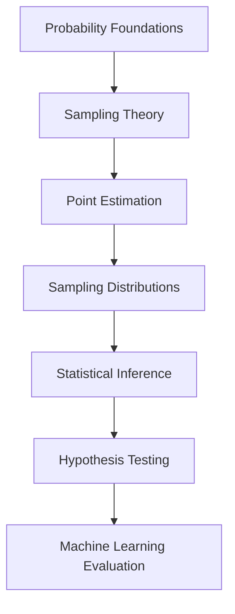

# W02 - Introduction To Statistical Inference

This module marks the transition from descriptive statistics into formal inferential reasoning.

W01 focused on modelling uncertainty.

W02 focuses on extracting reliable conclusions from incomplete information.

This is where statistics stops being observational and becomes decisional.

Repository:

[MSC Data Science AI - W02 Repository](https://github.com/Balasubramanian-pg/MSC.-Data-Science-AI/tree/main/Trimester%201/Statistical%20Modelling%20%26%20Inferencing/W02%20-%20Introduction%20To%20Statistical%20Inference)

---

# Why This Module Matters

Statistical inference is fundamentally about this problem:

> We never observe the full population.
> We only observe fragments.

Everything in modern data science operates under this constraint.

Examples:

| Real Problem              | Hidden Population             |
| ------------------------- | ----------------------------- |
| Customer churn prediction | All future customers          |
| Election polling          | Entire voting population      |
| Drug trials               | Entire biological variability |
| A/B testing               | All possible users            |
| ML model evaluation       | True real-world performance   |

Inference exists because complete certainty is impossible.

The entire discipline is therefore about:

* estimating uncertainty
* quantifying confidence
* making decisions with incomplete evidence
* minimizing inferential error

---

# Module Structure

```text
W02 - Introduction To Statistical Inference
│
├── L0 → Inferential Foundations & Epistemology
├── L1 → Sampling Theory & Data Collection
├── L2 → Point Estimation & Sampling Distributions
└── Jupyter Notebooks → Computational Inference
```

---

# L0 · Inferential Foundations & Epistemology

This section introduces the philosophical and mathematical foundations of inference.

Most introductory statistics courses skip the epistemology layer entirely.

That creates a dangerous failure mode:
students learn procedures without understanding what knowledge claims actually mean.

This section attempts to fix that.

---

## Core Themes

### What Is Inference?

Inference is the process of moving from:

* observed sample data
* to unobserved population conclusions

This sounds simple.

It is not.

Because every inferential conclusion carries:

* uncertainty
* assumptions
* bias risk
* sampling error
* model dependency

---

## Key Questions Introduced

* What counts as evidence?
* How reliable are conclusions from samples?
* When does statistical reasoning fail?
* What assumptions are hidden inside inference?
* How do sampling methods distort conclusions?
* Can uncertainty itself be measured?

These questions later become central in:

* causal inference
* experimental design
* Bayesian statistics
* machine learning evaluation
* AI reliability systems

---

## Resources

### [Inferential Statistics](https://github.com/Balasubramanian-pg/MSC.-Data-Science-AI/blob/main/Trimester%201/Statistical%20Modelling%20%26%20Inferencing/W02%20-%20Introduction%20To%20Statistical%20Inference/L0/Inferential%20Statistics.md)

Introduces the operational framework of inferential reasoning and statistical generalization.

### [Module Introduction 1](https://github.com/Balasubramanian-pg/MSC.-Data-Science-AI/blob/main/Trimester%201/Statistical%20Modelling%20%26%20Inferencing/W02%20-%20Introduction%20To%20Statistical%20Inference/L0/Module%20Introduction%201.pdf)

Overview of the inferential workflow and module trajectory.

### [Sampling Theory and Representation](https://github.com/Balasubramanian-pg/MSC.-Data-Science-AI/blob/main/Trimester%201/Statistical%20Modelling%20%26%20Inferencing/W02%20-%20Introduction%20To%20Statistical%20Inference/L0/Sampling%20Theory%20and%20Representation.md)

Focuses on representativeness, sampling validity, and the relationship between samples and populations.

### [The Epistemology of Inference](https://github.com/Balasubramanian-pg/MSC.-Data-Science-AI/blob/main/Trimester%201/Statistical%20Modelling%20%26%20Inferencing/W02%20-%20Introduction%20To%20Statistical%20Inference/L0/The%20Epistemology%20of%20Inference.md)

One of the deeper conceptual readings in the module.

Moves beyond formulas into:

* what statistical evidence means
* why inference is probabilistic rather than absolute
* limits of empirical certainty

---

# L1 · Sampling Theory & Data Collection

This section focuses on one of the most underestimated topics in data science:

> Bad sampling destroys good models.

Most model failures in production are not algorithm failures.
They are sampling failures.

---

# Core Themes

## Sampling as Compression

A sample is effectively a compressed representation of reality.

The challenge:

* preserve enough structure
* avoid introducing bias
* retain inferential validity

This becomes increasingly difficult in:

* large-scale systems
* streaming environments
* biased data pipelines
* observational datasets

---

## Major Sampling Concepts

### Random Sampling

Every unit has equal selection probability.

Idealized foundation of classical inference.

### Stratified Sampling

Preserves subgroup representation.

Critical when populations are heterogeneous.

### Cluster Sampling

Operationally cheaper but introduces correlation structures.

### Sampling Bias

The silent killer of inference.

Examples:

* survivorship bias
* selection bias
* non-response bias
* convenience sampling

These biases appear constantly in:

* social media analytics
* recommender systems
* survey pipelines
* online experimentation

---

## Resources

### [Art of Sampling](https://github.com/Balasubramanian-pg/MSC.-Data-Science-AI/blob/main/Trimester%201/Statistical%20Modelling%20%26%20Inferencing/W02%20-%20Introduction%20To%20Statistical%20Inference/L1/Art%20of%20Sampling.md)

Conceptual treatment of sampling design and representativeness.

### [The Art of Sampling](https://github.com/Balasubramanian-pg/MSC.-Data-Science-AI/blob/main/Trimester%201/Statistical%20Modelling%20%26%20Inferencing/W02%20-%20Introduction%20To%20Statistical%20Inference/L1/The%20Art%20of%20Sampling.md)

Expanded reading material exploring practical sampling tradeoffs and inferential reliability.

### [The Art of Sampling (PDF)](https://github.com/Balasubramanian-pg/MSC.-Data-Science-AI/blob/main/Trimester%201/Statistical%20Modelling%20%26%20Inferencing/W02%20-%20Introduction%20To%20Statistical%20Inference/L1/The%20Art%20of%20Sampling.pdf)

Formal lecture material supporting theoretical and mathematical treatment of sampling methods.

---

# L2 · Point Estimation & Sampling Distributions

This section introduces one of the most important ideas in statistics:

> Statistics themselves are random variables.

That idea changes everything.

A sample mean is not "the truth."
It is one realization from a distribution of possible estimates.

This realization is the foundation of:

* confidence intervals
* hypothesis testing
* bootstrap methods
* Bayesian posterior estimation
* model uncertainty quantification

---

# Core Themes

## Point Estimation

Using a statistic to estimate an unknown population parameter.

Examples:

| Population Parameter    | Estimator            |
| ----------------------- | -------------------- |
| Population mean μ       | Sample mean x̄       |
| Population variance σ²  | Sample variance s²   |
| Population proportion p | Sample proportion p̂ |

---

## Good Estimators

A strong estimator ideally has:

### Unbiasedness

Expected value equals true parameter.

### Consistency

Improves with more data.

### Efficiency

Low variance.

### Sufficiency

Captures maximal information from data.

These properties become foundational later in:

* maximum likelihood estimation
* Bayesian estimation
* generalized linear models
* deep learning optimization

---

## Sampling Distributions

One of the deepest ideas in statistics.

If you repeatedly sample and compute estimators:

* those estimators form distributions
* inference emerges from those distributions

This directly leads to:

* Central Limit Theorem
* standard errors
* confidence intervals
* significance testing

---

# Computational Perspective

The notebooks in this section matter a lot.

Inference becomes dramatically easier once you simulate it.

Many students memorize formulas but never internalize:

* estimator variability
* sampling noise
* convergence behavior
* inferential instability

Simulation fixes that.

---

## Resources

### [Introduction_to_Statistical_Inference.ipynb](https://github.com/Balasubramanian-pg/MSC.-Data-Science-AI/blob/main/Trimester%201/Statistical%20Modelling%20%26%20Inferencing/W02%20-%20Introduction%20To%20Statistical%20Inference/L2/Introduction_to_Statistical_Inference.ipynb)

Notebook introducing computational intuition behind inferential reasoning.

### [Point Estimation](https://github.com/Balasubramanian-pg/MSC.-Data-Science-AI/blob/main/Trimester%201/Statistical%20Modelling%20%26%20Inferencing/W02%20-%20Introduction%20To%20Statistical%20Inference/L2/Point%20Estimation.md)

Theoretical foundations of parameter estimation.

### [Point Estimation (PDF)](https://github.com/Balasubramanian-pg/MSC.-Data-Science-AI/blob/main/Trimester%201/Statistical%20Modelling%20%26%20Inferencing/W02%20-%20Introduction%20To%20Statistical%20Inference/L2/Point%20Estimation.pdf)

Formal lecture notes covering estimation theory and inferential mathematics.

### [Point_Estimation.ipynb](https://github.com/Balasubramanian-pg/MSC.-Data-Science-AI/blob/main/Trimester%201/Statistical%20Modelling%20%26%20Inferencing/W02%20-%20Introduction%20To%20Statistical%20Inference/L2/Point_Estimation.ipynb)

Practical implementation notebook for estimator construction and experimentation.

### [Sampling_Distributions.ipynb](https://github.com/Balasubramanian-pg/MSC.-Data-Science-AI/blob/main/Trimester%201/Statistical%20Modelling%20%26%20Inferencing/W02%20-%20Introduction%20To%20Statistical%20Inference/L2/Sampling_Distributions.ipynb)

Critical notebook for visualizing how estimators behave across repeated samples.

Strongly tied to understanding:

* CLT intuition
* estimator variance
* inferential stability
* confidence construction

---

# Recommended Learning Flow



---

# Hidden Insight Behind This Module

Most people think statistical inference is:

> "using formulas to analyze data."

That is not the deeper idea.

The deeper idea is:

> Inference is uncertainty engineering.

You are building systems that reason under incomplete information.

That is exactly what:

* machine learning
* AI systems
* recommendation engines
* forecasting systems
* risk modelling
* Bayesian reasoning

are all doing at scale.

This module is therefore not merely "statistics."

It is the mathematical infrastructure for decision-making under uncertainty.

