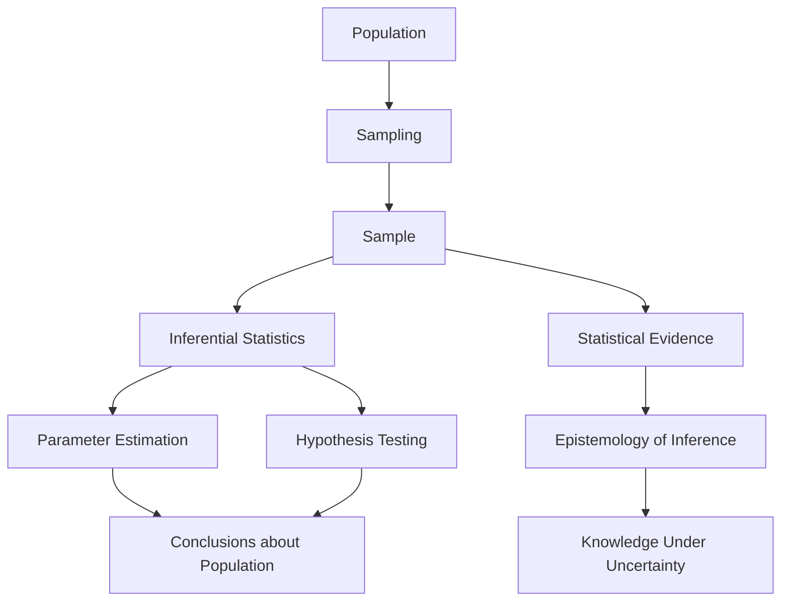

# Lesson 0: Foundations of Statistical Inference

## Overview

Statistical inference is the branch of statistics concerned with drawing conclusions about an entire population based on information obtained from a sample. Since it is often impractical, expensive, or impossible to observe every member of a population, statisticians rely on carefully selected samples to estimate unknown population characteristics and make evidence-based decisions.

This lesson introduces the philosophical and mathematical foundations of statistical inference. It explores how sampling enables us to generalize from limited observations, examines the theoretical basis underlying inferential reasoning, and discusses the epistemological principles that govern the acquisition of statistical knowledge.

Understanding these concepts is essential because virtually all modern statistical methods, machine learning algorithms, and scientific investigations rely on inferential reasoning.

## Learning Objectives

After completing this lesson, you should be able to:

- Define statistical inference and explain its importance.
- Distinguish between populations and samples.
- Explain the role of sampling in statistical analysis.
- Understand how samples represent populations.
- Describe the assumptions underlying inferential procedures.
- Explain the philosophical basis of statistical reasoning.
- Understand the limitations and uncertainty inherent in inference.
- Appreciate the relationship between evidence, probability, and knowledge.

## Topics Covered

### 1. [Inferential Statistics](2.1.%20Inferential%20Statistics.md)

Inferential statistics involves using sample data to make conclusions, predictions, or decisions about a larger population.

Inferential methods allow analysts to:

- Estimate unknown population parameters.
- Test research hypotheses.
- Make predictions about future observations.
- Quantify uncertainty in conclusions.

Key inferential techniques include:

- Parameter Estimation
- Confidence Intervals
- Hypothesis Testing
- Regression Analysis
- Analysis of Variance (ANOVA)

Inferential statistics forms the backbone of scientific research, business analytics, healthcare studies, and machine learning.

### 2. [Sampling Theory and Representation](2.2.%20Sampling%20Theory%20and%20Representation.md)

Sampling theory studies how observations should be selected from a population to ensure reliable and unbiased conclusions.

Fundamental concepts include:

- Population
- Sample
- Sampling Frame
- Sampling Distribution
- Sampling Error
- Representation

A representative sample should accurately reflect the characteristics of the underlying population.

Common sampling methods include:

- Simple Random Sampling
- Stratified Sampling
- Cluster Sampling
- Systematic Sampling

Proper sampling is critical because poor sampling can introduce bias and invalidate inferential conclusions.

### 3. [The Epistemology of Inference](2.3%20The%20Epistemology%20of%20Inference.md)

Epistemology is the philosophical study of knowledge, belief, and justification.

In statistical inference, epistemology examines questions such as:

- How can we learn about populations from samples?
- What constitutes statistical evidence?
- How certain can we be about inferential conclusions?
- What assumptions justify generalization?

Important epistemological concepts include:

- Inductive Reasoning
- Uncertainty
- Probability as Evidence
- Scientific Justification
- Model Assumptions

Statistical inference fundamentally relies on inductive reasoning, where conclusions about unobserved phenomena are derived from observed data.

Understanding these philosophical foundations helps analysts interpret statistical results more critically and responsibly.

## Conceptual Relationship



## Lesson Navigation

| Resource | Description |
|-----------|-------------|
| 📄 [Inferential Statistics](2.1.%20Inferential%20Statistics.md) | Introduction to drawing conclusions about populations from samples |
| 📄 [Sampling Theory and Representation](2.2.%20Sampling%20Theory%20and%20Representation.md) | Principles governing representative sampling and population inference |
| 📄 [The Epistemology of Inference](2.3%20The%20Epistemology%20of%20Inference.md) | Philosophical foundations of statistical reasoning and evidence |

## Real-World Applications

| Domain | Application |
|---------|-------------|
| Healthcare | Estimating treatment effectiveness from clinical trials |
| Business | Predicting customer behavior from survey samples |
| Politics | Election polling and opinion surveys |
| Manufacturing | Quality control through sample inspection |
| Finance | Estimating market trends and investment risk |
| Data Science | Building predictive models from training datasets |

## Key Takeaways

- Statistical inference enables conclusions about populations using sample data.
- Sampling theory provides the framework for selecting representative observations.
- Inferential conclusions always involve uncertainty.
- Representative sampling is essential for valid inference.
- Statistical reasoning is fundamentally based on inductive logic.
- Epistemology helps explain how statistical evidence generates knowledge.
- Understanding inferential foundations improves interpretation and communication of statistical results.

## Prerequisites for Future Topics

The concepts introduced in this lesson provide the foundation for:

- Sampling Distributions
- Estimation Theory
- Confidence Intervals
- Hypothesis Testing
- Regression Analysis
- Bayesian Statistics
- Experimental Design
- Machine Learning
```
