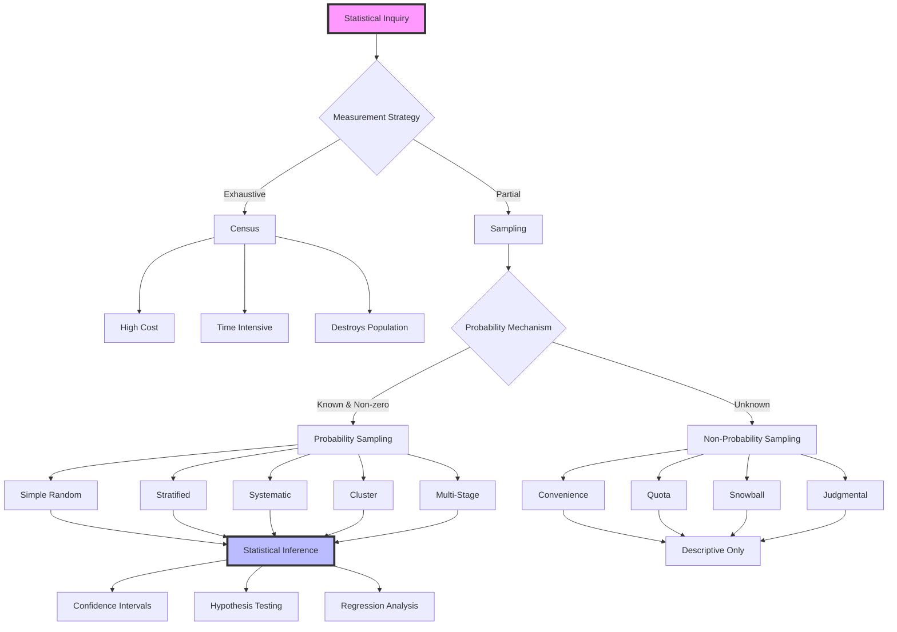

# 1.4 Conceptual Architecture

```mermaid
graph TD
    A[Statistical Inquiry] --> B{Measurement Strategy}
    B -->|Exhaustive| C[Census]
    B -->|Partial| D[Sampling]
    C --> C1[High Cost]
    C --> C2[Time Intensive]
    C --> C3[Destroys Population]
    D --> E{Probability Mechanism}
    E -->|Known & Non-zero| F[Probability Sampling]
    E -->|Unknown| G[Non-Probability Sampling]
    F --> F1[Simple Random]
    F --> F2[Stratified]
    F --> F3[Systematic]
    F --> F4[Cluster]
    F --> F5[Multi-Stage]
    G --> G1[Convenience]
    G --> G2[Quota]
    G --> G3[Snowball]
    G --> G4[Judgmental]
    F1 --> H[Statistical Inference]
    F2 --> H
    F3 --> H
    F4 --> H
    F5 --> H
    G1 --> I[Descriptive Only]
    G2 --> I
    G3 --> I
    G4 --> I
    H --> J[Confidence Intervals]
    H --> K[Hypothesis Testing]
    H --> L[Regression Analysis]
    style A fill:#f9f,stroke:#333,stroke-width:4px
    style H fill:#bbf,stroke:#333,stroke-width:4px
```

# 2. Foundational Concepts
