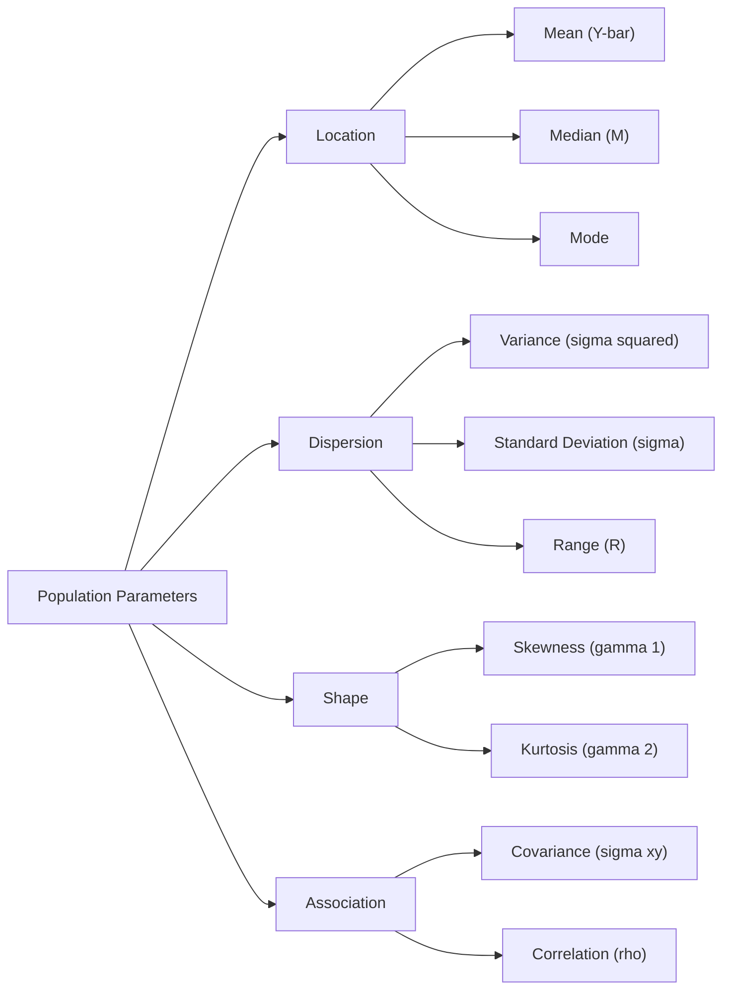

# 2.2 Parameter Hierarchy

```mermaid
graph LR
    A["Population Parameters"] --> B["Location"]
    A --> C["Dispersion"]
    A --> D["Shape"]
    A --> E["Association"]

    B --> B1["Mean (Y-bar)"]
    B --> B2["Median (M)"]
    B --> B3["Mode"]

    C --> C1["Variance (sigma squared)"]
    C --> C2["Standard Deviation (sigma)"]
    C --> C3["Range (R)"]

    D --> D1["Skewness (gamma 1)"]
    D --> D2["Kurtosis (gamma 2)"]

    E --> E1["Covariance (sigma xy)"]
    E --> E2["Correlation (rho)"]
```
