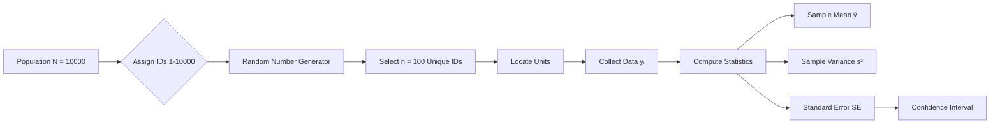

# 3.1 Simple Random Sampling (SRS)

### 3.1.1 Definition

SRSWOR: Every possible combination of $n$ units has equal selection probability.

Number of possible samples:

$$
\binom{N}{n} = \frac{N!}{n!(N-n)!}
$$

Design probability:

$$
p(s) = \frac{1}{\binom{N}{n}}
$$

### 3.1.2 Inclusion Probabilities

First-order:

$$
\pi_i = \frac{n}{N}
$$

Second-order:

$$
\pi_{ij} = \frac{n(n-1)}{N(N-1)} \quad \text{for } i \neq j
$$

### 3.1.3 Estimation Theory

**Unbiased Mean Estimator:**

$$
\hat{\bar{Y}}_{SRS} = \bar{y} = \frac{1}{n} \sum_{i \in s} y_i
$$

**Variance of Sample Mean:**

$$
Var(\bar{y}) = \left(\frac{N-n}{N-1}\right) \frac{\sigma^2}{n} = \left(1 - \frac{n}{N}\right) \frac{S^2}{n}
$$

**Unbiased Variance Estimator:**

$$
\widehat{Var}(\bar{y}) = \left(1 - \frac{n}{N}\right) \frac{s^2}{n}
$$

**Confidence Interval:**

$$
CI_{1-\alpha} = \bar{y} \pm t_{\alpha/2, n-1} \sqrt{\left(1 - \frac{n}{N}\right) \frac{s^2}{n}}
$$

**Population Total:**

$$
\hat{Y} = N\bar{y} = \frac{N}{n} \sum_{i \in s} y_i
$$

**Variance of Total:**

$$
Var(\hat{Y}) = N^2 \left(1 - \frac{n}{N}\right) \frac{S^2}{n}
$$

**Population Proportion:**

$$
\hat{P} = p = \frac{1}{n} \sum_{i \in s} y_i
$$

**Variance of Proportion:**

$$
Var(p) = \left(1 - \frac{n}{N}\right) \frac{P(1-P)}{n-1} \approx \left(1 - \frac{n}{N}\right) \frac{p(1-p)}{n-1}
$$

### 3.1.4 SRS With Replacement (SRSWR)

Number of ordered samples: $N^n$

Variance:

$$
Var(\bar{y}_{wr}) = \frac{\sigma^2}{n} = \frac{N-1}{N} \frac{S^2}{n}
$$

Efficiency ratio:

$$
\text{Efficiency} = \frac{Var(\bar{y}_{wr})}{Var(\bar{y}_{wor})} = \frac{N-1}{N-n} > 1
$$

### 3.1.5 Numerical Example: University GPA

**Given:** $N = 10,000$, $n = 100$, $\bar{y} = 3.42$, $s^2 = 0.25$

Sampling fraction: $f = 100/10000 = 0.01$

FPC: $1 - f = 0.99$

Standard error:

$$
SE(\bar{y}) = \sqrt{0.99 \times \frac{0.25}{100}} = \sqrt{0.002475} \approx 0.04975
$$

95% CI:

$$
CI = 3.42 \pm 1.96 \times 0.04975 = 3.42 \pm 0.0975 = [3.3225, 3.5175]
$$

### 3.1.6 SRS Process Flow

