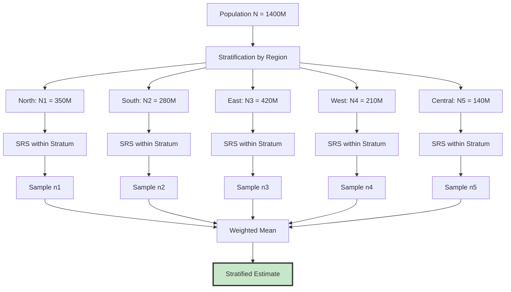

# 3.2 Stratified Random Sampling

### 3.2.1 Conceptual Foundation

Population partitioned into $H$ mutually exclusive strata $U_1, U_2, \ldots, U_H$:

$$
\bigcup_{h=1}^H U_h = U \quad \text{and} \quad U_h \cap U_k = \emptyset \text{ for } h \neq k
$$

With $\sum_{h=1}^H N_h = N$.

### 3.2.2 Variance Decomposition

Total variance decomposition:

$$
\sigma^2 = \underbrace{\sum_{h=1}^H W_h \sigma_h^2}_{\text{Within}} + \underbrace{\sum_{h=1}^H W_h (\bar{Y}_h - \bar{Y})^2}_{\text{Between}}
$$

where $W_h = N_h/N$.

### 3.2.3 Allocation Methods

**Proportional Allocation:**

$$
n_h = n \cdot \frac{N_h}{N} = n \cdot W_h
$$

Variance under proportional allocation:

$$
Var(\bar{y}_{st})_{prop} = \sum_{h=1}^H W_h^2 \left(1 - \frac{n_h}{N_h}\right) \frac{S_h^2}{n_h}
$$

**Neyman (Optimal) Allocation:**

$$
n_h = n \cdot \frac{W_h S_h}{\sum_{k=1}^H W_k S_k} = n \cdot \frac{N_h S_h}{\sum_{k=1}^H N_k S_k}
$$

Minimum variance:

$$
Var(\bar{y}_{st})_{Neyman} = \frac{1}{n} \left(\sum_{h=1}^H W_h S_h\right)^2 - \frac{1}{N} \sum_{h=1}^H W_h S_h^2
$$

**Cost-Optimal Allocation:**

Cost function:

$$
C = c_0 + \sum_{h=1}^H c_h n_h
$$

Optimal allocation:

$$
n_h = \frac{(C - c_0) W_h S_h / \sqrt{c_h}}{\sum_{k=1}^H W_k S_k \sqrt{c_k}}
$$

Or for fixed $n$:

$$
n_h = n \cdot \frac{W_h S_h / \sqrt{c_h}}{\sum_{k=1}^H W_k S_k / \sqrt{c_k}}
$$

### 3.2.4 Estimation

**Stratified Mean:**

$$
\bar{y}_{st} = \sum_{h=1}^H W_h \bar{y}_h = \sum_{h=1}^H \frac{N_h}{N} \cdot \frac{1}{n_h} \sum_{i \in s_h} y_{hi}
$$

**Variance:**

$$
Var(\bar{y}_{st}) = \sum_{h=1}^H W_h^2 \left(1 - \frac{n_h}{N_h}\right) \frac{S_h^2}{n_h}
$$

**Variance Estimator:**

$$
\widehat{Var}(\bar{y}_{st}) = \sum_{h=1}^H W_h^2 \left(1 - \frac{n_h}{N_h}\right) \frac{s_h^2}{n_h}
$$

**Population Total:**

$$
\hat{Y}_{st} = N \bar{y}_{st} = \sum_{h=1}^H N_h \bar{y}_h
$$

### 3.2.5 Gain in Precision

Relative Efficiency:

$$
RE = \frac{Var(\bar{y}_{SRS})}{Var(\bar{y}_{st})}
$$

Under proportional allocation with small $n/N$:

$$
RE \approx \frac{S^2}{\sum_{h=1}^H W_h S_h^2} = \frac{\sigma^2_{\text{total}}}{\sigma^2_{\text{within}}}
$$

### 3.2.6 Example: Height by Region

| Stratum | Region | $N_h$ (M) | $W_h$ | $S_h$ (cm) | $n_h$ (prop) | $n_h$ (Neyman) |
|:---|:---|:---:|:---:|:---:|:---:|:---:|
| 1 | North | 350 | 0.25 | 6.2 | 25 | 28 |
| 2 | South | 280 | 0.20 | 5.8 | 20 | 21 |
| 3 | East | 420 | 0.30 | 7.1 | 30 | 38 |
| 4 | West | 210 | 0.15 | 5.5 | 15 | 16 |
| 5 | Central | 140 | 0.10 | 6.8 | 10 | 17 |
| **Total** | | **1400** | **1.00** | | **100** | **120** |

Stratified mean calculation:

$$
\bar{y}_{st} = 0.25(165.2) + 0.20(162.8) + 0.30(168.1) + 0.15(164.5) + 0.10(166.9) = 165.43 \text{ cm}
$$

### 3.2.7 Stratified Sampling Diagram

