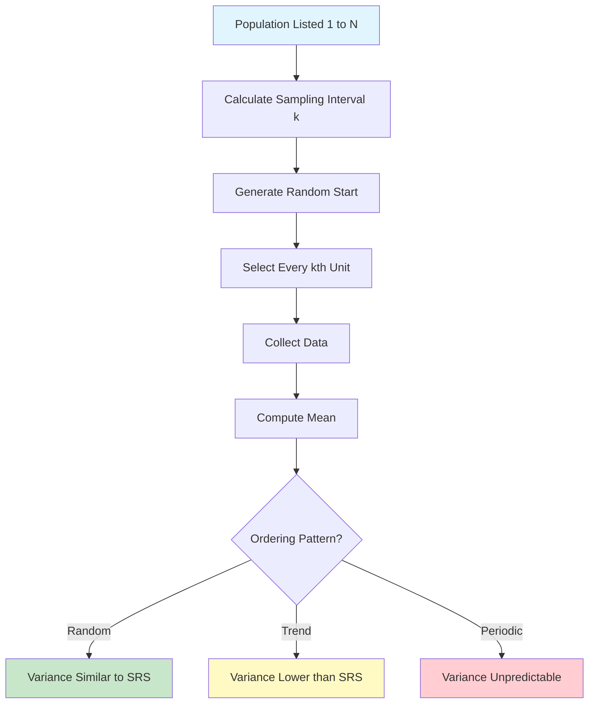

# 3.3 Systematic Sampling

### 3.3.1 Mechanics

Select every $k$-th unit from a randomly ordered or listed population, where $k = N/n$ (sampling interval).

1. Choose random start $r$ from $\{1, 2, \ldots, k\}$
2. Select units: $r, r+k, r+2k, \ldots, r+(n-1)k$

### 3.3.2 Circular Systematic Sampling

For non-integer $k$, use circular arrangement:

$$
r_j = [(r + (j-1)k) \mod N] + 1
$$

### 3.3.3 Variance Estimation Challenge

Systematic sampling is equivalent to selecting one cluster from $k$ possible clusters, each of size $n$.

**Variance under random ordering:**

If the population is randomly ordered, systematic sampling behaves like SRS:

$$
Var(\bar{y}_{sys}) \approx \left(1 - \frac{n}{N}\right) \frac{S^2}{n}
$$

**Variance under linear trend:**

If $y_i = a + bi + \epsilon_i$:

$$
Var(\bar{y}_{sys}) \approx \frac{(N-n)b^2(k^2-1)}{12N}
$$

**Variance under periodic variation:**

If the period $T$ coincides with $k$, variance can be severely inflated or deflated.

### 3.3.4 Comparison with SRS and Stratified

| Scenario | SRS | Systematic | Stratified |
|:---|:---:|:---:|:---:|
| Random order | Baseline | ~SRS | ~SRS |
| Linear trend | Higher Var | Lower Var | Lowest Var |
| Periodic (T=k) | Baseline | Very High | Baseline |
| Autocorrelated | Baseline | Lower Var | Lower Var |

### 3.3.5 Systematic Sampling Process

