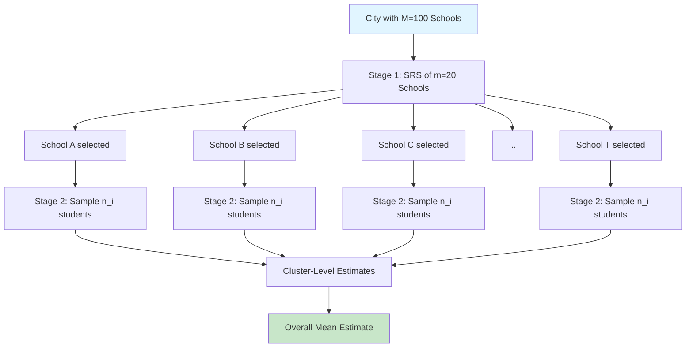

# 3.4 Cluster Sampling

### 3.4.1 Rationale and Structure

When no reliable list of individuals exists but groups (clusters) are well-defined, we sample clusters and observe all (or a sample of) units within selected clusters.

Population divided into $M$ clusters, each containing $N_i$ units.

$$
\sum_{i=1}^M N_i = N
$$

### 3.4.2 One-Stage Cluster Sampling (Equal Clusters)

Select $m$ clusters from $M$ via SRS. Measure all $N$ units in each selected cluster (when $N_i = \bar{N}$ for all $i$).

**Cluster Mean:**

$$
\bar{y}_{cl} = \frac{1}{m} \sum_{i=1}^m \bar{y}_i
$$

**Variance:**

$$
Var(\bar{y}_{cl}) = \left(1 - \frac{m}{M}\right) \frac{S_b^2}{m}
$$

where $S_b^2 = \frac{1}{M-1}\sum_{i=1}^M (\bar{Y}_i - \bar{Y})^2$ is the between-cluster variance.

**Intraclass Correlation Coefficient (ICC):**

$$
\rho = \frac{\sigma_b^2 - \sigma_w^2/(N-1)}{\sigma^2}
$$

where $\sigma_b^2$ is between-cluster variance and $\sigma_w^2$ is within-cluster variance.

The design effect (DEFF) is:

$$
DEFF = 1 + (\bar{N} - 1)\rho
$$

### 3.4.3 Two-Stage Cluster Sampling

Stage 1: Select $m$ clusters from $M$.
Stage 2: Select $n_i$ units from $N_i$ within each selected cluster.

**Unbiased Estimator:**

$$
\hat{\bar{Y}} = \frac{1}{m} \sum_{i=1}^m \frac{N_i \bar{y}_i}{\bar{N}} = \frac{1}{m\bar{N}} \sum_{i=1}^m \hat{Y}_i
$$

**Variance:**

$$
Var(\hat{\bar{Y}}) = \left(1 - \frac{m}{M}\right) \frac{S_b^2}{m} + \frac{1}{mM\bar{N}^2} \sum_{i=1}^M N_i^2 \left(1 - \frac{n_i}{N_i}\right) \frac{S_{w_i}^2}{n_i}
$$

### 3.4.4 Cluster vs. SRS Efficiency

Cluster sampling is generally less efficient than SRS of same total size because:

$$
Var(\bar{y}_{cl}) \geq Var(\bar{y}_{SRS})
$$

when $\rho > 0$. However, the cost per unit is typically much lower, enabling larger sample sizes.

### 3.4.5 Cluster Sampling Diagram

