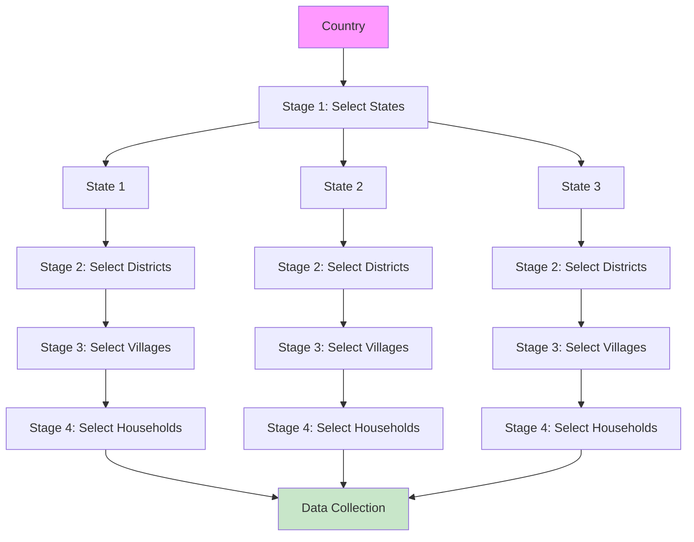

# 3.5 Multi-Stage Sampling

### 3.5.1 Generalization

Multi-stage sampling extends cluster sampling to $L$ stages of selection:

Stage 1: Primary Sampling Units (PSUs) - e.g., States
Stage 2: Secondary Sampling Units (SSUs) - e.g., Districts
Stage 3: Tertiary Sampling Units (TSUs) - e.g., Villages
Stage 4: Ultimate Sampling Units (USUs) - e.g., Households

### 3.5.2 Variance in Multi-Stage Designs

For a three-stage design with simple random sampling at each stage:

$$
Var(\hat{Y}) = \frac{M^2}{m} S_1^2 + \frac{M}{m} \sum_{i=1}^M \frac{N_i^2}{n_i} S_{2i}^2 + \frac{M}{m} \sum_{i=1}^M \frac{N_i}{n_i} \sum_{j=1}^{N_i} \frac{K_{ij}^2}{k_{ij}} S_{3ij}^2
$$

where:
- $S_1^2$ = between-PSU variance
- $S_{2i}^2$ = between-SSU variance within PSU $i$
- $S_{3ij}^2$ = between-USU variance within SSU $j$ of PSU $i$

### 3.5.3 Multi-Stage Diagram

