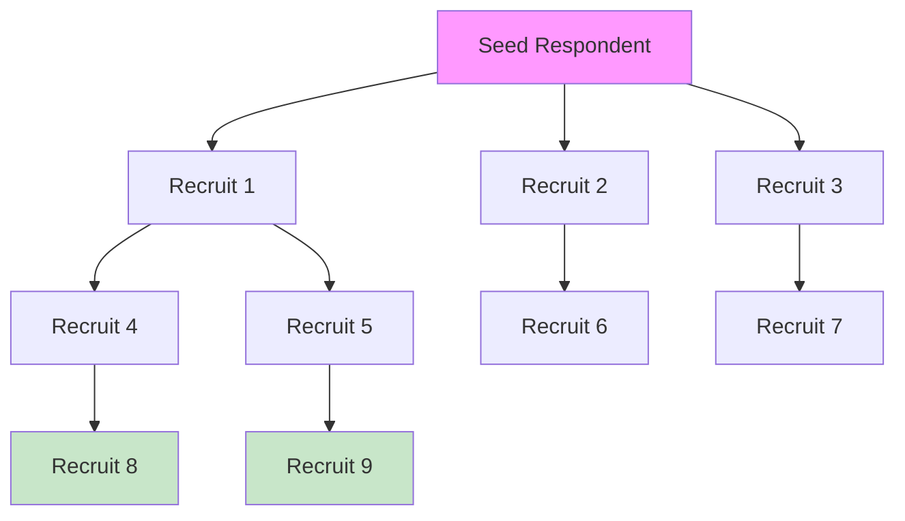

# 4.3 Snowball Sampling

### 4.3.1 Network-Based Recruitment

Used for hidden or hard-to-reach populations. Initial respondents recruit future respondents from their social network.

**Recruitment probability:**

The probability of inclusion depends on network degree $d_i$:

$$
P(i \in s) \propto d_i \times P(\text{initial contact} \rightarrow i)
$$

### 4.3.2 Respondent-Driven Sampling (RDS)

RDS introduces coupons and dual incentives to approximate a Markov chain:

$$
\pi_i \approx \frac{d_i}{\sum_{j=1}^N d_j}
$$

The RDS-II estimator (Volz-Heckathorn) is:

$$
\hat{\bar{Y}}_{RDS} = \frac{\sum_{i \in s} y_i / d_i}{\sum_{i \in s} 1/d_i}
$$

### 4.3.3 Snowball Diagram

