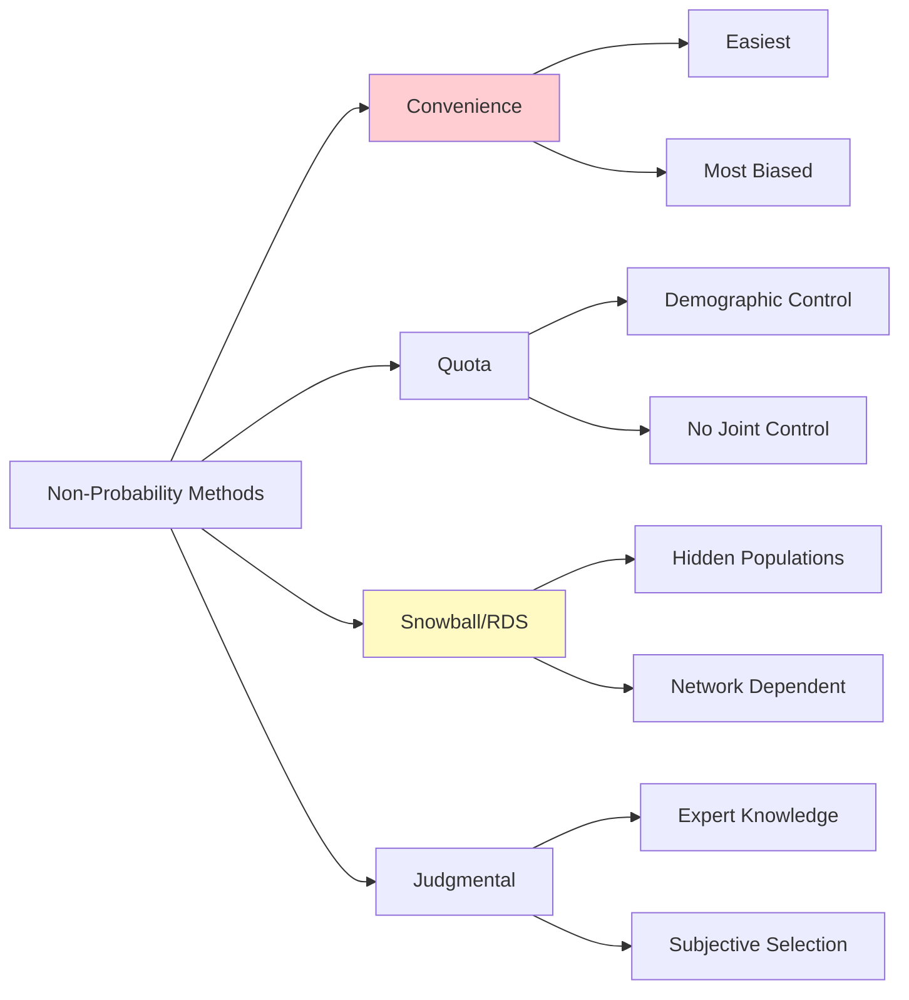

# 4.5 Non-Probability Methods Comparison

```mermaid
graph LR
    A[Non-Probability Methods] --> B[Convenience]
    A --> C[Quota]
    A --> D[Snowball/RDS]
    A --> E[Judgmental]
    B --> B1[Easiest]
    B --> B2[Most Biased]
    C --> C1[Demographic Control]
    C --> C2[No Joint Control]
    D --> D1[Hidden Populations]
    D --> D2[Network Dependent]
    E --> E1[Expert Knowledge]
    E --> E2[Subjective Selection]
    style B fill:#ffcdd2
    style D fill:#fff9c4
```

# 5. Sampling Distributions and the Central Limit Theorem
