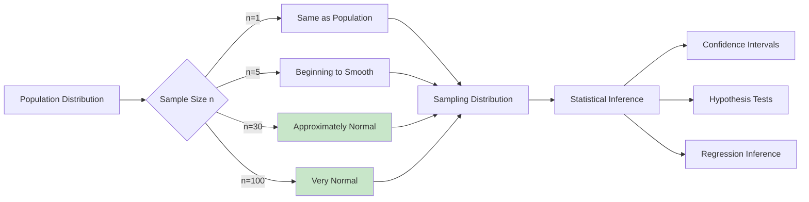

# 5.3 CLT Visualization and Implications

```mermaid
graph LR
    A[Population Distribution] --> B{Sample Size n}
    B -->|n=1| C[Same as Population]
    B -->|n=5| D[Beginning to Smooth]
    B -->|n=30| E[Approximately Normal]
    B -->|n=100| F[Very Normal]
    C --> G[Sampling Distribution]
    D --> G
    E --> G
    F --> G
    G --> H[Statistical Inference]
    H --> I[Confidence Intervals]
    H --> J[Hypothesis Tests]
    H --> K[Regression Inference]
    style E fill:#c8e6c9
    style F fill:#c8e6c9
```
