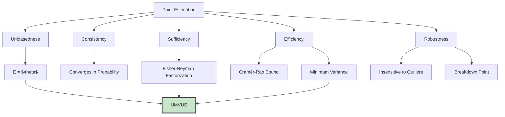

# 6.5 Estimator Properties Diagram

```mermaid
graph TD
    A[Point Estimation] --> B[Unbiasedness]
    A --> C[Consistency]
    A --> D[Efficiency]
    A --> E[Sufficiency]
    A --> F[Robustness]
    B --> B1[E = $\theta$]
    C --> C1[Converges in Probability]
    D --> D1[Minimum Variance]
    D --> D2[Cramér-Rao Bound]
    E --> E1[Fisher-Neyman Factorization]
    F --> F1[Insensitive to Outliers]
    F --> F2[Breakdown Point]
    B1 --> G[UMVUE]
    E1 --> G
    D1 --> G
    style G fill:#c8e6c9,stroke:#333,stroke-width:3px
```

# 7. Confidence Intervals
