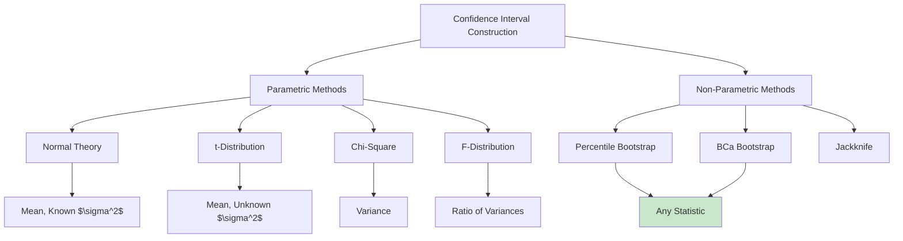

# 7.6 Confidence Interval Diagram

```mermaid
graph TD
    A[Confidence Interval Construction] --> B[Parametric Methods]
    A --> C[Non-Parametric Methods]
    B --> B1[Normal Theory]
    B --> B2[t-Distribution]
    B --> B3[Chi-Square]
    B --> B4[F-Distribution]
    C --> C1[Percentile Bootstrap]
    C --> C2[BCa Bootstrap]
    C --> C3[Jackknife]
    B1 --> D[Mean, Known $\sigma^2$]
    B2 --> E[Mean, Unknown $\sigma^2$]
    B3 --> F[Variance]
    B4 --> G[Ratio of Variances]
    C1 --> H[Any Statistic]
    C2 --> H
    style H fill:#c8e6c9
```

# 8. Sample Size Determination
