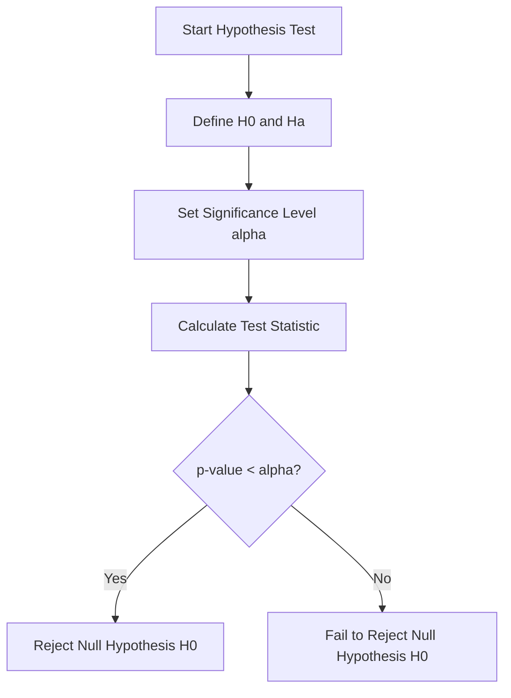

### Module 3: Statistical Inference in Modelling

This module transitions from descriptive statistics to **Inferential Statistics**, the formal framework for making rigorous, data-driven [conclusions](https://github.com/Balasubramanian-pg/MSC.-Data-Science-AI/blob/main/Trimester%201/Statistical%20Modelling%20%26%20Inferencing/W03 - Estimation And Hypothesis Testing/L1/3.1%20Interval%20Estimation%20of%20the%20Mean.md#conclusions) about a population parameter ($\theta$) using data from a limited sample ($n$).

#### 1. Core Objectives

- **Interval Estimation:** Construct confidence intervals for population means under known and unknown variance conditions.
    
- **Sample Size Determination:** Calculate the minimum sample size ($n$) required to achieve a specific precision.
    
- **Hypothesis Testing:** Formulate and execute formal frameworks to decide between competing claims ($H_0$ vs. $H_a$).
    

#### 2. Interval Estimation (Confidence Intervals)

Rather than a point estimate (a "spear"), we use a "net" to capture the true parameter with a defined level of confidence.

- **Known Population Variance ($\sigma$):** Use the Standard Normal distribution ($Z$).
    

$$
CI = \bar{x} \pm Z_{\alpha/2} \left( [\frac{](https://github.com/Balasubramanian-pg/MSC.-Data-Science-AI/blob/main/Trimester%201/Statistical%20Modelling%20%26%20Inferencing/W04 - Estimation And Hypothesis Testing Cont/L1/Inferences%20for%20Two%20Population%20Means.md#frac)\sigma}{\sqrt{n}} \right)
$$

    
- **Unknown Population Variance ($s$):** Use the Student’s $t$-distribution.
    

$$
CI = \bar{x} \pm t_{\alpha/2, \nu} \left( \frac{s}{\sqrt{n}} \right)
$$

    
    Where $\nu = n - 1$ degrees of freedom.
    

```Python
## Example: Calculating a 95% Confidence Interval (Unknown Variance)
import numpy as np
from scipy import stats

data = [14200, 13800, 14500, 14100, 14300] # Sample data
n = len(data)
mean = np.mean(data)
std_err = stats.sem(data)

## 95% confidence interval
ci = stats.t.interval(0.95, df=n-1, loc=mean, scale=std_err)
print(f"Confidence Interval: {ci}")
```

#### [3. Hypothesis Testing Framework](https://github.com/Balasubramanian-pg/MSC.-Data-Science-AI/blob/main/Trimester%201/Statistical%20Modelling%20%26%20Inferencing/W01 - Basic Probability & Statistics/L0/Inference%20%26%20Modelling.md#3-hypothesis-testing-framework)

A formal courtroom-like procedure to evaluate status quo claims.

- **[Null Hypothesis](https://github.com/Balasubramanian-pg/MSC.-Data-Science-AI/blob/main/Trimester%201/Statistical%20Modelling%20%26%20Inferencing/W03 - Estimation And Hypothesis Testing/L2/Errors%2C%20P-values%2C%20and%20Significance.md#null-hypothesis) ($H_0$):** The "no effect" baseline.
    
- **[Alternative Hypothesis](https://github.com/Balasubramanian-pg/MSC.-Data-Science-AI/blob/main/Trimester%201/Statistical%20Modelling%20%26%20Inferencing/W03 - Estimation And Hypothesis Testing/L2/Errors%2C%20P-values%2C%20and%20Significance.md#alternative-hypothesis) ($H_a$):** The effect you are attempting to prove.
    
- **Significance Level ($\alpha$):** The threshold for Type I Error (False Positive) risk.
    
- **Test Statistic:** Standardizes the difference relative to [noise](https://github.com/Balasubramanian-pg/MSC.-Data-Science-AI/blob/main/Trimester%201/Statistical%20Modelling%20%26%20Inferencing/W06 - Simple Linear Regression/L2/Testing%20for%20Significance%20in%20Regression.md#noise).
    

$$
Z = [\frac{](https://github.com/Balasubramanian-pg/MSC.-Data-Science-AI/blob/main/Trimester%201/Statistical%20Modelling%20%26%20Inferencing/W04 - Estimation And Hypothesis Testing Cont/L1/Inferences%20for%20Two%20Population%20Means.md#frac)\bar{x} - \mu_0}{\sigma / \sqrt{n}}
$$

    



#### 4. [Summary](https://github.com/Balasubramanian-pg/MSC.-Data-Science-AI/blob/main/Trimester%201/Statistical%20Modelling%20%26%20Inferencing/W01 - Basic Probability & Statistics/L2/Reading%202%20Parametric%20vs.%20Non-Parametric%20Methods.md#summary)) of Key Constraints & Traps

- **The Probability Fallacy:** A 95% CI does **not** [mean](https://github.com/Balasubramanian-pg/MSC.-Data-Science-AI/blob/main/Trimester%201/Statistical%20Modelling%20%26%20Inferencing/W04 - Estimation And Hypothesis Testing Cont/L2/Testing%20Population%20Proportions.md#mean) there is a 95% probability the true parameter is inside your specific interval; it means the _procedure_ captures the true parameter 95% of the time in the long run.
    
- **Statistical vs. [Practical Significance](https://github.com/Balasubramanian-pg/MSC.-Data-Science-AI/blob/main/Trimester%201/Statistical%20Modelling%20%26%20Inferencing/W03 - Estimation And Hypothesis Testing/L2/Errors%2C%20P-values%2C%20and%20Significance.md#practical-significance):** With massive sample sizes ($n \to \infty$), even trivial differences become statistically significant ($p < 0.05$); always evaluate **Effect Size** (e.g., Cohen's $d$) for business impact.
    
- **Type I vs. Type II Errors:**
    
    - **Type I ($\alpha$):** Rejecting $H_0$ when it is true (False Positive).
        
    - **Type II ($\beta$):** Failing to reject $H_0$ when it is false (False Negative).
        
    - **Power ($1-\beta$):** The probability of correctly rejecting a false $H_0$.

Tags: #statistics #machine-learning #data-science #statistical-modelling
